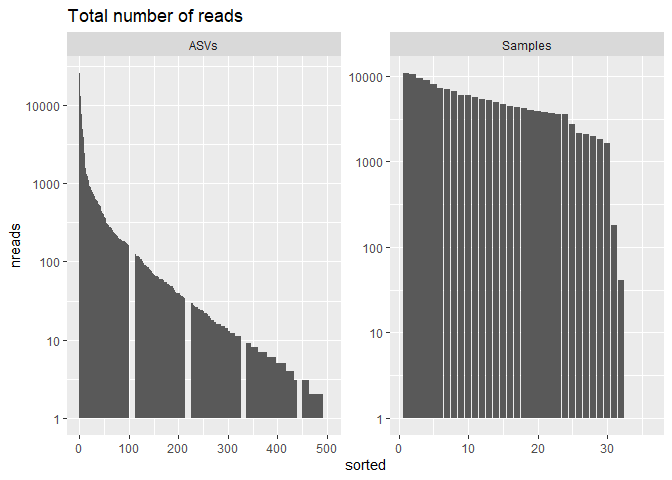
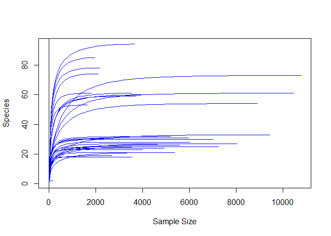
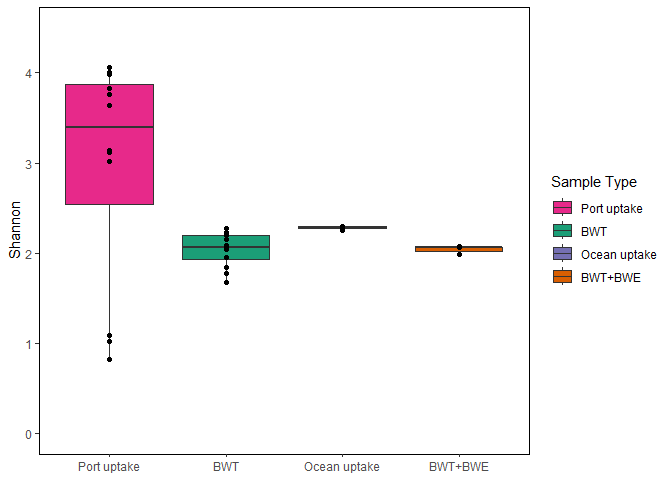
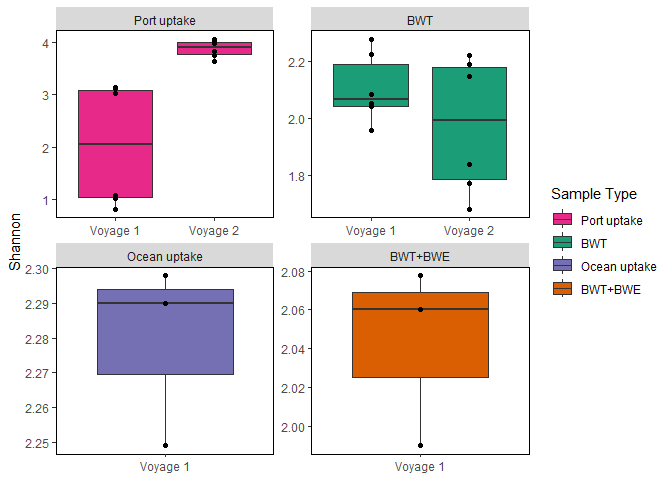
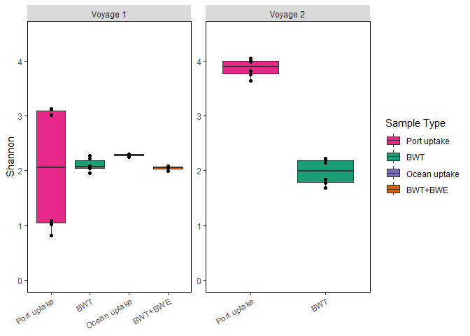

Ballast water bacteria 16S rRNA analysis
================
Sarah Brown
2025-10-15

- [1 Load Packages and Import Data](#1-load-packages-and-import-data)
- [2 Preparing the Data](#2-preparing-the-data)
  - [2.1 Examine the total number of reads and
    ASV’s](#21-examine-the-total-number-of-reads-and-asvs)
  - [2.2 Create table showing the number of reads per
    sample](#22-create-table-showing-the-number-of-reads-per-sample)
  - [2.3 Create a rarefaction curve](#23-create-a-rarefaction-curve)
  - [2.4 Filter samples](#24-filter-samples)
  - [2.5 Label and order variables](#25-label-and-order-variables)
  - [2.6 Group rarefaction curves by
    Sample_type](#26-group-rarefaction-curves-by-sample_type)
  - [2.7 Abundance transformation](#27-abundance-transformation)
- [3 Alpha Diversity](#3-alpha-diversity)
  - [3.1 Calculate Shannon Diversity per
    Sample](#31-calculate-shannon-diversity-per-sample)
  - [3.2 Create Alpha Diversity
    Boxplots](#32-create-alpha-diversity-boxplots)
    - [3.2.1 Shannon diversity: sample
      type](#321-shannon-diversity-sample-type)
    - [3.2.2 Shannon diversity: sample type and
      voyage](#322-shannon-diversity-sample-type-and-voyage)
    - [3.2.3 Shannon diversity: voyage and sample
      type](#323-shannon-diversity-voyage-and-sample-type)
    - [3.2.4 Richness: sample type](#324-richness-sample-type)
    - [3.2.5 Richness: voyage and sample
      type](#325-richness-voyage-and-sample-type)
    - [3.2.6 Reads: voyage and sample
      type](#326-reads-voyage-and-sample-type)
    - [3.2.7 Combine plots for Fig. 2](#327-combine-plots-for-fig-2)
  - [3.3 Alpha Diversity statistics](#33-alpha-diversity-statistics)
    - [3.3.1 Subset alpha diversity
      dataframe](#331-subset-alpha-diversity-dataframe)
    - [3.3.2 Shannon diversity: sample
      type](#332-shannon-diversity-sample-type)
    - [3.3.3 Shannon diversity: voyage and sample
      type](#333-shannon-diversity-voyage-and-sample-type)
    - [3.3.4 Richness: sample type](#334-richness-sample-type)
    - [3.3.5 Richness: voyage and sample
      type](#335-richness-voyage-and-sample-type)
- [4 Ordination plots](#4-ordination-plots)
  - [4.1 Find plot color hex codes](#41-find-plot-color-hex-codes)
  - [4.2 Create NMDS with the Bray-Curtis dissimilarity
    matrix](#42-create-nmds-with-the-bray-curtis-dissimilarity-matrix)
  - [4.3 Create PCoA with the Bray-Curtis dissimilarity
    matrix](#43-create-pcoa-with-the-bray-curtis-dissimilarity-matrix)
    - [4.3.1 PCoA with labels and
      arrows](#431-pcoa-with-labels-and-arrows)
    - [4.3.2 PCoA without labels and
      arrows](#432-pcoa-without-labels-and-arrows)
- [5 PERMANOVA Analysis](#5-permanova-analysis)
  - [5.1 PERMANOVA analysis](#51-permanova-analysis)
  - [5.2 Pairwise PERMANOVA](#52-pairwise-permanova)
- [6 Preliminary taxonomy fix](#6-preliminary-taxonomy-fix)
- [7 Bacterial community composition bar
  charts](#7-bacterial-community-composition-bar-charts)
  - [7.1 Find color hex codes](#71-find-color-hex-codes)
  - [7.2 Family level, individual
    samples](#72-family-level-individual-samples)
  - [7.3 Family level, grouped by sample
    type](#73-family-level-grouped-by-sample-type)
  - [7.4 Family level, grouped by sample type and
    voyage](#74-family-level-grouped-by-sample-type-and-voyage)
  - [7.5 Genus level, grouped by voyage and sample
    type](#75-genus-level-grouped-by-voyage-and-sample-type)
    - [7.5.1 Re-creating the above plot using
      ggnested](#751-re-creating-the-above-plot-using-ggnested)
  - [7.6 Species level, grouped by voyage and sample
    type](#76-species-level-grouped-by-voyage-and-sample-type)
    - [7.6.1 Create plot with
      fantaxtic](#761-create-plot-with-fantaxtic)
  - [7.7 Species level, grouped by voyage, sample type, and
    tank](#77-species-level-grouped-by-voyage-sample-type-and-tank)
    - [7.7.1 Create plot with
      fantaxtic](#771-create-plot-with-fantaxtic)
- [8 Bacterial community composition dot
  plots](#8-bacterial-community-composition-dot-plots)
  - [8.1 Genus level, grouped by sample type and
    voyage](#81-genus-level-grouped-by-sample-type-and-voyage)
  - [8.2 Genus level, grouped by voyage and sample
    type](#82-genus-level-grouped-by-voyage-and-sample-type)
  - [8.3 Species level, grouped by sample type and
    voyage](#83-species-level-grouped-by-sample-type-and-voyage)
  - [8.4 Species level, grouped by voyage and sample
    type](#84-species-level-grouped-by-voyage-and-sample-type)
- [9 DESeq2 analysis on MetaCyc
  data](#9-deseq2-analysis-on-metacyc-data)
  - [9.1 Create the DESeq object](#91-create-the-deseq-object)
  - [9.2 Load pathway descriptions](#92-load-pathway-descriptions)
  - [9.3 Create PCA of all MetaCyc results in
    DESeq2](#93-create-pca-of-all-metacyc-results-in-deseq2)
    - [9.3.1 PCA with labels and
      arrows](#931-pca-with-labels-and-arrows)
    - [9.3.2 PCA without labels and
      arrows](#932-pca-without-labels-and-arrows)
  - [9.4 BWT vs port uptake](#94-bwt-vs-port-uptake)
    - [9.4.1 Based on lowest level of functional
      annotation](#941-based-on-lowest-level-of-functional-annotation)
    - [9.4.2 Based on second level of functional
      annotation](#942-based-on-second-level-of-functional-annotation)
  - [9.5 BWT vs BWT+BWE](#95-bwt-vs-bwtbwe)
- [10 DESeq2 analysis on KEGG data
  (TEST)](#10-deseq2-analysis-on-kegg-data-test)
  - [10.1 Load ggpicrust2 and dependent
    packages](#101-load-ggpicrust2-and-dependent-packages)
  - [10.2 Convert KO abundance to KEGG pathway
    abundance](#102-convert-ko-abundance-to-kegg-pathway-abundance)
- [11 MBPD](#11-mbpd)
  - [11.1 Import pathogen data](#111-import-pathogen-data)
  - [11.2 Filter samples](#112-filter-samples)
  - [11.3 Label and order variables](#113-label-and-order-variables)
  - [11.4 Bacterial community composition bar
    charts](#114-bacterial-community-composition-bar-charts)
    - [11.4.1 Species level, grouped by voyage and sample
      type](#1141-species-level-grouped-by-voyage-and-sample-type)
- [12 Filter ASVs to determine how many were given species-level
  assignments](#12-filter-asvs-to-determine-how-many-were-given-species-level-assignments)
- [13 Session Info](#13-session-info)

# 1 Load Packages and Import Data

Here, we load the required packages and then import the .qza files
exported from QIIME2 using the qiime2R package. The final object is a
phyloseq object called Ballast_physeq.

``` r
library(ggplot2)
library(vegan)
```

    ## Loading required package: permute

    ## Loading required package: lattice

    ## This is vegan 2.6-6.1

``` r
library(plyr)
library(dplyr)
```

    ## 
    ## Attaching package: 'dplyr'

    ## The following objects are masked from 'package:plyr':
    ## 
    ##     arrange, count, desc, failwith, id, mutate, rename, summarise,
    ##     summarize

    ## The following objects are masked from 'package:stats':
    ## 
    ##     filter, lag

    ## The following objects are masked from 'package:base':
    ## 
    ##     intersect, setdiff, setequal, union

``` r
library(scales)
library(grid)
library(reshape2)
library(phyloseq)
library(picante)
```

    ## Loading required package: ape

    ## 
    ## Attaching package: 'ape'

    ## The following object is masked from 'package:dplyr':
    ## 
    ##     where

    ## Loading required package: nlme

    ## 
    ## Attaching package: 'nlme'

    ## The following object is masked from 'package:dplyr':
    ## 
    ##     collapse

``` r
library(tidyr)
```

    ## 
    ## Attaching package: 'tidyr'

    ## The following object is masked from 'package:reshape2':
    ## 
    ##     smiths

``` r
library(viridis)
```

    ## Loading required package: viridisLite

    ## 
    ## Attaching package: 'viridis'

    ## The following object is masked from 'package:scales':
    ## 
    ##     viridis_pal

``` r
library(qiime2R)
library(DESeq2)
```

    ## Loading required package: S4Vectors

    ## Loading required package: stats4

    ## Loading required package: BiocGenerics

    ## 
    ## Attaching package: 'BiocGenerics'

    ## The following objects are masked from 'package:dplyr':
    ## 
    ##     combine, intersect, setdiff, union

    ## The following objects are masked from 'package:stats':
    ## 
    ##     IQR, mad, sd, var, xtabs

    ## The following objects are masked from 'package:base':
    ## 
    ##     anyDuplicated, aperm, append, as.data.frame, basename, cbind,
    ##     colnames, dirname, do.call, duplicated, eval, evalq, Filter, Find,
    ##     get, grep, grepl, intersect, is.unsorted, lapply, Map, mapply,
    ##     match, mget, order, paste, pmax, pmax.int, pmin, pmin.int,
    ##     Position, rank, rbind, Reduce, rownames, sapply, setdiff, table,
    ##     tapply, union, unique, unsplit, which.max, which.min

    ## 
    ## Attaching package: 'S4Vectors'

    ## The following object is masked from 'package:tidyr':
    ## 
    ##     expand

    ## The following objects are masked from 'package:dplyr':
    ## 
    ##     first, rename

    ## The following object is masked from 'package:plyr':
    ## 
    ##     rename

    ## The following object is masked from 'package:utils':
    ## 
    ##     findMatches

    ## The following objects are masked from 'package:base':
    ## 
    ##     expand.grid, I, unname

    ## Loading required package: IRanges

    ## 
    ## Attaching package: 'IRanges'

    ## The following object is masked from 'package:nlme':
    ## 
    ##     collapse

    ## The following object is masked from 'package:phyloseq':
    ## 
    ##     distance

    ## The following objects are masked from 'package:dplyr':
    ## 
    ##     collapse, desc, slice

    ## The following object is masked from 'package:plyr':
    ## 
    ##     desc

    ## The following object is masked from 'package:grDevices':
    ## 
    ##     windows

    ## Loading required package: GenomicRanges

    ## Loading required package: GenomeInfoDb

    ## Loading required package: SummarizedExperiment

    ## Loading required package: MatrixGenerics

    ## Loading required package: matrixStats

    ## 
    ## Attaching package: 'matrixStats'

    ## The following object is masked from 'package:dplyr':
    ## 
    ##     count

    ## The following object is masked from 'package:plyr':
    ## 
    ##     count

    ## 
    ## Attaching package: 'MatrixGenerics'

    ## The following objects are masked from 'package:matrixStats':
    ## 
    ##     colAlls, colAnyNAs, colAnys, colAvgsPerRowSet, colCollapse,
    ##     colCounts, colCummaxs, colCummins, colCumprods, colCumsums,
    ##     colDiffs, colIQRDiffs, colIQRs, colLogSumExps, colMadDiffs,
    ##     colMads, colMaxs, colMeans2, colMedians, colMins, colOrderStats,
    ##     colProds, colQuantiles, colRanges, colRanks, colSdDiffs, colSds,
    ##     colSums2, colTabulates, colVarDiffs, colVars, colWeightedMads,
    ##     colWeightedMeans, colWeightedMedians, colWeightedSds,
    ##     colWeightedVars, rowAlls, rowAnyNAs, rowAnys, rowAvgsPerColSet,
    ##     rowCollapse, rowCounts, rowCummaxs, rowCummins, rowCumprods,
    ##     rowCumsums, rowDiffs, rowIQRDiffs, rowIQRs, rowLogSumExps,
    ##     rowMadDiffs, rowMads, rowMaxs, rowMeans2, rowMedians, rowMins,
    ##     rowOrderStats, rowProds, rowQuantiles, rowRanges, rowRanks,
    ##     rowSdDiffs, rowSds, rowSums2, rowTabulates, rowVarDiffs, rowVars,
    ##     rowWeightedMads, rowWeightedMeans, rowWeightedMedians,
    ##     rowWeightedSds, rowWeightedVars

    ## Loading required package: Biobase

    ## Welcome to Bioconductor
    ## 
    ##     Vignettes contain introductory material; view with
    ##     'browseVignettes()'. To cite Bioconductor, see
    ##     'citation("Biobase")', and for packages 'citation("pkgname")'.

    ## 
    ## Attaching package: 'Biobase'

    ## The following object is masked from 'package:MatrixGenerics':
    ## 
    ##     rowMedians

    ## The following objects are masked from 'package:matrixStats':
    ## 
    ##     anyMissing, rowMedians

    ## The following object is masked from 'package:phyloseq':
    ## 
    ##     sampleNames

``` r
library(patchwork)
library(RColorBrewer)
library(microViz)
```

    ## microViz version 0.12.3 - Copyright (C) 2021-2024 David Barnett
    ## ! Website: https://david-barnett.github.io/microViz
    ## ✔ Useful?  For citation details, run: `citation("microViz")`
    ## ✖ Silence? `suppressPackageStartupMessages(library(microViz))`

``` r
library(speedyseq)
```

    ## 
    ## Attaching package: 'speedyseq'

    ## The following objects are masked from 'package:phyloseq':
    ## 
    ##     filter_taxa, plot_bar, plot_heatmap, plot_tree, psmelt, tax_glom,
    ##     tip_glom, transform_sample_counts

``` r
library(ComplexHeatmap)
```

    ## ========================================
    ## ComplexHeatmap version 2.20.0
    ## Bioconductor page: http://bioconductor.org/packages/ComplexHeatmap/
    ## Github page: https://github.com/jokergoo/ComplexHeatmap
    ## Documentation: http://jokergoo.github.io/ComplexHeatmap-reference
    ## 
    ## If you use it in published research, please cite either one:
    ## - Gu, Z. Complex Heatmap Visualization. iMeta 2022.
    ## - Gu, Z. Complex heatmaps reveal patterns and correlations in multidimensional 
    ##     genomic data. Bioinformatics 2016.
    ## 
    ## 
    ## The new InteractiveComplexHeatmap package can directly export static 
    ## complex heatmaps into an interactive Shiny app with zero effort. Have a try!
    ## 
    ## This message can be suppressed by:
    ##   suppressPackageStartupMessages(library(ComplexHeatmap))
    ## ========================================

``` r
library(plotly)
```

    ## 
    ## Attaching package: 'plotly'

    ## The following object is masked from 'package:ComplexHeatmap':
    ## 
    ##     add_heatmap

    ## The following object is masked from 'package:microViz':
    ## 
    ##     add_paths

    ## The following object is masked from 'package:IRanges':
    ## 
    ##     slice

    ## The following object is masked from 'package:S4Vectors':
    ## 
    ##     rename

    ## The following objects are masked from 'package:plyr':
    ## 
    ##     arrange, mutate, rename, summarise

    ## The following object is masked from 'package:ggplot2':
    ## 
    ##     last_plot

    ## The following object is masked from 'package:stats':
    ## 
    ##     filter

    ## The following object is masked from 'package:graphics':
    ## 
    ##     layout

``` r
library(seecolor)
library(tibble)
library(tidyverse)
```

    ## ── Attaching core tidyverse packages ──────────────────────── tidyverse 2.0.0 ──
    ## ✔ forcats   1.0.0     ✔ readr     2.1.5
    ## ✔ lubridate 1.9.4     ✔ stringr   1.5.1
    ## ✔ purrr     1.0.2

    ## ── Conflicts ────────────────────────────────────────── tidyverse_conflicts() ──
    ## ✖ lubridate::%within%()    masks IRanges::%within%()
    ## ✖ plotly::arrange()        masks dplyr::arrange(), plyr::arrange()
    ## ✖ readr::col_factor()      masks scales::col_factor()
    ## ✖ IRanges::collapse()      masks nlme::collapse(), dplyr::collapse()
    ## ✖ Biobase::combine()       masks BiocGenerics::combine(), dplyr::combine()
    ## ✖ purrr::compact()         masks plyr::compact()
    ## ✖ matrixStats::count()     masks dplyr::count(), plyr::count()
    ## ✖ IRanges::desc()          masks dplyr::desc(), plyr::desc()
    ## ✖ purrr::discard()         masks scales::discard()
    ## ✖ S4Vectors::expand()      masks tidyr::expand()
    ## ✖ dplyr::failwith()        masks plyr::failwith()
    ## ✖ plotly::filter()         masks dplyr::filter(), stats::filter()
    ## ✖ S4Vectors::first()       masks dplyr::first()
    ## ✖ dplyr::id()              masks plyr::id()
    ## ✖ dplyr::lag()             masks stats::lag()
    ## ✖ plotly::mutate()         masks dplyr::mutate(), plyr::mutate()
    ## ✖ BiocGenerics::Position() masks ggplot2::Position(), base::Position()
    ## ✖ purrr::reduce()          masks GenomicRanges::reduce(), IRanges::reduce()
    ## ✖ plotly::rename()         masks S4Vectors::rename(), dplyr::rename(), plyr::rename()
    ## ✖ lubridate::second()      masks S4Vectors::second()
    ## ✖ lubridate::second<-()    masks S4Vectors::second<-()
    ## ✖ plotly::slice()          masks IRanges::slice(), dplyr::slice()
    ## ✖ plotly::summarise()      masks dplyr::summarise(), plyr::summarise()
    ## ✖ dplyr::summarize()       masks plyr::summarize()
    ## ✖ ape::where()             masks dplyr::where()
    ## ℹ Use the conflicted package (<http://conflicted.r-lib.org/>) to force all conflicts to become errors

``` r
library(ggh4x)
library(kableExtra)
```

    ## 
    ## Attaching package: 'kableExtra'
    ## 
    ## The following object is masked from 'package:dplyr':
    ## 
    ##     group_rows

``` r
library(patchwork)

set.seed(13745)

#Create a phyloseq object from the .qza files exported from qiime2 using 
#the qiime2R package
Ballast_physeq <- qza_to_phyloseq(
  features="Qiime output/ballast-dada2-table.qza",
  tree="Qiime output/ballast-rooted-tree.qza",
  taxonomy="Qiime output/ballast-taxonomy.qza",
  metadata = "Qiime output/Metadata.tsv"
)
```

# 2 Preparing the Data

Before performing any analyses, we need to examine the phyloseq object
and remove chloroplast and mitochondrial sequences:

``` r
#Check the rank names to make sure they are accurate
rank_names(Ballast_physeq)
```

    ## [1] "Kingdom" "Phylum"  "Class"   "Order"   "Family"  "Genus"   "Species"

``` r
#Correct output:[1] "Kingdom" "Phylum"  "Class"   "Order"   "Family"  
#                   "Genus"   "Species"

#Check sample variables
sample_variables(Ballast_physeq)
```

    ## [1] "Sample_type"   "Voyage"        "Tank"          "Sample_number"
    ## [5] "Sample_site"   "Sample_date"   "Type_voyage"   "Sample_group" 
    ## [9] "notes"

``` r
#Remove chloroplast sequences and any contaminant sequences
Ballast_physeq <- subset_taxa(Ballast_physeq, Kingdom != "d__Archaea")
Ballast_physeq <- subset_taxa(Ballast_physeq, Order != "Chloroplast")
Ballast_physeq <- subset_taxa(Ballast_physeq, Family != "Mitochondria")

#Check that contaminant sequences are removed (easiest to save as data frame and search)
taxtabl <- as.data.frame(tax_table(Ballast_physeq))

#At this point, blanks and positive controls should also be removed
Ballast_physeq = subset_samples(Ballast_physeq, Sample_type != "control")
Ballast_physeq = subset_samples(Ballast_physeq, Sample_type != "negative")
```

## 2.1 Examine the total number of reads and ASV’s

This part of the code examines the number of times each ASV occurs in
the data set and the number of reads per sample; this will help
determine which ASV’s and samples need to be filtered out of the data
set.

``` r
#Create graph showing number of reads per ASV and number of reads per sample
readsumsdf = data.frame(nreads = sort(taxa_sums(Ballast_physeq), TRUE), 
                        sorted = 1:ntaxa(Ballast_physeq), type = "ASVs")
readsumsdf = rbind(readsumsdf, data.frame(nreads = sort(sample_sums(Ballast_physeq), TRUE), sorted = 1:nsamples(Ballast_physeq), type = "Samples"))
title = "Total number of reads"
p = ggplot(readsumsdf, aes(x = sorted, y = nreads)) + geom_bar(stat = "identity")
p + ggtitle(title) + scale_y_log10() + facet_wrap(~type, 1, scales = "free")
```

<!-- -->

``` r
#Create a dataframe that includes only the total number of times that each ASV occurs
readsumsdf_ASVs <- readsumsdf %>% 
    filter(type == "ASVs")  
  
#How many singletons are present?
length(which(readsumsdf_ASVs$nreads <= 0))
```

    ## [1] 11

``` r
#Answer: 11
length(which(readsumsdf_ASVs$nreads == 1))
```

    ## [1] 0

``` r
#Answer: 0

#How many doubletons are present?
length(which(readsumsdf_ASVs$nreads == 2))
```

    ## [1] 29

``` r
#Answer: 29

#Create a bar plot showing the number of times each ASV occurs
ASV_occurance <- ggplot(data = readsumsdf_ASVs) +
    geom_bar(mapping = aes(x=nreads)) + 
    ylim(0, 20) +
    labs(x = "Number of reads", y = "Number of ASV's") +
    theme(text = element_text(size = 18), 
        axis.title = element_text(size = 15),
        panel.spacing = unit(1, "lines"), 
        panel.border = element_rect(colour = "black", fill = NA, size = 0.5), 
        panel.background = element_blank())
```

    ## Warning: The `size` argument of `element_rect()` is deprecated as of ggplot2 3.4.0.
    ## ℹ Please use the `linewidth` argument instead.
    ## This warning is displayed once every 8 hours.
    ## Call `lifecycle::last_lifecycle_warnings()` to see where this warning was
    ## generated.

``` r
print(ASV_occurance)
```

    ## Warning: Removed 2 rows containing missing values or values outside the scale range
    ## (`geom_bar()`).

<!-- -->

## 2.2 Create table showing the number of reads per sample

``` r
#Sum reads and sort by samples with least to greatest number of reads
samples_reads <- sort(sample_sums(Ballast_physeq))

#Create table 
knitr::kable(samples_reads) %>% 
    kableExtra::kable_styling("striped", 
                            latex_options="scale_down") %>% 
    kableExtra::scroll_box(width = "100%") 
```

<div style="border: 1px solid #ddd; padding: 5px; overflow-x: scroll; width:100%; ">

<table class="table table-striped" style="color: black; margin-left: auto; margin-right: auto;">
<thead>
<tr>
<th style="text-align:left;">
</th>
<th style="text-align:right;">
x
</th>
</tr>
</thead>
<tbody>
<tr>
<td style="text-align:left;">
Ship-Ballast-104-02-05-17-SA-2-Dis2-1
</td>
<td style="text-align:right;">
0
</td>
</tr>
<tr>
<td style="text-align:left;">
Ship-Ballast-105-02-05-17-SA-2-Dis2-2
</td>
<td style="text-align:right;">
0
</td>
</tr>
<tr>
<td style="text-align:left;">
Ship-Ballast-107-02-05-17-SA-2-Dis2B-1
</td>
<td style="text-align:right;">
0
</td>
</tr>
<tr>
<td style="text-align:left;">
Ship-Ballast-108-02-05-17-SA-2-Dis2B-2
</td>
<td style="text-align:right;">
0
</td>
</tr>
<tr>
<td style="text-align:left;">
Ship-Ballast-109-02-05-17-SA-2-Dis2B-3
</td>
<td style="text-align:right;">
41
</td>
</tr>
<tr>
<td style="text-align:left;">
Ship-Ballast-106-02-05-17-SA-2-Dis2-3
</td>
<td style="text-align:right;">
179
</td>
</tr>
<tr>
<td style="text-align:left;">
Ship-Ballast-99-02-01-17-SA-2-tank-6-uptake-2
</td>
<td style="text-align:right;">
1640
</td>
</tr>
<tr>
<td style="text-align:left;">
Ship-Ballast-103-02-01-17-SA-2-tank-2-uptake-3
</td>
<td style="text-align:right;">
1808
</td>
</tr>
<tr>
<td style="text-align:left;">
Ship-Ballast-102-02-01-17-SA-2-tank-2-uptake-2
</td>
<td style="text-align:right;">
1957
</td>
</tr>
<tr>
<td style="text-align:left;">
Ship-Ballast-98-02-01-17-SA-2-tank-6-uptake-1
</td>
<td style="text-align:right;">
2114
</td>
</tr>
<tr>
<td style="text-align:left;">
Ship-Ballast-101-02-01-17-SA-2-tank-2-uptake-1
</td>
<td style="text-align:right;">
2169
</td>
</tr>
<tr>
<td style="text-align:left;">
Ship-Ballast-97-10-23-16-SA-1-Dis-5-3
</td>
<td style="text-align:right;">
2703
</td>
</tr>
<tr>
<td style="text-align:left;">
Ship-Ballast-82-10-18-16-SA-1-UP-5-3
</td>
<td style="text-align:right;">
3542
</td>
</tr>
<tr>
<td style="text-align:left;">
Ship-Ballast-95-10-23-16-SA-1-Dis-5-1
</td>
<td style="text-align:right;">
3569
</td>
</tr>
<tr>
<td style="text-align:left;">
Ship-Ballast-100-02-01-17-SA-2-tank-6-uptake-3
</td>
<td style="text-align:right;">
3676
</td>
</tr>
<tr>
<td style="text-align:left;">
Ship-Ballast-81-10-18-16-SA-1-UP-5-2
</td>
<td style="text-align:right;">
3726
</td>
</tr>
<tr>
<td style="text-align:left;">
Ship-Ballast-86-10-20-16-EX-Dis-5-1
</td>
<td style="text-align:right;">
3855
</td>
</tr>
<tr>
<td style="text-align:left;">
Ship-Ballast-115-02-05-17-SA-2-Dis2B-3
</td>
<td style="text-align:right;">
4006
</td>
</tr>
<tr>
<td style="text-align:left;">
Ship-Ballast-87-10-20-16-EX-Dis-5-2
</td>
<td style="text-align:right;">
4194
</td>
</tr>
<tr>
<td style="text-align:left;">
Ship-Ballast-96-10-23-16-SA-1-Dis-5-2
</td>
<td style="text-align:right;">
4263
</td>
</tr>
<tr>
<td style="text-align:left;">
Ship-Ballast-80-10-18-16-SA-1-UP-5-1
</td>
<td style="text-align:right;">
4416
</td>
</tr>
<tr>
<td style="text-align:left;">
Ship-Ballast-83-10-17-16-SA-1-UP-6-1
</td>
<td style="text-align:right;">
4701
</td>
</tr>
<tr>
<td style="text-align:left;">
Ship-Ballast-111-02-05-17-SA-2-Dis6-2
</td>
<td style="text-align:right;">
4937
</td>
</tr>
<tr>
<td style="text-align:left;">
Ship-Ballast-88-10-20-16-EX-Dis-5-3
</td>
<td style="text-align:right;">
5198
</td>
</tr>
<tr>
<td style="text-align:left;">
Ship-Ballast-85-10-17-16-SA-1-UP-6-3
</td>
<td style="text-align:right;">
5375
</td>
</tr>
<tr>
<td style="text-align:left;">
Ship-Ballast-84-10-17-16-SA-1-UP-6-2
</td>
<td style="text-align:right;">
5588
</td>
</tr>
<tr>
<td style="text-align:left;">
Ship-Ballast-113-02-05-17-SA-2-Dis2B-1
</td>
<td style="text-align:right;">
5964
</td>
</tr>
<tr>
<td style="text-align:left;">
Ship-Ballast-112-02-05-17-SA-2-Dis6-3
</td>
<td style="text-align:right;">
6036
</td>
</tr>
<tr>
<td style="text-align:left;">
Ship-Ballast-110-02-05-17-SA-2-Dis6-1
</td>
<td style="text-align:right;">
6570
</td>
</tr>
<tr>
<td style="text-align:left;">
Ship-Ballast-114-02-05-17-SA-2-Dis2B-2
</td>
<td style="text-align:right;">
7009
</td>
</tr>
<tr>
<td style="text-align:left;">
Ship-Ballast-94-10-23-16-SA-1-Dis-6-3
</td>
<td style="text-align:right;">
7257
</td>
</tr>
<tr>
<td style="text-align:left;">
Ship-Ballast-93-10-23-16-SA-1-Dis-6-2
</td>
<td style="text-align:right;">
8050
</td>
</tr>
<tr>
<td style="text-align:left;">
Ship-Ballast-91-10-20-16-EX-UP-5-3
</td>
<td style="text-align:right;">
8904
</td>
</tr>
<tr>
<td style="text-align:left;">
Ship-Ballast-92-10-23-16-SA-1-Dis-6-1
</td>
<td style="text-align:right;">
9436
</td>
</tr>
<tr>
<td style="text-align:left;">
Ship-Ballast-89-10-20-16-EX-UP-5-1
</td>
<td style="text-align:right;">
10467
</td>
</tr>
<tr>
<td style="text-align:left;">
Ship-Ballast-90-10-20-16-EX-UP-5-2
</td>
<td style="text-align:right;">
10776
</td>
</tr>
</tbody>
</table>

</div>

## 2.3 Create a rarefaction curve

``` r
#Rarefaction curve using vegan
#From: https://micca.readthedocs.io/en/latest/phyloseq.html
taxa_are_rows(Ballast_physeq)
```

    ## [1] TRUE

``` r
mat <- t(otu_table(Ballast_physeq))
class(mat) <- "matrix"
class(mat)
```

    ## [1] "matrix" "array"

``` r
mat <- as(t(otu_table(Ballast_physeq)), "matrix")
class(mat)
```

    ## [1] "matrix" "array"

``` r
raremax <- min(rowSums(mat))

system.time(rarecurve(mat, step = 100, sample = raremax, col = "blue", label = FALSE))
```

    ## empty rows removed

<!-- -->

    ##    user  system elapsed 
    ##    0.31    0.02    0.45

## 2.4 Filter samples

Based on the table above, there are some samples with very few to no
reads, so we’ll filter these out here. In this case, we keep all samples
with more than 1,000 reads.

Removing these samples with low sequencing depths is important because
samples with low reads typically are lower quality and have a greater
probability of containing contaminant sequences ([Weiss et al.,
2017](https://microbiomejournal.biomedcentral.com/articles/10.1186/s40168-017-0237-y)).

``` r
#Remove samples with few reads
Ballast_physeq = subset_samples(Ballast_physeq, 
                            Sample_number != "104")
Ballast_physeq = subset_samples(Ballast_physeq, 
                            Sample_number != "105")
Ballast_physeq = subset_samples(Ballast_physeq, 
                            Sample_number != "107")
Ballast_physeq = subset_samples(Ballast_physeq, 
                            Sample_number != "108")
Ballast_physeq = subset_samples(Ballast_physeq, 
                            Sample_number != "109")
Ballast_physeq = subset_samples(Ballast_physeq, 
                            Sample_number != "106")

#Filter out low abundance ASVs
Ballast_physeq = prune_taxa(taxa_sums(Ballast_physeq) > 2, Ballast_physeq)
```

## 2.5 Label and order variables

Now we can relabel the variables; if you type in Ballast_physeq you will
see that sample_data is the matrix that holds the information that we
want to change, so we need to include sample_data in our code here.

``` r
#Order factors
sample_data(Ballast_physeq)$Sample_type <- factor(sample_data(Ballast_physeq)$Sample_type, 
               levels = c("port_uptake", "BWT", "ocean_uptake", "BWT_BWE"),
               labels = c("Port uptake", "BWT", "Ocean uptake", "BWT+BWE"))

sample_data(Ballast_physeq)$Sample_number <- factor(sample_data(Ballast_physeq)$Sample_number, 
               levels = c("80", "81", "82", "83", "84", "85", "86", "87", "88", "89", "90", "91", "92", "93", "94", "95", "96", "97", "98", "100", "101", "102", "103", "110", "111", "112", "113", "114", "115"),
               labels = c("80", "81", "82", "83", "84", "85", "86", "87", "88", "89", "90", "91", "92", "93", "94", "95", "96", "97", "98", "100", "101", "102", "103", "110", "111", "112", "113", "114", "115"))

sample_data(Ballast_physeq)$Voyage <- factor(sample_data(Ballast_physeq)$Voyage, 
               levels = c("1", "2"),
               labels = c("Voyage 1", "Voyage 2"))
```

## 2.6 Group rarefaction curves by Sample_type

Comparing the sequencing depth and species richness between different
sample types. Using the ggrare function in the phyloseq.extended package
which wraps vegan’s rarecurve function so that it can be easily used
with phyloseq objects.

Note: I load the phyloseq-extended package here instead of above in the
‘Load packages’ section because it seems to create conflicts with the
phyloseq package and results in several warning messages.

``` r
library(phyloseq.extended)
```

    ## 
    ## Attaching package: 'phyloseq.extended'

    ## The following object is masked from 'package:phyloseq':
    ## 
    ##     UniFrac

``` r
p <- ggrare(Ballast_physeq, step = 1000, color = "Sample_type", label = "Sample_number", se = FALSE) 
```

    ## rarefying sample Ship-Ballast-100-02-01-17-SA-2-tank-6-uptake-3

    ## rarefying sample Ship-Ballast-101-02-01-17-SA-2-tank-2-uptake-1

    ## rarefying sample Ship-Ballast-102-02-01-17-SA-2-tank-2-uptake-2

    ## rarefying sample Ship-Ballast-103-02-01-17-SA-2-tank-2-uptake-3

    ## rarefying sample Ship-Ballast-110-02-05-17-SA-2-Dis6-1

    ## rarefying sample Ship-Ballast-111-02-05-17-SA-2-Dis6-2

    ## rarefying sample Ship-Ballast-112-02-05-17-SA-2-Dis6-3

    ## rarefying sample Ship-Ballast-113-02-05-17-SA-2-Dis2B-1

    ## rarefying sample Ship-Ballast-114-02-05-17-SA-2-Dis2B-2

    ## rarefying sample Ship-Ballast-115-02-05-17-SA-2-Dis2B-3

    ## rarefying sample Ship-Ballast-80-10-18-16-SA-1-UP-5-1

    ## rarefying sample Ship-Ballast-81-10-18-16-SA-1-UP-5-2

    ## rarefying sample Ship-Ballast-82-10-18-16-SA-1-UP-5-3

    ## rarefying sample Ship-Ballast-83-10-17-16-SA-1-UP-6-1

    ## rarefying sample Ship-Ballast-84-10-17-16-SA-1-UP-6-2

    ## rarefying sample Ship-Ballast-85-10-17-16-SA-1-UP-6-3

    ## rarefying sample Ship-Ballast-86-10-20-16-EX-Dis-5-1

    ## rarefying sample Ship-Ballast-87-10-20-16-EX-Dis-5-2

    ## rarefying sample Ship-Ballast-88-10-20-16-EX-Dis-5-3

    ## rarefying sample Ship-Ballast-89-10-20-16-EX-UP-5-1

    ## rarefying sample Ship-Ballast-90-10-20-16-EX-UP-5-2

    ## rarefying sample Ship-Ballast-91-10-20-16-EX-UP-5-3

    ## rarefying sample Ship-Ballast-92-10-23-16-SA-1-Dis-6-1

    ## rarefying sample Ship-Ballast-93-10-23-16-SA-1-Dis-6-2

    ## rarefying sample Ship-Ballast-94-10-23-16-SA-1-Dis-6-3

    ## rarefying sample Ship-Ballast-95-10-23-16-SA-1-Dis-5-1

    ## rarefying sample Ship-Ballast-96-10-23-16-SA-1-Dis-5-2

    ## rarefying sample Ship-Ballast-97-10-23-16-SA-1-Dis-5-3

    ## rarefying sample Ship-Ballast-98-02-01-17-SA-2-tank-6-uptake-1

    ## rarefying sample Ship-Ballast-99-02-01-17-SA-2-tank-6-uptake-2

<!-- -->

``` r
p <- p + facet_wrap(~Sample_type, scale="free") +
  scale_colour_manual(values = c("Port uptake" = "#E7298A", "Ocean uptake" = "#7570B3", "BWT" = "#1B9E77", "BWT+BWE" = "#D95F02"), "Sample Type") +
  theme_bw() +
  theme(axis.text.x = element_text(angle = 45, hjust = 1),
        panel.grid.major = element_blank(),
        panel.grid.minor = element_blank(),
        legend.position = "none") +
  labs(x ="Number of Reads")


print(p)
```

<!-- -->

``` r
#Save as svg
ggsave(filename="R output/rarecurve_sampletype.svg", plot=p, width=8, height=6, device=svg)
```

## 2.7 Abundance transformation

We have to transform the count data to account for differences in
library size between samples. This is often done using rarefaction, but
rarefaction results in the elimination of valid data and can also
increase the rate of false positives when testing for ASV’s that are
differentially abundant in different sample categories.

Additionally, here are some helpful references regarding library
normalization strategies:

[Waste Not, Want Not: Why Rarefying Microbiome Data is
Inadmissible](https://journals.plos.org/ploscompbiol/article?id=10.1371/journal.pcbi.1003531)

[Normalization and microbial differential abundance strategies depend on
data
characteristics](https://microbiomejournal.biomedcentral.com/articles/10.1186/s40168-017-0237-y)

Below, we’ll use relative abundance as our variance-stabilizing method.

``` r
#Transform to relative abundance
Ballast_physeqRA = transform_sample_counts(Ballast_physeq, function(x){x / sum(x)})
```

    ## Found more than one class "phylo" in cache; using the first, from namespace 'phyloseq'

    ## Also defined by 'tidytree'

    ## Found more than one class "phylo" in cache; using the first, from namespace 'phyloseq'

    ## Also defined by 'tidytree'

    ## Found more than one class "phylo" in cache; using the first, from namespace 'phyloseq'

    ## Also defined by 'tidytree'

    ## Found more than one class "phylo" in cache; using the first, from namespace 'phyloseq'

    ## Also defined by 'tidytree'

Alternatively, you could also choose to log-transform the data:

``` r
Ballast_physeqlog = transform_sample_counts(Ballast_physeq, function(x) log(1 + x))
```

    ## Found more than one class "phylo" in cache; using the first, from namespace 'phyloseq'

    ## Also defined by 'tidytree'

    ## Found more than one class "phylo" in cache; using the first, from namespace 'phyloseq'

    ## Also defined by 'tidytree'

    ## Found more than one class "phylo" in cache; using the first, from namespace 'phyloseq'

    ## Also defined by 'tidytree'

    ## Found more than one class "phylo" in cache; using the first, from namespace 'phyloseq'

    ## Also defined by 'tidytree'

# 3 Alpha Diversity

Note that while these data are not rarefied, they are normalized. We’ll
use the Shannon diversity index (based on richness AND evenness;
examines how many different taxa are present and how evenly they’re
distributed within a sample) to analyze alpha diversity between variable
types. This means it considers both the number of species and the
inequality between species abundances.

## 3.1 Calculate Shannon Diversity per Sample

Using the estimate_richness function in the phyloseq package to
calculate Shannon diversity. The estimate_richness function can also
take measures “Chao1” “ACE” “Simpson” and “Fisher”.

Note that running this code results in an error message stating that the
provided data does not have any singletons. See here for more
information:

<https://github.com/benjjneb/dada2/issues/214>

<https://forum.qiime2.org/t/singletons-and-diversity-richness-indices/2971/9>

``` r
#Change the - in the sample names to _ to prevent the estimate_richness function from changing the - to a . during the calculation of Observed richness
sample_names(Ballast_physeq) <- paste(gsub("-", "_", sample_names(Ballast_physeq)), sep = "_")

#Calculating richness - Shannon diversity and number of observations (Observed) in a new dataframe
richness <- data.frame(estimate_richness(Ballast_physeq, measures = c("Shannon", "Observed")))

richness <- setNames(cbind(rownames(richness), richness, row.names = NULL), 
                     c("sample-id", "Observed", "Shannon"))

#Add the sample metadata to the dataframe
s <- data.frame(sample_data(Ballast_physeq))
s <- setNames(cbind(rownames(s), s, row.names = NULL), 
              c("sample-id", "Sample_type", "Voyage", "Tank", 
                "Sample_number", "Sample_site", "Sample_date"))

alphadiv <- merge(s, richness, by = "sample-id")

#Order factors
alphadiv$Sample_type <- factor(alphadiv$Sample_type, 
                      levels = c("Port uptake", "BWT", "Ocean uptake", "BWT+BWE"),
                      labels = c("Port uptake", "BWT", "Ocean uptake", "BWT+BWE")) 

#Shows the calculated indices
knitr::kable(head(alphadiv)) %>% 
  kableExtra::kable_styling("striped", latex_options="scale_down") %>% 
  kableExtra::scroll_box(width = "100%")
```

<div style="border: 1px solid #ddd; padding: 5px; overflow-x: scroll; width:100%; ">

<table class="table table-striped" style="color: black; margin-left: auto; margin-right: auto;">
<thead>
<tr>
<th style="text-align:left;">
sample-id
</th>
<th style="text-align:left;">
Sample_type
</th>
<th style="text-align:left;">
Voyage
</th>
<th style="text-align:right;">
Tank
</th>
<th style="text-align:left;">
Sample_number
</th>
<th style="text-align:left;">
Sample_site
</th>
<th style="text-align:left;">
Sample_date
</th>
<th style="text-align:left;">
NA
</th>
<th style="text-align:left;">
NA
</th>
<th style="text-align:left;">
NA
</th>
<th style="text-align:right;">
Observed
</th>
<th style="text-align:right;">
Shannon
</th>
</tr>
</thead>
<tbody>
<tr>
<td style="text-align:left;">
Ship_Ballast_100_02_01_17_SA_2_tank_6_uptake_3
</td>
<td style="text-align:left;">
Port uptake
</td>
<td style="text-align:left;">
Voyage 2
</td>
<td style="text-align:right;">
6
</td>
<td style="text-align:left;">
100
</td>
<td style="text-align:left;">
Antioch
</td>
<td style="text-align:left;">
1-Feb-17
</td>
<td style="text-align:left;">
port_uptake_2
</td>
<td style="text-align:left;">
V2_UP_T6
</td>
<td style="text-align:left;">
</td>
<td style="text-align:right;">
93
</td>
<td style="text-align:right;">
4.053663
</td>
</tr>
<tr>
<td style="text-align:left;">
Ship_Ballast_101_02_01_17_SA_2_tank_2_uptake_1
</td>
<td style="text-align:left;">
Port uptake
</td>
<td style="text-align:left;">
Voyage 2
</td>
<td style="text-align:right;">
2
</td>
<td style="text-align:left;">
101
</td>
<td style="text-align:left;">
Antioch
</td>
<td style="text-align:left;">
1-Feb-17
</td>
<td style="text-align:left;">
port_uptake_2
</td>
<td style="text-align:left;">
V2_UP_T2
</td>
<td style="text-align:left;">
</td>
<td style="text-align:right;">
76
</td>
<td style="text-align:right;">
3.984224
</td>
</tr>
<tr>
<td style="text-align:left;">
Ship_Ballast_102_02_01_17_SA_2_tank_2_uptake_2
</td>
<td style="text-align:left;">
Port uptake
</td>
<td style="text-align:left;">
Voyage 2
</td>
<td style="text-align:right;">
2
</td>
<td style="text-align:left;">
102
</td>
<td style="text-align:left;">
Antioch
</td>
<td style="text-align:left;">
1-Feb-17
</td>
<td style="text-align:left;">
port_uptake_2
</td>
<td style="text-align:left;">
V2_UP_T2
</td>
<td style="text-align:left;">
</td>
<td style="text-align:right;">
78
</td>
<td style="text-align:right;">
3.999169
</td>
</tr>
<tr>
<td style="text-align:left;">
Ship_Ballast_103_02_01_17_SA_2_tank_2_uptake_3
</td>
<td style="text-align:left;">
Port uptake
</td>
<td style="text-align:left;">
Voyage 2
</td>
<td style="text-align:right;">
2
</td>
<td style="text-align:left;">
103
</td>
<td style="text-align:left;">
Antioch
</td>
<td style="text-align:left;">
1-Feb-17
</td>
<td style="text-align:left;">
port_uptake_2
</td>
<td style="text-align:left;">
V2_UP_T2
</td>
<td style="text-align:left;">
</td>
<td style="text-align:right;">
59
</td>
<td style="text-align:right;">
3.755243
</td>
</tr>
<tr>
<td style="text-align:left;">
Ship_Ballast_110_02_05_17_SA_2_Dis6_1
</td>
<td style="text-align:left;">
BWT
</td>
<td style="text-align:left;">
Voyage 2
</td>
<td style="text-align:right;">
6
</td>
<td style="text-align:left;">
110
</td>
<td style="text-align:left;">
Port McNeill
</td>
<td style="text-align:left;">
7-Feb-17
</td>
<td style="text-align:left;">
BWT_2
</td>
<td style="text-align:left;">
V2_BWT_T6
</td>
<td style="text-align:left;">
treatment only
</td>
<td style="text-align:right;">
27
</td>
<td style="text-align:right;">
1.770741
</td>
</tr>
<tr>
<td style="text-align:left;">
Ship_Ballast_111_02_05_17_SA_2_Dis6_2
</td>
<td style="text-align:left;">
BWT
</td>
<td style="text-align:left;">
Voyage 2
</td>
<td style="text-align:right;">
6
</td>
<td style="text-align:left;">
111
</td>
<td style="text-align:left;">
Port McNeill
</td>
<td style="text-align:left;">
7-Feb-17
</td>
<td style="text-align:left;">
BWT_2
</td>
<td style="text-align:left;">
V2_BWT_T6
</td>
<td style="text-align:left;">
treatment only
</td>
<td style="text-align:right;">
24
</td>
<td style="text-align:right;">
1.681808
</td>
</tr>
</tbody>
</table>

</div>

## 3.2 Create Alpha Diversity Boxplots

### 3.2.1 Shannon diversity: sample type

``` r
#Plot
ggplot(data=alphadiv, aes(x=Sample_type, y=Shannon), alpha=0.1) + 
  geom_boxplot(aes(fill=Sample_type)) +
  scale_fill_manual(values = c("Port uptake" = "#E7298A", 
                                 "BWT" = "#1B9E77", 
                                 "Ocean uptake" = "#7570B3",
                                 "BWT+BWE" = "#D95F02"), "Sample Type") +
  geom_point(position=position_dodge(width=0.75),aes(group=Sample_type)) +
  scale_y_continuous(limits = c(0, 4.5)) +
  theme(legend.position="right",
        panel.border = element_rect(colour = "black", fill = NA, size = 0.5), 
        panel.background = element_blank(), 
        axis.title.x = element_blank())
```

<!-- -->

### 3.2.2 Shannon diversity: sample type and voyage

``` r
#Plot
ggplot(data=alphadiv, aes(x=Voyage, y=Shannon), alpha=0.1) + 
  geom_boxplot(aes(fill=Sample_type)) +
  scale_fill_manual(values = c("Port uptake" = "#E7298A", 
                                 "Ocean uptake" = "#7570B3", 
                                 "BWT" = "#1B9E77", 
                                 "BWT+BWE" = "#D95F02"), "Sample Type") +
  geom_point(position=position_dodge(width=0.75),aes(group=Sample_type)) +
  facet_wrap(~Sample_type, scale="free") +
  theme(legend.position="right",
        panel.border = element_rect(colour = "black", fill = NA, size = 0.5), 
        panel.background = element_blank(),
        axis.title.x = element_blank())
```

<!-- -->

### 3.2.3 Shannon diversity: voyage and sample type

``` r
#Plot
ggplot(data=alphadiv, aes(x=Sample_type, y=Shannon), alpha=0.1) + 
  geom_boxplot(aes(fill=Sample_type)) +
  scale_fill_manual(values = c("Port uptake" = "#E7298A", 
                                 "Ocean uptake" = "#7570B3", 
                                 "BWT" = "#1B9E77", 
                                 "BWT+BWE" = "#D95F02"), "Sample Type") +
  geom_point(position=position_dodge(width=0.75),aes(group=Voyage)) +
  facet_wrap(~Voyage, scale="free") +
  scale_y_continuous(limits = c(0, 4.5)) +
  theme(legend.position="right",
        panel.border = element_rect(colour = "black", fill = NA, size = 0.5), 
        panel.background = element_blank(),
        axis.title.x = element_blank(),
        axis.text.x = element_text(angle = 30, vjust = 1, hjust = 1))
```

<!-- -->

### 3.2.4 Richness: sample type

``` r
#Plot
ggplot(data=alphadiv, aes(x=Sample_type, y=Observed), alpha=0.1) + 
  geom_boxplot(aes(fill=Sample_type)) +
  scale_fill_manual(values = c("Port uptake" = "#E7298A", 
                                 "BWT" = "#1B9E77", 
                                 "Ocean uptake" = "#7570B3",
                                 "BWT+BWE" = "#D95F02"), "Sample Type") +
  geom_point(position=position_dodge(width=0.75),aes(group=Sample_type)) +
  scale_y_continuous(limits = c(0, 100)) +
  theme(legend.position="right",
        panel.border = element_rect(colour = "black", fill = NA, size = 0.5), 
        panel.background = element_blank(), 
        axis.title.x = element_blank())
```

<!-- -->

### 3.2.5 Richness: voyage and sample type

``` r
#Plot
ggplot(data=alphadiv, aes(x=Sample_type, y=Observed), alpha=0.1) + 
  geom_boxplot(aes(fill=Sample_type)) +
  scale_fill_manual(values = c("Port uptake" = "#E7298A", 
                                 "Ocean uptake" = "#7570B3", 
                                 "BWT" = "#1B9E77", 
                                 "BWT+BWE" = "#D95F02"), "Sample Type") +
  geom_point(position=position_dodge(width=0.75),aes(group=Voyage)) +
  facet_wrap(~Voyage, scale="free") +
  scale_y_continuous(limits = c(0, 100)) +
  theme(legend.position="right",
        panel.border = element_rect(colour = "black", fill = NA, size = 0.5), 
        panel.background = element_blank(),
        axis.title.x = element_blank(),
        axis.text.x = element_text(angle = 30, vjust = 1, hjust = 1))
```

<!-- -->

### 3.2.6 Reads: voyage and sample type

``` r
#Sum reads and sort by samples with least to greatest number of reads
samples_reads <- sort(sample_sums(Ballast_physeq))

samples_reads_df <- data.frame(sample_sums(Ballast_physeq))

#Make column out of the row names
samples_reads_df <- tibble::rownames_to_column(samples_reads_df, "sample-id")

#Add the sample metadata to the dataframe
s <- data.frame(sample_data(Ballast_physeq))
s <- setNames(cbind(rownames(s), s, row.names = NULL), 
              c("sample-id", "Sample_type", "Voyage", "Tank", 
                "Sample_number", "Sample_site", "Sample_date"))

reads_df <- merge(s, samples_reads_df, by = "sample-id")
```

    ## Warning in merge.data.frame(s, samples_reads_df, by = "sample-id"): column
    ## names 'NA', 'NA' are duplicated in the result

``` r
#Order factors
reads_df$Sample_type <- factor(reads_df$Sample_type, 
                      levels = c("Port uptake", "BWT", "Ocean uptake", "BWT+BWE"),
                      labels = c("Port uptake", "BWT", "Ocean uptake", "BWT+BWE"))


#Plot
reads_box <- ggplot(data=reads_df, aes(x=Sample_type, y=sample_sums.Ballast_physeq.), 
       alpha=0.1) + 
  labs(y = "Reads") +
  geom_boxplot(aes(fill=Sample_type)) +
  scale_fill_manual(values = c("Port uptake" = "#E7298A", 
                                 "Ocean uptake" = "#7570B3", 
                                 "BWT" = "#1B9E77", 
                                 "BWT+BWE" = "#D95F02"), "Sample Type") +
  geom_point(position=position_dodge(width=0.75),aes(group=Voyage)) +
  facet_wrap(~Voyage, scale="free") +
  #scale_y_continuous(limits = c(0, 100)) +
  theme(legend.position="right",
        panel.border = element_rect(colour = "black", fill = NA, size = 0.5), 
        panel.background = element_blank(),
        axis.title.x = element_blank(),
        axis.text.x = element_text(angle = 30, vjust = 1, hjust = 1))
```

### 3.2.7 Combine plots for Fig. 2

``` r
#Observed without x-axis labels
richness_box <- ggplot(data=alphadiv, aes(x=Sample_type, y=Observed), alpha=0.1) + 
  geom_boxplot(aes(fill=Sample_type)) +
  scale_fill_manual(values = c("Port uptake" = "#E7298A", 
                                 "Ocean uptake" = "#7570B3", 
                                 "BWT" = "#1B9E77", 
                                 "BWT+BWE" = "#D95F02"), "Sample Type") +
  geom_point(position=position_dodge(width=0.75),aes(group=Voyage)) +
  facet_wrap(~Voyage, scale="free") +
  scale_y_continuous(limits = c(0, 100)) +
  theme(legend.position="right",
        panel.border = element_rect(colour = "black", fill = NA, size = 0.5), 
        panel.background = element_blank(),
        axis.title.x = element_blank(),
        axis.text.x = element_blank(),
        axis.ticks.x = element_blank())

#Shannon without x-axis labels
shannon_box <- ggplot(data=alphadiv, aes(x=Sample_type, y=Shannon), alpha=0.1) + 
  geom_boxplot(aes(fill=Sample_type)) +
  scale_fill_manual(values = c("Port uptake" = "#E7298A", 
                                 "Ocean uptake" = "#7570B3", 
                                 "BWT" = "#1B9E77", 
                                 "BWT+BWE" = "#D95F02"), "Sample Type") +
  geom_point(position=position_dodge(width=0.75),aes(group=Voyage)) +
  facet_wrap(~Voyage, scale="free") +
  scale_y_continuous(limits = c(0, 4.5)) +
  theme(legend.position="right",
        panel.border = element_rect(colour = "black", fill = NA, size = 0.5), 
        panel.background = element_blank(),
        axis.title.x = element_blank(),
        axis.text.x = element_blank(),
        axis.ticks = element_blank())

#Combine with the sample coverage plot using patchwork
boxplot_combo <- richness_box / shannon_box / reads_box

#Save as an png file
ggsave(filename="R output/Fig2_combined_boxplot.png", 
       plot=boxplot_combo, width=5, height=8, device=png)
```

## 3.3 Alpha Diversity statistics

Perform Wilcoxon test.

Use section 7.2
<https://microbiome.github.io/course_2021_radboud/alpha-diversity.html>

Some information from the tutorial linked above: “To further investigate
if patient status could explain the variation of Shannon index, let’s do
a Wilcoxon test. This is a non-parametric test that doesn’t make
specific assumptions about the distribution, unlike popular parametric
tests, such as the t test, which assumes normally distributed
observations. Wilcoxon test can be used to estimate whether the
differences between two groups is statistically significant.”

### 3.3.1 Subset alpha diversity dataframe

``` r
#Subset the alphadiversity dataframe by voyage
v1.alpha <- subset(alphadiv, Voyage == "Voyage 1")
v2.alpha <- subset(alphadiv, Voyage == "Voyage 2")
```

### 3.3.2 Shannon diversity: sample type

Voyages are grouped together and differences in sample type are tested
using a pairwise Wilcoxon test.

``` r
sample.shan.wil <- pairwise.wilcox.test(alphadiv$Shannon, alphadiv$Sample_type, p.adjust.method="fdr", paired=FALSE) 
sample.shan.wil
```

    ## 
    ##  Pairwise comparisons using Wilcoxon rank sum exact test 
    ## 
    ## data:  alphadiv$Shannon and alphadiv$Sample_type 
    ## 
    ##              Port uptake BWT   Ocean uptake
    ## BWT          0.116       -     -           
    ## Ocean uptake 0.280       0.053 -           
    ## BWT+BWE      0.280       0.840 0.200       
    ## 
    ## P value adjustment method: fdr

``` r
#Convert output to dataframe
sample.shan.wil <- as.data.frame(sample.shan.wil$p.value)

#Create table of p-values
knitr::kable(sample.shan.wil) %>% 
  kableExtra::kable_styling("striped", 
                            latex_options="scale_down") %>% 
  kableExtra::scroll_box(width = "100%")
```

<div style="border: 1px solid #ddd; padding: 5px; overflow-x: scroll; width:100%; ">

<table class="table table-striped" style="color: black; margin-left: auto; margin-right: auto;">
<thead>
<tr>
<th style="text-align:left;">
</th>
<th style="text-align:right;">
Port uptake
</th>
<th style="text-align:right;">
BWT
</th>
<th style="text-align:right;">
Ocean uptake
</th>
</tr>
</thead>
<tbody>
<tr>
<td style="text-align:left;">
BWT
</td>
<td style="text-align:right;">
0.1161634
</td>
<td style="text-align:right;">
NA
</td>
<td style="text-align:right;">
NA
</td>
</tr>
<tr>
<td style="text-align:left;">
Ocean uptake
</td>
<td style="text-align:right;">
0.2795604
</td>
<td style="text-align:right;">
0.0527473
</td>
<td style="text-align:right;">
NA
</td>
</tr>
<tr>
<td style="text-align:left;">
BWT+BWE
</td>
<td style="text-align:right;">
0.2795604
</td>
<td style="text-align:right;">
0.8395604
</td>
<td style="text-align:right;">
0.2
</td>
</tr>
</tbody>
</table>

</div>

### 3.3.3 Shannon diversity: voyage and sample type

Testing for differences in sample types in the two voyages separately
using a pairwise Wilcoxon test.

``` r
#Voyage 1
v1.sample.shan.wil <- pairwise.wilcox.test(v1.alpha$Shannon, v1.alpha$Sample_type, p.adjust.method="fdr", paired=FALSE) 
v1.sample.shan.wil
```

    ## 
    ##  Pairwise comparisons using Wilcoxon rank sum exact test 
    ## 
    ## data:  v1.alpha$Shannon and v1.alpha$Sample_type 
    ## 
    ##              Port uptake BWT  Ocean uptake
    ## BWT          1.00        -    -           
    ## Ocean uptake 1.00        0.29 -           
    ## BWT+BWE      1.00        1.00 0.30        
    ## 
    ## P value adjustment method: fdr

``` r
#Voyage 2
v2.sample.shan.wil <- pairwise.wilcox.test(v2.alpha$Shannon, v2.alpha$Sample_type, p.adjust.method="fdr", paired=FALSE) 
v2.sample.shan.wil
```

    ## 
    ##  Pairwise comparisons using Wilcoxon rank sum exact test 
    ## 
    ## data:  v2.alpha$Shannon and v2.alpha$Sample_type 
    ## 
    ##     Port uptake
    ## BWT 0.0022     
    ## 
    ## P value adjustment method: fdr

``` r
#Convert output to dataframe
v1.sample.shan.wil.df <- as.data.frame(v1.sample.shan.wil$p.value)

#Create table of p-values
knitr::kable(v1.sample.shan.wil.df) %>% 
  kableExtra::kable_styling("striped", 
                            latex_options="scale_down") %>% 
  kableExtra::scroll_box(width = "100%")
```

<div style="border: 1px solid #ddd; padding: 5px; overflow-x: scroll; width:100%; ">

<table class="table table-striped" style="color: black; margin-left: auto; margin-right: auto;">
<thead>
<tr>
<th style="text-align:left;">
</th>
<th style="text-align:right;">
Port uptake
</th>
<th style="text-align:right;">
BWT
</th>
<th style="text-align:right;">
Ocean uptake
</th>
</tr>
</thead>
<tbody>
<tr>
<td style="text-align:left;">
BWT
</td>
<td style="text-align:right;">
1
</td>
<td style="text-align:right;">
NA
</td>
<td style="text-align:right;">
NA
</td>
</tr>
<tr>
<td style="text-align:left;">
Ocean uptake
</td>
<td style="text-align:right;">
1
</td>
<td style="text-align:right;">
0.2857143
</td>
<td style="text-align:right;">
NA
</td>
</tr>
<tr>
<td style="text-align:left;">
BWT+BWE
</td>
<td style="text-align:right;">
1
</td>
<td style="text-align:right;">
1.0000000
</td>
<td style="text-align:right;">
0.3
</td>
</tr>
</tbody>
</table>

</div>

``` r
#Convert output to dataframe
v2.sample.shan.wil.df <- as.data.frame(v2.sample.shan.wil$p.value)

#Create table of p-values
knitr::kable(v2.sample.shan.wil.df) %>% 
  kableExtra::kable_styling("striped", 
                            latex_options="scale_down") %>% 
  kableExtra::scroll_box(width = "100%")
```

<div style="border: 1px solid #ddd; padding: 5px; overflow-x: scroll; width:100%; ">

<table class="table table-striped" style="color: black; margin-left: auto; margin-right: auto;">
<thead>
<tr>
<th style="text-align:left;">
</th>
<th style="text-align:right;">
Port uptake
</th>
</tr>
</thead>
<tbody>
<tr>
<td style="text-align:left;">
BWT
</td>
<td style="text-align:right;">
0.0021645
</td>
</tr>
</tbody>
</table>

</div>

### 3.3.4 Richness: sample type

Voyages are grouped together and differences in sample type are tested
using a pairwise Wilcoxon test.

``` r
sample.richness.wil <- pairwise.wilcox.test(alphadiv$Observed, alphadiv$Sample_type, p.adjust.method="fdr", paired=FALSE) 
```

    ## Warning in wilcox.test.default(xi, xj, paired = paired, ...): cannot compute
    ## exact p-value with ties
    ## Warning in wilcox.test.default(xi, xj, paired = paired, ...): cannot compute
    ## exact p-value with ties
    ## Warning in wilcox.test.default(xi, xj, paired = paired, ...): cannot compute
    ## exact p-value with ties
    ## Warning in wilcox.test.default(xi, xj, paired = paired, ...): cannot compute
    ## exact p-value with ties
    ## Warning in wilcox.test.default(xi, xj, paired = paired, ...): cannot compute
    ## exact p-value with ties
    ## Warning in wilcox.test.default(xi, xj, paired = paired, ...): cannot compute
    ## exact p-value with ties

``` r
sample.richness.wil
```

    ## 
    ##  Pairwise comparisons using Wilcoxon rank sum test with continuity correction 
    ## 
    ## data:  alphadiv$Observed and alphadiv$Sample_type 
    ## 
    ##              Port uptake BWT   Ocean uptake
    ## BWT          0.025       -     -           
    ## Ocean uptake 0.828       0.025 -           
    ## BWT+BWE      0.025       0.025 0.092       
    ## 
    ## P value adjustment method: fdr

``` r
#Convert output to dataframe
sample.richness.wil <- as.data.frame(sample.richness.wil$p.value)

#Create table of p-values
knitr::kable(sample.richness.wil) %>% 
  kableExtra::kable_styling("striped", 
                            latex_options="scale_down") %>% 
  kableExtra::scroll_box(width = "100%")
```

<div style="border: 1px solid #ddd; padding: 5px; overflow-x: scroll; width:100%; ">

<table class="table table-striped" style="color: black; margin-left: auto; margin-right: auto;">
<thead>
<tr>
<th style="text-align:left;">
</th>
<th style="text-align:right;">
Port uptake
</th>
<th style="text-align:right;">
BWT
</th>
<th style="text-align:right;">
Ocean uptake
</th>
</tr>
</thead>
<tbody>
<tr>
<td style="text-align:left;">
BWT
</td>
<td style="text-align:right;">
0.0251165
</td>
<td style="text-align:right;">
NA
</td>
<td style="text-align:right;">
NA
</td>
</tr>
<tr>
<td style="text-align:left;">
Ocean uptake
</td>
<td style="text-align:right;">
0.8279872
</td>
<td style="text-align:right;">
0.0251165
</td>
<td style="text-align:right;">
NA
</td>
</tr>
<tr>
<td style="text-align:left;">
BWT+BWE
</td>
<td style="text-align:right;">
0.0251165
</td>
<td style="text-align:right;">
0.0251165
</td>
<td style="text-align:right;">
0.091827
</td>
</tr>
</tbody>
</table>

</div>

### 3.3.5 Richness: voyage and sample type

Testing for differences in sample types in the two voyages separately
using a pairwise Wilcoxon test.

``` r
#Voyage 1
v1.sample.richness.wil <- pairwise.wilcox.test(v1.alpha$Observed, v1.alpha$Sample_type, p.adjust.method="fdr", paired=FALSE) 
```

    ## Warning in wilcox.test.default(xi, xj, paired = paired, ...): cannot compute
    ## exact p-value with ties
    ## Warning in wilcox.test.default(xi, xj, paired = paired, ...): cannot compute
    ## exact p-value with ties
    ## Warning in wilcox.test.default(xi, xj, paired = paired, ...): cannot compute
    ## exact p-value with ties
    ## Warning in wilcox.test.default(xi, xj, paired = paired, ...): cannot compute
    ## exact p-value with ties
    ## Warning in wilcox.test.default(xi, xj, paired = paired, ...): cannot compute
    ## exact p-value with ties
    ## Warning in wilcox.test.default(xi, xj, paired = paired, ...): cannot compute
    ## exact p-value with ties

``` r
v1.sample.richness.wil
```

    ## 
    ##  Pairwise comparisons using Wilcoxon rank sum test with continuity correction 
    ## 
    ## data:  v1.alpha$Observed and v1.alpha$Sample_type 
    ## 
    ##              Port uptake BWT   Ocean uptake
    ## BWT          0.747       -     -           
    ## Ocean uptake 0.185       0.083 -           
    ## BWT+BWE      0.102       0.083 0.115       
    ## 
    ## P value adjustment method: fdr

``` r
#Voyage 2
v2.sample.richness.wil <- pairwise.wilcox.test(v2.alpha$Observed, v2.alpha$Sample_type, p.adjust.method="fdr", paired=FALSE) 
v2.sample.richness.wil
```

    ## 
    ##  Pairwise comparisons using Wilcoxon rank sum exact test 
    ## 
    ## data:  v2.alpha$Observed and v2.alpha$Sample_type 
    ## 
    ##     Port uptake
    ## BWT 0.0022     
    ## 
    ## P value adjustment method: fdr

``` r
#Convert output to dataframe
v1.sample.richness.wil.df <- as.data.frame(v1.sample.richness.wil$p.value)

#Create table of p-values
knitr::kable(v1.sample.richness.wil.df) %>% 
  kableExtra::kable_styling("striped", 
                            latex_options="scale_down") %>% 
  kableExtra::scroll_box(width = "100%")
```

<div style="border: 1px solid #ddd; padding: 5px; overflow-x: scroll; width:100%; ">

<table class="table table-striped" style="color: black; margin-left: auto; margin-right: auto;">
<thead>
<tr>
<th style="text-align:left;">
</th>
<th style="text-align:right;">
Port uptake
</th>
<th style="text-align:right;">
BWT
</th>
<th style="text-align:right;">
Ocean uptake
</th>
</tr>
</thead>
<tbody>
<tr>
<td style="text-align:left;">
BWT
</td>
<td style="text-align:right;">
0.7474911
</td>
<td style="text-align:right;">
NA
</td>
<td style="text-align:right;">
NA
</td>
</tr>
<tr>
<td style="text-align:left;">
Ocean uptake
</td>
<td style="text-align:right;">
0.1846253
</td>
<td style="text-align:right;">
0.0825957
</td>
<td style="text-align:right;">
NA
</td>
</tr>
<tr>
<td style="text-align:left;">
BWT+BWE
</td>
<td style="text-align:right;">
0.1016786
</td>
<td style="text-align:right;">
0.0825957
</td>
<td style="text-align:right;">
0.1147838
</td>
</tr>
</tbody>
</table>

</div>

``` r
#Convert output to dataframe
v2.sample.richness.wil.df <- as.data.frame(v2.sample.richness.wil$p.value)

#Create table of p-values
knitr::kable(v2.sample.richness.wil.df) %>% 
  kableExtra::kable_styling("striped", 
                            latex_options="scale_down") %>% 
  kableExtra::scroll_box(width = "100%")
```

<div style="border: 1px solid #ddd; padding: 5px; overflow-x: scroll; width:100%; ">

<table class="table table-striped" style="color: black; margin-left: auto; margin-right: auto;">
<thead>
<tr>
<th style="text-align:left;">
</th>
<th style="text-align:right;">
Port uptake
</th>
</tr>
</thead>
<tbody>
<tr>
<td style="text-align:left;">
BWT
</td>
<td style="text-align:right;">
0.0021645
</td>
</tr>
</tbody>
</table>

</div>

# 4 Ordination plots

## 4.1 Find plot color hex codes

``` r
#For points
brewer.pal(4, "Dark2")
```

    ## [1] "#1B9E77" "#D95F02" "#7570B3" "#E7298A"

``` r
#For lines
brewer.pal(3, "Set1")
```

    ## [1] "#E41A1C" "#377EB8" "#4DAF4A"

## 4.2 Create NMDS with the Bray-Curtis dissimilarity matrix

Here, we use the relative abundance transformed data to create an NMDS
plot.

Also, pay attention to the printout of the stress here - less than 0.05
means that the two dimensional plot is an excellent representation of
the data (i.e., the NMDS ordination is a ‘good fit’ for the data), \<0.1
and 0.2 are also okay, but \> or = to 0.3 means that the NMDS ordination
does not fit the data well.

``` r
all.nmds.source.ord <- ordinate(
  physeq = Ballast_physeqRA, 
  method = "NMDS", 
  distance = "bray"
)
```

    ## Run 0 stress 0.1420328 
    ## Run 1 stress 0.07650127 
    ## ... New best solution
    ## ... Procrustes: rmse 0.1432305  max resid 0.3388684 
    ## Run 2 stress 0.07650665 
    ## ... Procrustes: rmse 0.002126616  max resid 0.008201207 
    ## ... Similar to previous best
    ## Run 3 stress 0.07650152 
    ## ... Procrustes: rmse 9.187896e-05  max resid 0.0002036735 
    ## ... Similar to previous best
    ## Run 4 stress 0.07650038 
    ## ... New best solution
    ## ... Procrustes: rmse 0.001382065  max resid 0.005338761 
    ## ... Similar to previous best
    ## Run 5 stress 0.07650611 
    ## ... Procrustes: rmse 0.002310297  max resid 0.0078514 
    ## ... Similar to previous best
    ## Run 6 stress 0.07650583 
    ## ... Procrustes: rmse 0.001930166  max resid 0.007550624 
    ## ... Similar to previous best
    ## Run 7 stress 0.07650116 
    ## ... Procrustes: rmse 0.0008765777  max resid 0.003586621 
    ## ... Similar to previous best
    ## Run 8 stress 0.07650568 
    ## ... Procrustes: rmse 0.001941535  max resid 0.007508334 
    ## ... Similar to previous best
    ## Run 9 stress 0.07650702 
    ## ... Procrustes: rmse 0.002520907  max resid 0.007910959 
    ## ... Similar to previous best
    ## Run 10 stress 0.07650597 
    ## ... Procrustes: rmse 0.001922496  max resid 0.007588458 
    ## ... Similar to previous best
    ## Run 11 stress 0.07650634 
    ## ... Procrustes: rmse 0.002377276  max resid 0.007741155 
    ## ... Similar to previous best
    ## Run 12 stress 0.07650127 
    ## ... Procrustes: rmse 0.001379364  max resid 0.005331976 
    ## ... Similar to previous best
    ## Run 13 stress 0.07650126 
    ## ... Procrustes: rmse 0.0008768257  max resid 0.003737948 
    ## ... Similar to previous best
    ## Run 14 stress 0.07650569 
    ## ... Procrustes: rmse 0.00219345  max resid 0.007711747 
    ## ... Similar to previous best
    ## Run 15 stress 0.1299754 
    ## Run 16 stress 0.07650107 
    ## ... Procrustes: rmse 0.0008753033  max resid 0.003622702 
    ## ... Similar to previous best
    ## Run 17 stress 0.1299782 
    ## Run 18 stress 0.1299754 
    ## Run 19 stress 0.1339471 
    ## Run 20 stress 0.1483835 
    ## *** Best solution repeated 12 times

``` r
#Plot, color coding by Sample_type
all.nmds.sample.type <- plot_ordination(
  physeq = Ballast_physeqRA,
  ordination = all.nmds.source.ord) + 
  scale_colour_manual(values = c("Port uptake" = "#E7298A", "Ocean uptake" = "#7570B3", "BWT" = "#1B9E77", "BWT+BWE" = "#D95F02"), "Sample Type") +
  scale_shape_manual(values = c("Voyage 1" = 16, "Voyage 2" = 17), name = "Voyage") +
  geom_point(mapping = aes(colour = factor(Sample_type), shape = factor(Voyage), size = 5)) +
  guides(size=FALSE) +
  guides(shape = guide_legend(override.aes = list(size = 3))) +
  theme(plot.title = element_text(size = 18),
        text = element_text(size = 18), 
        axis.title = element_text(size = 15),
        panel.spacing = unit(1, "lines"), 
        panel.border = element_rect(colour = "black", fill = NA, size = 0.5), 
        panel.background = element_blank(), 
        legend.text = element_text(size = 15),
        legend.title = element_text(size = 15),
        legend.justification = c("right", "top")) 
```

    ## Warning: The `<scale>` argument of `guides()` cannot be `FALSE`. Use "none" instead as
    ## of ggplot2 3.3.4.
    ## This warning is displayed once every 8 hours.
    ## Call `lifecycle::last_lifecycle_warnings()` to see where this warning was
    ## generated.

``` r
print(all.nmds.sample.type)
```

<!-- -->

## 4.3 Create PCoA with the Bray-Curtis dissimilarity matrix

### 4.3.1 PCoA with labels and arrows

``` r
all.pcoa.source.ord <- ordinate(
  physeq = Ballast_physeqRA, 
  method = "PCoA", 
  distance = "bray"
)

#Plot, color coding by Sample_type
all.pcoa.sample.type <- plot_ordination(
  physeq = Ballast_physeqRA,
  ordination = all.pcoa.source.ord) + 
  scale_colour_manual(values = c("Port uptake" = "#E7298A", "Ocean uptake" = "#7570B3", "BWT" = "#1B9E77", "BWT+BWE" = "#D95F02"), "Sample Type") +
  scale_shape_manual(values = c("Voyage 1" = 16, "Voyage 2" = 17), name = "Voyage") +
  geom_point(mapping = aes(colour = factor(Sample_type), shape = factor(Voyage), size = 5)) +
  geom_text(aes(label = Sample_number, colour = factor(Sample_type)), nudge_x=0.05, nudge_y=0.05, check_overlap = TRUE) +
  guides(size=FALSE) +
  guides(shape = guide_legend(override.aes = list(size = 3))) +
  theme(plot.title = element_text(size = 18),
        text = element_text(size = 18), 
        axis.title = element_text(size = 15),
        panel.spacing = unit(1, "lines"), 
        panel.border = element_rect(colour = "black", fill = NA, size = 0.5), 
        panel.background = element_blank(), 
        legend.text = element_text(size = 15),
        legend.title = element_text(size = 15),
        legend.justification = c("right", "top")) +
  geom_segment(
  aes(x = -0.45, y = -0.30, xend = 0.30, yend = -0.30),
  arrow = arrow(length = unit(0.03, "npc"))) +
   geom_segment(
  aes(x = -0.08, y = 0.03, xend = 0.29, yend = -0.08),
  arrow = arrow(length = unit(0.03, "npc")), colour = "#E41A1C") +
   geom_segment(
  aes(x = -0.14, y = 0.35, xend = 0.04, yend = 0.34),
  arrow = arrow(length = unit(0.03, "npc"))) +
  geom_curve(
  aes(x = -0.14, y = 0.43, xend = 0.25, yend = 0.21),
  arrow = arrow(length = unit(0.03, "npc")), curvature = -0.3) +
  geom_segment(
  aes(x = 0.06, y = 0.34, xend = 0.29, yend = -0.08),
  arrow = arrow(length = unit(0.03, "npc")), colour = "#E41A1C") 
  

print(all.pcoa.sample.type)
```

    ## Warning in geom_segment(aes(x = -0.45, y = -0.3, xend = 0.3, yend = -0.3), : All aesthetics have length 1, but the data has 30 rows.
    ## ℹ Please consider using `annotate()` or provide this layer with data containing
    ##   a single row.

    ## Warning in geom_segment(aes(x = -0.08, y = 0.03, xend = 0.29, yend = -0.08), : All aesthetics have length 1, but the data has 30 rows.
    ## ℹ Please consider using `annotate()` or provide this layer with data containing
    ##   a single row.

    ## Warning in geom_segment(aes(x = -0.14, y = 0.35, xend = 0.04, yend = 0.34), : All aesthetics have length 1, but the data has 30 rows.
    ## ℹ Please consider using `annotate()` or provide this layer with data containing
    ##   a single row.

    ## Warning in geom_curve(aes(x = -0.14, y = 0.43, xend = 0.25, yend = 0.21), : All aesthetics have length 1, but the data has 30 rows.
    ## ℹ Please consider using `annotate()` or provide this layer with data containing
    ##   a single row.

    ## Warning in geom_segment(aes(x = 0.06, y = 0.34, xend = 0.29, yend = -0.08), : All aesthetics have length 1, but the data has 30 rows.
    ## ℹ Please consider using `annotate()` or provide this layer with data containing
    ##   a single row.

    ## Warning: Removed 1 row containing missing values or values outside the scale range
    ## (`geom_text()`).

<!-- -->

### 4.3.2 PCoA without labels and arrows

``` r
all.pcoa.source.ord <- ordinate(
  physeq = Ballast_physeqRA, 
  method = "PCoA", 
  distance = "bray"
)

#Plot, color coding by Sample_type
all.pcoa.sample.type.no.label <- plot_ordination(
  physeq = Ballast_physeqRA,
  ordination = all.pcoa.source.ord) + 
  scale_colour_manual(values = c("Port uptake" = "#E7298A", "Ocean uptake" = "#7570B3", "BWT" = "#1B9E77", "BWT+BWE" = "#D95F02"), "Sample Type") +
  scale_shape_manual(values = c("Voyage 1" = 16, "Voyage 2" = 17), name = "Voyage") +
  geom_point(mapping = aes(colour = factor(Sample_type), shape = factor(Voyage), size = 5)) +
  guides(size=FALSE) +
  guides(shape = guide_legend(override.aes = list(size = 3))) +
  theme(plot.title = element_text(size = 18),
        text = element_text(size = 18), 
        axis.title = element_text(size = 15),
        panel.spacing = unit(1, "lines"), 
        panel.border = element_rect(colour = "black", fill = NA, size = 0.5), 
        panel.background = element_blank(), 
        legend.text = element_text(size = 15),
        legend.title = element_text(size = 15),
        legend.justification = c("right", "top"))  
  

print(all.pcoa.sample.type.no.label)
```

<!-- -->

# 5 PERMANOVA Analysis

Using the relative abundance-transformed phyloseq object here
(Ballast_physeqRA). The adonis PERMANOVA function requires the input to
be an abundance table; the output of this function will tell you if
environmental factors are influencing differences in bacterial community
composition. Useful sources with information on how to interpret
PERMANOVA results:

<https://forum.qiime2.org/t/adonis-vs-anosim-vs-permanova/9744>

<https://forum.qiime2.org/t/adonis-correct-interpretation-of-interaction-among-factors/10327>

<https://sites.google.com/site/mb3gustame/hypothesis-tests/manova/npmanova>

## 5.1 PERMANOVA analysis

``` r
#Run PERMANOVA with Bray-Curtis dissimilarity
permanova_bray <- phyloseq::distance(Ballast_physeqRA, method = "bray")
permanova_bray_df <- data.frame(sample_data(Ballast_physeqRA))
all <- adonis2(permanova_bray ~ Voyage*Sample_type, data = permanova_bray_df)
all
```

    ## Permutation test for adonis under reduced model
    ## Terms added sequentially (first to last)
    ## Permutation: free
    ## Number of permutations: 999
    ## 
    ## adonis2(formula = permanova_bray ~ Voyage * Sample_type, data = permanova_bray_df)
    ##                    Df SumOfSqs      R2      F Pr(>F)    
    ## Voyage              1   2.2122 0.19732 31.394  0.001 ***
    ## Sample_type         3   5.3590 0.47800 25.350  0.001 ***
    ## Voyage:Sample_type  1   1.9489 0.17383 27.657  0.001 ***
    ## Residual           24   1.6912 0.15085                  
    ## Total              29  11.2113 1.00000                  
    ## ---
    ## Signif. codes:  0 '***' 0.001 '**' 0.01 '*' 0.05 '.' 0.1 ' ' 1

``` r
#Convert output to dataframe
all.pvalue <- as.data.frame(all)

#Create table of p-values
knitr::kable(all.pvalue) %>% 
  kableExtra::kable_styling("striped", 
                            latex_options="scale_down") %>% 
  kableExtra::scroll_box(width = "100%")
```

<div style="border: 1px solid #ddd; padding: 5px; overflow-x: scroll; width:100%; ">

<table class="table table-striped" style="color: black; margin-left: auto; margin-right: auto;">
<thead>
<tr>
<th style="text-align:left;">
</th>
<th style="text-align:right;">
Df
</th>
<th style="text-align:right;">
SumOfSqs
</th>
<th style="text-align:right;">
R2
</th>
<th style="text-align:right;">
F
</th>
<th style="text-align:right;">
Pr(\>F)
</th>
</tr>
</thead>
<tbody>
<tr>
<td style="text-align:left;">
Voyage
</td>
<td style="text-align:right;">
1
</td>
<td style="text-align:right;">
2.212223
</td>
<td style="text-align:right;">
0.1973204
</td>
<td style="text-align:right;">
31.39378
</td>
<td style="text-align:right;">
0.001
</td>
</tr>
<tr>
<td style="text-align:left;">
Sample_type
</td>
<td style="text-align:right;">
3
</td>
<td style="text-align:right;">
5.359015
</td>
<td style="text-align:right;">
0.4780002
</td>
<td style="text-align:right;">
25.35002
</td>
<td style="text-align:right;">
0.001
</td>
</tr>
<tr>
<td style="text-align:left;">
Voyage:Sample_type
</td>
<td style="text-align:right;">
1
</td>
<td style="text-align:right;">
1.948879
</td>
<td style="text-align:right;">
0.1738313
</td>
<td style="text-align:right;">
27.65664
</td>
<td style="text-align:right;">
0.001
</td>
</tr>
<tr>
<td style="text-align:left;">
Residual
</td>
<td style="text-align:right;">
24
</td>
<td style="text-align:right;">
1.691207
</td>
<td style="text-align:right;">
0.1508481
</td>
<td style="text-align:right;">
NA
</td>
<td style="text-align:right;">
NA
</td>
</tr>
<tr>
<td style="text-align:left;">
Total
</td>
<td style="text-align:right;">
29
</td>
<td style="text-align:right;">
11.211324
</td>
<td style="text-align:right;">
1.0000000
</td>
<td style="text-align:right;">
NA
</td>
<td style="text-align:right;">
NA
</td>
</tr>
</tbody>
</table>

</div>

## 5.2 Pairwise PERMANOVA

Examine whether BWT from different tank was statistically the same

``` r
library(pairwiseAdonis)
```

    ## Loading required package: cluster

``` r
#Run pairwise PERMANOVA with bray-curtis dissimilarity
Ballast_physeq_df <- data.frame(sample_data(Ballast_physeq))

Ballast_physeq_pairwise <- phyloseq::distance(Ballast_physeq, method = "bray")

Ballast.physeq.pairwise <- pairwise.adonis(Ballast_physeq_pairwise, Ballast_physeq_df$Sample_type, p.adjust.m='BH')
```

    ## 'nperm' >= set of all permutations: complete enumeration.

    ## Set of permutations < 'minperm'. Generating entire set.

``` r
Ballast.physeq.pairwise
```

    ##                         pairs Df SumsOfSqs    F.Model        R2 p.value
    ## 1          Port uptake vs BWT  1 2.4414627   8.875528 0.2874616   0.001
    ## 2 Port uptake vs Ocean uptake  1 1.6976855   6.522544 0.3341032   0.004
    ## 3      Port uptake vs BWT+BWE  1 1.6290724   6.216411 0.3234949   0.003
    ## 4         BWT vs Ocean uptake  1 1.8221514   8.799639 0.4036598   0.003
    ## 5              BWT vs BWT+BWE  1 0.9703614   4.646179 0.2632966   0.004
    ## 6     Ocean uptake vs BWT+BWE  1 1.2606365 107.315202 0.9640660   0.100
    ##   p.adjusted sig
    ## 1     0.0048   *
    ## 2     0.0048   *
    ## 3     0.0048   *
    ## 4     0.0048   *
    ## 5     0.0048   *
    ## 6     0.1000

# 6 Preliminary taxonomy fix

Some of the taxonomic levels in the phyloseq object have NA’s or short
values such as “g\_” which are uninformative when graphing bacterial
taxonomy at those levels. The tax_fix function from the microViz package
fills in these unknown values with useful information from higher
taxonomic levels.

This should be run prior to running the following code for generating
community composition barcharts, heatmaps, or any other analysis
involving the visualization of bacterial community composition.

``` r
#First, view the tax_table
knitr::kable(head(tax_table(Ballast_physeq))) %>% 
  kableExtra::kable_styling("striped") %>% 
  kableExtra::scroll_box(width = "100%")
```

<div style="border: 1px solid #ddd; padding: 5px; overflow-x: scroll; width:100%; ">

<table class="table table-striped" style="color: black; margin-left: auto; margin-right: auto;">
<thead>
<tr>
<th style="text-align:left;">
</th>
<th style="text-align:left;">
Kingdom
</th>
<th style="text-align:left;">
Phylum
</th>
<th style="text-align:left;">
Class
</th>
<th style="text-align:left;">
Order
</th>
<th style="text-align:left;">
Family
</th>
<th style="text-align:left;">
Genus
</th>
<th style="text-align:left;">
Species
</th>
</tr>
</thead>
<tbody>
<tr>
<td style="text-align:left;">
632d2cbb9c3417e0801b120443ee6a6d
</td>
<td style="text-align:left;">
d\_\_Bacteria
</td>
<td style="text-align:left;">
Proteobacteria
</td>
<td style="text-align:left;">
Gammaproteobacteria
</td>
<td style="text-align:left;">
Burkholderiales
</td>
<td style="text-align:left;">
T34
</td>
<td style="text-align:left;">
T34
</td>
<td style="text-align:left;">
uncultured_beta
</td>
</tr>
<tr>
<td style="text-align:left;">
8b66f81cf7f4e30dca76fb4e533fa0e2
</td>
<td style="text-align:left;">
d\_\_Bacteria
</td>
<td style="text-align:left;">
Proteobacteria
</td>
<td style="text-align:left;">
Gammaproteobacteria
</td>
<td style="text-align:left;">
Burkholderiales
</td>
<td style="text-align:left;">
T34
</td>
<td style="text-align:left;">
T34
</td>
<td style="text-align:left;">
uncultured_beta
</td>
</tr>
<tr>
<td style="text-align:left;">
2fb07775d5e453e95f73c4c347db7785
</td>
<td style="text-align:left;">
d\_\_Bacteria
</td>
<td style="text-align:left;">
Proteobacteria
</td>
<td style="text-align:left;">
Gammaproteobacteria
</td>
<td style="text-align:left;">
Burkholderiales
</td>
<td style="text-align:left;">
T34
</td>
<td style="text-align:left;">
T34
</td>
<td style="text-align:left;">
uncultured_beta
</td>
</tr>
<tr>
<td style="text-align:left;">
1fd035b1d5f122ae0ff5bed5979d964d
</td>
<td style="text-align:left;">
d\_\_Bacteria
</td>
<td style="text-align:left;">
Proteobacteria
</td>
<td style="text-align:left;">
Alphaproteobacteria
</td>
<td style="text-align:left;">
SAR11_clade
</td>
<td style="text-align:left;">
Clade_I
</td>
<td style="text-align:left;">
Clade_Ia
</td>
<td style="text-align:left;">
NA
</td>
</tr>
<tr>
<td style="text-align:left;">
1a67cc1cdac43c656cc5051897569de1
</td>
<td style="text-align:left;">
d\_\_Bacteria
</td>
<td style="text-align:left;">
Proteobacteria
</td>
<td style="text-align:left;">
Alphaproteobacteria
</td>
<td style="text-align:left;">
SAR11_clade
</td>
<td style="text-align:left;">
Clade_I
</td>
<td style="text-align:left;">
Clade_Ia
</td>
<td style="text-align:left;">
NA
</td>
</tr>
<tr>
<td style="text-align:left;">
c1c5b88084f21a29027a786c5bbd9167
</td>
<td style="text-align:left;">
d\_\_Bacteria
</td>
<td style="text-align:left;">
Proteobacteria
</td>
<td style="text-align:left;">
Alphaproteobacteria
</td>
<td style="text-align:left;">
SAR11_clade
</td>
<td style="text-align:left;">
Clade_I
</td>
<td style="text-align:left;">
Clade_Ia
</td>
<td style="text-align:left;">
NA
</td>
</tr>
</tbody>
</table>

</div>

``` r
#Now fix the labels
Ballast_physeq <- tax_fix(Ballast_physeq)
```

    ## Found more than one class "phylo" in cache; using the first, from namespace 'phyloseq'

    ## Also defined by 'tidytree'

    ## Found more than one class "phylo" in cache; using the first, from namespace 'phyloseq'

    ## Also defined by 'tidytree'

    ## Found more than one class "phylo" in cache; using the first, from namespace 'phyloseq'

    ## Also defined by 'tidytree'

    ## Found more than one class "phylo" in cache; using the first, from namespace 'phyloseq'

    ## Also defined by 'tidytree'

``` r
#View the relabeled tax_table
knitr::kable(head(tax_table(Ballast_physeq))) %>% 
  kableExtra::kable_styling("striped") %>% 
  kableExtra::scroll_box(width = "100%")
```

<div style="border: 1px solid #ddd; padding: 5px; overflow-x: scroll; width:100%; ">

<table class="table table-striped" style="color: black; margin-left: auto; margin-right: auto;">
<thead>
<tr>
<th style="text-align:left;">
</th>
<th style="text-align:left;">
Kingdom
</th>
<th style="text-align:left;">
Phylum
</th>
<th style="text-align:left;">
Class
</th>
<th style="text-align:left;">
Order
</th>
<th style="text-align:left;">
Family
</th>
<th style="text-align:left;">
Genus
</th>
<th style="text-align:left;">
Species
</th>
</tr>
</thead>
<tbody>
<tr>
<td style="text-align:left;">
632d2cbb9c3417e0801b120443ee6a6d
</td>
<td style="text-align:left;">
d\_\_Bacteria
</td>
<td style="text-align:left;">
Proteobacteria
</td>
<td style="text-align:left;">
Gammaproteobacteria
</td>
<td style="text-align:left;">
Burkholderiales
</td>
<td style="text-align:left;">
Burkholderiales Order
</td>
<td style="text-align:left;">
Burkholderiales Order
</td>
<td style="text-align:left;">
uncultured_beta
</td>
</tr>
<tr>
<td style="text-align:left;">
8b66f81cf7f4e30dca76fb4e533fa0e2
</td>
<td style="text-align:left;">
d\_\_Bacteria
</td>
<td style="text-align:left;">
Proteobacteria
</td>
<td style="text-align:left;">
Gammaproteobacteria
</td>
<td style="text-align:left;">
Burkholderiales
</td>
<td style="text-align:left;">
Burkholderiales Order
</td>
<td style="text-align:left;">
Burkholderiales Order
</td>
<td style="text-align:left;">
uncultured_beta
</td>
</tr>
<tr>
<td style="text-align:left;">
2fb07775d5e453e95f73c4c347db7785
</td>
<td style="text-align:left;">
d\_\_Bacteria
</td>
<td style="text-align:left;">
Proteobacteria
</td>
<td style="text-align:left;">
Gammaproteobacteria
</td>
<td style="text-align:left;">
Burkholderiales
</td>
<td style="text-align:left;">
Burkholderiales Order
</td>
<td style="text-align:left;">
Burkholderiales Order
</td>
<td style="text-align:left;">
uncultured_beta
</td>
</tr>
<tr>
<td style="text-align:left;">
1fd035b1d5f122ae0ff5bed5979d964d
</td>
<td style="text-align:left;">
d\_\_Bacteria
</td>
<td style="text-align:left;">
Proteobacteria
</td>
<td style="text-align:left;">
Alphaproteobacteria
</td>
<td style="text-align:left;">
SAR11_clade
</td>
<td style="text-align:left;">
Clade_I
</td>
<td style="text-align:left;">
Clade_Ia
</td>
<td style="text-align:left;">
Clade_Ia Genus
</td>
</tr>
<tr>
<td style="text-align:left;">
1a67cc1cdac43c656cc5051897569de1
</td>
<td style="text-align:left;">
d\_\_Bacteria
</td>
<td style="text-align:left;">
Proteobacteria
</td>
<td style="text-align:left;">
Alphaproteobacteria
</td>
<td style="text-align:left;">
SAR11_clade
</td>
<td style="text-align:left;">
Clade_I
</td>
<td style="text-align:left;">
Clade_Ia
</td>
<td style="text-align:left;">
Clade_Ia Genus
</td>
</tr>
<tr>
<td style="text-align:left;">
c1c5b88084f21a29027a786c5bbd9167
</td>
<td style="text-align:left;">
d\_\_Bacteria
</td>
<td style="text-align:left;">
Proteobacteria
</td>
<td style="text-align:left;">
Alphaproteobacteria
</td>
<td style="text-align:left;">
SAR11_clade
</td>
<td style="text-align:left;">
Clade_I
</td>
<td style="text-align:left;">
Clade_Ia
</td>
<td style="text-align:left;">
Clade_Ia Genus
</td>
</tr>
</tbody>
</table>

</div>

# 7 Bacterial community composition bar charts

## 7.1 Find color hex codes

I’ve included here a list of hex codes for colors that can be used to
identify taxa in plots of bacterial community composition; these hex
codes are visualized with the seecolor package.

``` r
bcc_hex <- print_color(c("black", "#440154FF", "#450659FF","#460B5EFF","#472D7AFF","#3B518BFF", "#3A548CFF", "#38598CFF", "#365C8DFF", "#34608DFF", "#33638DFF", "#31678EFF", "#306A8EFF","#2E6E8EFF", "#2D718EFF", "#2B748EFF","#2A778EFF", "#297B8EFF","#1F958BFF", "#1F988BFF", "#1E9C89FF", "#1F9F88FF","#1FA287FF", "#21A585FF", "#23A983FF","#25AC82FF", "#29AF7FFF", "#2DB27DFF","#32B67AFF", "#37B878FF", "#3CBC74FF","#57C766FF", "#5EC962FF","#A2DA37FF","#DAE319FF", "#E4E419FF",  "#ECE51BFF", "#F5E61FFF","darkorchid1", "darkorchid2", "darkorchid3","#A21C9AFF", "#A62098FF", "#AB2394FF", "#AE2892FF", "#B22B8FFF", "#B6308BFF", "#BA3388FF", "#BE3885FF", "#C13B82FF", "#C53F7EFF","#C8437BFF", "#CC4678FF", "#CE4B75FF", "#D14E72FF", "#D5536FFF", "#D7566CFF", "#DA5B69FF", "#DD5E66FF", "#E06363FF","#FF6699","#F68D45FF", "#FCA537FF","#F6E726FF", "#F4ED27FF", "#00489C", "#CCCCCC", "#999999", "#A1C299","#300018"), type = "r")
```

    ## 
    ##  ------ c black #440154FF #450659FF #460B5EFF #472D7AFF #3B518BFF #3A548CFF #38598CFF #365C8DFF #34608DFF #33638DFF #31678EFF #306A8EFF #2E6E8EFF #2D718EFF #2B748EFF #2A778EFF #297B8EFF #1F958BFF #1F988BFF #1E9C89FF #1F9F88FF #1FA287FF #21A585FF #23A983FF #25AC82FF #29AF7FFF #2DB27DFF #32B67AFF #37B878FF #3CBC74FF #57C766FF #5EC962FF #A2DA37FF #DAE319FF #E4E419FF #ECE51BFF #F5E61FFF darkorchid1 darkorchid2 darkorchid3 #A21C9AFF #A62098FF #AB2394FF #AE2892FF #B22B8FFF #B6308BFF #BA3388FF #BE3885FF #C13B82FF #C53F7EFF #C8437BFF #CC4678FF #CE4B75FF #D14E72FF #D5536FFF #D7566CFF #DA5B69FF #DD5E66FF #E06363FF #FF6699 #F68D45FF #FCA537FF #F6E726FF #F4ED27FF #00489C #CCCCCC #999999 #A1C299 #300018 ------
    ## black               
    ## #440154FF           
    ## #450659FF           
    ## #460B5EFF           
    ## #472D7AFF           
    ## #3B518BFF           
    ## #3A548CFF           
    ## #38598CFF           
    ## #365C8DFF           
    ## #34608DFF           
    ## #33638DFF           
    ## #31678EFF           
    ## #306A8EFF           
    ## #2E6E8EFF           
    ## #2D718EFF           
    ## #2B748EFF           
    ## #2A778EFF           
    ## #297B8EFF           
    ## #1F958BFF           
    ## #1F988BFF           
    ## #1E9C89FF           
    ## #1F9F88FF           
    ## #1FA287FF           
    ## #21A585FF           
    ## #23A983FF           
    ## #25AC82FF           
    ## #29AF7FFF           
    ## #2DB27DFF           
    ## #32B67AFF           
    ## #37B878FF           
    ## #3CBC74FF           
    ## #57C766FF           
    ## #5EC962FF           
    ## #A2DA37FF           
    ## #DAE319FF           
    ## #E4E419FF           
    ## #ECE51BFF           
    ## #F5E61FFF           
    ## darkorchid1         
    ## darkorchid2         
    ## darkorchid3         
    ## #A21C9AFF           
    ## #A62098FF           
    ## #AB2394FF           
    ## #AE2892FF           
    ## #B22B8FFF           
    ## #B6308BFF           
    ## #BA3388FF           
    ## #BE3885FF           
    ## #C13B82FF           
    ## #C53F7EFF           
    ## #C8437BFF           
    ## #CC4678FF           
    ## #CE4B75FF           
    ## #D14E72FF           
    ## #D5536FFF           
    ## #D7566CFF           
    ## #DA5B69FF           
    ## #DD5E66FF           
    ## #E06363FF           
    ## #FF6699             
    ## #F68D45FF           
    ## #FCA537FF           
    ## #F6E726FF           
    ## #F4ED27FF           
    ## #00489C             
    ## #CCCCCC             
    ## #999999             
    ## #A1C299             
    ## #300018

``` r
print(bcc_hex)
```

    ## NULL

## 7.2 Family level, individual samples

``` r
#Examining BCC in each individual sample first
#BallastSeqR_family <- Ballast_physeq %>%
#  tax_glom(taxrank = "Family") %>%                    #Agglomerate at family level
#  transform_sample_counts(function(x) {x/sum(x)}) %>% #Transform to rel. abundance
#  psmelt() %>%                                        # Melt to long format
#  group_by(Sample, 
#           Kingdom, Phylum, Class, Order, Family) %>%
#  filter(Abundance > 0.01) %>%                        #Filter 
#  arrange(Class)

#Creating a new column that combines both the Class and Family level information
#so that Family level identifiers that are not unique to one Class (such as Ambiguous_taxa) aren't merged into a single large category when graphed
#BallastSeqR_family$Class_family <- paste(BallastSeqR_family$Class, BallastSeqR_family$Family, sep="_")

#Creating plot  
#BallastSeqR_family_bar <- ggplot(BallastSeqR_family, aes(x = Sample, y = Abundance, fill = Class_family)) + 
#  geom_bar(stat="identity", colour = "black", size=0.3, position = "fill") +
# scale_fill_manual(values = c("black", 
                               
#                               "#440154FF", "#450659FF","#460B5EFF",
                               
 #                              "#472D7AFF", 
                               
#                               "#3B518BFF", "#3A548CFF", "#38598CFF", "#365C8DFF", 
#                               "#34608DFF", "#33638DFF", "#31678EFF", "#306A8EFF",
#                               "#2E6E8EFF", "#2D718EFF", "#2B748EFF",
#                               "#2A778EFF", "#297B8EFF",
                               
#                               "#1F958BFF", "#1F988BFF", "#1E9C89FF", "#1F9F88FF",
#                               "#1FA287FF", "#21A585FF", "#23A983FF",
#                               "#25AC82FF", "#29AF7FFF", "#2DB27DFF",
#                               "#32B67AFF", "#37B878FF", "#3CBC74FF",
                               
#                               "#57C766FF", "#5EC962FF",
                               
#                               "#A2DA37FF",
                               
#                               "#DAE319FF", "#E4E419FF",  "#ECE51BFF", "#F5E61FFF"#,
                               
#                               "darkorchid1", "darkorchid2", "darkorchid3", 
                               
#                               "#A21C9AFF", "#A62098FF", "#AB2394FF", "#AE2892FF", "#B22B8FFF", "#B6308BFF", "#BA3388FF", "#BE3885FF", "#C13B82FF", "#C53F7EFF",
#                               "#C8437BFF", "#CC4678FF", "#CE4B75FF", "#D14E72FF", #"#D5536FFF", "#D7566CFF", "#DA5B69FF", "#DD5E66FF", "#E06363FF",
                               
#                               "#FF6699",
                               
#                               "#F68D45FF", "#FCA537FF",
                               
#                               "#F6E726FF", "#F4ED27FF", 
                               
                               
#                               "#00489C", "#CCCCCC", "#999999", "#A1C299", "#300018",
                               
#                               "#00489C", "#CCCCCC", "#999999", "#A1C299", "#300018",
#                               "#00489C", "#CCCCCC", "#999999", "#A1C299", "#300018",
#                               "#00489C", "#CCCCCC", "#999999", "#A1C299", "#300018")) +
  
#  guides(fill = guide_legend(reverse = FALSE, keywidth = 1, keyheight = 1)) +
#  ylab("Relative Abundance (Family > 1%) \n") + xlab("Sample ID") +
#  theme_minimal()+theme(panel.border = element_rect(fill=NA, colour = "black"), panel.grid.minor = element_blank(), 
#                        panel.grid.major = element_blank(), axis.text.x  = element_text(angle = 90, vjust = 0.5, hjust=1, size=8, colour="black"), 
#                        axis.text.y = element_text(size=8, colour="black"), plot#.title = element_text(hjust = 0.5), 
#                        axis.ticks.x = element_line(colour="#000000", size=0.1), axis.ticks.y = element_line(colour="#000000", size=0.1),
#                        legend.text = element_text(size = 7))  

#print(BallastSeqR_family_bar)

#Make interactive plot
#BallastSeqR_family_bar_interactive <- ggplotly(BallastSeqR_family_bar)

#BallastSeqR_family_bar_interactive

#Save html of interactive plot on knit
#htmlwidgets::saveWidget(BallastSeqR_family_bar_interactive, "BallastSeqR_family_bar_interactive.html")

#htmltools::tags$iframe(
#  src=file.path(getwd(), "BallastSeqR_family_bar_interactive.html"),
#  width="100%",
#  height="600",
#  scrolling="no",
#  seamless="seamless",
#  frameBorder="0"
#)
```

## 7.3 Family level, grouped by sample type

``` r
#Examining BCC by sample type
#BallastSeqR_family_sample <- Ballast_physeq %>%
#  tax_glom(taxrank = "Family") %>%                    #Agglomerate at family level
#  transform_sample_counts(function(x) {x/sum(x)}) %>% #Transform to rel. abundance
#  psmelt() %>%                                        #Melt to long format
#  group_by(Sample_type, 
#           Kingdom, Phylum, Class, Order, Family) %>%
#  dplyr::summarize(Mean = 
#                     mean(Abundance, na.rm=TRUE),
#                    .groups = "keep") %>%             #Calculate average
#  filter(Mean > 0.01) %>%                             #Filter 
#  arrange(Class)

#Creating a new column that combines both the Class and Family level information
#so that Family level identifiers that are not unique to one Class (such as Ambiguous_taxa) aren't merged into a single large category when graphed
#BallastSeqR_family_sample$Class_family <- paste(BallastSeqR_family_sample$Class, BallastSeqR_family_sample$Family, sep="_")

#Creating plot  
#BallastSeqR_sample_family_bar <- ggplot(BallastSeqR_family_sample, aes(x = Sample_type, y = Mean, fill = Class_family)) + 
#  geom_bar(stat="identity", colour = "black", size=0.3, position = "fill") +
#  scale_fill_manual(values = c("black", "#440154FF", "#450659FF","#460B5EFF","#472D7AFF", "#3B518BFF", "#3A548CFF", "#38598CFF", "#365C8DFF","#34608DFF", "#33638DFF", "#31678EFF", "#306A8EFF","#2E6E8EFF", "#2D718EFF", "#2B748EFF","#2A778EFF", "#297B8EFF","#1F958BFF", "#1F988BFF", "#1E9C89FF", "#1F9F88FF",
#"#1FA287FF", "#21A585FF", "#23A983FF","#25AC82FF", "#29AF7FFF", "#2DB27DFF","#32B67AFF", "#37B878FF", "#3CBC74FF","#57C766FF", "#5EC962FF","#A2DA37FF",
#"#DAE319FF", "#E4E419FF",  "#ECE51BFF", "#F5E61FFF","darkorchid1", "darkorchid2", "darkorchid3", "#A21C9AFF", "#A62098FF", "#AB2394FF", "#AE2892FF", "#B22B8FFF", "#B6308BFF", "#BA3388FF", "#BE3885FF", "#C13B82FF", "#C53F7EFF","#C8437BFF", "#CC4678FF", "#CE4B75FF", "#D14E72FF", "#D5536FFF", "#D7566CFF", "#DA5B69FF", "#DD5E66FF", "#E06363FF","#FF6699","#F68D45FF", "#FCA537FF","#F6E726FF", "#F4ED27FF", "#00489C", "#CCCCCC", "#999999", "#A1C299", "#300018","#00489C", "#CCCCCC", "#999999", "#A1C299", "#300018","#00489C", "#CCCCCC", "#999999", "#A1C299", "#300018","#00489C", "#CCCCCC", "#999999", "#A1C299", "#300018")) +
  
#  guides(fill = guide_legend(reverse = FALSE, keywidth = 1, keyheight = 1)) +
#  ylab("Relative Abundance (Family > 1%) \n") + xlab("Sample ID") +
#  theme_minimal()+theme(panel.border = element_rect(fill=NA, colour = "black"), panel.grid.minor = element_blank(), 
#                        panel.grid.major = element_blank(), axis.text.x  = element_text(angle = 90, vjust = 0.5, hjust=1, size=8, colour="black"), 
#                        axis.text.y = element_text(size=8, colour="black"), plot.title = element_text(hjust = 0.5), 
#                        axis.ticks.x = element_line(colour="#000000", size=0.1), axis.ticks.y = element_line(colour="#000000", size=0.1),
#                        legend.text = element_text(size = 7))  

#print(BallastSeqR_sample_family_bar)

#Make interactive plot
#BallastSeqR_sample_family_bar_interactive <- ggplotly(BallastSeqR_sample_family_bar)

#BallastSeqR_sample_family_bar_interactive

#Save html of interactive plot on knit
#htmlwidgets::saveWidget(BallastSeqR_sample_family_bar_interactive, "BallastSeqR_sample_family_bar_interactive.html")

#htmltools::tags$iframe(
#  src=file.path(getwd(), "BallastSeqR_sample_family_bar_interactive.html"),
#  width="100%",
#  height="600",
#  scrolling="no",
#  seamless="seamless",
#  frameBorder="0"
#)
```

## 7.4 Family level, grouped by sample type and voyage

Creating the same bar plot as above, but with subsets within sample type
showing the different voyages, since similar sample types that were
collected during different voyages cluster separately on the NMDS and
PCoA plots.

``` r
#Examining BCC by sample type & voyage
#BallastSeqR_family_voyage <- Ballast_physeq %>%
#  tax_glom(taxrank = "Family") %>%                    #Agglomerate at family level
#  transform_sample_counts(function(x) {x/sum(x)}) %>% #Transform to rel. abundance
#  psmelt() %>%                                        # Melt to long format
#  group_by(Sample_type, Voyage, 
#           Kingdom, Phylum, Class, Order, Family) %>%
#  dplyr::summarize(Mean = 
#                     mean(Abundance, na.rm=TRUE))# %>% #Calculate average
#  filter(Mean > 0.01) %>%                             #Filter 
#  arrange(Class)

#Creating a new column that combines both the Class and Family level information
#so that Family level identifiers that are not unique to one Class (such as Ambiguous_taxa) aren't merged into a single large category when graphed
#BallastSeqR_family_voyage$Class_family <- paste(BallastSeqR_family_voyage$Class, BallastSeqR_family_voyage$Family, sep="_")

#Creating plot  
#BallastSeqR_voyage_family_bar <- ggplot(BallastSeqR_family_voyage, aes(x = Voyage, y = Mean, fill = Class_family)) + 
#  geom_bar(stat="identity", colour = "black", size=0.3, position = "fill") +
#  scale_fill_manual(values = c("black", "#440154FF", "#450659FF","#460B5EFF","#472D7AFF", "#3B518BFF", "#3A548CFF", "#38598CFF", "#365C8DFF","#34608DFF", "#33638DFF", "#31678EFF", "#306A8EFF","#2E6E8EFF", "#2D718EFF", "#2B748EFF","#2A778EFF", "#297B8EFF","#1F958BFF", "#1F988BFF", "#1E9C89FF", "#1F9F88FF",
#"#1FA287FF", "#21A585FF", "#23A983FF","#25AC82FF", "#29AF7FFF", "#2DB27DFF","#32B67AFF", "#37B878FF", "#3CBC74FF","#57C766FF", "#5EC962FF","#A2DA37FF",
#"#DAE319FF", "#E4E419FF",  "#ECE51BFF", "#F5E61FFF","darkorchid1", "darkorchid2", "darkorchid3", "#A21C9AFF", "#A62098FF", "#AB2394FF", "#AE2892FF", "#B22B8FFF", "#B6308BFF", "#BA3388FF", "#BE3885FF", "#C13B82FF", "#C53F7EFF","#C8437BFF", "#CC4678FF", "#CE4B75FF", "#D14E72FF", "#D5536FFF", "#D7566CFF", "#DA5B69FF", "#DD5E66FF", "#E06363FF","#FF6699","#F68D45FF", "#FCA537FF","#F6E726FF", "#F4ED27FF", "#00489C", "#CCCCCC", "#999999", "#A1C299", "#300018","#00489C", "#CCCCCC", "#999999", "#A1C299", "#300018","#00489C", "#CCCCCC", "#999999", "#A1C299", "#300018","#00489C", "#CCCCCC", "#999999", "#A1C299", "#300018")) +
  
#  guides(fill = guide_legend(reverse = FALSE, keywidth = 1, keyheight = 1)) +
#  ylab("Relative Abundance (Family > 1%) \n") + xlab("Voyage") +
#  theme_minimal()+theme(panel.border = element_rect(fill=NA, colour = "black"), 
#  panel.grid.minor = element_blank(),
#  panel.grid.major = element_blank(), 
#  axis.text.x  = element_text(angle = 90, vjust = 0.5, hjust=1, size=8, 
#                              colour="black"), 
#  axis.text.y = element_text(size=8, colour="black"), 
#  plot.title = element_text(hjust = 0.5), 
#  axis.ticks.x = element_line(colour="#000000", size=0.1), 
#  axis.ticks.y = element_line(colour="#000000", size=0.1),
#  legend.text = element_text(size = 7)) +
#  facet_grid(. ~ Sample_type, margins = TRUE, scale="free")

#print(BallastSeqR_voyage_family_bar)

#Make interactive plot
#p <- ggplotly(BallastSeqR_voyage_family_bar)

#p
```

``` r
#htmlwidgets::saveWidget(p, "BallastSeqR_voyage_family_bar_interactive.html")

#htmltools::tags$iframe(
#  src=file.path(getwd(), "BallastSeqR_voyage_family_bar_interactive.html"),
#  width="100%",
#  height="600",
#  scrolling="no",
#  seamless="seamless",
#  frameBorder="0"
#)
```

## 7.5 Genus level, grouped by voyage and sample type

``` r
#Examining BCC by sample type & voyage
#BallastSeqR_genus_voyage <- Ballast_physeq %>%
#  tax_glom(taxrank = "Genus") %>%                     #Agglomerate at genus level
#  transform_sample_counts(function(x) {x/sum(x)}) %>% #Transform to rel. abundance
#  psmelt() %>%                                        #Melt to long format
#  group_by(Sample_type, Voyage, 
#           Kingdom, Phylum, Class, Order, Family, Genus) %>%
#  dplyr::summarize(Mean = 
#                     mean(Abundance, na.rm=TRUE)) %>% #Calculate average
#  filter(Mean > 0.01) %>%                             #Filter 
#  arrange(Class)

#Creating a new column that combines both the Class and Family level information
#so that Family level identifiers that are not unique to one Class (such as Ambiguous_taxa) aren't merged into a single large category when graphed
#BallastSeqR_genus_voyage$Class_genus <- paste(BallastSeqR_genus_voyage$Class, BallastSeqR_genus_voyage$Genus, sep="_")

#Creating plot  
#BallastSeqR_voyage_genus_bar <- ggplot(BallastSeqR_genus_voyage, 
#  aes(x = Sample_type, y = Mean, fill = Class_genus)) +
#  geom_bar(stat="identity", colour = "black", size=0.3, position = "fill") +
#  scale_fill_manual(
#  breaks=BallastSeqR_genus_voyage$Class_genus,
#  labels=BallastSeqR_genus_voyage$Genus, 
#  values = c("black", "#440154FF", "#450659FF","#460B5EFF","#472D7AFF", "#3B518BFF", "#3A548CFF", "#38598CFF", "#365C8DFF","#34608DFF", "#33638DFF", "#31678EFF", "#306A8EFF","#2E6E8EFF", "#2D718EFF", "#2B748EFF","#2A778EFF", "#297B8EFF","#1F958BFF", "#1F988BFF", "#1E9C89FF", "#1F9F88FF",
#"#1FA287FF", "#21A585FF", "#23A983FF","#25AC82FF", "#29AF7FFF", "#2DB27DFF","#32B67AFF", "#37B878FF", "#3CBC74FF","#57C766FF", "#5EC962FF","#A2DA37FF",
#"#DAE319FF", "#E4E419FF",  "#ECE51BFF", "#F5E61FFF","darkorchid1", "darkorchid2", "darkorchid3", "#A21C9AFF", "#A62098FF", "#AB2394FF", "#AE2892FF", "#B22B8FFF", "#B6308BFF", "#BA3388FF", "#BE3885FF", "#C13B82FF", "#C53F7EFF","#C8437BFF", "#CC4678FF", "#CE4B75FF", "#D14E72FF", "#D5536FFF", "#D7566CFF", "#DA5B69FF", "#DD5E66FF", "#E06363FF","#FF6699","#F68D45FF", "#FCA537FF","#F6E726FF", "#F4ED27FF", "#00489C", "#CCCCCC", "#999999", "#A1C299", "#300018","#00489C", "#CCCCCC", "#999999", "#A1C299", "#300018","#00489C", "#CCCCCC", "#999999", "#A1C299", "#300018","#00489C", "#CCCCCC", "#999999", "#A1C299", "#300018")) +
  
#  guides(fill = guide_legend(reverse = FALSE, keywidth = 1, keyheight = 1)) +
#  ylab("Relative Abundance (Genus > 1%) \n") + xlab("Sample Type") +
#  theme_minimal()+theme(panel.border = element_rect(fill=NA, colour = "black"), 
#  panel.grid.minor = element_blank(),
#  panel.grid.major = element_blank(), 
#  axis.text.x  = element_text(angle = 90, vjust = 0.5, hjust=1, size=8, 
#                              colour="black"), 
#  axis.text.y = element_text(size=8, colour="black"), 
#  plot.title = element_text(hjust = 0.5), 
#  axis.ticks.x = element_line(colour="#000000", size=0.1), 
#  axis.ticks.y = element_line(colour="#000000", size=0.1),
#  legend.text = element_text(size = 7)) +
#  facet_wrap(~ Voyage, scale="free")

#print(BallastSeqR_voyage_genus_bar)

#Make interactive plot
#p <- ggplotly(BallastSeqR_voyage_genus_bar)

#p
```

``` r
#htmlwidgets::saveWidget(p, "R output/BallastSeqR_voyage_genus_bar_interactive.html")

#htmltools::tags$iframe(
#  src=file.path(getwd(), "R output/BallastSeqR_voyage_genus_bar_interactive.html"),
#  width="100%",
#  height="600",
#  scrolling="no",
#  seamless="seamless",
#  frameBorder="0"
#)
```

### 7.5.1 Re-creating the above plot using ggnested

The ggnested package enables grouping of categories in the legend, which
allows for genera to be grouped under class labels. The package also
color-codes by main_group (in this case Class).

``` r
#require("ggnested")

#Convert to a dataframe
#BallastSeqR_genus_voyage_filt <- data.frame(BallastSeqR_genus_voyage) 

#Custom color palette
#pal <- c("#440154FF", "blue", "green", "yellow", "purple", "orange", "#FF6699")
#names(pal) <- unique(BallastSeqR_genus_voyage_filt$Class)

#Use ggnested to create the bar plot
#BallastSeqR_voyage_genus_bar_ggnested <- ggnested::ggnested(BallastSeqR_genus_voyage_filt, 
#         aes(x = Sample_type, 
#             y = Mean, 
#             main_group = Class, 
#             sub_group = Genus),
#          main_palette = pal) + 
#  geom_bar(stat="identity", colour = "black", size=0.3, position = "fill") +
#  facet_wrap(~ Voyage, scale="free") +
#  guides(fill = guide_legend(reverse = FALSE, keywidth = 1, keyheight = 1)) +
#  ylab("Relative Abundance (Genus > 1%) \n") + xlab("Sample Type") +
#  theme_minimal()+theme(
#    strip.text = element_text(size=12),
#    panel.border = element_rect(fill=NA, colour = "black"), 
#    panel.grid.minor = element_blank(),
#    panel.grid.major = element_blank(), 
#    axis.title.x = element_text(size=12),
#    axis.title.y = element_text(size=12),
#    axis.text.x  = element_text(angle = 90, vjust = 0.5, hjust=1, size=10, 
#                              colour="black"), 
#    axis.text.y = element_text(size=10, colour="black"), 
#    plot.title = element_text(hjust = 0.5), 
#    axis.ticks.x = element_line(colour="#000000", size=0.1), 
#    axis.ticks.y = element_line(colour="#000000", size=0.1),
#    legend.text = element_text(size = 10)) +
#  facet_wrap(~ Voyage, scale="free")

#print(BallastSeqR_voyage_genus_bar_ggnested)
```

Save as svg:

``` r
#ggsave(filename="R output/BallastSeqR_voyage_sample_genus_bar.svg", 
#       plot=BallastSeqR_voyage_genus_bar_ggnested, width=10, height=6, device=svg)
```

## 7.6 Species level, grouped by voyage and sample type

``` r
#Examining BCC by sample type & voyage
BallastSeqR_species_voyage <- Ballast_physeq %>%
  tax_glom(taxrank = "Species") %>%                   #Agglomerate at species level
  transform_sample_counts(function(x) {x/sum(x)}) %>% #Transform to rel. abundance
  psmelt() %>%                                        #Melt to long format
  group_by(Sample_type, Voyage, 
           Kingdom, Phylum, Class, Order, Family, Genus, Species) %>%
  dplyr::summarize(Mean = 
                     mean(Abundance, na.rm=TRUE)) %>% #Calculate average
  arrange(Class)
```

    ## Found more than one class "phylo" in cache; using the first, from namespace 'phyloseq'

    ## Also defined by 'tidytree'

    ## Found more than one class "phylo" in cache; using the first, from namespace 'phyloseq'

    ## Also defined by 'tidytree'

    ## Found more than one class "phylo" in cache; using the first, from namespace 'phyloseq'

    ## Also defined by 'tidytree'

    ## Found more than one class "phylo" in cache; using the first, from namespace 'phyloseq'

    ## Also defined by 'tidytree'

    ## Found more than one class "phylo" in cache; using the first, from namespace 'phyloseq'

    ## Also defined by 'tidytree'

    ## Found more than one class "phylo" in cache; using the first, from namespace 'phyloseq'

    ## Also defined by 'tidytree'

    ## Found more than one class "phylo" in cache; using the first, from namespace 'phyloseq'

    ## Also defined by 'tidytree'

    ## Found more than one class "phylo" in cache; using the first, from namespace 'phyloseq'

    ## Also defined by 'tidytree'

    ## Found more than one class "phylo" in cache; using the first, from namespace 'phyloseq'

    ## Also defined by 'tidytree'

    ## `summarise()` has grouped output by 'Sample_type', 'Voyage', 'Kingdom',
    ## 'Phylum', 'Class', 'Order', 'Family', 'Genus'. You can override using the
    ## `.groups` argument.

``` r
#Convert to a dataframe
BallastSeqR_species_voyage_filt <- data.frame(BallastSeqR_species_voyage) 

#Custom color palette
pal <- c("#440154FF", "blue", "green", "yellow", "purple", "orange", "#FF6699",
         "#440154FF", "blue", "green", "yellow", "purple", "orange", "#FF6699",
         "#440154FF", "blue", "green", "yellow", "purple", "orange", "#FF6699",
         "#440154FF", "blue", "green", "yellow", "purple", "orange", "#FF6699",
          "#440154FF", "blue", "green", "yellow")
names(pal) <- unique(BallastSeqR_species_voyage_filt$Class)

#Use ggnested to create the bar plot
BallastSeqR_voyage_species_bar_ggnested <- ggnested::ggnested(BallastSeqR_species_voyage_filt, 
         aes(x = Sample_type, 
             y = Mean, 
             main_group = Class, 
             sub_group = Species),
          main_palette = pal) + 
  geom_bar(stat="identity", colour = "black", size=0.3, position = "fill") +
  facet_wrap(~ Voyage, scale="free") +
  guides(fill = guide_legend(reverse = FALSE, keywidth = 1, keyheight = 1)) +
  ylab("Relative Abundance (Species > 1%) \n") + xlab("Sample Type") +
  theme_minimal()+theme(
    strip.text = element_text(size=12),
    panel.border = element_rect(fill=NA, colour = "black"), 
    panel.grid.minor = element_blank(),
    panel.grid.major = element_blank(), 
    axis.title.x = element_text(size=12),
    axis.title.y = element_text(size=12),
    axis.text.x  = element_text(angle = 90, vjust = 0.5, hjust=1, size=10, 
                              colour="black"), 
    axis.text.y = element_text(size=10, colour="black"), 
    plot.title = element_text(hjust = 0.5), 
    axis.ticks.x = element_line(colour="#000000", size=0.1), 
    axis.ticks.y = element_line(colour="#000000", size=0.1),
    legend.text = element_text(size = 10)) +
  facet_wrap(~ Voyage, scale="free")
```

    ## Warning: Using `size` aesthetic for lines was deprecated in ggplot2 3.4.0.
    ## ℹ Please use `linewidth` instead.
    ## This warning is displayed once every 8 hours.
    ## Call `lifecycle::last_lifecycle_warnings()` to see where this warning was
    ## generated.

    ## Warning: The `size` argument of `element_line()` is deprecated as of ggplot2 3.4.0.
    ## ℹ Please use the `linewidth` argument instead.
    ## This warning is displayed once every 8 hours.
    ## Call `lifecycle::last_lifecycle_warnings()` to see where this warning was
    ## generated.

``` r
print(BallastSeqR_voyage_species_bar_ggnested)
```

<!-- -->

### 7.6.1 Create plot with fantaxtic

#### 7.6.1.1 Relative abundance

``` r
#Merge by sample_type and voyage; there is a separate category in the metadata that combines these categories together
Ballast_physeq_merged <- speedyseq::merge_samples2(Ballast_physeq, "Type_voyage", fun_otu = mean)
```

    ## Found more than one class "phylo" in cache; using the first, from namespace 'phyloseq'

    ## Also defined by 'tidytree'

    ## Found more than one class "phylo" in cache; using the first, from namespace 'phyloseq'

    ## Also defined by 'tidytree'

    ## Found more than one class "phylo" in cache; using the first, from namespace 'phyloseq'

    ## Also defined by 'tidytree'

    ## Found more than one class "phylo" in cache; using the first, from namespace 'phyloseq'

    ## Also defined by 'tidytree'

``` r
SD <- speedyseq::merge_samples2(sample_data(Ballast_physeq), "Type_voyage")
print(SD[, "Type_voyage"])
```

    ## Sample Data:        [ 6 samples by 1 sample variables ]:
    ##                  Type_voyage   
    ##                  <chr>         
    ## 1 port_uptake_2  port_uptake_2 
    ## 2 BWT_2          BWT_2         
    ## 3 port_uptake_1  port_uptake_1 
    ## 4 BWT_1          BWT_1         
    ## 5 ocean_uptake_1 ocean_uptake_1
    ## 6 BWT_BWE_1      BWT_BWE_1

``` r
#Now samples will be displayed by sample_type rather than individially when graphed using fantaxtic

#Label and order variables
sample_data(Ballast_physeq_merged)$Type_voyage <- factor(sample_data(Ballast_physeq_merged)$Type_voyage, 
               levels = c("port_uptake_1", "BWT_1", "ocean_uptake_1",
                          "BWT_BWE_1", "port_uptake_2", "BWT_2"),
               labels = c("Port uptake V1", "BWT V1", "Ocean uptake V1",
                          "BWT+BWE V1", "Port uptake V2", "BWT V2"))
```

    ## Found more than one class "phylo" in cache; using the first, from namespace 'phyloseq'
    ## Also defined by 'tidytree'

    ## Found more than one class "phylo" in cache; using the first, from namespace 'phyloseq'

    ## Also defined by 'tidytree'

    ## Found more than one class "phylo" in cache; using the first, from namespace 'phyloseq'

    ## Also defined by 'tidytree'

    ## Found more than one class "phylo" in cache; using the first, from namespace 'phyloseq'

    ## Also defined by 'tidytree'

``` r
#Load fantaxtic and create plot
library("fantaxtic")
```

    ## 
    ## Attaching package: 'fantaxtic'

    ## The following object is masked from 'package:phyloseq.extended':
    ## 
    ##     top_taxa

``` r
top_nested <- nested_top_taxa(Ballast_physeq_merged,
                              #grouping = "Type_voyage",
                              top_tax_level = "Class",
                              nested_tax_level = "Species",
                              n_top_taxa = 3, 
                              n_nested_taxa = 10)
```

    ## Found more than one class "phylo" in cache; using the first, from namespace 'phyloseq'

    ## Also defined by 'tidytree'

    ## Found more than one class "phylo" in cache; using the first, from namespace 'phyloseq'

    ## Also defined by 'tidytree'

    ## Found more than one class "phylo" in cache; using the first, from namespace 'phyloseq'

    ## Also defined by 'tidytree'

    ## Found more than one class "phylo" in cache; using the first, from namespace 'phyloseq'

    ## Also defined by 'tidytree'

    ## Found more than one class "phylo" in cache; using the first, from namespace 'phyloseq'

    ## Also defined by 'tidytree'

    ## Found more than one class "phylo" in cache; using the first, from namespace 'phyloseq'

    ## Also defined by 'tidytree'

    ## Found more than one class "phylo" in cache; using the first, from namespace 'phyloseq'

    ## Also defined by 'tidytree'

    ## Found more than one class "phylo" in cache; using the first, from namespace 'phyloseq'

    ## Also defined by 'tidytree'

    ## Found more than one class "phylo" in cache; using the first, from namespace 'phyloseq'

    ## Also defined by 'tidytree'

    ## Found more than one class "phylo" in cache; using the first, from namespace 'phyloseq'

    ## Also defined by 'tidytree'

    ## Found more than one class "phylo" in cache; using the first, from namespace 'phyloseq'

    ## Also defined by 'tidytree'

    ## Found more than one class "phylo" in cache; using the first, from namespace 'phyloseq'

    ## Also defined by 'tidytree'

    ## Found more than one class "phylo" in cache; using the first, from namespace 'phyloseq'

    ## Also defined by 'tidytree'

    ## Found more than one class "phylo" in cache; using the first, from namespace 'phyloseq'

    ## Also defined by 'tidytree'

    ## Found more than one class "phylo" in cache; using the first, from namespace 'phyloseq'

    ## Also defined by 'tidytree'

    ## Found more than one class "phylo" in cache; using the first, from namespace 'phyloseq'

    ## Also defined by 'tidytree'

    ## Found more than one class "phylo" in cache; using the first, from namespace 'phyloseq'

    ## Also defined by 'tidytree'

    ## Found more than one class "phylo" in cache; using the first, from namespace 'phyloseq'

    ## Also defined by 'tidytree'

    ## Found more than one class "phylo" in cache; using the first, from namespace 'phyloseq'

    ## Also defined by 'tidytree'

    ## Found more than one class "phylo" in cache; using the first, from namespace 'phyloseq'

    ## Also defined by 'tidytree'

    ## Found more than one class "phylo" in cache; using the first, from namespace 'phyloseq'

    ## Also defined by 'tidytree'

    ## Found more than one class "phylo" in cache; using the first, from namespace 'phyloseq'

    ## Also defined by 'tidytree'

    ## Found more than one class "phylo" in cache; using the first, from namespace 'phyloseq'

    ## Also defined by 'tidytree'

    ## Found more than one class "phylo" in cache; using the first, from namespace 'phyloseq'

    ## Also defined by 'tidytree'

    ## Found more than one class "phylo" in cache; using the first, from namespace 'phyloseq'

    ## Also defined by 'tidytree'

    ## Found more than one class "phylo" in cache; using the first, from namespace 'phyloseq'

    ## Also defined by 'tidytree'

    ## Found more than one class "phylo" in cache; using the first, from namespace 'phyloseq'

    ## Also defined by 'tidytree'

    ## Found more than one class "phylo" in cache; using the first, from namespace 'phyloseq'

    ## Also defined by 'tidytree'

    ## Found more than one class "phylo" in cache; using the first, from namespace 'phyloseq'

    ## Also defined by 'tidytree'

    ## Found more than one class "phylo" in cache; using the first, from namespace 'phyloseq'

    ## Also defined by 'tidytree'

    ## Found more than one class "phylo" in cache; using the first, from namespace 'phyloseq'

    ## Also defined by 'tidytree'

    ## Found more than one class "phylo" in cache; using the first, from namespace 'phyloseq'

    ## Also defined by 'tidytree'

    ## Found more than one class "phylo" in cache; using the first, from namespace 'phyloseq'

    ## Also defined by 'tidytree'

    ## Found more than one class "phylo" in cache; using the first, from namespace 'phyloseq'

    ## Also defined by 'tidytree'

    ## Found more than one class "phylo" in cache; using the first, from namespace 'phyloseq'

    ## Also defined by 'tidytree'

    ## Found more than one class "phylo" in cache; using the first, from namespace 'phyloseq'

    ## Also defined by 'tidytree'

    ## Found more than one class "phylo" in cache; using the first, from namespace 'phyloseq'

    ## Also defined by 'tidytree'

    ## Found more than one class "phylo" in cache; using the first, from namespace 'phyloseq'

    ## Also defined by 'tidytree'

    ## Found more than one class "phylo" in cache; using the first, from namespace 'phyloseq'

    ## Also defined by 'tidytree'

    ## Found more than one class "phylo" in cache; using the first, from namespace 'phyloseq'

    ## Also defined by 'tidytree'

    ## Found more than one class "phylo" in cache; using the first, from namespace 'phyloseq'

    ## Also defined by 'tidytree'

    ## Found more than one class "phylo" in cache; using the first, from namespace 'phyloseq'

    ## Also defined by 'tidytree'

    ## Found more than one class "phylo" in cache; using the first, from namespace 'phyloseq'

    ## Also defined by 'tidytree'

    ## Found more than one class "phylo" in cache; using the first, from namespace 'phyloseq'

    ## Also defined by 'tidytree'

    ## Found more than one class "phylo" in cache; using the first, from namespace 'phyloseq'

    ## Also defined by 'tidytree'

    ## Found more than one class "phylo" in cache; using the first, from namespace 'phyloseq'

    ## Also defined by 'tidytree'

    ## Found more than one class "phylo" in cache; using the first, from namespace 'phyloseq'

    ## Also defined by 'tidytree'

    ## Found more than one class "phylo" in cache; using the first, from namespace 'phyloseq'

    ## Also defined by 'tidytree'

    ## Found more than one class "phylo" in cache; using the first, from namespace 'phyloseq'

    ## Also defined by 'tidytree'

    ## Found more than one class "phylo" in cache; using the first, from namespace 'phyloseq'

    ## Also defined by 'tidytree'

    ## Found more than one class "phylo" in cache; using the first, from namespace 'phyloseq'

    ## Also defined by 'tidytree'

    ## Found more than one class "phylo" in cache; using the first, from namespace 'phyloseq'

    ## Also defined by 'tidytree'

    ## Found more than one class "phylo" in cache; using the first, from namespace 'phyloseq'

    ## Also defined by 'tidytree'

    ## Found more than one class "phylo" in cache; using the first, from namespace 'phyloseq'

    ## Also defined by 'tidytree'

    ## Found more than one class "phylo" in cache; using the first, from namespace 'phyloseq'

    ## Also defined by 'tidytree'

    ## Found more than one class "phylo" in cache; using the first, from namespace 'phyloseq'

    ## Also defined by 'tidytree'

    ## Found more than one class "phylo" in cache; using the first, from namespace 'phyloseq'

    ## Also defined by 'tidytree'

    ## Found more than one class "phylo" in cache; using the first, from namespace 'phyloseq'

    ## Also defined by 'tidytree'

    ## Found more than one class "phylo" in cache; using the first, from namespace 'phyloseq'

    ## Also defined by 'tidytree'

    ## Found more than one class "phylo" in cache; using the first, from namespace 'phyloseq'

    ## Also defined by 'tidytree'

    ## Found more than one class "phylo" in cache; using the first, from namespace 'phyloseq'

    ## Also defined by 'tidytree'

    ## Found more than one class "phylo" in cache; using the first, from namespace 'phyloseq'

    ## Also defined by 'tidytree'

    ## Found more than one class "phylo" in cache; using the first, from namespace 'phyloseq'

    ## Also defined by 'tidytree'

    ## Found more than one class "phylo" in cache; using the first, from namespace 'phyloseq'

    ## Also defined by 'tidytree'

    ## Found more than one class "phylo" in cache; using the first, from namespace 'phyloseq'

    ## Also defined by 'tidytree'

    ## Found more than one class "phylo" in cache; using the first, from namespace 'phyloseq'

    ## Also defined by 'tidytree'

    ## Found more than one class "phylo" in cache; using the first, from namespace 'phyloseq'

    ## Also defined by 'tidytree'

    ## Found more than one class "phylo" in cache; using the first, from namespace 'phyloseq'

    ## Also defined by 'tidytree'

    ## Found more than one class "phylo" in cache; using the first, from namespace 'phyloseq'

    ## Also defined by 'tidytree'

    ## Found more than one class "phylo" in cache; using the first, from namespace 'phyloseq'

    ## Also defined by 'tidytree'

    ## Found more than one class "phylo" in cache; using the first, from namespace 'phyloseq'

    ## Also defined by 'tidytree'

    ## Found more than one class "phylo" in cache; using the first, from namespace 'phyloseq'

    ## Also defined by 'tidytree'

    ## Found more than one class "phylo" in cache; using the first, from namespace 'phyloseq'

    ## Also defined by 'tidytree'

    ## Found more than one class "phylo" in cache; using the first, from namespace 'phyloseq'

    ## Also defined by 'tidytree'

    ## Found more than one class "phylo" in cache; using the first, from namespace 'phyloseq'

    ## Also defined by 'tidytree'

    ## Found more than one class "phylo" in cache; using the first, from namespace 'phyloseq'

    ## Also defined by 'tidytree'

    ## Found more than one class "phylo" in cache; using the first, from namespace 'phyloseq'

    ## Also defined by 'tidytree'

    ## Found more than one class "phylo" in cache; using the first, from namespace 'phyloseq'

    ## Also defined by 'tidytree'

    ## Found more than one class "phylo" in cache; using the first, from namespace 'phyloseq'

    ## Also defined by 'tidytree'

    ## Found more than one class "phylo" in cache; using the first, from namespace 'phyloseq'

    ## Also defined by 'tidytree'

    ## Found more than one class "phylo" in cache; using the first, from namespace 'phyloseq'

    ## Also defined by 'tidytree'

    ## Found more than one class "phylo" in cache; using the first, from namespace 'phyloseq'

    ## Also defined by 'tidytree'

    ## Found more than one class "phylo" in cache; using the first, from namespace 'phyloseq'

    ## Also defined by 'tidytree'

    ## Found more than one class "phylo" in cache; using the first, from namespace 'phyloseq'

    ## Also defined by 'tidytree'

    ## Found more than one class "phylo" in cache; using the first, from namespace 'phyloseq'

    ## Also defined by 'tidytree'

    ## Found more than one class "phylo" in cache; using the first, from namespace 'phyloseq'

    ## Also defined by 'tidytree'

    ## Found more than one class "phylo" in cache; using the first, from namespace 'phyloseq'

    ## Also defined by 'tidytree'

    ## Found more than one class "phylo" in cache; using the first, from namespace 'phyloseq'

    ## Also defined by 'tidytree'

    ## Found more than one class "phylo" in cache; using the first, from namespace 'phyloseq'

    ## Also defined by 'tidytree'

    ## Found more than one class "phylo" in cache; using the first, from namespace 'phyloseq'

    ## Also defined by 'tidytree'

    ## Found more than one class "phylo" in cache; using the first, from namespace 'phyloseq'

    ## Also defined by 'tidytree'

    ## Found more than one class "phylo" in cache; using the first, from namespace 'phyloseq'

    ## Also defined by 'tidytree'

    ## Found more than one class "phylo" in cache; using the first, from namespace 'phyloseq'

    ## Also defined by 'tidytree'

    ## Found more than one class "phylo" in cache; using the first, from namespace 'phyloseq'

    ## Also defined by 'tidytree'

    ## Found more than one class "phylo" in cache; using the first, from namespace 'phyloseq'

    ## Also defined by 'tidytree'

    ## Found more than one class "phylo" in cache; using the first, from namespace 'phyloseq'

    ## Also defined by 'tidytree'

    ## Found more than one class "phylo" in cache; using the first, from namespace 'phyloseq'

    ## Also defined by 'tidytree'

    ## Found more than one class "phylo" in cache; using the first, from namespace 'phyloseq'

    ## Also defined by 'tidytree'

    ## Found more than one class "phylo" in cache; using the first, from namespace 'phyloseq'

    ## Also defined by 'tidytree'

    ## Found more than one class "phylo" in cache; using the first, from namespace 'phyloseq'

    ## Also defined by 'tidytree'

    ## Found more than one class "phylo" in cache; using the first, from namespace 'phyloseq'

    ## Also defined by 'tidytree'

    ## Found more than one class "phylo" in cache; using the first, from namespace 'phyloseq'

    ## Also defined by 'tidytree'

    ## Found more than one class "phylo" in cache; using the first, from namespace 'phyloseq'

    ## Also defined by 'tidytree'

    ## Found more than one class "phylo" in cache; using the first, from namespace 'phyloseq'

    ## Also defined by 'tidytree'

    ## Found more than one class "phylo" in cache; using the first, from namespace 'phyloseq'

    ## Also defined by 'tidytree'

    ## Found more than one class "phylo" in cache; using the first, from namespace 'phyloseq'

    ## Also defined by 'tidytree'

    ## Found more than one class "phylo" in cache; using the first, from namespace 'phyloseq'

    ## Also defined by 'tidytree'

    ## Found more than one class "phylo" in cache; using the first, from namespace 'phyloseq'

    ## Also defined by 'tidytree'

    ## Found more than one class "phylo" in cache; using the first, from namespace 'phyloseq'

    ## Also defined by 'tidytree'

    ## Found more than one class "phylo" in cache; using the first, from namespace 'phyloseq'

    ## Also defined by 'tidytree'

    ## Found more than one class "phylo" in cache; using the first, from namespace 'phyloseq'

    ## Also defined by 'tidytree'

    ## Found more than one class "phylo" in cache; using the first, from namespace 'phyloseq'

    ## Also defined by 'tidytree'

    ## Found more than one class "phylo" in cache; using the first, from namespace 'phyloseq'

    ## Also defined by 'tidytree'

    ## Found more than one class "phylo" in cache; using the first, from namespace 'phyloseq'

    ## Also defined by 'tidytree'

    ## Found more than one class "phylo" in cache; using the first, from namespace 'phyloseq'

    ## Also defined by 'tidytree'

    ## Found more than one class "phylo" in cache; using the first, from namespace 'phyloseq'

    ## Also defined by 'tidytree'

    ## Found more than one class "phylo" in cache; using the first, from namespace 'phyloseq'

    ## Also defined by 'tidytree'

    ## Found more than one class "phylo" in cache; using the first, from namespace 'phyloseq'

    ## Also defined by 'tidytree'

    ## Found more than one class "phylo" in cache; using the first, from namespace 'phyloseq'

    ## Also defined by 'tidytree'

    ## Found more than one class "phylo" in cache; using the first, from namespace 'phyloseq'

    ## Also defined by 'tidytree'

    ## Found more than one class "phylo" in cache; using the first, from namespace 'phyloseq'

    ## Also defined by 'tidytree'

    ## Found more than one class "phylo" in cache; using the first, from namespace 'phyloseq'

    ## Also defined by 'tidytree'

    ## Found more than one class "phylo" in cache; using the first, from namespace 'phyloseq'

    ## Also defined by 'tidytree'

    ## Found more than one class "phylo" in cache; using the first, from namespace 'phyloseq'

    ## Also defined by 'tidytree'

    ## Found more than one class "phylo" in cache; using the first, from namespace 'phyloseq'

    ## Also defined by 'tidytree'

    ## Found more than one class "phylo" in cache; using the first, from namespace 'phyloseq'

    ## Also defined by 'tidytree'

    ## Found more than one class "phylo" in cache; using the first, from namespace 'phyloseq'

    ## Also defined by 'tidytree'

    ## Found more than one class "phylo" in cache; using the first, from namespace 'phyloseq'

    ## Also defined by 'tidytree'

    ## Found more than one class "phylo" in cache; using the first, from namespace 'phyloseq'

    ## Also defined by 'tidytree'

    ## Found more than one class "phylo" in cache; using the first, from namespace 'phyloseq'

    ## Also defined by 'tidytree'

    ## Found more than one class "phylo" in cache; using the first, from namespace 'phyloseq'

    ## Also defined by 'tidytree'

    ## Found more than one class "phylo" in cache; using the first, from namespace 'phyloseq'

    ## Also defined by 'tidytree'

    ## Found more than one class "phylo" in cache; using the first, from namespace 'phyloseq'

    ## Also defined by 'tidytree'

    ## Found more than one class "phylo" in cache; using the first, from namespace 'phyloseq'

    ## Also defined by 'tidytree'

    ## Found more than one class "phylo" in cache; using the first, from namespace 'phyloseq'

    ## Also defined by 'tidytree'

    ## Found more than one class "phylo" in cache; using the first, from namespace 'phyloseq'

    ## Also defined by 'tidytree'

    ## Found more than one class "phylo" in cache; using the first, from namespace 'phyloseq'

    ## Also defined by 'tidytree'

    ## Found more than one class "phylo" in cache; using the first, from namespace 'phyloseq'

    ## Also defined by 'tidytree'

    ## Found more than one class "phylo" in cache; using the first, from namespace 'phyloseq'

    ## Also defined by 'tidytree'

    ## Found more than one class "phylo" in cache; using the first, from namespace 'phyloseq'

    ## Also defined by 'tidytree'

    ## Found more than one class "phylo" in cache; using the first, from namespace 'phyloseq'

    ## Also defined by 'tidytree'

    ## Found more than one class "phylo" in cache; using the first, from namespace 'phyloseq'

    ## Also defined by 'tidytree'

    ## Found more than one class "phylo" in cache; using the first, from namespace 'phyloseq'

    ## Also defined by 'tidytree'

    ## Found more than one class "phylo" in cache; using the first, from namespace 'phyloseq'

    ## Also defined by 'tidytree'

    ## Found more than one class "phylo" in cache; using the first, from namespace 'phyloseq'

    ## Also defined by 'tidytree'

    ## Found more than one class "phylo" in cache; using the first, from namespace 'phyloseq'

    ## Also defined by 'tidytree'

    ## Found more than one class "phylo" in cache; using the first, from namespace 'phyloseq'

    ## Also defined by 'tidytree'

    ## Found more than one class "phylo" in cache; using the first, from namespace 'phyloseq'

    ## Also defined by 'tidytree'

    ## Found more than one class "phylo" in cache; using the first, from namespace 'phyloseq'

    ## Also defined by 'tidytree'

    ## Found more than one class "phylo" in cache; using the first, from namespace 'phyloseq'

    ## Also defined by 'tidytree'

    ## Found more than one class "phylo" in cache; using the first, from namespace 'phyloseq'

    ## Also defined by 'tidytree'

    ## Found more than one class "phylo" in cache; using the first, from namespace 'phyloseq'

    ## Also defined by 'tidytree'

    ## Found more than one class "phylo" in cache; using the first, from namespace 'phyloseq'

    ## Also defined by 'tidytree'

    ## Found more than one class "phylo" in cache; using the first, from namespace 'phyloseq'

    ## Also defined by 'tidytree'

    ## Found more than one class "phylo" in cache; using the first, from namespace 'phyloseq'

    ## Also defined by 'tidytree'

    ## Found more than one class "phylo" in cache; using the first, from namespace 'phyloseq'

    ## Also defined by 'tidytree'

    ## Found more than one class "phylo" in cache; using the first, from namespace 'phyloseq'

    ## Also defined by 'tidytree'

    ## Found more than one class "phylo" in cache; using the first, from namespace 'phyloseq'

    ## Also defined by 'tidytree'

    ## Found more than one class "phylo" in cache; using the first, from namespace 'phyloseq'

    ## Also defined by 'tidytree'

    ## Found more than one class "phylo" in cache; using the first, from namespace 'phyloseq'

    ## Also defined by 'tidytree'

    ## Found more than one class "phylo" in cache; using the first, from namespace 'phyloseq'

    ## Also defined by 'tidytree'

    ## Found more than one class "phylo" in cache; using the first, from namespace 'phyloseq'

    ## Also defined by 'tidytree'

    ## Found more than one class "phylo" in cache; using the first, from namespace 'phyloseq'

    ## Also defined by 'tidytree'

    ## Found more than one class "phylo" in cache; using the first, from namespace 'phyloseq'

    ## Also defined by 'tidytree'

    ## Found more than one class "phylo" in cache; using the first, from namespace 'phyloseq'

    ## Also defined by 'tidytree'

    ## Found more than one class "phylo" in cache; using the first, from namespace 'phyloseq'

    ## Also defined by 'tidytree'

    ## Found more than one class "phylo" in cache; using the first, from namespace 'phyloseq'

    ## Also defined by 'tidytree'

    ## Found more than one class "phylo" in cache; using the first, from namespace 'phyloseq'

    ## Also defined by 'tidytree'

    ## Found more than one class "phylo" in cache; using the first, from namespace 'phyloseq'

    ## Also defined by 'tidytree'

    ## Found more than one class "phylo" in cache; using the first, from namespace 'phyloseq'

    ## Also defined by 'tidytree'

    ## Found more than one class "phylo" in cache; using the first, from namespace 'phyloseq'

    ## Also defined by 'tidytree'

    ## Found more than one class "phylo" in cache; using the first, from namespace 'phyloseq'

    ## Also defined by 'tidytree'

    ## Found more than one class "phylo" in cache; using the first, from namespace 'phyloseq'

    ## Also defined by 'tidytree'

    ## Found more than one class "phylo" in cache; using the first, from namespace 'phyloseq'

    ## Also defined by 'tidytree'

    ## Found more than one class "phylo" in cache; using the first, from namespace 'phyloseq'

    ## Also defined by 'tidytree'

    ## Found more than one class "phylo" in cache; using the first, from namespace 'phyloseq'

    ## Also defined by 'tidytree'

    ## Found more than one class "phylo" in cache; using the first, from namespace 'phyloseq'

    ## Also defined by 'tidytree'

    ## Found more than one class "phylo" in cache; using the first, from namespace 'phyloseq'

    ## Also defined by 'tidytree'

    ## Found more than one class "phylo" in cache; using the first, from namespace 'phyloseq'

    ## Also defined by 'tidytree'

    ## Found more than one class "phylo" in cache; using the first, from namespace 'phyloseq'

    ## Also defined by 'tidytree'

    ## Found more than one class "phylo" in cache; using the first, from namespace 'phyloseq'

    ## Also defined by 'tidytree'

    ## Found more than one class "phylo" in cache; using the first, from namespace 'phyloseq'

    ## Also defined by 'tidytree'

    ## Found more than one class "phylo" in cache; using the first, from namespace 'phyloseq'

    ## Also defined by 'tidytree'

    ## Found more than one class "phylo" in cache; using the first, from namespace 'phyloseq'

    ## Also defined by 'tidytree'

    ## Found more than one class "phylo" in cache; using the first, from namespace 'phyloseq'

    ## Also defined by 'tidytree'

    ## Found more than one class "phylo" in cache; using the first, from namespace 'phyloseq'

    ## Also defined by 'tidytree'

    ## Found more than one class "phylo" in cache; using the first, from namespace 'phyloseq'

    ## Also defined by 'tidytree'

    ## Found more than one class "phylo" in cache; using the first, from namespace 'phyloseq'

    ## Also defined by 'tidytree'

    ## Found more than one class "phylo" in cache; using the first, from namespace 'phyloseq'

    ## Also defined by 'tidytree'

    ## Found more than one class "phylo" in cache; using the first, from namespace 'phyloseq'

    ## Also defined by 'tidytree'

    ## Found more than one class "phylo" in cache; using the first, from namespace 'phyloseq'

    ## Also defined by 'tidytree'

    ## Found more than one class "phylo" in cache; using the first, from namespace 'phyloseq'

    ## Also defined by 'tidytree'

    ## Found more than one class "phylo" in cache; using the first, from namespace 'phyloseq'

    ## Also defined by 'tidytree'

    ## Found more than one class "phylo" in cache; using the first, from namespace 'phyloseq'

    ## Also defined by 'tidytree'

    ## Found more than one class "phylo" in cache; using the first, from namespace 'phyloseq'

    ## Also defined by 'tidytree'

    ## Found more than one class "phylo" in cache; using the first, from namespace 'phyloseq'

    ## Also defined by 'tidytree'

    ## Found more than one class "phylo" in cache; using the first, from namespace 'phyloseq'

    ## Also defined by 'tidytree'

    ## Found more than one class "phylo" in cache; using the first, from namespace 'phyloseq'

    ## Also defined by 'tidytree'

    ## Found more than one class "phylo" in cache; using the first, from namespace 'phyloseq'

    ## Also defined by 'tidytree'

    ## Found more than one class "phylo" in cache; using the first, from namespace 'phyloseq'

    ## Also defined by 'tidytree'

    ## Found more than one class "phylo" in cache; using the first, from namespace 'phyloseq'

    ## Also defined by 'tidytree'

    ## Found more than one class "phylo" in cache; using the first, from namespace 'phyloseq'

    ## Also defined by 'tidytree'

    ## Found more than one class "phylo" in cache; using the first, from namespace 'phyloseq'

    ## Also defined by 'tidytree'

    ## Found more than one class "phylo" in cache; using the first, from namespace 'phyloseq'

    ## Also defined by 'tidytree'

    ## Found more than one class "phylo" in cache; using the first, from namespace 'phyloseq'

    ## Also defined by 'tidytree'

    ## Found more than one class "phylo" in cache; using the first, from namespace 'phyloseq'

    ## Also defined by 'tidytree'

    ## Found more than one class "phylo" in cache; using the first, from namespace 'phyloseq'

    ## Also defined by 'tidytree'

    ## Found more than one class "phylo" in cache; using the first, from namespace 'phyloseq'

    ## Also defined by 'tidytree'

    ## Found more than one class "phylo" in cache; using the first, from namespace 'phyloseq'

    ## Also defined by 'tidytree'

    ## Found more than one class "phylo" in cache; using the first, from namespace 'phyloseq'

    ## Also defined by 'tidytree'

    ## Found more than one class "phylo" in cache; using the first, from namespace 'phyloseq'

    ## Also defined by 'tidytree'

    ## Found more than one class "phylo" in cache; using the first, from namespace 'phyloseq'

    ## Also defined by 'tidytree'

    ## Found more than one class "phylo" in cache; using the first, from namespace 'phyloseq'

    ## Also defined by 'tidytree'

    ## Found more than one class "phylo" in cache; using the first, from namespace 'phyloseq'

    ## Also defined by 'tidytree'

    ## Found more than one class "phylo" in cache; using the first, from namespace 'phyloseq'

    ## Also defined by 'tidytree'

    ## Found more than one class "phylo" in cache; using the first, from namespace 'phyloseq'

    ## Also defined by 'tidytree'

    ## Found more than one class "phylo" in cache; using the first, from namespace 'phyloseq'

    ## Also defined by 'tidytree'

    ## Found more than one class "phylo" in cache; using the first, from namespace 'phyloseq'

    ## Also defined by 'tidytree'

    ## Found more than one class "phylo" in cache; using the first, from namespace 'phyloseq'

    ## Also defined by 'tidytree'

    ## Found more than one class "phylo" in cache; using the first, from namespace 'phyloseq'

    ## Also defined by 'tidytree'

    ## Found more than one class "phylo" in cache; using the first, from namespace 'phyloseq'

    ## Also defined by 'tidytree'

    ## Found more than one class "phylo" in cache; using the first, from namespace 'phyloseq'

    ## Also defined by 'tidytree'

    ## Found more than one class "phylo" in cache; using the first, from namespace 'phyloseq'

    ## Also defined by 'tidytree'

    ## Found more than one class "phylo" in cache; using the first, from namespace 'phyloseq'

    ## Also defined by 'tidytree'

    ## Found more than one class "phylo" in cache; using the first, from namespace 'phyloseq'

    ## Also defined by 'tidytree'

    ## Found more than one class "phylo" in cache; using the first, from namespace 'phyloseq'

    ## Also defined by 'tidytree'

    ## Found more than one class "phylo" in cache; using the first, from namespace 'phyloseq'

    ## Also defined by 'tidytree'

    ## Found more than one class "phylo" in cache; using the first, from namespace 'phyloseq'

    ## Also defined by 'tidytree'

    ## Found more than one class "phylo" in cache; using the first, from namespace 'phyloseq'

    ## Also defined by 'tidytree'

    ## Found more than one class "phylo" in cache; using the first, from namespace 'phyloseq'

    ## Also defined by 'tidytree'

    ## Found more than one class "phylo" in cache; using the first, from namespace 'phyloseq'

    ## Also defined by 'tidytree'

    ## Found more than one class "phylo" in cache; using the first, from namespace 'phyloseq'

    ## Also defined by 'tidytree'

    ## Found more than one class "phylo" in cache; using the first, from namespace 'phyloseq'

    ## Also defined by 'tidytree'

    ## Found more than one class "phylo" in cache; using the first, from namespace 'phyloseq'

    ## Also defined by 'tidytree'

    ## Found more than one class "phylo" in cache; using the first, from namespace 'phyloseq'

    ## Also defined by 'tidytree'

    ## Found more than one class "phylo" in cache; using the first, from namespace 'phyloseq'

    ## Also defined by 'tidytree'

    ## Found more than one class "phylo" in cache; using the first, from namespace 'phyloseq'

    ## Also defined by 'tidytree'

    ## Found more than one class "phylo" in cache; using the first, from namespace 'phyloseq'

    ## Also defined by 'tidytree'

    ## Found more than one class "phylo" in cache; using the first, from namespace 'phyloseq'

    ## Also defined by 'tidytree'

    ## Found more than one class "phylo" in cache; using the first, from namespace 'phyloseq'

    ## Also defined by 'tidytree'

    ## Found more than one class "phylo" in cache; using the first, from namespace 'phyloseq'

    ## Also defined by 'tidytree'

    ## Found more than one class "phylo" in cache; using the first, from namespace 'phyloseq'

    ## Also defined by 'tidytree'

    ## Found more than one class "phylo" in cache; using the first, from namespace 'phyloseq'

    ## Also defined by 'tidytree'

    ## Found more than one class "phylo" in cache; using the first, from namespace 'phyloseq'

    ## Also defined by 'tidytree'

    ## Found more than one class "phylo" in cache; using the first, from namespace 'phyloseq'

    ## Also defined by 'tidytree'

    ## Found more than one class "phylo" in cache; using the first, from namespace 'phyloseq'

    ## Also defined by 'tidytree'

    ## Found more than one class "phylo" in cache; using the first, from namespace 'phyloseq'

    ## Also defined by 'tidytree'

    ## Found more than one class "phylo" in cache; using the first, from namespace 'phyloseq'

    ## Also defined by 'tidytree'

    ## Found more than one class "phylo" in cache; using the first, from namespace 'phyloseq'

    ## Also defined by 'tidytree'

    ## Found more than one class "phylo" in cache; using the first, from namespace 'phyloseq'

    ## Also defined by 'tidytree'

    ## Found more than one class "phylo" in cache; using the first, from namespace 'phyloseq'

    ## Also defined by 'tidytree'

    ## Found more than one class "phylo" in cache; using the first, from namespace 'phyloseq'

    ## Also defined by 'tidytree'

    ## Found more than one class "phylo" in cache; using the first, from namespace 'phyloseq'

    ## Also defined by 'tidytree'

    ## Found more than one class "phylo" in cache; using the first, from namespace 'phyloseq'

    ## Also defined by 'tidytree'

    ## Found more than one class "phylo" in cache; using the first, from namespace 'phyloseq'

    ## Also defined by 'tidytree'

    ## Found more than one class "phylo" in cache; using the first, from namespace 'phyloseq'

    ## Also defined by 'tidytree'

    ## Found more than one class "phylo" in cache; using the first, from namespace 'phyloseq'

    ## Also defined by 'tidytree'

    ## Found more than one class "phylo" in cache; using the first, from namespace 'phyloseq'

    ## Also defined by 'tidytree'

    ## Found more than one class "phylo" in cache; using the first, from namespace 'phyloseq'

    ## Also defined by 'tidytree'

    ## Found more than one class "phylo" in cache; using the first, from namespace 'phyloseq'

    ## Also defined by 'tidytree'

    ## Found more than one class "phylo" in cache; using the first, from namespace 'phyloseq'

    ## Also defined by 'tidytree'

    ## Found more than one class "phylo" in cache; using the first, from namespace 'phyloseq'

    ## Also defined by 'tidytree'

    ## Found more than one class "phylo" in cache; using the first, from namespace 'phyloseq'

    ## Also defined by 'tidytree'

    ## Found more than one class "phylo" in cache; using the first, from namespace 'phyloseq'

    ## Also defined by 'tidytree'

    ## Found more than one class "phylo" in cache; using the first, from namespace 'phyloseq'

    ## Also defined by 'tidytree'

    ## Found more than one class "phylo" in cache; using the first, from namespace 'phyloseq'

    ## Also defined by 'tidytree'

    ## Found more than one class "phylo" in cache; using the first, from namespace 'phyloseq'

    ## Also defined by 'tidytree'

    ## Found more than one class "phylo" in cache; using the first, from namespace 'phyloseq'

    ## Also defined by 'tidytree'

    ## Found more than one class "phylo" in cache; using the first, from namespace 'phyloseq'

    ## Also defined by 'tidytree'

    ## Found more than one class "phylo" in cache; using the first, from namespace 'phyloseq'

    ## Also defined by 'tidytree'

    ## Found more than one class "phylo" in cache; using the first, from namespace 'phyloseq'

    ## Also defined by 'tidytree'

    ## Found more than one class "phylo" in cache; using the first, from namespace 'phyloseq'

    ## Also defined by 'tidytree'

    ## Found more than one class "phylo" in cache; using the first, from namespace 'phyloseq'

    ## Also defined by 'tidytree'

    ## Found more than one class "phylo" in cache; using the first, from namespace 'phyloseq'

    ## Also defined by 'tidytree'

    ## Found more than one class "phylo" in cache; using the first, from namespace 'phyloseq'

    ## Also defined by 'tidytree'

    ## Found more than one class "phylo" in cache; using the first, from namespace 'phyloseq'

    ## Also defined by 'tidytree'

    ## Found more than one class "phylo" in cache; using the first, from namespace 'phyloseq'

    ## Also defined by 'tidytree'

    ## Found more than one class "phylo" in cache; using the first, from namespace 'phyloseq'

    ## Also defined by 'tidytree'

    ## Found more than one class "phylo" in cache; using the first, from namespace 'phyloseq'

    ## Also defined by 'tidytree'

    ## Found more than one class "phylo" in cache; using the first, from namespace 'phyloseq'

    ## Also defined by 'tidytree'

    ## Found more than one class "phylo" in cache; using the first, from namespace 'phyloseq'

    ## Also defined by 'tidytree'

    ## Found more than one class "phylo" in cache; using the first, from namespace 'phyloseq'

    ## Also defined by 'tidytree'

    ## Found more than one class "phylo" in cache; using the first, from namespace 'phyloseq'

    ## Also defined by 'tidytree'

    ## Found more than one class "phylo" in cache; using the first, from namespace 'phyloseq'

    ## Also defined by 'tidytree'

    ## Found more than one class "phylo" in cache; using the first, from namespace 'phyloseq'

    ## Also defined by 'tidytree'

    ## Found more than one class "phylo" in cache; using the first, from namespace 'phyloseq'

    ## Also defined by 'tidytree'

    ## Found more than one class "phylo" in cache; using the first, from namespace 'phyloseq'

    ## Also defined by 'tidytree'

    ## Found more than one class "phylo" in cache; using the first, from namespace 'phyloseq'

    ## Also defined by 'tidytree'

    ## Found more than one class "phylo" in cache; using the first, from namespace 'phyloseq'

    ## Also defined by 'tidytree'

    ## Found more than one class "phylo" in cache; using the first, from namespace 'phyloseq'

    ## Also defined by 'tidytree'

    ## Found more than one class "phylo" in cache; using the first, from namespace 'phyloseq'

    ## Also defined by 'tidytree'

    ## Found more than one class "phylo" in cache; using the first, from namespace 'phyloseq'

    ## Also defined by 'tidytree'

    ## Found more than one class "phylo" in cache; using the first, from namespace 'phyloseq'

    ## Also defined by 'tidytree'

    ## Found more than one class "phylo" in cache; using the first, from namespace 'phyloseq'

    ## Also defined by 'tidytree'

    ## Found more than one class "phylo" in cache; using the first, from namespace 'phyloseq'

    ## Also defined by 'tidytree'

    ## Found more than one class "phylo" in cache; using the first, from namespace 'phyloseq'

    ## Also defined by 'tidytree'

    ## Found more than one class "phylo" in cache; using the first, from namespace 'phyloseq'

    ## Also defined by 'tidytree'

    ## Found more than one class "phylo" in cache; using the first, from namespace 'phyloseq'

    ## Also defined by 'tidytree'

    ## Found more than one class "phylo" in cache; using the first, from namespace 'phyloseq'

    ## Also defined by 'tidytree'

    ## Found more than one class "phylo" in cache; using the first, from namespace 'phyloseq'

    ## Also defined by 'tidytree'

    ## Found more than one class "phylo" in cache; using the first, from namespace 'phyloseq'

    ## Also defined by 'tidytree'

    ## Found more than one class "phylo" in cache; using the first, from namespace 'phyloseq'

    ## Also defined by 'tidytree'

    ## Found more than one class "phylo" in cache; using the first, from namespace 'phyloseq'

    ## Also defined by 'tidytree'

    ## Found more than one class "phylo" in cache; using the first, from namespace 'phyloseq'

    ## Also defined by 'tidytree'

    ## Found more than one class "phylo" in cache; using the first, from namespace 'phyloseq'

    ## Also defined by 'tidytree'

    ## Found more than one class "phylo" in cache; using the first, from namespace 'phyloseq'

    ## Also defined by 'tidytree'

    ## Found more than one class "phylo" in cache; using the first, from namespace 'phyloseq'

    ## Also defined by 'tidytree'

    ## Found more than one class "phylo" in cache; using the first, from namespace 'phyloseq'

    ## Also defined by 'tidytree'

    ## Found more than one class "phylo" in cache; using the first, from namespace 'phyloseq'

    ## Also defined by 'tidytree'

    ## Found more than one class "phylo" in cache; using the first, from namespace 'phyloseq'

    ## Also defined by 'tidytree'

    ## Found more than one class "phylo" in cache; using the first, from namespace 'phyloseq'

    ## Also defined by 'tidytree'

    ## Found more than one class "phylo" in cache; using the first, from namespace 'phyloseq'

    ## Also defined by 'tidytree'

    ## Found more than one class "phylo" in cache; using the first, from namespace 'phyloseq'

    ## Also defined by 'tidytree'

    ## Found more than one class "phylo" in cache; using the first, from namespace 'phyloseq'

    ## Also defined by 'tidytree'

    ## Found more than one class "phylo" in cache; using the first, from namespace 'phyloseq'

    ## Also defined by 'tidytree'

    ## Found more than one class "phylo" in cache; using the first, from namespace 'phyloseq'

    ## Also defined by 'tidytree'

    ## Found more than one class "phylo" in cache; using the first, from namespace 'phyloseq'

    ## Also defined by 'tidytree'

    ## Found more than one class "phylo" in cache; using the first, from namespace 'phyloseq'

    ## Also defined by 'tidytree'

    ## Found more than one class "phylo" in cache; using the first, from namespace 'phyloseq'

    ## Also defined by 'tidytree'

    ## Found more than one class "phylo" in cache; using the first, from namespace 'phyloseq'

    ## Also defined by 'tidytree'

    ## Found more than one class "phylo" in cache; using the first, from namespace 'phyloseq'

    ## Also defined by 'tidytree'

    ## Found more than one class "phylo" in cache; using the first, from namespace 'phyloseq'

    ## Also defined by 'tidytree'

    ## Found more than one class "phylo" in cache; using the first, from namespace 'phyloseq'

    ## Also defined by 'tidytree'

    ## Found more than one class "phylo" in cache; using the first, from namespace 'phyloseq'

    ## Also defined by 'tidytree'

    ## Found more than one class "phylo" in cache; using the first, from namespace 'phyloseq'

    ## Also defined by 'tidytree'

    ## Found more than one class "phylo" in cache; using the first, from namespace 'phyloseq'

    ## Also defined by 'tidytree'

    ## Found more than one class "phylo" in cache; using the first, from namespace 'phyloseq'

    ## Also defined by 'tidytree'

    ## Found more than one class "phylo" in cache; using the first, from namespace 'phyloseq'

    ## Also defined by 'tidytree'

    ## Found more than one class "phylo" in cache; using the first, from namespace 'phyloseq'

    ## Also defined by 'tidytree'

    ## Found more than one class "phylo" in cache; using the first, from namespace 'phyloseq'

    ## Also defined by 'tidytree'

    ## Found more than one class "phylo" in cache; using the first, from namespace 'phyloseq'

    ## Also defined by 'tidytree'

    ## Found more than one class "phylo" in cache; using the first, from namespace 'phyloseq'

    ## Also defined by 'tidytree'

    ## Found more than one class "phylo" in cache; using the first, from namespace 'phyloseq'

    ## Also defined by 'tidytree'

    ## Found more than one class "phylo" in cache; using the first, from namespace 'phyloseq'

    ## Also defined by 'tidytree'

    ## Found more than one class "phylo" in cache; using the first, from namespace 'phyloseq'

    ## Also defined by 'tidytree'

    ## Found more than one class "phylo" in cache; using the first, from namespace 'phyloseq'

    ## Also defined by 'tidytree'

    ## Found more than one class "phylo" in cache; using the first, from namespace 'phyloseq'

    ## Also defined by 'tidytree'

    ## Found more than one class "phylo" in cache; using the first, from namespace 'phyloseq'

    ## Also defined by 'tidytree'

    ## Found more than one class "phylo" in cache; using the first, from namespace 'phyloseq'

    ## Also defined by 'tidytree'

    ## Found more than one class "phylo" in cache; using the first, from namespace 'phyloseq'

    ## Also defined by 'tidytree'

    ## Found more than one class "phylo" in cache; using the first, from namespace 'phyloseq'

    ## Also defined by 'tidytree'

    ## Found more than one class "phylo" in cache; using the first, from namespace 'phyloseq'

    ## Also defined by 'tidytree'

    ## Found more than one class "phylo" in cache; using the first, from namespace 'phyloseq'

    ## Also defined by 'tidytree'

    ## Found more than one class "phylo" in cache; using the first, from namespace 'phyloseq'

    ## Also defined by 'tidytree'

    ## Found more than one class "phylo" in cache; using the first, from namespace 'phyloseq'

    ## Also defined by 'tidytree'

    ## Found more than one class "phylo" in cache; using the first, from namespace 'phyloseq'

    ## Also defined by 'tidytree'

    ## Found more than one class "phylo" in cache; using the first, from namespace 'phyloseq'

    ## Also defined by 'tidytree'

    ## Found more than one class "phylo" in cache; using the first, from namespace 'phyloseq'

    ## Also defined by 'tidytree'

    ## Found more than one class "phylo" in cache; using the first, from namespace 'phyloseq'

    ## Also defined by 'tidytree'

    ## Found more than one class "phylo" in cache; using the first, from namespace 'phyloseq'

    ## Also defined by 'tidytree'

    ## Found more than one class "phylo" in cache; using the first, from namespace 'phyloseq'

    ## Also defined by 'tidytree'

    ## Found more than one class "phylo" in cache; using the first, from namespace 'phyloseq'

    ## Also defined by 'tidytree'

    ## Found more than one class "phylo" in cache; using the first, from namespace 'phyloseq'

    ## Also defined by 'tidytree'

    ## Found more than one class "phylo" in cache; using the first, from namespace 'phyloseq'

    ## Also defined by 'tidytree'

    ## Found more than one class "phylo" in cache; using the first, from namespace 'phyloseq'

    ## Also defined by 'tidytree'

    ## Found more than one class "phylo" in cache; using the first, from namespace 'phyloseq'

    ## Also defined by 'tidytree'

    ## Found more than one class "phylo" in cache; using the first, from namespace 'phyloseq'

    ## Also defined by 'tidytree'

    ## Found more than one class "phylo" in cache; using the first, from namespace 'phyloseq'

    ## Also defined by 'tidytree'

    ## Found more than one class "phylo" in cache; using the first, from namespace 'phyloseq'

    ## Also defined by 'tidytree'

    ## Found more than one class "phylo" in cache; using the first, from namespace 'phyloseq'

    ## Also defined by 'tidytree'

    ## Found more than one class "phylo" in cache; using the first, from namespace 'phyloseq'

    ## Also defined by 'tidytree'

    ## Found more than one class "phylo" in cache; using the first, from namespace 'phyloseq'

    ## Also defined by 'tidytree'

    ## Found more than one class "phylo" in cache; using the first, from namespace 'phyloseq'

    ## Also defined by 'tidytree'

    ## Found more than one class "phylo" in cache; using the first, from namespace 'phyloseq'

    ## Also defined by 'tidytree'

    ## Found more than one class "phylo" in cache; using the first, from namespace 'phyloseq'

    ## Also defined by 'tidytree'

    ## Found more than one class "phylo" in cache; using the first, from namespace 'phyloseq'

    ## Also defined by 'tidytree'

    ## Found more than one class "phylo" in cache; using the first, from namespace 'phyloseq'

    ## Also defined by 'tidytree'

    ## Found more than one class "phylo" in cache; using the first, from namespace 'phyloseq'

    ## Also defined by 'tidytree'

    ## Found more than one class "phylo" in cache; using the first, from namespace 'phyloseq'

    ## Also defined by 'tidytree'

    ## Found more than one class "phylo" in cache; using the first, from namespace 'phyloseq'

    ## Also defined by 'tidytree'

    ## Found more than one class "phylo" in cache; using the first, from namespace 'phyloseq'

    ## Also defined by 'tidytree'

    ## Found more than one class "phylo" in cache; using the first, from namespace 'phyloseq'

    ## Also defined by 'tidytree'

    ## Found more than one class "phylo" in cache; using the first, from namespace 'phyloseq'

    ## Also defined by 'tidytree'

    ## Found more than one class "phylo" in cache; using the first, from namespace 'phyloseq'

    ## Also defined by 'tidytree'

    ## Found more than one class "phylo" in cache; using the first, from namespace 'phyloseq'

    ## Also defined by 'tidytree'

    ## Found more than one class "phylo" in cache; using the first, from namespace 'phyloseq'

    ## Also defined by 'tidytree'

    ## Found more than one class "phylo" in cache; using the first, from namespace 'phyloseq'

    ## Also defined by 'tidytree'

    ## Found more than one class "phylo" in cache; using the first, from namespace 'phyloseq'

    ## Also defined by 'tidytree'

    ## Found more than one class "phylo" in cache; using the first, from namespace 'phyloseq'

    ## Also defined by 'tidytree'

    ## Found more than one class "phylo" in cache; using the first, from namespace 'phyloseq'

    ## Also defined by 'tidytree'

    ## Found more than one class "phylo" in cache; using the first, from namespace 'phyloseq'

    ## Also defined by 'tidytree'

    ## Found more than one class "phylo" in cache; using the first, from namespace 'phyloseq'

    ## Also defined by 'tidytree'

    ## Found more than one class "phylo" in cache; using the first, from namespace 'phyloseq'

    ## Also defined by 'tidytree'

    ## Found more than one class "phylo" in cache; using the first, from namespace 'phyloseq'

    ## Also defined by 'tidytree'

    ## Found more than one class "phylo" in cache; using the first, from namespace 'phyloseq'

    ## Also defined by 'tidytree'

    ## Found more than one class "phylo" in cache; using the first, from namespace 'phyloseq'

    ## Also defined by 'tidytree'

    ## Found more than one class "phylo" in cache; using the first, from namespace 'phyloseq'

    ## Also defined by 'tidytree'

    ## Found more than one class "phylo" in cache; using the first, from namespace 'phyloseq'

    ## Also defined by 'tidytree'

    ## Found more than one class "phylo" in cache; using the first, from namespace 'phyloseq'

    ## Also defined by 'tidytree'

    ## Found more than one class "phylo" in cache; using the first, from namespace 'phyloseq'

    ## Also defined by 'tidytree'

    ## Found more than one class "phylo" in cache; using the first, from namespace 'phyloseq'

    ## Also defined by 'tidytree'

    ## Found more than one class "phylo" in cache; using the first, from namespace 'phyloseq'

    ## Also defined by 'tidytree'

    ## Found more than one class "phylo" in cache; using the first, from namespace 'phyloseq'

    ## Also defined by 'tidytree'

    ## Found more than one class "phylo" in cache; using the first, from namespace 'phyloseq'

    ## Also defined by 'tidytree'

    ## Found more than one class "phylo" in cache; using the first, from namespace 'phyloseq'

    ## Also defined by 'tidytree'

    ## Found more than one class "phylo" in cache; using the first, from namespace 'phyloseq'

    ## Also defined by 'tidytree'

    ## Found more than one class "phylo" in cache; using the first, from namespace 'phyloseq'

    ## Also defined by 'tidytree'

    ## Found more than one class "phylo" in cache; using the first, from namespace 'phyloseq'

    ## Also defined by 'tidytree'

    ## Found more than one class "phylo" in cache; using the first, from namespace 'phyloseq'

    ## Also defined by 'tidytree'

    ## Found more than one class "phylo" in cache; using the first, from namespace 'phyloseq'

    ## Also defined by 'tidytree'

    ## Found more than one class "phylo" in cache; using the first, from namespace 'phyloseq'

    ## Also defined by 'tidytree'

    ## Found more than one class "phylo" in cache; using the first, from namespace 'phyloseq'

    ## Also defined by 'tidytree'

    ## Found more than one class "phylo" in cache; using the first, from namespace 'phyloseq'

    ## Also defined by 'tidytree'

    ## Found more than one class "phylo" in cache; using the first, from namespace 'phyloseq'

    ## Also defined by 'tidytree'

    ## Found more than one class "phylo" in cache; using the first, from namespace 'phyloseq'

    ## Also defined by 'tidytree'

    ## Found more than one class "phylo" in cache; using the first, from namespace 'phyloseq'

    ## Also defined by 'tidytree'

    ## Found more than one class "phylo" in cache; using the first, from namespace 'phyloseq'

    ## Also defined by 'tidytree'

    ## Found more than one class "phylo" in cache; using the first, from namespace 'phyloseq'

    ## Also defined by 'tidytree'

    ## Found more than one class "phylo" in cache; using the first, from namespace 'phyloseq'

    ## Also defined by 'tidytree'

    ## Found more than one class "phylo" in cache; using the first, from namespace 'phyloseq'

    ## Also defined by 'tidytree'

    ## Found more than one class "phylo" in cache; using the first, from namespace 'phyloseq'

    ## Also defined by 'tidytree'

    ## Found more than one class "phylo" in cache; using the first, from namespace 'phyloseq'

    ## Also defined by 'tidytree'

    ## Found more than one class "phylo" in cache; using the first, from namespace 'phyloseq'

    ## Also defined by 'tidytree'

    ## Found more than one class "phylo" in cache; using the first, from namespace 'phyloseq'

    ## Also defined by 'tidytree'

    ## Found more than one class "phylo" in cache; using the first, from namespace 'phyloseq'

    ## Also defined by 'tidytree'

    ## Found more than one class "phylo" in cache; using the first, from namespace 'phyloseq'

    ## Also defined by 'tidytree'

    ## Found more than one class "phylo" in cache; using the first, from namespace 'phyloseq'

    ## Also defined by 'tidytree'

    ## Found more than one class "phylo" in cache; using the first, from namespace 'phyloseq'

    ## Also defined by 'tidytree'

    ## Found more than one class "phylo" in cache; using the first, from namespace 'phyloseq'

    ## Also defined by 'tidytree'

    ## Found more than one class "phylo" in cache; using the first, from namespace 'phyloseq'

    ## Also defined by 'tidytree'

    ## Found more than one class "phylo" in cache; using the first, from namespace 'phyloseq'

    ## Also defined by 'tidytree'

    ## Found more than one class "phylo" in cache; using the first, from namespace 'phyloseq'

    ## Also defined by 'tidytree'

    ## Found more than one class "phylo" in cache; using the first, from namespace 'phyloseq'

    ## Also defined by 'tidytree'

    ## Found more than one class "phylo" in cache; using the first, from namespace 'phyloseq'

    ## Also defined by 'tidytree'

    ## Found more than one class "phylo" in cache; using the first, from namespace 'phyloseq'

    ## Also defined by 'tidytree'

    ## Found more than one class "phylo" in cache; using the first, from namespace 'phyloseq'

    ## Also defined by 'tidytree'

    ## Found more than one class "phylo" in cache; using the first, from namespace 'phyloseq'

    ## Also defined by 'tidytree'

    ## Found more than one class "phylo" in cache; using the first, from namespace 'phyloseq'

    ## Also defined by 'tidytree'

    ## Found more than one class "phylo" in cache; using the first, from namespace 'phyloseq'

    ## Also defined by 'tidytree'

    ## Found more than one class "phylo" in cache; using the first, from namespace 'phyloseq'

    ## Also defined by 'tidytree'

    ## Found more than one class "phylo" in cache; using the first, from namespace 'phyloseq'

    ## Also defined by 'tidytree'

    ## Found more than one class "phylo" in cache; using the first, from namespace 'phyloseq'

    ## Also defined by 'tidytree'

    ## Found more than one class "phylo" in cache; using the first, from namespace 'phyloseq'

    ## Also defined by 'tidytree'

    ## Found more than one class "phylo" in cache; using the first, from namespace 'phyloseq'

    ## Also defined by 'tidytree'

    ## Found more than one class "phylo" in cache; using the first, from namespace 'phyloseq'

    ## Also defined by 'tidytree'

    ## Found more than one class "phylo" in cache; using the first, from namespace 'phyloseq'

    ## Also defined by 'tidytree'

    ## Found more than one class "phylo" in cache; using the first, from namespace 'phyloseq'

    ## Also defined by 'tidytree'

    ## Found more than one class "phylo" in cache; using the first, from namespace 'phyloseq'

    ## Also defined by 'tidytree'

    ## Found more than one class "phylo" in cache; using the first, from namespace 'phyloseq'

    ## Also defined by 'tidytree'

    ## Found more than one class "phylo" in cache; using the first, from namespace 'phyloseq'

    ## Also defined by 'tidytree'

    ## Found more than one class "phylo" in cache; using the first, from namespace 'phyloseq'

    ## Also defined by 'tidytree'

    ## Found more than one class "phylo" in cache; using the first, from namespace 'phyloseq'

    ## Also defined by 'tidytree'

    ## Found more than one class "phylo" in cache; using the first, from namespace 'phyloseq'

    ## Also defined by 'tidytree'

    ## Found more than one class "phylo" in cache; using the first, from namespace 'phyloseq'

    ## Also defined by 'tidytree'

    ## Found more than one class "phylo" in cache; using the first, from namespace 'phyloseq'

    ## Also defined by 'tidytree'

    ## Found more than one class "phylo" in cache; using the first, from namespace 'phyloseq'

    ## Also defined by 'tidytree'

    ## Found more than one class "phylo" in cache; using the first, from namespace 'phyloseq'

    ## Also defined by 'tidytree'

    ## Found more than one class "phylo" in cache; using the first, from namespace 'phyloseq'

    ## Also defined by 'tidytree'

    ## Found more than one class "phylo" in cache; using the first, from namespace 'phyloseq'

    ## Also defined by 'tidytree'

    ## Found more than one class "phylo" in cache; using the first, from namespace 'phyloseq'

    ## Also defined by 'tidytree'

    ## Found more than one class "phylo" in cache; using the first, from namespace 'phyloseq'

    ## Also defined by 'tidytree'

    ## Found more than one class "phylo" in cache; using the first, from namespace 'phyloseq'

    ## Also defined by 'tidytree'

    ## Found more than one class "phylo" in cache; using the first, from namespace 'phyloseq'

    ## Also defined by 'tidytree'

    ## Found more than one class "phylo" in cache; using the first, from namespace 'phyloseq'

    ## Also defined by 'tidytree'

    ## Found more than one class "phylo" in cache; using the first, from namespace 'phyloseq'

    ## Also defined by 'tidytree'

    ## Found more than one class "phylo" in cache; using the first, from namespace 'phyloseq'

    ## Also defined by 'tidytree'

    ## Found more than one class "phylo" in cache; using the first, from namespace 'phyloseq'

    ## Also defined by 'tidytree'

    ## Found more than one class "phylo" in cache; using the first, from namespace 'phyloseq'

    ## Also defined by 'tidytree'

    ## Found more than one class "phylo" in cache; using the first, from namespace 'phyloseq'

    ## Also defined by 'tidytree'

    ## Found more than one class "phylo" in cache; using the first, from namespace 'phyloseq'

    ## Also defined by 'tidytree'

    ## Found more than one class "phylo" in cache; using the first, from namespace 'phyloseq'

    ## Also defined by 'tidytree'

    ## Found more than one class "phylo" in cache; using the first, from namespace 'phyloseq'

    ## Also defined by 'tidytree'

    ## Found more than one class "phylo" in cache; using the first, from namespace 'phyloseq'

    ## Also defined by 'tidytree'

    ## Found more than one class "phylo" in cache; using the first, from namespace 'phyloseq'

    ## Also defined by 'tidytree'

    ## Found more than one class "phylo" in cache; using the first, from namespace 'phyloseq'

    ## Also defined by 'tidytree'

    ## Found more than one class "phylo" in cache; using the first, from namespace 'phyloseq'

    ## Also defined by 'tidytree'

    ## Found more than one class "phylo" in cache; using the first, from namespace 'phyloseq'

    ## Also defined by 'tidytree'

    ## Found more than one class "phylo" in cache; using the first, from namespace 'phyloseq'

    ## Also defined by 'tidytree'

    ## Found more than one class "phylo" in cache; using the first, from namespace 'phyloseq'

    ## Also defined by 'tidytree'

    ## Found more than one class "phylo" in cache; using the first, from namespace 'phyloseq'

    ## Also defined by 'tidytree'

    ## Found more than one class "phylo" in cache; using the first, from namespace 'phyloseq'

    ## Also defined by 'tidytree'

    ## Found more than one class "phylo" in cache; using the first, from namespace 'phyloseq'

    ## Also defined by 'tidytree'

    ## Found more than one class "phylo" in cache; using the first, from namespace 'phyloseq'

    ## Also defined by 'tidytree'

    ## Found more than one class "phylo" in cache; using the first, from namespace 'phyloseq'

    ## Also defined by 'tidytree'

    ## Found more than one class "phylo" in cache; using the first, from namespace 'phyloseq'

    ## Also defined by 'tidytree'

    ## Found more than one class "phylo" in cache; using the first, from namespace 'phyloseq'

    ## Also defined by 'tidytree'

    ## Found more than one class "phylo" in cache; using the first, from namespace 'phyloseq'

    ## Also defined by 'tidytree'

    ## Found more than one class "phylo" in cache; using the first, from namespace 'phyloseq'

    ## Also defined by 'tidytree'

    ## Found more than one class "phylo" in cache; using the first, from namespace 'phyloseq'

    ## Also defined by 'tidytree'

    ## Found more than one class "phylo" in cache; using the first, from namespace 'phyloseq'

    ## Also defined by 'tidytree'

    ## Found more than one class "phylo" in cache; using the first, from namespace 'phyloseq'

    ## Also defined by 'tidytree'

    ## Found more than one class "phylo" in cache; using the first, from namespace 'phyloseq'

    ## Also defined by 'tidytree'

    ## Found more than one class "phylo" in cache; using the first, from namespace 'phyloseq'

    ## Also defined by 'tidytree'

    ## Found more than one class "phylo" in cache; using the first, from namespace 'phyloseq'

    ## Also defined by 'tidytree'

    ## Found more than one class "phylo" in cache; using the first, from namespace 'phyloseq'

    ## Also defined by 'tidytree'

    ## Found more than one class "phylo" in cache; using the first, from namespace 'phyloseq'

    ## Also defined by 'tidytree'

    ## Found more than one class "phylo" in cache; using the first, from namespace 'phyloseq'

    ## Also defined by 'tidytree'

    ## Found more than one class "phylo" in cache; using the first, from namespace 'phyloseq'

    ## Also defined by 'tidytree'

    ## Found more than one class "phylo" in cache; using the first, from namespace 'phyloseq'

    ## Also defined by 'tidytree'

    ## Found more than one class "phylo" in cache; using the first, from namespace 'phyloseq'

    ## Also defined by 'tidytree'

    ## Found more than one class "phylo" in cache; using the first, from namespace 'phyloseq'

    ## Also defined by 'tidytree'

    ## Found more than one class "phylo" in cache; using the first, from namespace 'phyloseq'

    ## Also defined by 'tidytree'

    ## Found more than one class "phylo" in cache; using the first, from namespace 'phyloseq'

    ## Also defined by 'tidytree'

    ## Found more than one class "phylo" in cache; using the first, from namespace 'phyloseq'

    ## Also defined by 'tidytree'

    ## Found more than one class "phylo" in cache; using the first, from namespace 'phyloseq'

    ## Also defined by 'tidytree'

    ## Found more than one class "phylo" in cache; using the first, from namespace 'phyloseq'

    ## Also defined by 'tidytree'

    ## Found more than one class "phylo" in cache; using the first, from namespace 'phyloseq'

    ## Also defined by 'tidytree'

    ## Found more than one class "phylo" in cache; using the first, from namespace 'phyloseq'

    ## Also defined by 'tidytree'

    ## Found more than one class "phylo" in cache; using the first, from namespace 'phyloseq'

    ## Also defined by 'tidytree'

    ## Found more than one class "phylo" in cache; using the first, from namespace 'phyloseq'

    ## Also defined by 'tidytree'

    ## Found more than one class "phylo" in cache; using the first, from namespace 'phyloseq'

    ## Also defined by 'tidytree'

    ## Found more than one class "phylo" in cache; using the first, from namespace 'phyloseq'

    ## Also defined by 'tidytree'

    ## Found more than one class "phylo" in cache; using the first, from namespace 'phyloseq'

    ## Also defined by 'tidytree'

    ## Found more than one class "phylo" in cache; using the first, from namespace 'phyloseq'

    ## Also defined by 'tidytree'

    ## Found more than one class "phylo" in cache; using the first, from namespace 'phyloseq'

    ## Also defined by 'tidytree'

    ## Found more than one class "phylo" in cache; using the first, from namespace 'phyloseq'

    ## Also defined by 'tidytree'

    ## Found more than one class "phylo" in cache; using the first, from namespace 'phyloseq'

    ## Also defined by 'tidytree'

    ## Found more than one class "phylo" in cache; using the first, from namespace 'phyloseq'

    ## Also defined by 'tidytree'

    ## Found more than one class "phylo" in cache; using the first, from namespace 'phyloseq'

    ## Also defined by 'tidytree'

    ## Found more than one class "phylo" in cache; using the first, from namespace 'phyloseq'

    ## Also defined by 'tidytree'

    ## Found more than one class "phylo" in cache; using the first, from namespace 'phyloseq'

    ## Also defined by 'tidytree'

    ## Found more than one class "phylo" in cache; using the first, from namespace 'phyloseq'

    ## Also defined by 'tidytree'

    ## Found more than one class "phylo" in cache; using the first, from namespace 'phyloseq'

    ## Also defined by 'tidytree'

    ## Found more than one class "phylo" in cache; using the first, from namespace 'phyloseq'

    ## Also defined by 'tidytree'

    ## Found more than one class "phylo" in cache; using the first, from namespace 'phyloseq'

    ## Also defined by 'tidytree'

    ## Found more than one class "phylo" in cache; using the first, from namespace 'phyloseq'

    ## Also defined by 'tidytree'

    ## Found more than one class "phylo" in cache; using the first, from namespace 'phyloseq'

    ## Also defined by 'tidytree'

    ## Found more than one class "phylo" in cache; using the first, from namespace 'phyloseq'

    ## Also defined by 'tidytree'

    ## Found more than one class "phylo" in cache; using the first, from namespace 'phyloseq'

    ## Also defined by 'tidytree'

    ## Found more than one class "phylo" in cache; using the first, from namespace 'phyloseq'

    ## Also defined by 'tidytree'

    ## Found more than one class "phylo" in cache; using the first, from namespace 'phyloseq'

    ## Also defined by 'tidytree'

    ## Found more than one class "phylo" in cache; using the first, from namespace 'phyloseq'

    ## Also defined by 'tidytree'

    ## Found more than one class "phylo" in cache; using the first, from namespace 'phyloseq'

    ## Also defined by 'tidytree'

    ## Found more than one class "phylo" in cache; using the first, from namespace 'phyloseq'

    ## Also defined by 'tidytree'

    ## Found more than one class "phylo" in cache; using the first, from namespace 'phyloseq'

    ## Also defined by 'tidytree'

    ## Found more than one class "phylo" in cache; using the first, from namespace 'phyloseq'

    ## Also defined by 'tidytree'

    ## Found more than one class "phylo" in cache; using the first, from namespace 'phyloseq'

    ## Also defined by 'tidytree'

    ## Found more than one class "phylo" in cache; using the first, from namespace 'phyloseq'

    ## Also defined by 'tidytree'

    ## Found more than one class "phylo" in cache; using the first, from namespace 'phyloseq'

    ## Also defined by 'tidytree'

    ## Found more than one class "phylo" in cache; using the first, from namespace 'phyloseq'

    ## Also defined by 'tidytree'

    ## Found more than one class "phylo" in cache; using the first, from namespace 'phyloseq'

    ## Also defined by 'tidytree'

    ## Found more than one class "phylo" in cache; using the first, from namespace 'phyloseq'

    ## Also defined by 'tidytree'

    ## Found more than one class "phylo" in cache; using the first, from namespace 'phyloseq'

    ## Also defined by 'tidytree'

    ## Found more than one class "phylo" in cache; using the first, from namespace 'phyloseq'

    ## Also defined by 'tidytree'

    ## Found more than one class "phylo" in cache; using the first, from namespace 'phyloseq'

    ## Also defined by 'tidytree'

    ## Found more than one class "phylo" in cache; using the first, from namespace 'phyloseq'

    ## Also defined by 'tidytree'

    ## Found more than one class "phylo" in cache; using the first, from namespace 'phyloseq'

    ## Also defined by 'tidytree'

    ## Found more than one class "phylo" in cache; using the first, from namespace 'phyloseq'

    ## Also defined by 'tidytree'

    ## Found more than one class "phylo" in cache; using the first, from namespace 'phyloseq'

    ## Also defined by 'tidytree'

    ## Found more than one class "phylo" in cache; using the first, from namespace 'phyloseq'

    ## Also defined by 'tidytree'

    ## Found more than one class "phylo" in cache; using the first, from namespace 'phyloseq'

    ## Also defined by 'tidytree'

    ## Found more than one class "phylo" in cache; using the first, from namespace 'phyloseq'

    ## Also defined by 'tidytree'

    ## Found more than one class "phylo" in cache; using the first, from namespace 'phyloseq'

    ## Also defined by 'tidytree'

    ## Found more than one class "phylo" in cache; using the first, from namespace 'phyloseq'

    ## Also defined by 'tidytree'

    ## Found more than one class "phylo" in cache; using the first, from namespace 'phyloseq'

    ## Also defined by 'tidytree'

    ## Found more than one class "phylo" in cache; using the first, from namespace 'phyloseq'

    ## Also defined by 'tidytree'

    ## Found more than one class "phylo" in cache; using the first, from namespace 'phyloseq'

    ## Also defined by 'tidytree'

    ## Found more than one class "phylo" in cache; using the first, from namespace 'phyloseq'

    ## Also defined by 'tidytree'

    ## Found more than one class "phylo" in cache; using the first, from namespace 'phyloseq'

    ## Also defined by 'tidytree'

    ## Found more than one class "phylo" in cache; using the first, from namespace 'phyloseq'

    ## Also defined by 'tidytree'

    ## Found more than one class "phylo" in cache; using the first, from namespace 'phyloseq'

    ## Also defined by 'tidytree'

    ## Found more than one class "phylo" in cache; using the first, from namespace 'phyloseq'

    ## Also defined by 'tidytree'

    ## Found more than one class "phylo" in cache; using the first, from namespace 'phyloseq'

    ## Also defined by 'tidytree'

    ## Found more than one class "phylo" in cache; using the first, from namespace 'phyloseq'

    ## Also defined by 'tidytree'

    ## Found more than one class "phylo" in cache; using the first, from namespace 'phyloseq'

    ## Also defined by 'tidytree'

    ## Found more than one class "phylo" in cache; using the first, from namespace 'phyloseq'

    ## Also defined by 'tidytree'

    ## Found more than one class "phylo" in cache; using the first, from namespace 'phyloseq'

    ## Also defined by 'tidytree'

    ## Found more than one class "phylo" in cache; using the first, from namespace 'phyloseq'

    ## Also defined by 'tidytree'

    ## Found more than one class "phylo" in cache; using the first, from namespace 'phyloseq'

    ## Also defined by 'tidytree'

    ## Found more than one class "phylo" in cache; using the first, from namespace 'phyloseq'

    ## Also defined by 'tidytree'

    ## Found more than one class "phylo" in cache; using the first, from namespace 'phyloseq'

    ## Also defined by 'tidytree'

    ## Found more than one class "phylo" in cache; using the first, from namespace 'phyloseq'

    ## Also defined by 'tidytree'

    ## Found more than one class "phylo" in cache; using the first, from namespace 'phyloseq'

    ## Also defined by 'tidytree'

    ## Found more than one class "phylo" in cache; using the first, from namespace 'phyloseq'

    ## Also defined by 'tidytree'

    ## Found more than one class "phylo" in cache; using the first, from namespace 'phyloseq'

    ## Also defined by 'tidytree'

    ## Found more than one class "phylo" in cache; using the first, from namespace 'phyloseq'

    ## Also defined by 'tidytree'

    ## Found more than one class "phylo" in cache; using the first, from namespace 'phyloseq'

    ## Also defined by 'tidytree'

    ## Found more than one class "phylo" in cache; using the first, from namespace 'phyloseq'

    ## Also defined by 'tidytree'

    ## Found more than one class "phylo" in cache; using the first, from namespace 'phyloseq'

    ## Also defined by 'tidytree'

    ## Found more than one class "phylo" in cache; using the first, from namespace 'phyloseq'

    ## Also defined by 'tidytree'

    ## Found more than one class "phylo" in cache; using the first, from namespace 'phyloseq'

    ## Also defined by 'tidytree'

    ## Found more than one class "phylo" in cache; using the first, from namespace 'phyloseq'

    ## Also defined by 'tidytree'

    ## Found more than one class "phylo" in cache; using the first, from namespace 'phyloseq'

    ## Also defined by 'tidytree'

    ## Found more than one class "phylo" in cache; using the first, from namespace 'phyloseq'

    ## Also defined by 'tidytree'

    ## Found more than one class "phylo" in cache; using the first, from namespace 'phyloseq'

    ## Also defined by 'tidytree'

    ## Found more than one class "phylo" in cache; using the first, from namespace 'phyloseq'

    ## Also defined by 'tidytree'

    ## Found more than one class "phylo" in cache; using the first, from namespace 'phyloseq'

    ## Also defined by 'tidytree'

    ## Found more than one class "phylo" in cache; using the first, from namespace 'phyloseq'

    ## Also defined by 'tidytree'

    ## Found more than one class "phylo" in cache; using the first, from namespace 'phyloseq'

    ## Also defined by 'tidytree'

    ## Found more than one class "phylo" in cache; using the first, from namespace 'phyloseq'

    ## Also defined by 'tidytree'

    ## Found more than one class "phylo" in cache; using the first, from namespace 'phyloseq'

    ## Also defined by 'tidytree'

    ## Found more than one class "phylo" in cache; using the first, from namespace 'phyloseq'

    ## Also defined by 'tidytree'

    ## Found more than one class "phylo" in cache; using the first, from namespace 'phyloseq'

    ## Also defined by 'tidytree'

    ## Found more than one class "phylo" in cache; using the first, from namespace 'phyloseq'

    ## Also defined by 'tidytree'

    ## Found more than one class "phylo" in cache; using the first, from namespace 'phyloseq'

    ## Also defined by 'tidytree'

    ## Found more than one class "phylo" in cache; using the first, from namespace 'phyloseq'

    ## Also defined by 'tidytree'

    ## Found more than one class "phylo" in cache; using the first, from namespace 'phyloseq'

    ## Also defined by 'tidytree'

    ## Found more than one class "phylo" in cache; using the first, from namespace 'phyloseq'

    ## Also defined by 'tidytree'

    ## Found more than one class "phylo" in cache; using the first, from namespace 'phyloseq'

    ## Also defined by 'tidytree'

    ## Found more than one class "phylo" in cache; using the first, from namespace 'phyloseq'

    ## Also defined by 'tidytree'

    ## Found more than one class "phylo" in cache; using the first, from namespace 'phyloseq'

    ## Also defined by 'tidytree'

    ## Found more than one class "phylo" in cache; using the first, from namespace 'phyloseq'

    ## Also defined by 'tidytree'

    ## Found more than one class "phylo" in cache; using the first, from namespace 'phyloseq'

    ## Also defined by 'tidytree'

    ## Found more than one class "phylo" in cache; using the first, from namespace 'phyloseq'

    ## Also defined by 'tidytree'

    ## Found more than one class "phylo" in cache; using the first, from namespace 'phyloseq'

    ## Also defined by 'tidytree'

    ## Found more than one class "phylo" in cache; using the first, from namespace 'phyloseq'

    ## Also defined by 'tidytree'

    ## Found more than one class "phylo" in cache; using the first, from namespace 'phyloseq'

    ## Also defined by 'tidytree'

    ## Found more than one class "phylo" in cache; using the first, from namespace 'phyloseq'

    ## Also defined by 'tidytree'

    ## Found more than one class "phylo" in cache; using the first, from namespace 'phyloseq'

    ## Also defined by 'tidytree'

    ## Found more than one class "phylo" in cache; using the first, from namespace 'phyloseq'

    ## Also defined by 'tidytree'

    ## Found more than one class "phylo" in cache; using the first, from namespace 'phyloseq'

    ## Also defined by 'tidytree'

    ## Found more than one class "phylo" in cache; using the first, from namespace 'phyloseq'

    ## Also defined by 'tidytree'

    ## Found more than one class "phylo" in cache; using the first, from namespace 'phyloseq'

    ## Also defined by 'tidytree'

    ## Found more than one class "phylo" in cache; using the first, from namespace 'phyloseq'

    ## Also defined by 'tidytree'

    ## Found more than one class "phylo" in cache; using the first, from namespace 'phyloseq'

    ## Also defined by 'tidytree'

    ## Found more than one class "phylo" in cache; using the first, from namespace 'phyloseq'

    ## Also defined by 'tidytree'

    ## Found more than one class "phylo" in cache; using the first, from namespace 'phyloseq'

    ## Also defined by 'tidytree'

    ## Found more than one class "phylo" in cache; using the first, from namespace 'phyloseq'

    ## Also defined by 'tidytree'

    ## Found more than one class "phylo" in cache; using the first, from namespace 'phyloseq'

    ## Also defined by 'tidytree'

    ## Found more than one class "phylo" in cache; using the first, from namespace 'phyloseq'

    ## Also defined by 'tidytree'

    ## Found more than one class "phylo" in cache; using the first, from namespace 'phyloseq'

    ## Also defined by 'tidytree'

    ## Found more than one class "phylo" in cache; using the first, from namespace 'phyloseq'

    ## Also defined by 'tidytree'

    ## Found more than one class "phylo" in cache; using the first, from namespace 'phyloseq'

    ## Also defined by 'tidytree'

    ## Found more than one class "phylo" in cache; using the first, from namespace 'phyloseq'

    ## Also defined by 'tidytree'

    ## Found more than one class "phylo" in cache; using the first, from namespace 'phyloseq'

    ## Also defined by 'tidytree'

    ## Found more than one class "phylo" in cache; using the first, from namespace 'phyloseq'

    ## Also defined by 'tidytree'

    ## Found more than one class "phylo" in cache; using the first, from namespace 'phyloseq'

    ## Also defined by 'tidytree'

    ## Found more than one class "phylo" in cache; using the first, from namespace 'phyloseq'

    ## Also defined by 'tidytree'

    ## Found more than one class "phylo" in cache; using the first, from namespace 'phyloseq'

    ## Also defined by 'tidytree'

    ## Found more than one class "phylo" in cache; using the first, from namespace 'phyloseq'

    ## Also defined by 'tidytree'

    ## Found more than one class "phylo" in cache; using the first, from namespace 'phyloseq'

    ## Also defined by 'tidytree'

    ## Found more than one class "phylo" in cache; using the first, from namespace 'phyloseq'

    ## Also defined by 'tidytree'

    ## Found more than one class "phylo" in cache; using the first, from namespace 'phyloseq'

    ## Also defined by 'tidytree'

    ## Found more than one class "phylo" in cache; using the first, from namespace 'phyloseq'

    ## Also defined by 'tidytree'

    ## Found more than one class "phylo" in cache; using the first, from namespace 'phyloseq'

    ## Also defined by 'tidytree'

    ## Found more than one class "phylo" in cache; using the first, from namespace 'phyloseq'

    ## Also defined by 'tidytree'

    ## Found more than one class "phylo" in cache; using the first, from namespace 'phyloseq'

    ## Also defined by 'tidytree'

    ## Found more than one class "phylo" in cache; using the first, from namespace 'phyloseq'

    ## Also defined by 'tidytree'

    ## Found more than one class "phylo" in cache; using the first, from namespace 'phyloseq'

    ## Also defined by 'tidytree'

    ## Found more than one class "phylo" in cache; using the first, from namespace 'phyloseq'

    ## Also defined by 'tidytree'

    ## Found more than one class "phylo" in cache; using the first, from namespace 'phyloseq'

    ## Also defined by 'tidytree'

    ## Found more than one class "phylo" in cache; using the first, from namespace 'phyloseq'

    ## Also defined by 'tidytree'

    ## Found more than one class "phylo" in cache; using the first, from namespace 'phyloseq'

    ## Also defined by 'tidytree'

    ## Found more than one class "phylo" in cache; using the first, from namespace 'phyloseq'

    ## Also defined by 'tidytree'

    ## Found more than one class "phylo" in cache; using the first, from namespace 'phyloseq'

    ## Also defined by 'tidytree'

    ## Found more than one class "phylo" in cache; using the first, from namespace 'phyloseq'

    ## Also defined by 'tidytree'

    ## Found more than one class "phylo" in cache; using the first, from namespace 'phyloseq'

    ## Also defined by 'tidytree'

    ## Found more than one class "phylo" in cache; using the first, from namespace 'phyloseq'

    ## Also defined by 'tidytree'

    ## Found more than one class "phylo" in cache; using the first, from namespace 'phyloseq'

    ## Also defined by 'tidytree'

    ## Found more than one class "phylo" in cache; using the first, from namespace 'phyloseq'

    ## Also defined by 'tidytree'

    ## Found more than one class "phylo" in cache; using the first, from namespace 'phyloseq'

    ## Also defined by 'tidytree'

    ## Found more than one class "phylo" in cache; using the first, from namespace 'phyloseq'

    ## Also defined by 'tidytree'

    ## Found more than one class "phylo" in cache; using the first, from namespace 'phyloseq'

    ## Also defined by 'tidytree'

    ## Found more than one class "phylo" in cache; using the first, from namespace 'phyloseq'

    ## Also defined by 'tidytree'

    ## Found more than one class "phylo" in cache; using the first, from namespace 'phyloseq'

    ## Also defined by 'tidytree'

    ## Found more than one class "phylo" in cache; using the first, from namespace 'phyloseq'

    ## Also defined by 'tidytree'

    ## Found more than one class "phylo" in cache; using the first, from namespace 'phyloseq'

    ## Also defined by 'tidytree'

    ## Found more than one class "phylo" in cache; using the first, from namespace 'phyloseq'

    ## Also defined by 'tidytree'

    ## Found more than one class "phylo" in cache; using the first, from namespace 'phyloseq'

    ## Also defined by 'tidytree'

    ## Found more than one class "phylo" in cache; using the first, from namespace 'phyloseq'

    ## Also defined by 'tidytree'

    ## Found more than one class "phylo" in cache; using the first, from namespace 'phyloseq'

    ## Also defined by 'tidytree'

    ## Found more than one class "phylo" in cache; using the first, from namespace 'phyloseq'

    ## Also defined by 'tidytree'

    ## Found more than one class "phylo" in cache; using the first, from namespace 'phyloseq'

    ## Also defined by 'tidytree'

    ## Found more than one class "phylo" in cache; using the first, from namespace 'phyloseq'

    ## Also defined by 'tidytree'

    ## Found more than one class "phylo" in cache; using the first, from namespace 'phyloseq'

    ## Also defined by 'tidytree'

    ## Found more than one class "phylo" in cache; using the first, from namespace 'phyloseq'

    ## Also defined by 'tidytree'

    ## Found more than one class "phylo" in cache; using the first, from namespace 'phyloseq'

    ## Also defined by 'tidytree'

    ## Found more than one class "phylo" in cache; using the first, from namespace 'phyloseq'

    ## Also defined by 'tidytree'

    ## Found more than one class "phylo" in cache; using the first, from namespace 'phyloseq'

    ## Also defined by 'tidytree'

    ## Found more than one class "phylo" in cache; using the first, from namespace 'phyloseq'

    ## Also defined by 'tidytree'

    ## Found more than one class "phylo" in cache; using the first, from namespace 'phyloseq'

    ## Also defined by 'tidytree'

    ## Found more than one class "phylo" in cache; using the first, from namespace 'phyloseq'

    ## Also defined by 'tidytree'

    ## Found more than one class "phylo" in cache; using the first, from namespace 'phyloseq'

    ## Also defined by 'tidytree'

    ## Found more than one class "phylo" in cache; using the first, from namespace 'phyloseq'

    ## Also defined by 'tidytree'

    ## Found more than one class "phylo" in cache; using the first, from namespace 'phyloseq'

    ## Also defined by 'tidytree'

    ## Found more than one class "phylo" in cache; using the first, from namespace 'phyloseq'

    ## Also defined by 'tidytree'

    ## Found more than one class "phylo" in cache; using the first, from namespace 'phyloseq'

    ## Also defined by 'tidytree'

    ## Found more than one class "phylo" in cache; using the first, from namespace 'phyloseq'

    ## Also defined by 'tidytree'

    ## Found more than one class "phylo" in cache; using the first, from namespace 'phyloseq'

    ## Also defined by 'tidytree'

    ## Found more than one class "phylo" in cache; using the first, from namespace 'phyloseq'

    ## Also defined by 'tidytree'

    ## Found more than one class "phylo" in cache; using the first, from namespace 'phyloseq'

    ## Also defined by 'tidytree'

    ## Found more than one class "phylo" in cache; using the first, from namespace 'phyloseq'

    ## Also defined by 'tidytree'

    ## Found more than one class "phylo" in cache; using the first, from namespace 'phyloseq'

    ## Also defined by 'tidytree'

    ## Found more than one class "phylo" in cache; using the first, from namespace 'phyloseq'

    ## Also defined by 'tidytree'

    ## Found more than one class "phylo" in cache; using the first, from namespace 'phyloseq'

    ## Also defined by 'tidytree'

    ## Found more than one class "phylo" in cache; using the first, from namespace 'phyloseq'

    ## Also defined by 'tidytree'

    ## Found more than one class "phylo" in cache; using the first, from namespace 'phyloseq'

    ## Also defined by 'tidytree'

    ## Found more than one class "phylo" in cache; using the first, from namespace 'phyloseq'

    ## Also defined by 'tidytree'

    ## Found more than one class "phylo" in cache; using the first, from namespace 'phyloseq'

    ## Also defined by 'tidytree'

    ## Found more than one class "phylo" in cache; using the first, from namespace 'phyloseq'

    ## Also defined by 'tidytree'

    ## Found more than one class "phylo" in cache; using the first, from namespace 'phyloseq'

    ## Also defined by 'tidytree'

    ## Found more than one class "phylo" in cache; using the first, from namespace 'phyloseq'

    ## Also defined by 'tidytree'

    ## Found more than one class "phylo" in cache; using the first, from namespace 'phyloseq'

    ## Also defined by 'tidytree'

    ## Found more than one class "phylo" in cache; using the first, from namespace 'phyloseq'

    ## Also defined by 'tidytree'

    ## Found more than one class "phylo" in cache; using the first, from namespace 'phyloseq'

    ## Also defined by 'tidytree'

    ## Found more than one class "phylo" in cache; using the first, from namespace 'phyloseq'

    ## Also defined by 'tidytree'

    ## Found more than one class "phylo" in cache; using the first, from namespace 'phyloseq'

    ## Also defined by 'tidytree'

    ## Found more than one class "phylo" in cache; using the first, from namespace 'phyloseq'

    ## Also defined by 'tidytree'

    ## Found more than one class "phylo" in cache; using the first, from namespace 'phyloseq'

    ## Also defined by 'tidytree'

    ## Found more than one class "phylo" in cache; using the first, from namespace 'phyloseq'

    ## Also defined by 'tidytree'

    ## Found more than one class "phylo" in cache; using the first, from namespace 'phyloseq'

    ## Also defined by 'tidytree'

    ## Found more than one class "phylo" in cache; using the first, from namespace 'phyloseq'

    ## Also defined by 'tidytree'

    ## Found more than one class "phylo" in cache; using the first, from namespace 'phyloseq'

    ## Also defined by 'tidytree'

    ## Found more than one class "phylo" in cache; using the first, from namespace 'phyloseq'

    ## Also defined by 'tidytree'

    ## Found more than one class "phylo" in cache; using the first, from namespace 'phyloseq'

    ## Also defined by 'tidytree'

    ## Found more than one class "phylo" in cache; using the first, from namespace 'phyloseq'

    ## Also defined by 'tidytree'

    ## Found more than one class "phylo" in cache; using the first, from namespace 'phyloseq'

    ## Also defined by 'tidytree'

    ## Found more than one class "phylo" in cache; using the first, from namespace 'phyloseq'

    ## Also defined by 'tidytree'

    ## Found more than one class "phylo" in cache; using the first, from namespace 'phyloseq'

    ## Also defined by 'tidytree'

    ## Found more than one class "phylo" in cache; using the first, from namespace 'phyloseq'

    ## Also defined by 'tidytree'

    ## Found more than one class "phylo" in cache; using the first, from namespace 'phyloseq'

    ## Also defined by 'tidytree'

    ## Found more than one class "phylo" in cache; using the first, from namespace 'phyloseq'

    ## Also defined by 'tidytree'

    ## Found more than one class "phylo" in cache; using the first, from namespace 'phyloseq'

    ## Also defined by 'tidytree'

    ## Found more than one class "phylo" in cache; using the first, from namespace 'phyloseq'

    ## Also defined by 'tidytree'

    ## Found more than one class "phylo" in cache; using the first, from namespace 'phyloseq'

    ## Also defined by 'tidytree'

    ## Found more than one class "phylo" in cache; using the first, from namespace 'phyloseq'

    ## Also defined by 'tidytree'

    ## Found more than one class "phylo" in cache; using the first, from namespace 'phyloseq'

    ## Also defined by 'tidytree'

    ## Found more than one class "phylo" in cache; using the first, from namespace 'phyloseq'

    ## Also defined by 'tidytree'

    ## Found more than one class "phylo" in cache; using the first, from namespace 'phyloseq'

    ## Also defined by 'tidytree'

    ## Found more than one class "phylo" in cache; using the first, from namespace 'phyloseq'

    ## Also defined by 'tidytree'

    ## Found more than one class "phylo" in cache; using the first, from namespace 'phyloseq'

    ## Also defined by 'tidytree'

    ## Found more than one class "phylo" in cache; using the first, from namespace 'phyloseq'

    ## Also defined by 'tidytree'

    ## Found more than one class "phylo" in cache; using the first, from namespace 'phyloseq'

    ## Also defined by 'tidytree'

    ## Found more than one class "phylo" in cache; using the first, from namespace 'phyloseq'

    ## Also defined by 'tidytree'

    ## Found more than one class "phylo" in cache; using the first, from namespace 'phyloseq'

    ## Also defined by 'tidytree'

    ## Found more than one class "phylo" in cache; using the first, from namespace 'phyloseq'

    ## Also defined by 'tidytree'

    ## Found more than one class "phylo" in cache; using the first, from namespace 'phyloseq'

    ## Also defined by 'tidytree'

    ## Found more than one class "phylo" in cache; using the first, from namespace 'phyloseq'

    ## Also defined by 'tidytree'

    ## Found more than one class "phylo" in cache; using the first, from namespace 'phyloseq'

    ## Also defined by 'tidytree'

    ## Found more than one class "phylo" in cache; using the first, from namespace 'phyloseq'

    ## Also defined by 'tidytree'

    ## Found more than one class "phylo" in cache; using the first, from namespace 'phyloseq'

    ## Also defined by 'tidytree'

    ## Found more than one class "phylo" in cache; using the first, from namespace 'phyloseq'

    ## Also defined by 'tidytree'

    ## Found more than one class "phylo" in cache; using the first, from namespace 'phyloseq'

    ## Also defined by 'tidytree'

    ## Found more than one class "phylo" in cache; using the first, from namespace 'phyloseq'

    ## Also defined by 'tidytree'

    ## Found more than one class "phylo" in cache; using the first, from namespace 'phyloseq'

    ## Also defined by 'tidytree'

    ## Found more than one class "phylo" in cache; using the first, from namespace 'phyloseq'

    ## Also defined by 'tidytree'

    ## Found more than one class "phylo" in cache; using the first, from namespace 'phyloseq'

    ## Also defined by 'tidytree'

    ## Found more than one class "phylo" in cache; using the first, from namespace 'phyloseq'

    ## Also defined by 'tidytree'

    ## Found more than one class "phylo" in cache; using the first, from namespace 'phyloseq'

    ## Also defined by 'tidytree'

    ## Found more than one class "phylo" in cache; using the first, from namespace 'phyloseq'

    ## Also defined by 'tidytree'

    ## Found more than one class "phylo" in cache; using the first, from namespace 'phyloseq'

    ## Also defined by 'tidytree'

    ## Found more than one class "phylo" in cache; using the first, from namespace 'phyloseq'

    ## Also defined by 'tidytree'

    ## Found more than one class "phylo" in cache; using the first, from namespace 'phyloseq'

    ## Also defined by 'tidytree'

    ## Found more than one class "phylo" in cache; using the first, from namespace 'phyloseq'

    ## Also defined by 'tidytree'

    ## Found more than one class "phylo" in cache; using the first, from namespace 'phyloseq'

    ## Also defined by 'tidytree'

    ## Found more than one class "phylo" in cache; using the first, from namespace 'phyloseq'

    ## Also defined by 'tidytree'

    ## Found more than one class "phylo" in cache; using the first, from namespace 'phyloseq'

    ## Also defined by 'tidytree'

    ## Found more than one class "phylo" in cache; using the first, from namespace 'phyloseq'

    ## Also defined by 'tidytree'

    ## Found more than one class "phylo" in cache; using the first, from namespace 'phyloseq'

    ## Also defined by 'tidytree'

    ## Found more than one class "phylo" in cache; using the first, from namespace 'phyloseq'

    ## Also defined by 'tidytree'

    ## Found more than one class "phylo" in cache; using the first, from namespace 'phyloseq'

    ## Also defined by 'tidytree'

    ## Found more than one class "phylo" in cache; using the first, from namespace 'phyloseq'

    ## Also defined by 'tidytree'

    ## Found more than one class "phylo" in cache; using the first, from namespace 'phyloseq'

    ## Also defined by 'tidytree'

    ## Found more than one class "phylo" in cache; using the first, from namespace 'phyloseq'

    ## Also defined by 'tidytree'

    ## Found more than one class "phylo" in cache; using the first, from namespace 'phyloseq'

    ## Also defined by 'tidytree'

    ## Found more than one class "phylo" in cache; using the first, from namespace 'phyloseq'

    ## Also defined by 'tidytree'

    ## Found more than one class "phylo" in cache; using the first, from namespace 'phyloseq'

    ## Also defined by 'tidytree'

    ## Found more than one class "phylo" in cache; using the first, from namespace 'phyloseq'

    ## Also defined by 'tidytree'

    ## Found more than one class "phylo" in cache; using the first, from namespace 'phyloseq'

    ## Also defined by 'tidytree'

    ## Found more than one class "phylo" in cache; using the first, from namespace 'phyloseq'

    ## Also defined by 'tidytree'

    ## Found more than one class "phylo" in cache; using the first, from namespace 'phyloseq'

    ## Also defined by 'tidytree'

    ## Found more than one class "phylo" in cache; using the first, from namespace 'phyloseq'

    ## Also defined by 'tidytree'

    ## Found more than one class "phylo" in cache; using the first, from namespace 'phyloseq'

    ## Also defined by 'tidytree'

    ## Found more than one class "phylo" in cache; using the first, from namespace 'phyloseq'

    ## Also defined by 'tidytree'

    ## Found more than one class "phylo" in cache; using the first, from namespace 'phyloseq'

    ## Also defined by 'tidytree'

    ## Found more than one class "phylo" in cache; using the first, from namespace 'phyloseq'

    ## Also defined by 'tidytree'

    ## Found more than one class "phylo" in cache; using the first, from namespace 'phyloseq'

    ## Also defined by 'tidytree'

    ## Found more than one class "phylo" in cache; using the first, from namespace 'phyloseq'

    ## Also defined by 'tidytree'

    ## Found more than one class "phylo" in cache; using the first, from namespace 'phyloseq'

    ## Also defined by 'tidytree'

    ## Found more than one class "phylo" in cache; using the first, from namespace 'phyloseq'

    ## Also defined by 'tidytree'

    ## Found more than one class "phylo" in cache; using the first, from namespace 'phyloseq'

    ## Also defined by 'tidytree'

    ## Found more than one class "phylo" in cache; using the first, from namespace 'phyloseq'

    ## Also defined by 'tidytree'

    ## Found more than one class "phylo" in cache; using the first, from namespace 'phyloseq'

    ## Also defined by 'tidytree'

    ## Found more than one class "phylo" in cache; using the first, from namespace 'phyloseq'

    ## Also defined by 'tidytree'

    ## Found more than one class "phylo" in cache; using the first, from namespace 'phyloseq'

    ## Also defined by 'tidytree'

    ## Found more than one class "phylo" in cache; using the first, from namespace 'phyloseq'

    ## Also defined by 'tidytree'

    ## Found more than one class "phylo" in cache; using the first, from namespace 'phyloseq'

    ## Also defined by 'tidytree'

    ## Found more than one class "phylo" in cache; using the first, from namespace 'phyloseq'

    ## Also defined by 'tidytree'

    ## Found more than one class "phylo" in cache; using the first, from namespace 'phyloseq'

    ## Also defined by 'tidytree'

    ## Found more than one class "phylo" in cache; using the first, from namespace 'phyloseq'

    ## Also defined by 'tidytree'

    ## Found more than one class "phylo" in cache; using the first, from namespace 'phyloseq'

    ## Also defined by 'tidytree'

    ## Found more than one class "phylo" in cache; using the first, from namespace 'phyloseq'

    ## Also defined by 'tidytree'

    ## Found more than one class "phylo" in cache; using the first, from namespace 'phyloseq'

    ## Also defined by 'tidytree'

    ## Found more than one class "phylo" in cache; using the first, from namespace 'phyloseq'

    ## Also defined by 'tidytree'

    ## Found more than one class "phylo" in cache; using the first, from namespace 'phyloseq'

    ## Also defined by 'tidytree'

    ## Found more than one class "phylo" in cache; using the first, from namespace 'phyloseq'

    ## Also defined by 'tidytree'

    ## Found more than one class "phylo" in cache; using the first, from namespace 'phyloseq'

    ## Also defined by 'tidytree'

    ## Found more than one class "phylo" in cache; using the first, from namespace 'phyloseq'

    ## Also defined by 'tidytree'

    ## Found more than one class "phylo" in cache; using the first, from namespace 'phyloseq'

    ## Also defined by 'tidytree'

    ## Found more than one class "phylo" in cache; using the first, from namespace 'phyloseq'

    ## Also defined by 'tidytree'

    ## Found more than one class "phylo" in cache; using the first, from namespace 'phyloseq'

    ## Also defined by 'tidytree'

    ## Found more than one class "phylo" in cache; using the first, from namespace 'phyloseq'

    ## Also defined by 'tidytree'

    ## Found more than one class "phylo" in cache; using the first, from namespace 'phyloseq'

    ## Also defined by 'tidytree'

    ## Found more than one class "phylo" in cache; using the first, from namespace 'phyloseq'

    ## Also defined by 'tidytree'

    ## Found more than one class "phylo" in cache; using the first, from namespace 'phyloseq'

    ## Also defined by 'tidytree'

    ## Found more than one class "phylo" in cache; using the first, from namespace 'phyloseq'

    ## Also defined by 'tidytree'

    ## Found more than one class "phylo" in cache; using the first, from namespace 'phyloseq'

    ## Also defined by 'tidytree'

    ## Found more than one class "phylo" in cache; using the first, from namespace 'phyloseq'

    ## Also defined by 'tidytree'

    ## Found more than one class "phylo" in cache; using the first, from namespace 'phyloseq'

    ## Also defined by 'tidytree'

    ## Found more than one class "phylo" in cache; using the first, from namespace 'phyloseq'

    ## Also defined by 'tidytree'

    ## Found more than one class "phylo" in cache; using the first, from namespace 'phyloseq'

    ## Also defined by 'tidytree'

    ## Found more than one class "phylo" in cache; using the first, from namespace 'phyloseq'

    ## Also defined by 'tidytree'

    ## Found more than one class "phylo" in cache; using the first, from namespace 'phyloseq'

    ## Also defined by 'tidytree'

    ## Found more than one class "phylo" in cache; using the first, from namespace 'phyloseq'

    ## Also defined by 'tidytree'

    ## Found more than one class "phylo" in cache; using the first, from namespace 'phyloseq'

    ## Also defined by 'tidytree'

    ## Found more than one class "phylo" in cache; using the first, from namespace 'phyloseq'

    ## Also defined by 'tidytree'

    ## Found more than one class "phylo" in cache; using the first, from namespace 'phyloseq'

    ## Also defined by 'tidytree'

    ## Found more than one class "phylo" in cache; using the first, from namespace 'phyloseq'

    ## Also defined by 'tidytree'

    ## Found more than one class "phylo" in cache; using the first, from namespace 'phyloseq'

    ## Also defined by 'tidytree'

    ## Found more than one class "phylo" in cache; using the first, from namespace 'phyloseq'

    ## Also defined by 'tidytree'

    ## Found more than one class "phylo" in cache; using the first, from namespace 'phyloseq'

    ## Also defined by 'tidytree'

    ## Found more than one class "phylo" in cache; using the first, from namespace 'phyloseq'

    ## Also defined by 'tidytree'

    ## Found more than one class "phylo" in cache; using the first, from namespace 'phyloseq'

    ## Also defined by 'tidytree'

    ## Found more than one class "phylo" in cache; using the first, from namespace 'phyloseq'

    ## Also defined by 'tidytree'

    ## Found more than one class "phylo" in cache; using the first, from namespace 'phyloseq'

    ## Also defined by 'tidytree'

    ## Found more than one class "phylo" in cache; using the first, from namespace 'phyloseq'

    ## Also defined by 'tidytree'

    ## Found more than one class "phylo" in cache; using the first, from namespace 'phyloseq'

    ## Also defined by 'tidytree'

    ## Found more than one class "phylo" in cache; using the first, from namespace 'phyloseq'

    ## Also defined by 'tidytree'

    ## Found more than one class "phylo" in cache; using the first, from namespace 'phyloseq'

    ## Also defined by 'tidytree'

    ## Found more than one class "phylo" in cache; using the first, from namespace 'phyloseq'

    ## Also defined by 'tidytree'

    ## Found more than one class "phylo" in cache; using the first, from namespace 'phyloseq'

    ## Also defined by 'tidytree'

    ## Found more than one class "phylo" in cache; using the first, from namespace 'phyloseq'

    ## Also defined by 'tidytree'

    ## Found more than one class "phylo" in cache; using the first, from namespace 'phyloseq'

    ## Also defined by 'tidytree'

    ## Found more than one class "phylo" in cache; using the first, from namespace 'phyloseq'

    ## Also defined by 'tidytree'

    ## Found more than one class "phylo" in cache; using the first, from namespace 'phyloseq'

    ## Also defined by 'tidytree'

    ## Found more than one class "phylo" in cache; using the first, from namespace 'phyloseq'

    ## Also defined by 'tidytree'

    ## Found more than one class "phylo" in cache; using the first, from namespace 'phyloseq'

    ## Also defined by 'tidytree'

    ## Found more than one class "phylo" in cache; using the first, from namespace 'phyloseq'

    ## Also defined by 'tidytree'

    ## Found more than one class "phylo" in cache; using the first, from namespace 'phyloseq'

    ## Also defined by 'tidytree'

    ## Found more than one class "phylo" in cache; using the first, from namespace 'phyloseq'

    ## Also defined by 'tidytree'

    ## Found more than one class "phylo" in cache; using the first, from namespace 'phyloseq'

    ## Also defined by 'tidytree'

    ## Found more than one class "phylo" in cache; using the first, from namespace 'phyloseq'

    ## Also defined by 'tidytree'

    ## Found more than one class "phylo" in cache; using the first, from namespace 'phyloseq'

    ## Also defined by 'tidytree'

    ## Found more than one class "phylo" in cache; using the first, from namespace 'phyloseq'

    ## Also defined by 'tidytree'

    ## Found more than one class "phylo" in cache; using the first, from namespace 'phyloseq'

    ## Also defined by 'tidytree'

    ## Found more than one class "phylo" in cache; using the first, from namespace 'phyloseq'

    ## Also defined by 'tidytree'

    ## Found more than one class "phylo" in cache; using the first, from namespace 'phyloseq'

    ## Also defined by 'tidytree'

    ## Found more than one class "phylo" in cache; using the first, from namespace 'phyloseq'

    ## Also defined by 'tidytree'

    ## Found more than one class "phylo" in cache; using the first, from namespace 'phyloseq'

    ## Also defined by 'tidytree'

    ## Found more than one class "phylo" in cache; using the first, from namespace 'phyloseq'

    ## Also defined by 'tidytree'

    ## Found more than one class "phylo" in cache; using the first, from namespace 'phyloseq'

    ## Also defined by 'tidytree'

    ## Found more than one class "phylo" in cache; using the first, from namespace 'phyloseq'

    ## Also defined by 'tidytree'

    ## Found more than one class "phylo" in cache; using the first, from namespace 'phyloseq'

    ## Also defined by 'tidytree'

    ## Found more than one class "phylo" in cache; using the first, from namespace 'phyloseq'

    ## Also defined by 'tidytree'

    ## Found more than one class "phylo" in cache; using the first, from namespace 'phyloseq'

    ## Also defined by 'tidytree'

    ## Found more than one class "phylo" in cache; using the first, from namespace 'phyloseq'

    ## Also defined by 'tidytree'

    ## Found more than one class "phylo" in cache; using the first, from namespace 'phyloseq'

    ## Also defined by 'tidytree'

    ## Found more than one class "phylo" in cache; using the first, from namespace 'phyloseq'

    ## Also defined by 'tidytree'

    ## Found more than one class "phylo" in cache; using the first, from namespace 'phyloseq'

    ## Also defined by 'tidytree'

    ## Found more than one class "phylo" in cache; using the first, from namespace 'phyloseq'

    ## Also defined by 'tidytree'

    ## Found more than one class "phylo" in cache; using the first, from namespace 'phyloseq'

    ## Also defined by 'tidytree'

    ## Found more than one class "phylo" in cache; using the first, from namespace 'phyloseq'

    ## Also defined by 'tidytree'

    ## Found more than one class "phylo" in cache; using the first, from namespace 'phyloseq'

    ## Also defined by 'tidytree'

    ## Found more than one class "phylo" in cache; using the first, from namespace 'phyloseq'

    ## Also defined by 'tidytree'

    ## Found more than one class "phylo" in cache; using the first, from namespace 'phyloseq'

    ## Also defined by 'tidytree'

    ## Found more than one class "phylo" in cache; using the first, from namespace 'phyloseq'

    ## Also defined by 'tidytree'

    ## Found more than one class "phylo" in cache; using the first, from namespace 'phyloseq'

    ## Also defined by 'tidytree'

    ## Found more than one class "phylo" in cache; using the first, from namespace 'phyloseq'

    ## Also defined by 'tidytree'

    ## Found more than one class "phylo" in cache; using the first, from namespace 'phyloseq'

    ## Also defined by 'tidytree'

    ## Found more than one class "phylo" in cache; using the first, from namespace 'phyloseq'

    ## Also defined by 'tidytree'

    ## Found more than one class "phylo" in cache; using the first, from namespace 'phyloseq'

    ## Also defined by 'tidytree'

    ## Found more than one class "phylo" in cache; using the first, from namespace 'phyloseq'

    ## Also defined by 'tidytree'

    ## Found more than one class "phylo" in cache; using the first, from namespace 'phyloseq'

    ## Also defined by 'tidytree'

    ## Found more than one class "phylo" in cache; using the first, from namespace 'phyloseq'

    ## Also defined by 'tidytree'

    ## Found more than one class "phylo" in cache; using the first, from namespace 'phyloseq'

    ## Also defined by 'tidytree'

    ## Found more than one class "phylo" in cache; using the first, from namespace 'phyloseq'

    ## Also defined by 'tidytree'

    ## Found more than one class "phylo" in cache; using the first, from namespace 'phyloseq'

    ## Also defined by 'tidytree'

    ## Found more than one class "phylo" in cache; using the first, from namespace 'phyloseq'

    ## Also defined by 'tidytree'

    ## Found more than one class "phylo" in cache; using the first, from namespace 'phyloseq'

    ## Also defined by 'tidytree'

    ## Found more than one class "phylo" in cache; using the first, from namespace 'phyloseq'

    ## Also defined by 'tidytree'

    ## Found more than one class "phylo" in cache; using the first, from namespace 'phyloseq'

    ## Also defined by 'tidytree'

    ## Found more than one class "phylo" in cache; using the first, from namespace 'phyloseq'

    ## Also defined by 'tidytree'

    ## Found more than one class "phylo" in cache; using the first, from namespace 'phyloseq'

    ## Also defined by 'tidytree'

    ## Found more than one class "phylo" in cache; using the first, from namespace 'phyloseq'

    ## Also defined by 'tidytree'

    ## Found more than one class "phylo" in cache; using the first, from namespace 'phyloseq'

    ## Also defined by 'tidytree'

    ## Found more than one class "phylo" in cache; using the first, from namespace 'phyloseq'

    ## Also defined by 'tidytree'

    ## Found more than one class "phylo" in cache; using the first, from namespace 'phyloseq'

    ## Also defined by 'tidytree'

    ## Found more than one class "phylo" in cache; using the first, from namespace 'phyloseq'

    ## Also defined by 'tidytree'

    ## Found more than one class "phylo" in cache; using the first, from namespace 'phyloseq'

    ## Also defined by 'tidytree'

    ## Found more than one class "phylo" in cache; using the first, from namespace 'phyloseq'

    ## Also defined by 'tidytree'

    ## Found more than one class "phylo" in cache; using the first, from namespace 'phyloseq'

    ## Also defined by 'tidytree'

    ## Found more than one class "phylo" in cache; using the first, from namespace 'phyloseq'

    ## Also defined by 'tidytree'

    ## Found more than one class "phylo" in cache; using the first, from namespace 'phyloseq'

    ## Also defined by 'tidytree'

    ## Found more than one class "phylo" in cache; using the first, from namespace 'phyloseq'

    ## Also defined by 'tidytree'

    ## Found more than one class "phylo" in cache; using the first, from namespace 'phyloseq'

    ## Also defined by 'tidytree'

    ## Found more than one class "phylo" in cache; using the first, from namespace 'phyloseq'

    ## Also defined by 'tidytree'

    ## Found more than one class "phylo" in cache; using the first, from namespace 'phyloseq'

    ## Also defined by 'tidytree'

    ## Found more than one class "phylo" in cache; using the first, from namespace 'phyloseq'

    ## Also defined by 'tidytree'

    ## Found more than one class "phylo" in cache; using the first, from namespace 'phyloseq'

    ## Also defined by 'tidytree'

    ## Found more than one class "phylo" in cache; using the first, from namespace 'phyloseq'

    ## Also defined by 'tidytree'

    ## Found more than one class "phylo" in cache; using the first, from namespace 'phyloseq'

    ## Also defined by 'tidytree'

    ## Found more than one class "phylo" in cache; using the first, from namespace 'phyloseq'

    ## Also defined by 'tidytree'

    ## Found more than one class "phylo" in cache; using the first, from namespace 'phyloseq'

    ## Also defined by 'tidytree'

    ## Found more than one class "phylo" in cache; using the first, from namespace 'phyloseq'

    ## Also defined by 'tidytree'

    ## Found more than one class "phylo" in cache; using the first, from namespace 'phyloseq'

    ## Also defined by 'tidytree'

    ## Found more than one class "phylo" in cache; using the first, from namespace 'phyloseq'

    ## Also defined by 'tidytree'

    ## Found more than one class "phylo" in cache; using the first, from namespace 'phyloseq'

    ## Also defined by 'tidytree'

    ## Found more than one class "phylo" in cache; using the first, from namespace 'phyloseq'

    ## Also defined by 'tidytree'

    ## Found more than one class "phylo" in cache; using the first, from namespace 'phyloseq'

    ## Also defined by 'tidytree'

    ## Found more than one class "phylo" in cache; using the first, from namespace 'phyloseq'

    ## Also defined by 'tidytree'

    ## Found more than one class "phylo" in cache; using the first, from namespace 'phyloseq'

    ## Also defined by 'tidytree'

    ## Found more than one class "phylo" in cache; using the first, from namespace 'phyloseq'

    ## Also defined by 'tidytree'

    ## Found more than one class "phylo" in cache; using the first, from namespace 'phyloseq'

    ## Also defined by 'tidytree'

    ## Found more than one class "phylo" in cache; using the first, from namespace 'phyloseq'

    ## Also defined by 'tidytree'

    ## Found more than one class "phylo" in cache; using the first, from namespace 'phyloseq'

    ## Also defined by 'tidytree'

    ## Found more than one class "phylo" in cache; using the first, from namespace 'phyloseq'

    ## Also defined by 'tidytree'

    ## Found more than one class "phylo" in cache; using the first, from namespace 'phyloseq'

    ## Also defined by 'tidytree'

    ## Found more than one class "phylo" in cache; using the first, from namespace 'phyloseq'

    ## Also defined by 'tidytree'

    ## Found more than one class "phylo" in cache; using the first, from namespace 'phyloseq'

    ## Also defined by 'tidytree'

    ## Found more than one class "phylo" in cache; using the first, from namespace 'phyloseq'

    ## Also defined by 'tidytree'

    ## Found more than one class "phylo" in cache; using the first, from namespace 'phyloseq'

    ## Also defined by 'tidytree'

    ## Found more than one class "phylo" in cache; using the first, from namespace 'phyloseq'

    ## Also defined by 'tidytree'

    ## Found more than one class "phylo" in cache; using the first, from namespace 'phyloseq'

    ## Also defined by 'tidytree'

    ## Found more than one class "phylo" in cache; using the first, from namespace 'phyloseq'

    ## Also defined by 'tidytree'

    ## Found more than one class "phylo" in cache; using the first, from namespace 'phyloseq'

    ## Also defined by 'tidytree'

    ## Found more than one class "phylo" in cache; using the first, from namespace 'phyloseq'

    ## Also defined by 'tidytree'

    ## Found more than one class "phylo" in cache; using the first, from namespace 'phyloseq'

    ## Also defined by 'tidytree'

    ## Found more than one class "phylo" in cache; using the first, from namespace 'phyloseq'

    ## Also defined by 'tidytree'

    ## Found more than one class "phylo" in cache; using the first, from namespace 'phyloseq'

    ## Also defined by 'tidytree'

    ## Found more than one class "phylo" in cache; using the first, from namespace 'phyloseq'

    ## Also defined by 'tidytree'

    ## Found more than one class "phylo" in cache; using the first, from namespace 'phyloseq'

    ## Also defined by 'tidytree'

    ## Found more than one class "phylo" in cache; using the first, from namespace 'phyloseq'

    ## Also defined by 'tidytree'

    ## Found more than one class "phylo" in cache; using the first, from namespace 'phyloseq'

    ## Also defined by 'tidytree'

    ## Found more than one class "phylo" in cache; using the first, from namespace 'phyloseq'

    ## Also defined by 'tidytree'

    ## Found more than one class "phylo" in cache; using the first, from namespace 'phyloseq'

    ## Also defined by 'tidytree'

    ## Found more than one class "phylo" in cache; using the first, from namespace 'phyloseq'

    ## Also defined by 'tidytree'

    ## Found more than one class "phylo" in cache; using the first, from namespace 'phyloseq'

    ## Also defined by 'tidytree'

    ## Found more than one class "phylo" in cache; using the first, from namespace 'phyloseq'

    ## Also defined by 'tidytree'

    ## Found more than one class "phylo" in cache; using the first, from namespace 'phyloseq'

    ## Also defined by 'tidytree'

    ## Found more than one class "phylo" in cache; using the first, from namespace 'phyloseq'

    ## Also defined by 'tidytree'

    ## Found more than one class "phylo" in cache; using the first, from namespace 'phyloseq'

    ## Also defined by 'tidytree'

    ## Found more than one class "phylo" in cache; using the first, from namespace 'phyloseq'

    ## Also defined by 'tidytree'

    ## Found more than one class "phylo" in cache; using the first, from namespace 'phyloseq'

    ## Also defined by 'tidytree'

    ## Found more than one class "phylo" in cache; using the first, from namespace 'phyloseq'

    ## Also defined by 'tidytree'

    ## Found more than one class "phylo" in cache; using the first, from namespace 'phyloseq'

    ## Also defined by 'tidytree'

    ## Found more than one class "phylo" in cache; using the first, from namespace 'phyloseq'

    ## Also defined by 'tidytree'

    ## Found more than one class "phylo" in cache; using the first, from namespace 'phyloseq'

    ## Also defined by 'tidytree'

    ## Found more than one class "phylo" in cache; using the first, from namespace 'phyloseq'

    ## Also defined by 'tidytree'

    ## Found more than one class "phylo" in cache; using the first, from namespace 'phyloseq'

    ## Also defined by 'tidytree'

    ## Found more than one class "phylo" in cache; using the first, from namespace 'phyloseq'

    ## Also defined by 'tidytree'

    ## Found more than one class "phylo" in cache; using the first, from namespace 'phyloseq'

    ## Also defined by 'tidytree'

    ## Found more than one class "phylo" in cache; using the first, from namespace 'phyloseq'

    ## Also defined by 'tidytree'

    ## Found more than one class "phylo" in cache; using the first, from namespace 'phyloseq'

    ## Also defined by 'tidytree'

    ## Found more than one class "phylo" in cache; using the first, from namespace 'phyloseq'

    ## Also defined by 'tidytree'

    ## Found more than one class "phylo" in cache; using the first, from namespace 'phyloseq'

    ## Also defined by 'tidytree'

    ## Found more than one class "phylo" in cache; using the first, from namespace 'phyloseq'

    ## Also defined by 'tidytree'

    ## Found more than one class "phylo" in cache; using the first, from namespace 'phyloseq'

    ## Also defined by 'tidytree'

    ## Found more than one class "phylo" in cache; using the first, from namespace 'phyloseq'

    ## Also defined by 'tidytree'

    ## Found more than one class "phylo" in cache; using the first, from namespace 'phyloseq'

    ## Also defined by 'tidytree'

    ## Found more than one class "phylo" in cache; using the first, from namespace 'phyloseq'

    ## Also defined by 'tidytree'

    ## Found more than one class "phylo" in cache; using the first, from namespace 'phyloseq'

    ## Also defined by 'tidytree'

    ## Found more than one class "phylo" in cache; using the first, from namespace 'phyloseq'

    ## Also defined by 'tidytree'

    ## Found more than one class "phylo" in cache; using the first, from namespace 'phyloseq'

    ## Also defined by 'tidytree'

    ## Found more than one class "phylo" in cache; using the first, from namespace 'phyloseq'

    ## Also defined by 'tidytree'

    ## Found more than one class "phylo" in cache; using the first, from namespace 'phyloseq'

    ## Also defined by 'tidytree'

    ## Found more than one class "phylo" in cache; using the first, from namespace 'phyloseq'

    ## Also defined by 'tidytree'

    ## Found more than one class "phylo" in cache; using the first, from namespace 'phyloseq'

    ## Also defined by 'tidytree'

    ## Found more than one class "phylo" in cache; using the first, from namespace 'phyloseq'

    ## Also defined by 'tidytree'

    ## Found more than one class "phylo" in cache; using the first, from namespace 'phyloseq'

    ## Also defined by 'tidytree'

    ## Found more than one class "phylo" in cache; using the first, from namespace 'phyloseq'

    ## Also defined by 'tidytree'

    ## Found more than one class "phylo" in cache; using the first, from namespace 'phyloseq'

    ## Also defined by 'tidytree'

    ## Found more than one class "phylo" in cache; using the first, from namespace 'phyloseq'

    ## Also defined by 'tidytree'

    ## Found more than one class "phylo" in cache; using the first, from namespace 'phyloseq'

    ## Also defined by 'tidytree'

    ## Found more than one class "phylo" in cache; using the first, from namespace 'phyloseq'

    ## Also defined by 'tidytree'

    ## Found more than one class "phylo" in cache; using the first, from namespace 'phyloseq'

    ## Also defined by 'tidytree'

    ## Found more than one class "phylo" in cache; using the first, from namespace 'phyloseq'

    ## Also defined by 'tidytree'

    ## Found more than one class "phylo" in cache; using the first, from namespace 'phyloseq'

    ## Also defined by 'tidytree'

    ## Found more than one class "phylo" in cache; using the first, from namespace 'phyloseq'

    ## Also defined by 'tidytree'

    ## Found more than one class "phylo" in cache; using the first, from namespace 'phyloseq'

    ## Also defined by 'tidytree'

    ## Found more than one class "phylo" in cache; using the first, from namespace 'phyloseq'

    ## Also defined by 'tidytree'

    ## Found more than one class "phylo" in cache; using the first, from namespace 'phyloseq'

    ## Also defined by 'tidytree'

    ## Found more than one class "phylo" in cache; using the first, from namespace 'phyloseq'

    ## Also defined by 'tidytree'

    ## Found more than one class "phylo" in cache; using the first, from namespace 'phyloseq'

    ## Also defined by 'tidytree'

    ## Found more than one class "phylo" in cache; using the first, from namespace 'phyloseq'

    ## Also defined by 'tidytree'

    ## Found more than one class "phylo" in cache; using the first, from namespace 'phyloseq'

    ## Also defined by 'tidytree'

    ## Found more than one class "phylo" in cache; using the first, from namespace 'phyloseq'

    ## Also defined by 'tidytree'

    ## Found more than one class "phylo" in cache; using the first, from namespace 'phyloseq'

    ## Also defined by 'tidytree'

    ## Found more than one class "phylo" in cache; using the first, from namespace 'phyloseq'

    ## Also defined by 'tidytree'

    ## Found more than one class "phylo" in cache; using the first, from namespace 'phyloseq'

    ## Also defined by 'tidytree'

    ## Found more than one class "phylo" in cache; using the first, from namespace 'phyloseq'

    ## Also defined by 'tidytree'

    ## Found more than one class "phylo" in cache; using the first, from namespace 'phyloseq'

    ## Also defined by 'tidytree'

    ## Found more than one class "phylo" in cache; using the first, from namespace 'phyloseq'

    ## Also defined by 'tidytree'

    ## Found more than one class "phylo" in cache; using the first, from namespace 'phyloseq'

    ## Also defined by 'tidytree'

    ## Found more than one class "phylo" in cache; using the first, from namespace 'phyloseq'

    ## Also defined by 'tidytree'

    ## Found more than one class "phylo" in cache; using the first, from namespace 'phyloseq'

    ## Also defined by 'tidytree'

    ## Found more than one class "phylo" in cache; using the first, from namespace 'phyloseq'

    ## Also defined by 'tidytree'

    ## Found more than one class "phylo" in cache; using the first, from namespace 'phyloseq'

    ## Also defined by 'tidytree'

    ## Found more than one class "phylo" in cache; using the first, from namespace 'phyloseq'

    ## Also defined by 'tidytree'

    ## Found more than one class "phylo" in cache; using the first, from namespace 'phyloseq'

    ## Also defined by 'tidytree'

    ## Found more than one class "phylo" in cache; using the first, from namespace 'phyloseq'

    ## Also defined by 'tidytree'

    ## Found more than one class "phylo" in cache; using the first, from namespace 'phyloseq'

    ## Also defined by 'tidytree'

    ## Found more than one class "phylo" in cache; using the first, from namespace 'phyloseq'

    ## Also defined by 'tidytree'

    ## Found more than one class "phylo" in cache; using the first, from namespace 'phyloseq'

    ## Also defined by 'tidytree'

    ## Found more than one class "phylo" in cache; using the first, from namespace 'phyloseq'

    ## Also defined by 'tidytree'

    ## Found more than one class "phylo" in cache; using the first, from namespace 'phyloseq'

    ## Also defined by 'tidytree'

    ## Found more than one class "phylo" in cache; using the first, from namespace 'phyloseq'

    ## Also defined by 'tidytree'

    ## Found more than one class "phylo" in cache; using the first, from namespace 'phyloseq'

    ## Also defined by 'tidytree'

    ## Found more than one class "phylo" in cache; using the first, from namespace 'phyloseq'

    ## Also defined by 'tidytree'

    ## Found more than one class "phylo" in cache; using the first, from namespace 'phyloseq'

    ## Also defined by 'tidytree'

    ## Found more than one class "phylo" in cache; using the first, from namespace 'phyloseq'

    ## Also defined by 'tidytree'

    ## Found more than one class "phylo" in cache; using the first, from namespace 'phyloseq'

    ## Also defined by 'tidytree'

    ## Found more than one class "phylo" in cache; using the first, from namespace 'phyloseq'

    ## Also defined by 'tidytree'

    ## Found more than one class "phylo" in cache; using the first, from namespace 'phyloseq'

    ## Also defined by 'tidytree'

    ## Found more than one class "phylo" in cache; using the first, from namespace 'phyloseq'

    ## Also defined by 'tidytree'

    ## Found more than one class "phylo" in cache; using the first, from namespace 'phyloseq'

    ## Also defined by 'tidytree'

    ## Found more than one class "phylo" in cache; using the first, from namespace 'phyloseq'

    ## Also defined by 'tidytree'

    ## Found more than one class "phylo" in cache; using the first, from namespace 'phyloseq'

    ## Also defined by 'tidytree'

    ## Found more than one class "phylo" in cache; using the first, from namespace 'phyloseq'

    ## Also defined by 'tidytree'

    ## Found more than one class "phylo" in cache; using the first, from namespace 'phyloseq'

    ## Also defined by 'tidytree'

    ## Found more than one class "phylo" in cache; using the first, from namespace 'phyloseq'

    ## Also defined by 'tidytree'

    ## Found more than one class "phylo" in cache; using the first, from namespace 'phyloseq'

    ## Also defined by 'tidytree'

    ## Found more than one class "phylo" in cache; using the first, from namespace 'phyloseq'

    ## Also defined by 'tidytree'

    ## Found more than one class "phylo" in cache; using the first, from namespace 'phyloseq'

    ## Also defined by 'tidytree'

    ## Found more than one class "phylo" in cache; using the first, from namespace 'phyloseq'

    ## Also defined by 'tidytree'

    ## Found more than one class "phylo" in cache; using the first, from namespace 'phyloseq'

    ## Also defined by 'tidytree'

    ## Found more than one class "phylo" in cache; using the first, from namespace 'phyloseq'

    ## Also defined by 'tidytree'

    ## Found more than one class "phylo" in cache; using the first, from namespace 'phyloseq'

    ## Also defined by 'tidytree'

    ## Found more than one class "phylo" in cache; using the first, from namespace 'phyloseq'

    ## Also defined by 'tidytree'

    ## Found more than one class "phylo" in cache; using the first, from namespace 'phyloseq'

    ## Also defined by 'tidytree'

    ## Found more than one class "phylo" in cache; using the first, from namespace 'phyloseq'

    ## Also defined by 'tidytree'

    ## Found more than one class "phylo" in cache; using the first, from namespace 'phyloseq'

    ## Also defined by 'tidytree'

    ## Found more than one class "phylo" in cache; using the first, from namespace 'phyloseq'

    ## Also defined by 'tidytree'

    ## Found more than one class "phylo" in cache; using the first, from namespace 'phyloseq'

    ## Also defined by 'tidytree'

    ## Found more than one class "phylo" in cache; using the first, from namespace 'phyloseq'

    ## Also defined by 'tidytree'

    ## Found more than one class "phylo" in cache; using the first, from namespace 'phyloseq'

    ## Also defined by 'tidytree'

    ## Found more than one class "phylo" in cache; using the first, from namespace 'phyloseq'

    ## Also defined by 'tidytree'

    ## Found more than one class "phylo" in cache; using the first, from namespace 'phyloseq'

    ## Also defined by 'tidytree'

    ## Found more than one class "phylo" in cache; using the first, from namespace 'phyloseq'

    ## Also defined by 'tidytree'

    ## Found more than one class "phylo" in cache; using the first, from namespace 'phyloseq'

    ## Also defined by 'tidytree'

    ## Found more than one class "phylo" in cache; using the first, from namespace 'phyloseq'

    ## Also defined by 'tidytree'

    ## Found more than one class "phylo" in cache; using the first, from namespace 'phyloseq'

    ## Also defined by 'tidytree'

    ## Found more than one class "phylo" in cache; using the first, from namespace 'phyloseq'

    ## Also defined by 'tidytree'

    ## Found more than one class "phylo" in cache; using the first, from namespace 'phyloseq'

    ## Also defined by 'tidytree'

    ## Found more than one class "phylo" in cache; using the first, from namespace 'phyloseq'

    ## Also defined by 'tidytree'

    ## Found more than one class "phylo" in cache; using the first, from namespace 'phyloseq'

    ## Also defined by 'tidytree'

    ## Found more than one class "phylo" in cache; using the first, from namespace 'phyloseq'

    ## Also defined by 'tidytree'

    ## Found more than one class "phylo" in cache; using the first, from namespace 'phyloseq'

    ## Also defined by 'tidytree'

    ## Found more than one class "phylo" in cache; using the first, from namespace 'phyloseq'

    ## Also defined by 'tidytree'

    ## Found more than one class "phylo" in cache; using the first, from namespace 'phyloseq'

    ## Also defined by 'tidytree'

    ## Found more than one class "phylo" in cache; using the first, from namespace 'phyloseq'

    ## Also defined by 'tidytree'

    ## Found more than one class "phylo" in cache; using the first, from namespace 'phyloseq'

    ## Also defined by 'tidytree'

    ## Found more than one class "phylo" in cache; using the first, from namespace 'phyloseq'

    ## Also defined by 'tidytree'

    ## Found more than one class "phylo" in cache; using the first, from namespace 'phyloseq'

    ## Also defined by 'tidytree'

    ## Found more than one class "phylo" in cache; using the first, from namespace 'phyloseq'

    ## Also defined by 'tidytree'

    ## Found more than one class "phylo" in cache; using the first, from namespace 'phyloseq'

    ## Also defined by 'tidytree'

    ## Found more than one class "phylo" in cache; using the first, from namespace 'phyloseq'

    ## Also defined by 'tidytree'

    ## Found more than one class "phylo" in cache; using the first, from namespace 'phyloseq'

    ## Also defined by 'tidytree'

    ## Found more than one class "phylo" in cache; using the first, from namespace 'phyloseq'

    ## Also defined by 'tidytree'

    ## Found more than one class "phylo" in cache; using the first, from namespace 'phyloseq'

    ## Also defined by 'tidytree'

    ## Found more than one class "phylo" in cache; using the first, from namespace 'phyloseq'

    ## Also defined by 'tidytree'

    ## Found more than one class "phylo" in cache; using the first, from namespace 'phyloseq'

    ## Also defined by 'tidytree'

    ## Found more than one class "phylo" in cache; using the first, from namespace 'phyloseq'

    ## Also defined by 'tidytree'

    ## Found more than one class "phylo" in cache; using the first, from namespace 'phyloseq'

    ## Also defined by 'tidytree'

    ## Found more than one class "phylo" in cache; using the first, from namespace 'phyloseq'

    ## Also defined by 'tidytree'

    ## Found more than one class "phylo" in cache; using the first, from namespace 'phyloseq'

    ## Also defined by 'tidytree'

    ## Found more than one class "phylo" in cache; using the first, from namespace 'phyloseq'

    ## Also defined by 'tidytree'

    ## Found more than one class "phylo" in cache; using the first, from namespace 'phyloseq'

    ## Also defined by 'tidytree'

    ## Found more than one class "phylo" in cache; using the first, from namespace 'phyloseq'

    ## Also defined by 'tidytree'

    ## Found more than one class "phylo" in cache; using the first, from namespace 'phyloseq'

    ## Also defined by 'tidytree'

    ## Found more than one class "phylo" in cache; using the first, from namespace 'phyloseq'

    ## Also defined by 'tidytree'

    ## Found more than one class "phylo" in cache; using the first, from namespace 'phyloseq'

    ## Also defined by 'tidytree'

``` r
#Order samples
order <- c("port_uptake_1", "BWT_1", "ocean_uptake_1",
                          "BWT_BWE_1", "port_uptake_2", "BWT_2")
order <- as.character(order)

#Plot
plot <- plot_nested_bar(ps_obj = top_nested$ps_obj,
                top_level = "Class",
                nested_level = "Species",
                sample_order = order) +
  facet_wrap(~ Voyage, scale="free") +
  labs(x = "Sample type", y = "Relative abundance") +
  scale_x_discrete(labels=c("Port uptake V1", "BWT V1", "Ocean uptake V1",
                          "BWT+BWE V1", "Port uptake V2", "BWT V2")) +
  theme_minimal()+theme(
    strip.text = element_text(size=12),
    panel.border = element_rect(fill=NA, colour = "black"), 
    panel.grid.minor = element_blank(),
    panel.grid.major = element_blank(), 
    axis.title.x = element_text(size=12),
    axis.title.y = element_text(size=12),
    axis.text.x  = element_text(angle = 90, vjust = 0.5, hjust=1, size=10, 
                              colour="black"), 
    axis.text.y = element_text(size=10, colour="black"), 
    plot.title = element_text(hjust = 0.5), 
    axis.ticks.x = element_line(colour="#000000", size=0.1), 
    axis.ticks.y = element_line(colour="#000000", size=0.1),
    legend.text = element_text(size = 10))
```

    ## Found more than one class "phylo" in cache; using the first, from namespace 'phyloseq'
    ## Also defined by 'tidytree'

    ## Found more than one class "phylo" in cache; using the first, from namespace 'phyloseq'

    ## Also defined by 'tidytree'

    ## Found more than one class "phylo" in cache; using the first, from namespace 'phyloseq'

    ## Also defined by 'tidytree'

    ## Found more than one class "phylo" in cache; using the first, from namespace 'phyloseq'

    ## Also defined by 'tidytree'

    ## Found more than one class "phylo" in cache; using the first, from namespace 'phyloseq'

    ## Also defined by 'tidytree'

    ## Found more than one class "phylo" in cache; using the first, from namespace 'phyloseq'

    ## Also defined by 'tidytree'

    ## Found more than one class "phylo" in cache; using the first, from namespace 'phyloseq'

    ## Also defined by 'tidytree'

    ## Found more than one class "phylo" in cache; using the first, from namespace 'phyloseq'

    ## Also defined by 'tidytree'

``` r
print(plot)
```

<!-- -->

``` r
#Make interactive plot
p <- ggplotly(plot)

p
```

    ## file:///C:/Users/SBROWN13/AppData/Local/Temp/RtmpCUjOdc/file5d54293c24ae/widget5d5425e5198d.html screenshot completed

<!-- -->

Save as svg:

``` r
ggsave(filename="R output/BallastSeqR_voyage_species_bar_interactive_fantaxtic.svg", 
       plot=plot, width=10, height=6, device=svg)
```

##### 7.6.1.1.1 Create this plot with patterns overlayed

``` r
#Load ggpattern and magick packages so that patterns can be added over colors
library(ggpattern)
```

    ## Warning: package 'ggpattern' was built under R version 4.4.2

``` r
library(magick)
```

    ## Warning: package 'magick' was built under R version 4.4.3

    ## Linking to ImageMagick 6.9.12.98
    ## Enabled features: cairo, freetype, fftw, ghostscript, heic, lcms, pango, raw, rsvg, webp
    ## Disabled features: fontconfig, x11

``` r
#This code prints a figure displaying possible magick patterns and their names that
#can be used in the following manual pattern scale function.
#From https://coolbutuseless.github.io/package/ggpattern/articles/pattern-magick.html

df1 <- data.frame(
  x    = rep(1:6, 9),
  y    = rep(1:9, each=6),
  name = gridpattern::names_magick,
  stringsAsFactors = FALSE
)


ggplot(df1) + 
  geom_tile_pattern(
    aes(x, y, pattern_type = I(name)),
    pattern       = 'magick',
    pattern_scale = 1.5,
    pattern_fill  = 'black', 
    width         = 0.9, 
    height        = 0.9
  ) + 
  geom_label(aes(x+0.4, y+0.4, label = name), hjust = 1, vjust = 1) + 
  theme_void() + 
  labs(
    title = "All the possible magick pattern names"
  ) +
  coord_fixed(1)
```

<!-- -->

Create manual pattern scale function:

``` r
#This assigns a pattern to each taxa and is used in place of 
#scale_pattern_type_manual; make sure all taxa from all data sets are included here
#so that this function can be used to create all graphs. The value 'gray100' leaves
#an assigned taxa blank.

scale_pattern_type_bacteria <- function(...){
  ggpattern:::manual_scale(
    'pattern_type',
    values = setNames(c('gray100', 'vertical', 
                        'bricks', 'gray100',
                        'gray100', 'horizontalsaw',
                        'hs_bdiagonal', 'verticalsaw',
                        'gray100', 'gray100',
                        'gray100', 'gray100',
                        'gray100', 
                        'gray100',
                        'gray100', 'gray100',
                        'gray100', 'gray100',
                        'gray100', 'gray100',
                        'gray100', 'gray100',
                        'gray100', 'hs_horizontal',
                        'gray100', 'gray100',
                        'gray100', 'gray100',
                        'gray100', 'gray100',
                        'gray100', 'gray100',
                        'gray100', 'gray100',
                        'gray100', 'gray100',
                        'gray100', 'gray100'),
                      
                      c("Oleispira Genus", "Pseudomonas Genus",
                        "Pseudomonas_anguilliseptica", "Aeromonas Genus", 
                        "Shewanella Genus", "Pseudoalteromonas Genus", 
                        "Vibrionaceae Family", "Rheinheimera Genus", 
                        "Comamonadaceae Family", "Polynucleobacter Genus",
                        "Clade_Ia Genus", "Clade_II Genus", 
                        "Caulobacter Genus", 
                        "Allorhizobium-Neorhizobium-Pararhizobium-Rhizobium Genus",
                        "Sphingorhabdus Genus", "Sphingomonadaceae Family", 
                        "Sulfitobacter Genus", "Roseovarius Genus", 
                        "Rhodobacteraceae Family", "Tistrella Genus", 
                        "uncultured_bacterium", "Mesoflavibacter_sp.", 
                        "Antarctic_bacterium", "Flavobacterium Genus", 
                        "Flavobacterium_jumunjinense", "Flavobacteriaceae Family",
                        "Fluviicola Genus", "Arcicella Genus", 
                        "Flectobacillus Genus", "Pseudarcicella Genus",
                        "Other", "Other Alphaproteobacteria",
                        "Other Bacteroidia", "Other Gammaproteobacteria")),
    
    ...
  )
}


#'verticalsaw', 'crosshatch', 'verticalrightshingle', 
 #                       'horizontal3', 'hs_diagcross', 'horizontalsaw',
  #                      'rightshingle', 'hexagons', 'circles', 'verticalbricks',
   #                     'smallfishscales', 'left45', 'right45', 
    #                    'verticalsaw',   'gray100',
     #                   'right30', 'hs_fdiagonal', 'hs_cross', 'vertical2'
```

Add patterns to plot:

``` r
#Plot
plot_pattern <- plot_nested_bar(ps_obj = top_nested$ps_obj,
                top_level = "Class",
                nested_level = "Species",
                sample_order = order) +
  facet_wrap(~ Voyage, scale="free") +
  labs(x = "Sample type", y = "Relative abundance") +
  scale_x_discrete(labels=c("Port uptake V1", "BWT V1", "Ocean uptake V1",
                          "BWT+BWE V1", "Port uptake V2", "BWT V2")) +
  geom_bar_pattern(position = "fill",
                   stat = "identity",
                   color = "black", 
                   pattern_fill = "black",
                   pattern_spacing = 0.05,
                   pattern = 'magick',
                   aes(pattern_type = Species)) +
  scale_pattern_type_bacteria(guide = "none") +
  
  theme_minimal()+theme(
    strip.text = element_text(size=12),
    panel.border = element_rect(fill=NA, colour = "black"), 
    panel.grid.minor = element_blank(),
    panel.grid.major = element_blank(), 
    axis.title.x = element_text(size=12),
    axis.title.y = element_text(size=12),
    axis.text.x  = element_text(angle = 90, vjust = 0.5, hjust=1, size=10, 
                              colour="black"), 
    axis.text.y = element_text(size=10, colour="black"), 
    plot.title = element_text(hjust = 0.5), 
    axis.ticks.x = element_line(colour="#000000", size=0.1), 
    axis.ticks.y = element_line(colour="#000000", size=0.1),
    legend.text = element_text(size = 10))
```

    ## Found more than one class "phylo" in cache; using the first, from namespace 'phyloseq'

    ## Also defined by 'tidytree'

    ## Found more than one class "phylo" in cache; using the first, from namespace 'phyloseq'

    ## Also defined by 'tidytree'

    ## Found more than one class "phylo" in cache; using the first, from namespace 'phyloseq'

    ## Also defined by 'tidytree'

    ## Found more than one class "phylo" in cache; using the first, from namespace 'phyloseq'

    ## Also defined by 'tidytree'

    ## Found more than one class "phylo" in cache; using the first, from namespace 'phyloseq'

    ## Also defined by 'tidytree'

    ## Found more than one class "phylo" in cache; using the first, from namespace 'phyloseq'

    ## Also defined by 'tidytree'

    ## Found more than one class "phylo" in cache; using the first, from namespace 'phyloseq'

    ## Also defined by 'tidytree'

    ## Found more than one class "phylo" in cache; using the first, from namespace 'phyloseq'

    ## Also defined by 'tidytree'

``` r
print(plot_pattern)
```

<!-- -->

Save as .svg:

``` r
#Saving as an editable pdf
ggsave(filename="R output/BallastSeqR_fantaxtic_patterned.pdf", plot=plot_pattern, width=10, height=6, device=cairo_pdf)
```

    ## Warning in png(png_file, width = width, height = height): 'width=19, height=9'
    ## are unlikely values in pixels

    ## Warning in png(png_file, width = width, height = height): 'width=19, height=8'
    ## are unlikely values in pixels

    ## Warning in png(png_file, width = width, height = height): 'width=19, height=5'
    ## are unlikely values in pixels

    ## Warning in png(png_file, width = width, height = height): 'width=19, height=2'
    ## are unlikely values in pixels

    ## Warning in png(png_file, width = width, height = height): 'width=19, height=1'
    ## are unlikely values in pixels

    ## Warning in png(png_file, width = width, height = height): 'width=19, height=3'
    ## are unlikely values in pixels
    ## Warning in png(png_file, width = width, height = height): 'width=19, height=3'
    ## are unlikely values in pixels

    ## Warning in png(png_file, width = width, height = height): 'width=19, height=1'
    ## are unlikely values in pixels

    ## Warning in png(png_file, width = width, height = height): 'width=19, height=4'
    ## are unlikely values in pixels

    ## Warning in png(png_file, width = width, height = height): 'width=19, height=3'
    ## are unlikely values in pixels

    ## Warning in png(png_file, width = width, height = height): 'width=19, height=2'
    ## are unlikely values in pixels

    ## Warning in png(png_file, width = width, height = height): 'width=19, height=1'
    ## are unlikely values in pixels
    ## Warning in png(png_file, width = width, height = height): 'width=19, height=1'
    ## are unlikely values in pixels
    ## Warning in png(png_file, width = width, height = height): 'width=19, height=1'
    ## are unlikely values in pixels
    ## Warning in png(png_file, width = width, height = height): 'width=19, height=1'
    ## are unlikely values in pixels
    ## Warning in png(png_file, width = width, height = height): 'width=19, height=1'
    ## are unlikely values in pixels
    ## Warning in png(png_file, width = width, height = height): 'width=19, height=1'
    ## are unlikely values in pixels

    ## Warning in png(png_file, width = width, height = height): 'width=19, height=5'
    ## are unlikely values in pixels

    ## Warning in png(png_file, width = width, height = height): 'width=19, height=10'
    ## are unlikely values in pixels

    ## Warning in png(png_file, width = width, height = height): 'width=19, height=3'
    ## are unlikely values in pixels

    ## Warning in png(png_file, width = width, height = height): 'width=19, height=8'
    ## are unlikely values in pixels

    ## Warning in png(png_file, width = width, height = height): 'width=19, height=6'
    ## are unlikely values in pixels

    ## Warning in png(png_file, width = width, height = height): 'width=19, height=11'
    ## are unlikely values in pixels

    ## Warning in png(png_file, width = width, height = height): 'width=19, height=1'
    ## are unlikely values in pixels

    ## Warning in png(png_file, width = width, height = height): 'width=19, height=3'
    ## are unlikely values in pixels

    ## Warning in png(png_file, width = width, height = height): 'width=19, height=2'
    ## are unlikely values in pixels

    ## Warning in png(png_file, width = width, height = height): 'width=19, height=14'
    ## are unlikely values in pixels

    ## Warning in png(png_file, width = width, height = height): 'width=19, height=7'
    ## are unlikely values in pixels

    ## Warning in png(png_file, width = width, height = height): 'width=19, height=12'
    ## are unlikely values in pixels

    ## Warning in png(png_file, width = width, height = height): 'width=19, height=4'
    ## are unlikely values in pixels

    ## Warning in png(png_file, width = width, height = height): 'width=19, height=3'
    ## are unlikely values in pixels

#### 7.6.1.2 Read abundance

Same plot as above, but here I’m using fantaxtic to create a plot
displaying the number of reads for each of the top 10 species in the top
3 classes, rather than the relative abundance, as is shown above.

``` r
#Order samples
order <- c("port_uptake_1", "BWT_1", "ocean_uptake_1",
                          "BWT_BWE_1", "port_uptake_2", "BWT_2")
order <- as.character(order)

#Get the top taxa
top_level <- "Class"
nested_level <- "Species"
sample_order <- order
top_asv <- nested_top_taxa(Ballast_physeq_merged,
                              top_tax_level = "Class",
                              nested_tax_level = "Species",
                              n_top_taxa = 3, 
                              n_nested_taxa = 10)
```

    ## Found more than one class "phylo" in cache; using the first, from namespace 'phyloseq'

    ## Also defined by 'tidytree'

    ## Found more than one class "phylo" in cache; using the first, from namespace 'phyloseq'

    ## Also defined by 'tidytree'

    ## Found more than one class "phylo" in cache; using the first, from namespace 'phyloseq'

    ## Also defined by 'tidytree'

    ## Found more than one class "phylo" in cache; using the first, from namespace 'phyloseq'

    ## Also defined by 'tidytree'

    ## Found more than one class "phylo" in cache; using the first, from namespace 'phyloseq'

    ## Also defined by 'tidytree'

    ## Found more than one class "phylo" in cache; using the first, from namespace 'phyloseq'

    ## Also defined by 'tidytree'

    ## Found more than one class "phylo" in cache; using the first, from namespace 'phyloseq'

    ## Also defined by 'tidytree'

    ## Found more than one class "phylo" in cache; using the first, from namespace 'phyloseq'

    ## Also defined by 'tidytree'

    ## Found more than one class "phylo" in cache; using the first, from namespace 'phyloseq'

    ## Also defined by 'tidytree'

    ## Found more than one class "phylo" in cache; using the first, from namespace 'phyloseq'

    ## Also defined by 'tidytree'

    ## Found more than one class "phylo" in cache; using the first, from namespace 'phyloseq'

    ## Also defined by 'tidytree'

    ## Found more than one class "phylo" in cache; using the first, from namespace 'phyloseq'

    ## Also defined by 'tidytree'

    ## Found more than one class "phylo" in cache; using the first, from namespace 'phyloseq'

    ## Also defined by 'tidytree'

    ## Found more than one class "phylo" in cache; using the first, from namespace 'phyloseq'

    ## Also defined by 'tidytree'

    ## Found more than one class "phylo" in cache; using the first, from namespace 'phyloseq'

    ## Also defined by 'tidytree'

    ## Found more than one class "phylo" in cache; using the first, from namespace 'phyloseq'

    ## Also defined by 'tidytree'

    ## Found more than one class "phylo" in cache; using the first, from namespace 'phyloseq'

    ## Also defined by 'tidytree'

    ## Found more than one class "phylo" in cache; using the first, from namespace 'phyloseq'

    ## Also defined by 'tidytree'

    ## Found more than one class "phylo" in cache; using the first, from namespace 'phyloseq'

    ## Also defined by 'tidytree'

    ## Found more than one class "phylo" in cache; using the first, from namespace 'phyloseq'

    ## Also defined by 'tidytree'

    ## Found more than one class "phylo" in cache; using the first, from namespace 'phyloseq'

    ## Also defined by 'tidytree'

    ## Found more than one class "phylo" in cache; using the first, from namespace 'phyloseq'

    ## Also defined by 'tidytree'

    ## Found more than one class "phylo" in cache; using the first, from namespace 'phyloseq'

    ## Also defined by 'tidytree'

    ## Found more than one class "phylo" in cache; using the first, from namespace 'phyloseq'

    ## Also defined by 'tidytree'

    ## Found more than one class "phylo" in cache; using the first, from namespace 'phyloseq'

    ## Also defined by 'tidytree'

    ## Found more than one class "phylo" in cache; using the first, from namespace 'phyloseq'

    ## Also defined by 'tidytree'

    ## Found more than one class "phylo" in cache; using the first, from namespace 'phyloseq'

    ## Also defined by 'tidytree'

    ## Found more than one class "phylo" in cache; using the first, from namespace 'phyloseq'

    ## Also defined by 'tidytree'

    ## Found more than one class "phylo" in cache; using the first, from namespace 'phyloseq'

    ## Also defined by 'tidytree'

    ## Found more than one class "phylo" in cache; using the first, from namespace 'phyloseq'

    ## Also defined by 'tidytree'

    ## Found more than one class "phylo" in cache; using the first, from namespace 'phyloseq'

    ## Also defined by 'tidytree'

    ## Found more than one class "phylo" in cache; using the first, from namespace 'phyloseq'

    ## Also defined by 'tidytree'

    ## Found more than one class "phylo" in cache; using the first, from namespace 'phyloseq'

    ## Also defined by 'tidytree'

    ## Found more than one class "phylo" in cache; using the first, from namespace 'phyloseq'

    ## Also defined by 'tidytree'

    ## Found more than one class "phylo" in cache; using the first, from namespace 'phyloseq'

    ## Also defined by 'tidytree'

    ## Found more than one class "phylo" in cache; using the first, from namespace 'phyloseq'

    ## Also defined by 'tidytree'

    ## Found more than one class "phylo" in cache; using the first, from namespace 'phyloseq'

    ## Also defined by 'tidytree'

    ## Found more than one class "phylo" in cache; using the first, from namespace 'phyloseq'

    ## Also defined by 'tidytree'

    ## Found more than one class "phylo" in cache; using the first, from namespace 'phyloseq'

    ## Also defined by 'tidytree'

    ## Found more than one class "phylo" in cache; using the first, from namespace 'phyloseq'

    ## Also defined by 'tidytree'

    ## Found more than one class "phylo" in cache; using the first, from namespace 'phyloseq'

    ## Also defined by 'tidytree'

    ## Found more than one class "phylo" in cache; using the first, from namespace 'phyloseq'

    ## Also defined by 'tidytree'

    ## Found more than one class "phylo" in cache; using the first, from namespace 'phyloseq'

    ## Also defined by 'tidytree'

    ## Found more than one class "phylo" in cache; using the first, from namespace 'phyloseq'

    ## Also defined by 'tidytree'

    ## Found more than one class "phylo" in cache; using the first, from namespace 'phyloseq'

    ## Also defined by 'tidytree'

    ## Found more than one class "phylo" in cache; using the first, from namespace 'phyloseq'

    ## Also defined by 'tidytree'

    ## Found more than one class "phylo" in cache; using the first, from namespace 'phyloseq'

    ## Also defined by 'tidytree'

    ## Found more than one class "phylo" in cache; using the first, from namespace 'phyloseq'

    ## Also defined by 'tidytree'

    ## Found more than one class "phylo" in cache; using the first, from namespace 'phyloseq'

    ## Also defined by 'tidytree'

    ## Found more than one class "phylo" in cache; using the first, from namespace 'phyloseq'

    ## Also defined by 'tidytree'

    ## Found more than one class "phylo" in cache; using the first, from namespace 'phyloseq'

    ## Also defined by 'tidytree'

    ## Found more than one class "phylo" in cache; using the first, from namespace 'phyloseq'

    ## Also defined by 'tidytree'

    ## Found more than one class "phylo" in cache; using the first, from namespace 'phyloseq'

    ## Also defined by 'tidytree'

    ## Found more than one class "phylo" in cache; using the first, from namespace 'phyloseq'

    ## Also defined by 'tidytree'

    ## Found more than one class "phylo" in cache; using the first, from namespace 'phyloseq'

    ## Also defined by 'tidytree'

    ## Found more than one class "phylo" in cache; using the first, from namespace 'phyloseq'

    ## Also defined by 'tidytree'

    ## Found more than one class "phylo" in cache; using the first, from namespace 'phyloseq'

    ## Also defined by 'tidytree'

    ## Found more than one class "phylo" in cache; using the first, from namespace 'phyloseq'

    ## Also defined by 'tidytree'

    ## Found more than one class "phylo" in cache; using the first, from namespace 'phyloseq'

    ## Also defined by 'tidytree'

    ## Found more than one class "phylo" in cache; using the first, from namespace 'phyloseq'

    ## Also defined by 'tidytree'

    ## Found more than one class "phylo" in cache; using the first, from namespace 'phyloseq'

    ## Also defined by 'tidytree'

    ## Found more than one class "phylo" in cache; using the first, from namespace 'phyloseq'

    ## Also defined by 'tidytree'

    ## Found more than one class "phylo" in cache; using the first, from namespace 'phyloseq'

    ## Also defined by 'tidytree'

    ## Found more than one class "phylo" in cache; using the first, from namespace 'phyloseq'

    ## Also defined by 'tidytree'

    ## Found more than one class "phylo" in cache; using the first, from namespace 'phyloseq'

    ## Also defined by 'tidytree'

    ## Found more than one class "phylo" in cache; using the first, from namespace 'phyloseq'

    ## Also defined by 'tidytree'

    ## Found more than one class "phylo" in cache; using the first, from namespace 'phyloseq'

    ## Also defined by 'tidytree'

    ## Found more than one class "phylo" in cache; using the first, from namespace 'phyloseq'

    ## Also defined by 'tidytree'

    ## Found more than one class "phylo" in cache; using the first, from namespace 'phyloseq'

    ## Also defined by 'tidytree'

    ## Found more than one class "phylo" in cache; using the first, from namespace 'phyloseq'

    ## Also defined by 'tidytree'

    ## Found more than one class "phylo" in cache; using the first, from namespace 'phyloseq'

    ## Also defined by 'tidytree'

    ## Found more than one class "phylo" in cache; using the first, from namespace 'phyloseq'

    ## Also defined by 'tidytree'

    ## Found more than one class "phylo" in cache; using the first, from namespace 'phyloseq'

    ## Also defined by 'tidytree'

    ## Found more than one class "phylo" in cache; using the first, from namespace 'phyloseq'

    ## Also defined by 'tidytree'

    ## Found more than one class "phylo" in cache; using the first, from namespace 'phyloseq'

    ## Also defined by 'tidytree'

    ## Found more than one class "phylo" in cache; using the first, from namespace 'phyloseq'

    ## Also defined by 'tidytree'

    ## Found more than one class "phylo" in cache; using the first, from namespace 'phyloseq'

    ## Also defined by 'tidytree'

    ## Found more than one class "phylo" in cache; using the first, from namespace 'phyloseq'

    ## Also defined by 'tidytree'

    ## Found more than one class "phylo" in cache; using the first, from namespace 'phyloseq'

    ## Also defined by 'tidytree'

    ## Found more than one class "phylo" in cache; using the first, from namespace 'phyloseq'

    ## Also defined by 'tidytree'

    ## Found more than one class "phylo" in cache; using the first, from namespace 'phyloseq'

    ## Also defined by 'tidytree'

    ## Found more than one class "phylo" in cache; using the first, from namespace 'phyloseq'

    ## Also defined by 'tidytree'

    ## Found more than one class "phylo" in cache; using the first, from namespace 'phyloseq'

    ## Also defined by 'tidytree'

    ## Found more than one class "phylo" in cache; using the first, from namespace 'phyloseq'

    ## Also defined by 'tidytree'

    ## Found more than one class "phylo" in cache; using the first, from namespace 'phyloseq'

    ## Also defined by 'tidytree'

    ## Found more than one class "phylo" in cache; using the first, from namespace 'phyloseq'

    ## Also defined by 'tidytree'

    ## Found more than one class "phylo" in cache; using the first, from namespace 'phyloseq'

    ## Also defined by 'tidytree'

    ## Found more than one class "phylo" in cache; using the first, from namespace 'phyloseq'

    ## Also defined by 'tidytree'

    ## Found more than one class "phylo" in cache; using the first, from namespace 'phyloseq'

    ## Also defined by 'tidytree'

    ## Found more than one class "phylo" in cache; using the first, from namespace 'phyloseq'

    ## Also defined by 'tidytree'

    ## Found more than one class "phylo" in cache; using the first, from namespace 'phyloseq'

    ## Also defined by 'tidytree'

    ## Found more than one class "phylo" in cache; using the first, from namespace 'phyloseq'

    ## Also defined by 'tidytree'

    ## Found more than one class "phylo" in cache; using the first, from namespace 'phyloseq'

    ## Also defined by 'tidytree'

    ## Found more than one class "phylo" in cache; using the first, from namespace 'phyloseq'

    ## Also defined by 'tidytree'

    ## Found more than one class "phylo" in cache; using the first, from namespace 'phyloseq'

    ## Also defined by 'tidytree'

    ## Found more than one class "phylo" in cache; using the first, from namespace 'phyloseq'

    ## Also defined by 'tidytree'

    ## Found more than one class "phylo" in cache; using the first, from namespace 'phyloseq'

    ## Also defined by 'tidytree'

    ## Found more than one class "phylo" in cache; using the first, from namespace 'phyloseq'

    ## Also defined by 'tidytree'

    ## Found more than one class "phylo" in cache; using the first, from namespace 'phyloseq'

    ## Also defined by 'tidytree'

    ## Found more than one class "phylo" in cache; using the first, from namespace 'phyloseq'

    ## Also defined by 'tidytree'

    ## Found more than one class "phylo" in cache; using the first, from namespace 'phyloseq'

    ## Also defined by 'tidytree'

    ## Found more than one class "phylo" in cache; using the first, from namespace 'phyloseq'

    ## Also defined by 'tidytree'

    ## Found more than one class "phylo" in cache; using the first, from namespace 'phyloseq'

    ## Also defined by 'tidytree'

    ## Found more than one class "phylo" in cache; using the first, from namespace 'phyloseq'

    ## Also defined by 'tidytree'

    ## Found more than one class "phylo" in cache; using the first, from namespace 'phyloseq'

    ## Also defined by 'tidytree'

    ## Found more than one class "phylo" in cache; using the first, from namespace 'phyloseq'

    ## Also defined by 'tidytree'

    ## Found more than one class "phylo" in cache; using the first, from namespace 'phyloseq'

    ## Also defined by 'tidytree'

    ## Found more than one class "phylo" in cache; using the first, from namespace 'phyloseq'

    ## Also defined by 'tidytree'

    ## Found more than one class "phylo" in cache; using the first, from namespace 'phyloseq'

    ## Also defined by 'tidytree'

    ## Found more than one class "phylo" in cache; using the first, from namespace 'phyloseq'

    ## Also defined by 'tidytree'

    ## Found more than one class "phylo" in cache; using the first, from namespace 'phyloseq'

    ## Also defined by 'tidytree'

    ## Found more than one class "phylo" in cache; using the first, from namespace 'phyloseq'

    ## Also defined by 'tidytree'

    ## Found more than one class "phylo" in cache; using the first, from namespace 'phyloseq'

    ## Also defined by 'tidytree'

    ## Found more than one class "phylo" in cache; using the first, from namespace 'phyloseq'

    ## Also defined by 'tidytree'

    ## Found more than one class "phylo" in cache; using the first, from namespace 'phyloseq'

    ## Also defined by 'tidytree'

    ## Found more than one class "phylo" in cache; using the first, from namespace 'phyloseq'

    ## Also defined by 'tidytree'

    ## Found more than one class "phylo" in cache; using the first, from namespace 'phyloseq'

    ## Also defined by 'tidytree'

    ## Found more than one class "phylo" in cache; using the first, from namespace 'phyloseq'

    ## Also defined by 'tidytree'

    ## Found more than one class "phylo" in cache; using the first, from namespace 'phyloseq'

    ## Also defined by 'tidytree'

    ## Found more than one class "phylo" in cache; using the first, from namespace 'phyloseq'

    ## Also defined by 'tidytree'

    ## Found more than one class "phylo" in cache; using the first, from namespace 'phyloseq'

    ## Also defined by 'tidytree'

    ## Found more than one class "phylo" in cache; using the first, from namespace 'phyloseq'

    ## Also defined by 'tidytree'

    ## Found more than one class "phylo" in cache; using the first, from namespace 'phyloseq'

    ## Also defined by 'tidytree'

    ## Found more than one class "phylo" in cache; using the first, from namespace 'phyloseq'

    ## Also defined by 'tidytree'

    ## Found more than one class "phylo" in cache; using the first, from namespace 'phyloseq'

    ## Also defined by 'tidytree'

    ## Found more than one class "phylo" in cache; using the first, from namespace 'phyloseq'

    ## Also defined by 'tidytree'

    ## Found more than one class "phylo" in cache; using the first, from namespace 'phyloseq'

    ## Also defined by 'tidytree'

    ## Found more than one class "phylo" in cache; using the first, from namespace 'phyloseq'

    ## Also defined by 'tidytree'

    ## Found more than one class "phylo" in cache; using the first, from namespace 'phyloseq'

    ## Also defined by 'tidytree'

    ## Found more than one class "phylo" in cache; using the first, from namespace 'phyloseq'

    ## Also defined by 'tidytree'

    ## Found more than one class "phylo" in cache; using the first, from namespace 'phyloseq'

    ## Also defined by 'tidytree'

    ## Found more than one class "phylo" in cache; using the first, from namespace 'phyloseq'

    ## Also defined by 'tidytree'

    ## Found more than one class "phylo" in cache; using the first, from namespace 'phyloseq'

    ## Also defined by 'tidytree'

    ## Found more than one class "phylo" in cache; using the first, from namespace 'phyloseq'

    ## Also defined by 'tidytree'

    ## Found more than one class "phylo" in cache; using the first, from namespace 'phyloseq'

    ## Also defined by 'tidytree'

    ## Found more than one class "phylo" in cache; using the first, from namespace 'phyloseq'

    ## Also defined by 'tidytree'

    ## Found more than one class "phylo" in cache; using the first, from namespace 'phyloseq'

    ## Also defined by 'tidytree'

    ## Found more than one class "phylo" in cache; using the first, from namespace 'phyloseq'

    ## Also defined by 'tidytree'

    ## Found more than one class "phylo" in cache; using the first, from namespace 'phyloseq'

    ## Also defined by 'tidytree'

    ## Found more than one class "phylo" in cache; using the first, from namespace 'phyloseq'

    ## Also defined by 'tidytree'

    ## Found more than one class "phylo" in cache; using the first, from namespace 'phyloseq'

    ## Also defined by 'tidytree'

    ## Found more than one class "phylo" in cache; using the first, from namespace 'phyloseq'

    ## Also defined by 'tidytree'

    ## Found more than one class "phylo" in cache; using the first, from namespace 'phyloseq'

    ## Also defined by 'tidytree'

    ## Found more than one class "phylo" in cache; using the first, from namespace 'phyloseq'

    ## Also defined by 'tidytree'

    ## Found more than one class "phylo" in cache; using the first, from namespace 'phyloseq'

    ## Also defined by 'tidytree'

    ## Found more than one class "phylo" in cache; using the first, from namespace 'phyloseq'

    ## Also defined by 'tidytree'

    ## Found more than one class "phylo" in cache; using the first, from namespace 'phyloseq'

    ## Also defined by 'tidytree'

    ## Found more than one class "phylo" in cache; using the first, from namespace 'phyloseq'

    ## Also defined by 'tidytree'

    ## Found more than one class "phylo" in cache; using the first, from namespace 'phyloseq'

    ## Also defined by 'tidytree'

    ## Found more than one class "phylo" in cache; using the first, from namespace 'phyloseq'

    ## Also defined by 'tidytree'

    ## Found more than one class "phylo" in cache; using the first, from namespace 'phyloseq'

    ## Also defined by 'tidytree'

    ## Found more than one class "phylo" in cache; using the first, from namespace 'phyloseq'

    ## Also defined by 'tidytree'

    ## Found more than one class "phylo" in cache; using the first, from namespace 'phyloseq'

    ## Also defined by 'tidytree'

    ## Found more than one class "phylo" in cache; using the first, from namespace 'phyloseq'

    ## Also defined by 'tidytree'

    ## Found more than one class "phylo" in cache; using the first, from namespace 'phyloseq'

    ## Also defined by 'tidytree'

    ## Found more than one class "phylo" in cache; using the first, from namespace 'phyloseq'

    ## Also defined by 'tidytree'

    ## Found more than one class "phylo" in cache; using the first, from namespace 'phyloseq'

    ## Also defined by 'tidytree'

    ## Found more than one class "phylo" in cache; using the first, from namespace 'phyloseq'

    ## Also defined by 'tidytree'

    ## Found more than one class "phylo" in cache; using the first, from namespace 'phyloseq'

    ## Also defined by 'tidytree'

    ## Found more than one class "phylo" in cache; using the first, from namespace 'phyloseq'

    ## Also defined by 'tidytree'

    ## Found more than one class "phylo" in cache; using the first, from namespace 'phyloseq'

    ## Also defined by 'tidytree'

    ## Found more than one class "phylo" in cache; using the first, from namespace 'phyloseq'

    ## Also defined by 'tidytree'

    ## Found more than one class "phylo" in cache; using the first, from namespace 'phyloseq'

    ## Also defined by 'tidytree'

    ## Found more than one class "phylo" in cache; using the first, from namespace 'phyloseq'

    ## Also defined by 'tidytree'

    ## Found more than one class "phylo" in cache; using the first, from namespace 'phyloseq'

    ## Also defined by 'tidytree'

    ## Found more than one class "phylo" in cache; using the first, from namespace 'phyloseq'

    ## Also defined by 'tidytree'

    ## Found more than one class "phylo" in cache; using the first, from namespace 'phyloseq'

    ## Also defined by 'tidytree'

    ## Found more than one class "phylo" in cache; using the first, from namespace 'phyloseq'

    ## Also defined by 'tidytree'

    ## Found more than one class "phylo" in cache; using the first, from namespace 'phyloseq'

    ## Also defined by 'tidytree'

    ## Found more than one class "phylo" in cache; using the first, from namespace 'phyloseq'

    ## Also defined by 'tidytree'

    ## Found more than one class "phylo" in cache; using the first, from namespace 'phyloseq'

    ## Also defined by 'tidytree'

    ## Found more than one class "phylo" in cache; using the first, from namespace 'phyloseq'

    ## Also defined by 'tidytree'

    ## Found more than one class "phylo" in cache; using the first, from namespace 'phyloseq'

    ## Also defined by 'tidytree'

    ## Found more than one class "phylo" in cache; using the first, from namespace 'phyloseq'

    ## Also defined by 'tidytree'

    ## Found more than one class "phylo" in cache; using the first, from namespace 'phyloseq'

    ## Also defined by 'tidytree'

    ## Found more than one class "phylo" in cache; using the first, from namespace 'phyloseq'

    ## Also defined by 'tidytree'

    ## Found more than one class "phylo" in cache; using the first, from namespace 'phyloseq'

    ## Also defined by 'tidytree'

    ## Found more than one class "phylo" in cache; using the first, from namespace 'phyloseq'

    ## Also defined by 'tidytree'

    ## Found more than one class "phylo" in cache; using the first, from namespace 'phyloseq'

    ## Also defined by 'tidytree'

    ## Found more than one class "phylo" in cache; using the first, from namespace 'phyloseq'

    ## Also defined by 'tidytree'

    ## Found more than one class "phylo" in cache; using the first, from namespace 'phyloseq'

    ## Also defined by 'tidytree'

    ## Found more than one class "phylo" in cache; using the first, from namespace 'phyloseq'

    ## Also defined by 'tidytree'

    ## Found more than one class "phylo" in cache; using the first, from namespace 'phyloseq'

    ## Also defined by 'tidytree'

    ## Found more than one class "phylo" in cache; using the first, from namespace 'phyloseq'

    ## Also defined by 'tidytree'

    ## Found more than one class "phylo" in cache; using the first, from namespace 'phyloseq'

    ## Also defined by 'tidytree'

    ## Found more than one class "phylo" in cache; using the first, from namespace 'phyloseq'

    ## Also defined by 'tidytree'

    ## Found more than one class "phylo" in cache; using the first, from namespace 'phyloseq'

    ## Also defined by 'tidytree'

    ## Found more than one class "phylo" in cache; using the first, from namespace 'phyloseq'

    ## Also defined by 'tidytree'

    ## Found more than one class "phylo" in cache; using the first, from namespace 'phyloseq'

    ## Also defined by 'tidytree'

    ## Found more than one class "phylo" in cache; using the first, from namespace 'phyloseq'

    ## Also defined by 'tidytree'

    ## Found more than one class "phylo" in cache; using the first, from namespace 'phyloseq'

    ## Also defined by 'tidytree'

    ## Found more than one class "phylo" in cache; using the first, from namespace 'phyloseq'

    ## Also defined by 'tidytree'

    ## Found more than one class "phylo" in cache; using the first, from namespace 'phyloseq'

    ## Also defined by 'tidytree'

    ## Found more than one class "phylo" in cache; using the first, from namespace 'phyloseq'

    ## Also defined by 'tidytree'

    ## Found more than one class "phylo" in cache; using the first, from namespace 'phyloseq'

    ## Also defined by 'tidytree'

    ## Found more than one class "phylo" in cache; using the first, from namespace 'phyloseq'

    ## Also defined by 'tidytree'

    ## Found more than one class "phylo" in cache; using the first, from namespace 'phyloseq'

    ## Also defined by 'tidytree'

    ## Found more than one class "phylo" in cache; using the first, from namespace 'phyloseq'

    ## Also defined by 'tidytree'

    ## Found more than one class "phylo" in cache; using the first, from namespace 'phyloseq'

    ## Also defined by 'tidytree'

    ## Found more than one class "phylo" in cache; using the first, from namespace 'phyloseq'

    ## Also defined by 'tidytree'

    ## Found more than one class "phylo" in cache; using the first, from namespace 'phyloseq'

    ## Also defined by 'tidytree'

    ## Found more than one class "phylo" in cache; using the first, from namespace 'phyloseq'

    ## Also defined by 'tidytree'

    ## Found more than one class "phylo" in cache; using the first, from namespace 'phyloseq'

    ## Also defined by 'tidytree'

    ## Found more than one class "phylo" in cache; using the first, from namespace 'phyloseq'

    ## Also defined by 'tidytree'

    ## Found more than one class "phylo" in cache; using the first, from namespace 'phyloseq'

    ## Also defined by 'tidytree'

    ## Found more than one class "phylo" in cache; using the first, from namespace 'phyloseq'

    ## Also defined by 'tidytree'

    ## Found more than one class "phylo" in cache; using the first, from namespace 'phyloseq'

    ## Also defined by 'tidytree'

    ## Found more than one class "phylo" in cache; using the first, from namespace 'phyloseq'

    ## Also defined by 'tidytree'

    ## Found more than one class "phylo" in cache; using the first, from namespace 'phyloseq'

    ## Also defined by 'tidytree'

    ## Found more than one class "phylo" in cache; using the first, from namespace 'phyloseq'

    ## Also defined by 'tidytree'

    ## Found more than one class "phylo" in cache; using the first, from namespace 'phyloseq'

    ## Also defined by 'tidytree'

    ## Found more than one class "phylo" in cache; using the first, from namespace 'phyloseq'

    ## Also defined by 'tidytree'

    ## Found more than one class "phylo" in cache; using the first, from namespace 'phyloseq'

    ## Also defined by 'tidytree'

    ## Found more than one class "phylo" in cache; using the first, from namespace 'phyloseq'

    ## Also defined by 'tidytree'

    ## Found more than one class "phylo" in cache; using the first, from namespace 'phyloseq'

    ## Also defined by 'tidytree'

    ## Found more than one class "phylo" in cache; using the first, from namespace 'phyloseq'

    ## Also defined by 'tidytree'

    ## Found more than one class "phylo" in cache; using the first, from namespace 'phyloseq'

    ## Also defined by 'tidytree'

    ## Found more than one class "phylo" in cache; using the first, from namespace 'phyloseq'

    ## Also defined by 'tidytree'

    ## Found more than one class "phylo" in cache; using the first, from namespace 'phyloseq'

    ## Also defined by 'tidytree'

    ## Found more than one class "phylo" in cache; using the first, from namespace 'phyloseq'

    ## Also defined by 'tidytree'

    ## Found more than one class "phylo" in cache; using the first, from namespace 'phyloseq'

    ## Also defined by 'tidytree'

    ## Found more than one class "phylo" in cache; using the first, from namespace 'phyloseq'

    ## Also defined by 'tidytree'

    ## Found more than one class "phylo" in cache; using the first, from namespace 'phyloseq'

    ## Also defined by 'tidytree'

    ## Found more than one class "phylo" in cache; using the first, from namespace 'phyloseq'

    ## Also defined by 'tidytree'

    ## Found more than one class "phylo" in cache; using the first, from namespace 'phyloseq'

    ## Also defined by 'tidytree'

    ## Found more than one class "phylo" in cache; using the first, from namespace 'phyloseq'

    ## Also defined by 'tidytree'

    ## Found more than one class "phylo" in cache; using the first, from namespace 'phyloseq'

    ## Also defined by 'tidytree'

    ## Found more than one class "phylo" in cache; using the first, from namespace 'phyloseq'

    ## Also defined by 'tidytree'

    ## Found more than one class "phylo" in cache; using the first, from namespace 'phyloseq'

    ## Also defined by 'tidytree'

    ## Found more than one class "phylo" in cache; using the first, from namespace 'phyloseq'

    ## Also defined by 'tidytree'

    ## Found more than one class "phylo" in cache; using the first, from namespace 'phyloseq'

    ## Also defined by 'tidytree'

    ## Found more than one class "phylo" in cache; using the first, from namespace 'phyloseq'

    ## Also defined by 'tidytree'

    ## Found more than one class "phylo" in cache; using the first, from namespace 'phyloseq'

    ## Also defined by 'tidytree'

    ## Found more than one class "phylo" in cache; using the first, from namespace 'phyloseq'

    ## Also defined by 'tidytree'

    ## Found more than one class "phylo" in cache; using the first, from namespace 'phyloseq'

    ## Also defined by 'tidytree'

    ## Found more than one class "phylo" in cache; using the first, from namespace 'phyloseq'

    ## Also defined by 'tidytree'

    ## Found more than one class "phylo" in cache; using the first, from namespace 'phyloseq'

    ## Also defined by 'tidytree'

    ## Found more than one class "phylo" in cache; using the first, from namespace 'phyloseq'

    ## Also defined by 'tidytree'

    ## Found more than one class "phylo" in cache; using the first, from namespace 'phyloseq'

    ## Also defined by 'tidytree'

    ## Found more than one class "phylo" in cache; using the first, from namespace 'phyloseq'

    ## Also defined by 'tidytree'

    ## Found more than one class "phylo" in cache; using the first, from namespace 'phyloseq'

    ## Also defined by 'tidytree'

    ## Found more than one class "phylo" in cache; using the first, from namespace 'phyloseq'

    ## Also defined by 'tidytree'

    ## Found more than one class "phylo" in cache; using the first, from namespace 'phyloseq'

    ## Also defined by 'tidytree'

    ## Found more than one class "phylo" in cache; using the first, from namespace 'phyloseq'

    ## Also defined by 'tidytree'

    ## Found more than one class "phylo" in cache; using the first, from namespace 'phyloseq'

    ## Also defined by 'tidytree'

    ## Found more than one class "phylo" in cache; using the first, from namespace 'phyloseq'

    ## Also defined by 'tidytree'

    ## Found more than one class "phylo" in cache; using the first, from namespace 'phyloseq'

    ## Also defined by 'tidytree'

    ## Found more than one class "phylo" in cache; using the first, from namespace 'phyloseq'

    ## Also defined by 'tidytree'

    ## Found more than one class "phylo" in cache; using the first, from namespace 'phyloseq'

    ## Also defined by 'tidytree'

    ## Found more than one class "phylo" in cache; using the first, from namespace 'phyloseq'

    ## Also defined by 'tidytree'

    ## Found more than one class "phylo" in cache; using the first, from namespace 'phyloseq'

    ## Also defined by 'tidytree'

    ## Found more than one class "phylo" in cache; using the first, from namespace 'phyloseq'

    ## Also defined by 'tidytree'

    ## Found more than one class "phylo" in cache; using the first, from namespace 'phyloseq'

    ## Also defined by 'tidytree'

    ## Found more than one class "phylo" in cache; using the first, from namespace 'phyloseq'

    ## Also defined by 'tidytree'

    ## Found more than one class "phylo" in cache; using the first, from namespace 'phyloseq'

    ## Also defined by 'tidytree'

    ## Found more than one class "phylo" in cache; using the first, from namespace 'phyloseq'

    ## Also defined by 'tidytree'

    ## Found more than one class "phylo" in cache; using the first, from namespace 'phyloseq'

    ## Also defined by 'tidytree'

    ## Found more than one class "phylo" in cache; using the first, from namespace 'phyloseq'

    ## Also defined by 'tidytree'

    ## Found more than one class "phylo" in cache; using the first, from namespace 'phyloseq'

    ## Also defined by 'tidytree'

    ## Found more than one class "phylo" in cache; using the first, from namespace 'phyloseq'

    ## Also defined by 'tidytree'

    ## Found more than one class "phylo" in cache; using the first, from namespace 'phyloseq'

    ## Also defined by 'tidytree'

    ## Found more than one class "phylo" in cache; using the first, from namespace 'phyloseq'

    ## Also defined by 'tidytree'

    ## Found more than one class "phylo" in cache; using the first, from namespace 'phyloseq'

    ## Also defined by 'tidytree'

    ## Found more than one class "phylo" in cache; using the first, from namespace 'phyloseq'

    ## Also defined by 'tidytree'

    ## Found more than one class "phylo" in cache; using the first, from namespace 'phyloseq'

    ## Also defined by 'tidytree'

    ## Found more than one class "phylo" in cache; using the first, from namespace 'phyloseq'

    ## Also defined by 'tidytree'

    ## Found more than one class "phylo" in cache; using the first, from namespace 'phyloseq'

    ## Also defined by 'tidytree'

    ## Found more than one class "phylo" in cache; using the first, from namespace 'phyloseq'

    ## Also defined by 'tidytree'

    ## Found more than one class "phylo" in cache; using the first, from namespace 'phyloseq'

    ## Also defined by 'tidytree'

    ## Found more than one class "phylo" in cache; using the first, from namespace 'phyloseq'

    ## Also defined by 'tidytree'

    ## Found more than one class "phylo" in cache; using the first, from namespace 'phyloseq'

    ## Also defined by 'tidytree'

    ## Found more than one class "phylo" in cache; using the first, from namespace 'phyloseq'

    ## Also defined by 'tidytree'

    ## Found more than one class "phylo" in cache; using the first, from namespace 'phyloseq'

    ## Also defined by 'tidytree'

    ## Found more than one class "phylo" in cache; using the first, from namespace 'phyloseq'

    ## Also defined by 'tidytree'

    ## Found more than one class "phylo" in cache; using the first, from namespace 'phyloseq'

    ## Also defined by 'tidytree'

    ## Found more than one class "phylo" in cache; using the first, from namespace 'phyloseq'

    ## Also defined by 'tidytree'

    ## Found more than one class "phylo" in cache; using the first, from namespace 'phyloseq'

    ## Also defined by 'tidytree'

    ## Found more than one class "phylo" in cache; using the first, from namespace 'phyloseq'

    ## Also defined by 'tidytree'

    ## Found more than one class "phylo" in cache; using the first, from namespace 'phyloseq'

    ## Also defined by 'tidytree'

    ## Found more than one class "phylo" in cache; using the first, from namespace 'phyloseq'

    ## Also defined by 'tidytree'

    ## Found more than one class "phylo" in cache; using the first, from namespace 'phyloseq'

    ## Also defined by 'tidytree'

    ## Found more than one class "phylo" in cache; using the first, from namespace 'phyloseq'

    ## Also defined by 'tidytree'

    ## Found more than one class "phylo" in cache; using the first, from namespace 'phyloseq'

    ## Also defined by 'tidytree'

    ## Found more than one class "phylo" in cache; using the first, from namespace 'phyloseq'

    ## Also defined by 'tidytree'

    ## Found more than one class "phylo" in cache; using the first, from namespace 'phyloseq'

    ## Also defined by 'tidytree'

    ## Found more than one class "phylo" in cache; using the first, from namespace 'phyloseq'

    ## Also defined by 'tidytree'

    ## Found more than one class "phylo" in cache; using the first, from namespace 'phyloseq'

    ## Also defined by 'tidytree'

    ## Found more than one class "phylo" in cache; using the first, from namespace 'phyloseq'

    ## Also defined by 'tidytree'

    ## Found more than one class "phylo" in cache; using the first, from namespace 'phyloseq'

    ## Also defined by 'tidytree'

    ## Found more than one class "phylo" in cache; using the first, from namespace 'phyloseq'

    ## Also defined by 'tidytree'

    ## Found more than one class "phylo" in cache; using the first, from namespace 'phyloseq'

    ## Also defined by 'tidytree'

    ## Found more than one class "phylo" in cache; using the first, from namespace 'phyloseq'

    ## Also defined by 'tidytree'

    ## Found more than one class "phylo" in cache; using the first, from namespace 'phyloseq'

    ## Also defined by 'tidytree'

    ## Found more than one class "phylo" in cache; using the first, from namespace 'phyloseq'

    ## Also defined by 'tidytree'

    ## Found more than one class "phylo" in cache; using the first, from namespace 'phyloseq'

    ## Also defined by 'tidytree'

    ## Found more than one class "phylo" in cache; using the first, from namespace 'phyloseq'

    ## Also defined by 'tidytree'

    ## Found more than one class "phylo" in cache; using the first, from namespace 'phyloseq'

    ## Also defined by 'tidytree'

    ## Found more than one class "phylo" in cache; using the first, from namespace 'phyloseq'

    ## Also defined by 'tidytree'

    ## Found more than one class "phylo" in cache; using the first, from namespace 'phyloseq'

    ## Also defined by 'tidytree'

    ## Found more than one class "phylo" in cache; using the first, from namespace 'phyloseq'

    ## Also defined by 'tidytree'

    ## Found more than one class "phylo" in cache; using the first, from namespace 'phyloseq'

    ## Also defined by 'tidytree'

    ## Found more than one class "phylo" in cache; using the first, from namespace 'phyloseq'

    ## Also defined by 'tidytree'

    ## Found more than one class "phylo" in cache; using the first, from namespace 'phyloseq'

    ## Also defined by 'tidytree'

    ## Found more than one class "phylo" in cache; using the first, from namespace 'phyloseq'

    ## Also defined by 'tidytree'

    ## Found more than one class "phylo" in cache; using the first, from namespace 'phyloseq'

    ## Also defined by 'tidytree'

    ## Found more than one class "phylo" in cache; using the first, from namespace 'phyloseq'

    ## Also defined by 'tidytree'

    ## Found more than one class "phylo" in cache; using the first, from namespace 'phyloseq'

    ## Also defined by 'tidytree'

    ## Found more than one class "phylo" in cache; using the first, from namespace 'phyloseq'

    ## Also defined by 'tidytree'

    ## Found more than one class "phylo" in cache; using the first, from namespace 'phyloseq'

    ## Also defined by 'tidytree'

    ## Found more than one class "phylo" in cache; using the first, from namespace 'phyloseq'

    ## Also defined by 'tidytree'

    ## Found more than one class "phylo" in cache; using the first, from namespace 'phyloseq'

    ## Also defined by 'tidytree'

    ## Found more than one class "phylo" in cache; using the first, from namespace 'phyloseq'

    ## Also defined by 'tidytree'

    ## Found more than one class "phylo" in cache; using the first, from namespace 'phyloseq'

    ## Also defined by 'tidytree'

    ## Found more than one class "phylo" in cache; using the first, from namespace 'phyloseq'

    ## Also defined by 'tidytree'

    ## Found more than one class "phylo" in cache; using the first, from namespace 'phyloseq'

    ## Also defined by 'tidytree'

    ## Found more than one class "phylo" in cache; using the first, from namespace 'phyloseq'

    ## Also defined by 'tidytree'

    ## Found more than one class "phylo" in cache; using the first, from namespace 'phyloseq'

    ## Also defined by 'tidytree'

    ## Found more than one class "phylo" in cache; using the first, from namespace 'phyloseq'

    ## Also defined by 'tidytree'

    ## Found more than one class "phylo" in cache; using the first, from namespace 'phyloseq'

    ## Also defined by 'tidytree'

    ## Found more than one class "phylo" in cache; using the first, from namespace 'phyloseq'

    ## Also defined by 'tidytree'

    ## Found more than one class "phylo" in cache; using the first, from namespace 'phyloseq'

    ## Also defined by 'tidytree'

    ## Found more than one class "phylo" in cache; using the first, from namespace 'phyloseq'

    ## Also defined by 'tidytree'

    ## Found more than one class "phylo" in cache; using the first, from namespace 'phyloseq'

    ## Also defined by 'tidytree'

    ## Found more than one class "phylo" in cache; using the first, from namespace 'phyloseq'

    ## Also defined by 'tidytree'

    ## Found more than one class "phylo" in cache; using the first, from namespace 'phyloseq'

    ## Also defined by 'tidytree'

    ## Found more than one class "phylo" in cache; using the first, from namespace 'phyloseq'

    ## Also defined by 'tidytree'

    ## Found more than one class "phylo" in cache; using the first, from namespace 'phyloseq'

    ## Also defined by 'tidytree'

    ## Found more than one class "phylo" in cache; using the first, from namespace 'phyloseq'

    ## Also defined by 'tidytree'

    ## Found more than one class "phylo" in cache; using the first, from namespace 'phyloseq'

    ## Also defined by 'tidytree'

    ## Found more than one class "phylo" in cache; using the first, from namespace 'phyloseq'

    ## Also defined by 'tidytree'

    ## Found more than one class "phylo" in cache; using the first, from namespace 'phyloseq'

    ## Also defined by 'tidytree'

    ## Found more than one class "phylo" in cache; using the first, from namespace 'phyloseq'

    ## Also defined by 'tidytree'

    ## Found more than one class "phylo" in cache; using the first, from namespace 'phyloseq'

    ## Also defined by 'tidytree'

    ## Found more than one class "phylo" in cache; using the first, from namespace 'phyloseq'

    ## Also defined by 'tidytree'

    ## Found more than one class "phylo" in cache; using the first, from namespace 'phyloseq'

    ## Also defined by 'tidytree'

    ## Found more than one class "phylo" in cache; using the first, from namespace 'phyloseq'

    ## Also defined by 'tidytree'

    ## Found more than one class "phylo" in cache; using the first, from namespace 'phyloseq'

    ## Also defined by 'tidytree'

    ## Found more than one class "phylo" in cache; using the first, from namespace 'phyloseq'

    ## Also defined by 'tidytree'

    ## Found more than one class "phylo" in cache; using the first, from namespace 'phyloseq'

    ## Also defined by 'tidytree'

    ## Found more than one class "phylo" in cache; using the first, from namespace 'phyloseq'

    ## Also defined by 'tidytree'

    ## Found more than one class "phylo" in cache; using the first, from namespace 'phyloseq'

    ## Also defined by 'tidytree'

    ## Found more than one class "phylo" in cache; using the first, from namespace 'phyloseq'

    ## Also defined by 'tidytree'

    ## Found more than one class "phylo" in cache; using the first, from namespace 'phyloseq'

    ## Also defined by 'tidytree'

    ## Found more than one class "phylo" in cache; using the first, from namespace 'phyloseq'

    ## Also defined by 'tidytree'

    ## Found more than one class "phylo" in cache; using the first, from namespace 'phyloseq'

    ## Also defined by 'tidytree'

    ## Found more than one class "phylo" in cache; using the first, from namespace 'phyloseq'

    ## Also defined by 'tidytree'

    ## Found more than one class "phylo" in cache; using the first, from namespace 'phyloseq'

    ## Also defined by 'tidytree'

    ## Found more than one class "phylo" in cache; using the first, from namespace 'phyloseq'

    ## Also defined by 'tidytree'

    ## Found more than one class "phylo" in cache; using the first, from namespace 'phyloseq'

    ## Also defined by 'tidytree'

    ## Found more than one class "phylo" in cache; using the first, from namespace 'phyloseq'

    ## Also defined by 'tidytree'

    ## Found more than one class "phylo" in cache; using the first, from namespace 'phyloseq'

    ## Also defined by 'tidytree'

    ## Found more than one class "phylo" in cache; using the first, from namespace 'phyloseq'

    ## Also defined by 'tidytree'

    ## Found more than one class "phylo" in cache; using the first, from namespace 'phyloseq'

    ## Also defined by 'tidytree'

    ## Found more than one class "phylo" in cache; using the first, from namespace 'phyloseq'

    ## Also defined by 'tidytree'

    ## Found more than one class "phylo" in cache; using the first, from namespace 'phyloseq'

    ## Also defined by 'tidytree'

    ## Found more than one class "phylo" in cache; using the first, from namespace 'phyloseq'

    ## Also defined by 'tidytree'

    ## Found more than one class "phylo" in cache; using the first, from namespace 'phyloseq'

    ## Also defined by 'tidytree'

    ## Found more than one class "phylo" in cache; using the first, from namespace 'phyloseq'

    ## Also defined by 'tidytree'

    ## Found more than one class "phylo" in cache; using the first, from namespace 'phyloseq'

    ## Also defined by 'tidytree'

    ## Found more than one class "phylo" in cache; using the first, from namespace 'phyloseq'

    ## Also defined by 'tidytree'

    ## Found more than one class "phylo" in cache; using the first, from namespace 'phyloseq'

    ## Also defined by 'tidytree'

    ## Found more than one class "phylo" in cache; using the first, from namespace 'phyloseq'

    ## Also defined by 'tidytree'

    ## Found more than one class "phylo" in cache; using the first, from namespace 'phyloseq'

    ## Also defined by 'tidytree'

    ## Found more than one class "phylo" in cache; using the first, from namespace 'phyloseq'

    ## Also defined by 'tidytree'

    ## Found more than one class "phylo" in cache; using the first, from namespace 'phyloseq'

    ## Also defined by 'tidytree'

    ## Found more than one class "phylo" in cache; using the first, from namespace 'phyloseq'

    ## Also defined by 'tidytree'

    ## Found more than one class "phylo" in cache; using the first, from namespace 'phyloseq'

    ## Also defined by 'tidytree'

    ## Found more than one class "phylo" in cache; using the first, from namespace 'phyloseq'

    ## Also defined by 'tidytree'

    ## Found more than one class "phylo" in cache; using the first, from namespace 'phyloseq'

    ## Also defined by 'tidytree'

    ## Found more than one class "phylo" in cache; using the first, from namespace 'phyloseq'

    ## Also defined by 'tidytree'

    ## Found more than one class "phylo" in cache; using the first, from namespace 'phyloseq'

    ## Also defined by 'tidytree'

    ## Found more than one class "phylo" in cache; using the first, from namespace 'phyloseq'

    ## Also defined by 'tidytree'

    ## Found more than one class "phylo" in cache; using the first, from namespace 'phyloseq'

    ## Also defined by 'tidytree'

    ## Found more than one class "phylo" in cache; using the first, from namespace 'phyloseq'

    ## Also defined by 'tidytree'

    ## Found more than one class "phylo" in cache; using the first, from namespace 'phyloseq'

    ## Also defined by 'tidytree'

    ## Found more than one class "phylo" in cache; using the first, from namespace 'phyloseq'

    ## Also defined by 'tidytree'

    ## Found more than one class "phylo" in cache; using the first, from namespace 'phyloseq'

    ## Also defined by 'tidytree'

    ## Found more than one class "phylo" in cache; using the first, from namespace 'phyloseq'

    ## Also defined by 'tidytree'

    ## Found more than one class "phylo" in cache; using the first, from namespace 'phyloseq'

    ## Also defined by 'tidytree'

    ## Found more than one class "phylo" in cache; using the first, from namespace 'phyloseq'

    ## Also defined by 'tidytree'

    ## Found more than one class "phylo" in cache; using the first, from namespace 'phyloseq'

    ## Also defined by 'tidytree'

    ## Found more than one class "phylo" in cache; using the first, from namespace 'phyloseq'

    ## Also defined by 'tidytree'

    ## Found more than one class "phylo" in cache; using the first, from namespace 'phyloseq'

    ## Also defined by 'tidytree'

    ## Found more than one class "phylo" in cache; using the first, from namespace 'phyloseq'

    ## Also defined by 'tidytree'

    ## Found more than one class "phylo" in cache; using the first, from namespace 'phyloseq'

    ## Also defined by 'tidytree'

    ## Found more than one class "phylo" in cache; using the first, from namespace 'phyloseq'

    ## Also defined by 'tidytree'

    ## Found more than one class "phylo" in cache; using the first, from namespace 'phyloseq'

    ## Also defined by 'tidytree'

    ## Found more than one class "phylo" in cache; using the first, from namespace 'phyloseq'

    ## Also defined by 'tidytree'

    ## Found more than one class "phylo" in cache; using the first, from namespace 'phyloseq'

    ## Also defined by 'tidytree'

    ## Found more than one class "phylo" in cache; using the first, from namespace 'phyloseq'

    ## Also defined by 'tidytree'

    ## Found more than one class "phylo" in cache; using the first, from namespace 'phyloseq'

    ## Also defined by 'tidytree'

    ## Found more than one class "phylo" in cache; using the first, from namespace 'phyloseq'

    ## Also defined by 'tidytree'

    ## Found more than one class "phylo" in cache; using the first, from namespace 'phyloseq'

    ## Also defined by 'tidytree'

    ## Found more than one class "phylo" in cache; using the first, from namespace 'phyloseq'

    ## Also defined by 'tidytree'

    ## Found more than one class "phylo" in cache; using the first, from namespace 'phyloseq'

    ## Also defined by 'tidytree'

    ## Found more than one class "phylo" in cache; using the first, from namespace 'phyloseq'

    ## Also defined by 'tidytree'

    ## Found more than one class "phylo" in cache; using the first, from namespace 'phyloseq'

    ## Also defined by 'tidytree'

    ## Found more than one class "phylo" in cache; using the first, from namespace 'phyloseq'

    ## Also defined by 'tidytree'

    ## Found more than one class "phylo" in cache; using the first, from namespace 'phyloseq'

    ## Also defined by 'tidytree'

    ## Found more than one class "phylo" in cache; using the first, from namespace 'phyloseq'

    ## Also defined by 'tidytree'

    ## Found more than one class "phylo" in cache; using the first, from namespace 'phyloseq'

    ## Also defined by 'tidytree'

    ## Found more than one class "phylo" in cache; using the first, from namespace 'phyloseq'

    ## Also defined by 'tidytree'

    ## Found more than one class "phylo" in cache; using the first, from namespace 'phyloseq'

    ## Also defined by 'tidytree'

    ## Found more than one class "phylo" in cache; using the first, from namespace 'phyloseq'

    ## Also defined by 'tidytree'

    ## Found more than one class "phylo" in cache; using the first, from namespace 'phyloseq'

    ## Also defined by 'tidytree'

    ## Found more than one class "phylo" in cache; using the first, from namespace 'phyloseq'

    ## Also defined by 'tidytree'

    ## Found more than one class "phylo" in cache; using the first, from namespace 'phyloseq'

    ## Also defined by 'tidytree'

    ## Found more than one class "phylo" in cache; using the first, from namespace 'phyloseq'

    ## Also defined by 'tidytree'

    ## Found more than one class "phylo" in cache; using the first, from namespace 'phyloseq'

    ## Also defined by 'tidytree'

    ## Found more than one class "phylo" in cache; using the first, from namespace 'phyloseq'

    ## Also defined by 'tidytree'

    ## Found more than one class "phylo" in cache; using the first, from namespace 'phyloseq'

    ## Also defined by 'tidytree'

    ## Found more than one class "phylo" in cache; using the first, from namespace 'phyloseq'

    ## Also defined by 'tidytree'

    ## Found more than one class "phylo" in cache; using the first, from namespace 'phyloseq'

    ## Also defined by 'tidytree'

    ## Found more than one class "phylo" in cache; using the first, from namespace 'phyloseq'

    ## Also defined by 'tidytree'

    ## Found more than one class "phylo" in cache; using the first, from namespace 'phyloseq'

    ## Also defined by 'tidytree'

    ## Found more than one class "phylo" in cache; using the first, from namespace 'phyloseq'

    ## Also defined by 'tidytree'

    ## Found more than one class "phylo" in cache; using the first, from namespace 'phyloseq'

    ## Also defined by 'tidytree'

    ## Found more than one class "phylo" in cache; using the first, from namespace 'phyloseq'

    ## Also defined by 'tidytree'

    ## Found more than one class "phylo" in cache; using the first, from namespace 'phyloseq'

    ## Also defined by 'tidytree'

    ## Found more than one class "phylo" in cache; using the first, from namespace 'phyloseq'

    ## Also defined by 'tidytree'

    ## Found more than one class "phylo" in cache; using the first, from namespace 'phyloseq'

    ## Also defined by 'tidytree'

    ## Found more than one class "phylo" in cache; using the first, from namespace 'phyloseq'

    ## Also defined by 'tidytree'

    ## Found more than one class "phylo" in cache; using the first, from namespace 'phyloseq'

    ## Also defined by 'tidytree'

    ## Found more than one class "phylo" in cache; using the first, from namespace 'phyloseq'

    ## Also defined by 'tidytree'

    ## Found more than one class "phylo" in cache; using the first, from namespace 'phyloseq'

    ## Also defined by 'tidytree'

    ## Found more than one class "phylo" in cache; using the first, from namespace 'phyloseq'

    ## Also defined by 'tidytree'

    ## Found more than one class "phylo" in cache; using the first, from namespace 'phyloseq'

    ## Also defined by 'tidytree'

    ## Found more than one class "phylo" in cache; using the first, from namespace 'phyloseq'

    ## Also defined by 'tidytree'

    ## Found more than one class "phylo" in cache; using the first, from namespace 'phyloseq'

    ## Also defined by 'tidytree'

    ## Found more than one class "phylo" in cache; using the first, from namespace 'phyloseq'

    ## Also defined by 'tidytree'

    ## Found more than one class "phylo" in cache; using the first, from namespace 'phyloseq'

    ## Also defined by 'tidytree'

    ## Found more than one class "phylo" in cache; using the first, from namespace 'phyloseq'

    ## Also defined by 'tidytree'

    ## Found more than one class "phylo" in cache; using the first, from namespace 'phyloseq'

    ## Also defined by 'tidytree'

    ## Found more than one class "phylo" in cache; using the first, from namespace 'phyloseq'

    ## Also defined by 'tidytree'

    ## Found more than one class "phylo" in cache; using the first, from namespace 'phyloseq'

    ## Also defined by 'tidytree'

    ## Found more than one class "phylo" in cache; using the first, from namespace 'phyloseq'

    ## Also defined by 'tidytree'

    ## Found more than one class "phylo" in cache; using the first, from namespace 'phyloseq'

    ## Also defined by 'tidytree'

    ## Found more than one class "phylo" in cache; using the first, from namespace 'phyloseq'

    ## Also defined by 'tidytree'

    ## Found more than one class "phylo" in cache; using the first, from namespace 'phyloseq'

    ## Also defined by 'tidytree'

    ## Found more than one class "phylo" in cache; using the first, from namespace 'phyloseq'

    ## Also defined by 'tidytree'

    ## Found more than one class "phylo" in cache; using the first, from namespace 'phyloseq'

    ## Also defined by 'tidytree'

    ## Found more than one class "phylo" in cache; using the first, from namespace 'phyloseq'

    ## Also defined by 'tidytree'

    ## Found more than one class "phylo" in cache; using the first, from namespace 'phyloseq'

    ## Also defined by 'tidytree'

    ## Found more than one class "phylo" in cache; using the first, from namespace 'phyloseq'

    ## Also defined by 'tidytree'

    ## Found more than one class "phylo" in cache; using the first, from namespace 'phyloseq'

    ## Also defined by 'tidytree'

    ## Found more than one class "phylo" in cache; using the first, from namespace 'phyloseq'

    ## Also defined by 'tidytree'

    ## Found more than one class "phylo" in cache; using the first, from namespace 'phyloseq'

    ## Also defined by 'tidytree'

    ## Found more than one class "phylo" in cache; using the first, from namespace 'phyloseq'

    ## Also defined by 'tidytree'

    ## Found more than one class "phylo" in cache; using the first, from namespace 'phyloseq'

    ## Also defined by 'tidytree'

    ## Found more than one class "phylo" in cache; using the first, from namespace 'phyloseq'

    ## Also defined by 'tidytree'

    ## Found more than one class "phylo" in cache; using the first, from namespace 'phyloseq'

    ## Also defined by 'tidytree'

    ## Found more than one class "phylo" in cache; using the first, from namespace 'phyloseq'

    ## Also defined by 'tidytree'

    ## Found more than one class "phylo" in cache; using the first, from namespace 'phyloseq'

    ## Also defined by 'tidytree'

    ## Found more than one class "phylo" in cache; using the first, from namespace 'phyloseq'

    ## Also defined by 'tidytree'

    ## Found more than one class "phylo" in cache; using the first, from namespace 'phyloseq'

    ## Also defined by 'tidytree'

    ## Found more than one class "phylo" in cache; using the first, from namespace 'phyloseq'

    ## Also defined by 'tidytree'

    ## Found more than one class "phylo" in cache; using the first, from namespace 'phyloseq'

    ## Also defined by 'tidytree'

    ## Found more than one class "phylo" in cache; using the first, from namespace 'phyloseq'

    ## Also defined by 'tidytree'

    ## Found more than one class "phylo" in cache; using the first, from namespace 'phyloseq'

    ## Also defined by 'tidytree'

    ## Found more than one class "phylo" in cache; using the first, from namespace 'phyloseq'

    ## Also defined by 'tidytree'

    ## Found more than one class "phylo" in cache; using the first, from namespace 'phyloseq'

    ## Also defined by 'tidytree'

    ## Found more than one class "phylo" in cache; using the first, from namespace 'phyloseq'

    ## Also defined by 'tidytree'

    ## Found more than one class "phylo" in cache; using the first, from namespace 'phyloseq'

    ## Also defined by 'tidytree'

    ## Found more than one class "phylo" in cache; using the first, from namespace 'phyloseq'

    ## Also defined by 'tidytree'

    ## Found more than one class "phylo" in cache; using the first, from namespace 'phyloseq'

    ## Also defined by 'tidytree'

    ## Found more than one class "phylo" in cache; using the first, from namespace 'phyloseq'

    ## Also defined by 'tidytree'

    ## Found more than one class "phylo" in cache; using the first, from namespace 'phyloseq'

    ## Also defined by 'tidytree'

    ## Found more than one class "phylo" in cache; using the first, from namespace 'phyloseq'

    ## Also defined by 'tidytree'

    ## Found more than one class "phylo" in cache; using the first, from namespace 'phyloseq'

    ## Also defined by 'tidytree'

    ## Found more than one class "phylo" in cache; using the first, from namespace 'phyloseq'

    ## Also defined by 'tidytree'

    ## Found more than one class "phylo" in cache; using the first, from namespace 'phyloseq'

    ## Also defined by 'tidytree'

    ## Found more than one class "phylo" in cache; using the first, from namespace 'phyloseq'

    ## Also defined by 'tidytree'

    ## Found more than one class "phylo" in cache; using the first, from namespace 'phyloseq'

    ## Also defined by 'tidytree'

    ## Found more than one class "phylo" in cache; using the first, from namespace 'phyloseq'

    ## Also defined by 'tidytree'

    ## Found more than one class "phylo" in cache; using the first, from namespace 'phyloseq'

    ## Also defined by 'tidytree'

    ## Found more than one class "phylo" in cache; using the first, from namespace 'phyloseq'

    ## Also defined by 'tidytree'

    ## Found more than one class "phylo" in cache; using the first, from namespace 'phyloseq'

    ## Also defined by 'tidytree'

    ## Found more than one class "phylo" in cache; using the first, from namespace 'phyloseq'

    ## Also defined by 'tidytree'

    ## Found more than one class "phylo" in cache; using the first, from namespace 'phyloseq'

    ## Also defined by 'tidytree'

    ## Found more than one class "phylo" in cache; using the first, from namespace 'phyloseq'

    ## Also defined by 'tidytree'

    ## Found more than one class "phylo" in cache; using the first, from namespace 'phyloseq'

    ## Also defined by 'tidytree'

    ## Found more than one class "phylo" in cache; using the first, from namespace 'phyloseq'

    ## Also defined by 'tidytree'

    ## Found more than one class "phylo" in cache; using the first, from namespace 'phyloseq'

    ## Also defined by 'tidytree'

    ## Found more than one class "phylo" in cache; using the first, from namespace 'phyloseq'

    ## Also defined by 'tidytree'

    ## Found more than one class "phylo" in cache; using the first, from namespace 'phyloseq'

    ## Also defined by 'tidytree'

    ## Found more than one class "phylo" in cache; using the first, from namespace 'phyloseq'

    ## Also defined by 'tidytree'

    ## Found more than one class "phylo" in cache; using the first, from namespace 'phyloseq'

    ## Also defined by 'tidytree'

    ## Found more than one class "phylo" in cache; using the first, from namespace 'phyloseq'

    ## Also defined by 'tidytree'

    ## Found more than one class "phylo" in cache; using the first, from namespace 'phyloseq'

    ## Also defined by 'tidytree'

    ## Found more than one class "phylo" in cache; using the first, from namespace 'phyloseq'

    ## Also defined by 'tidytree'

    ## Found more than one class "phylo" in cache; using the first, from namespace 'phyloseq'

    ## Also defined by 'tidytree'

    ## Found more than one class "phylo" in cache; using the first, from namespace 'phyloseq'

    ## Also defined by 'tidytree'

    ## Found more than one class "phylo" in cache; using the first, from namespace 'phyloseq'

    ## Also defined by 'tidytree'

    ## Found more than one class "phylo" in cache; using the first, from namespace 'phyloseq'

    ## Also defined by 'tidytree'

    ## Found more than one class "phylo" in cache; using the first, from namespace 'phyloseq'

    ## Also defined by 'tidytree'

    ## Found more than one class "phylo" in cache; using the first, from namespace 'phyloseq'

    ## Also defined by 'tidytree'

    ## Found more than one class "phylo" in cache; using the first, from namespace 'phyloseq'

    ## Also defined by 'tidytree'

    ## Found more than one class "phylo" in cache; using the first, from namespace 'phyloseq'

    ## Also defined by 'tidytree'

    ## Found more than one class "phylo" in cache; using the first, from namespace 'phyloseq'

    ## Also defined by 'tidytree'

    ## Found more than one class "phylo" in cache; using the first, from namespace 'phyloseq'

    ## Also defined by 'tidytree'

    ## Found more than one class "phylo" in cache; using the first, from namespace 'phyloseq'

    ## Also defined by 'tidytree'

    ## Found more than one class "phylo" in cache; using the first, from namespace 'phyloseq'

    ## Also defined by 'tidytree'

    ## Found more than one class "phylo" in cache; using the first, from namespace 'phyloseq'

    ## Also defined by 'tidytree'

    ## Found more than one class "phylo" in cache; using the first, from namespace 'phyloseq'

    ## Also defined by 'tidytree'

    ## Found more than one class "phylo" in cache; using the first, from namespace 'phyloseq'

    ## Also defined by 'tidytree'

    ## Found more than one class "phylo" in cache; using the first, from namespace 'phyloseq'

    ## Also defined by 'tidytree'

    ## Found more than one class "phylo" in cache; using the first, from namespace 'phyloseq'

    ## Also defined by 'tidytree'

    ## Found more than one class "phylo" in cache; using the first, from namespace 'phyloseq'

    ## Also defined by 'tidytree'

    ## Found more than one class "phylo" in cache; using the first, from namespace 'phyloseq'

    ## Also defined by 'tidytree'

    ## Found more than one class "phylo" in cache; using the first, from namespace 'phyloseq'

    ## Also defined by 'tidytree'

    ## Found more than one class "phylo" in cache; using the first, from namespace 'phyloseq'

    ## Also defined by 'tidytree'

    ## Found more than one class "phylo" in cache; using the first, from namespace 'phyloseq'

    ## Also defined by 'tidytree'

    ## Found more than one class "phylo" in cache; using the first, from namespace 'phyloseq'

    ## Also defined by 'tidytree'

    ## Found more than one class "phylo" in cache; using the first, from namespace 'phyloseq'

    ## Also defined by 'tidytree'

    ## Found more than one class "phylo" in cache; using the first, from namespace 'phyloseq'

    ## Also defined by 'tidytree'

    ## Found more than one class "phylo" in cache; using the first, from namespace 'phyloseq'

    ## Also defined by 'tidytree'

    ## Found more than one class "phylo" in cache; using the first, from namespace 'phyloseq'

    ## Also defined by 'tidytree'

    ## Found more than one class "phylo" in cache; using the first, from namespace 'phyloseq'

    ## Also defined by 'tidytree'

    ## Found more than one class "phylo" in cache; using the first, from namespace 'phyloseq'

    ## Also defined by 'tidytree'

    ## Found more than one class "phylo" in cache; using the first, from namespace 'phyloseq'

    ## Also defined by 'tidytree'

    ## Found more than one class "phylo" in cache; using the first, from namespace 'phyloseq'

    ## Also defined by 'tidytree'

    ## Found more than one class "phylo" in cache; using the first, from namespace 'phyloseq'

    ## Also defined by 'tidytree'

    ## Found more than one class "phylo" in cache; using the first, from namespace 'phyloseq'

    ## Also defined by 'tidytree'

    ## Found more than one class "phylo" in cache; using the first, from namespace 'phyloseq'

    ## Also defined by 'tidytree'

    ## Found more than one class "phylo" in cache; using the first, from namespace 'phyloseq'

    ## Also defined by 'tidytree'

    ## Found more than one class "phylo" in cache; using the first, from namespace 'phyloseq'

    ## Also defined by 'tidytree'

    ## Found more than one class "phylo" in cache; using the first, from namespace 'phyloseq'

    ## Also defined by 'tidytree'

    ## Found more than one class "phylo" in cache; using the first, from namespace 'phyloseq'

    ## Also defined by 'tidytree'

    ## Found more than one class "phylo" in cache; using the first, from namespace 'phyloseq'

    ## Also defined by 'tidytree'

    ## Found more than one class "phylo" in cache; using the first, from namespace 'phyloseq'

    ## Also defined by 'tidytree'

    ## Found more than one class "phylo" in cache; using the first, from namespace 'phyloseq'

    ## Also defined by 'tidytree'

    ## Found more than one class "phylo" in cache; using the first, from namespace 'phyloseq'

    ## Also defined by 'tidytree'

    ## Found more than one class "phylo" in cache; using the first, from namespace 'phyloseq'

    ## Also defined by 'tidytree'

    ## Found more than one class "phylo" in cache; using the first, from namespace 'phyloseq'

    ## Also defined by 'tidytree'

    ## Found more than one class "phylo" in cache; using the first, from namespace 'phyloseq'

    ## Also defined by 'tidytree'

    ## Found more than one class "phylo" in cache; using the first, from namespace 'phyloseq'

    ## Also defined by 'tidytree'

    ## Found more than one class "phylo" in cache; using the first, from namespace 'phyloseq'

    ## Also defined by 'tidytree'

    ## Found more than one class "phylo" in cache; using the first, from namespace 'phyloseq'

    ## Also defined by 'tidytree'

    ## Found more than one class "phylo" in cache; using the first, from namespace 'phyloseq'

    ## Also defined by 'tidytree'

    ## Found more than one class "phylo" in cache; using the first, from namespace 'phyloseq'

    ## Also defined by 'tidytree'

    ## Found more than one class "phylo" in cache; using the first, from namespace 'phyloseq'

    ## Also defined by 'tidytree'

    ## Found more than one class "phylo" in cache; using the first, from namespace 'phyloseq'

    ## Also defined by 'tidytree'

    ## Found more than one class "phylo" in cache; using the first, from namespace 'phyloseq'

    ## Also defined by 'tidytree'

    ## Found more than one class "phylo" in cache; using the first, from namespace 'phyloseq'

    ## Also defined by 'tidytree'

    ## Found more than one class "phylo" in cache; using the first, from namespace 'phyloseq'

    ## Also defined by 'tidytree'

    ## Found more than one class "phylo" in cache; using the first, from namespace 'phyloseq'

    ## Also defined by 'tidytree'

    ## Found more than one class "phylo" in cache; using the first, from namespace 'phyloseq'

    ## Also defined by 'tidytree'

    ## Found more than one class "phylo" in cache; using the first, from namespace 'phyloseq'

    ## Also defined by 'tidytree'

    ## Found more than one class "phylo" in cache; using the first, from namespace 'phyloseq'

    ## Also defined by 'tidytree'

    ## Found more than one class "phylo" in cache; using the first, from namespace 'phyloseq'

    ## Also defined by 'tidytree'

    ## Found more than one class "phylo" in cache; using the first, from namespace 'phyloseq'

    ## Also defined by 'tidytree'

    ## Found more than one class "phylo" in cache; using the first, from namespace 'phyloseq'

    ## Also defined by 'tidytree'

    ## Found more than one class "phylo" in cache; using the first, from namespace 'phyloseq'

    ## Also defined by 'tidytree'

    ## Found more than one class "phylo" in cache; using the first, from namespace 'phyloseq'

    ## Also defined by 'tidytree'

    ## Found more than one class "phylo" in cache; using the first, from namespace 'phyloseq'

    ## Also defined by 'tidytree'

    ## Found more than one class "phylo" in cache; using the first, from namespace 'phyloseq'

    ## Also defined by 'tidytree'

    ## Found more than one class "phylo" in cache; using the first, from namespace 'phyloseq'

    ## Also defined by 'tidytree'

    ## Found more than one class "phylo" in cache; using the first, from namespace 'phyloseq'

    ## Also defined by 'tidytree'

    ## Found more than one class "phylo" in cache; using the first, from namespace 'phyloseq'

    ## Also defined by 'tidytree'

    ## Found more than one class "phylo" in cache; using the first, from namespace 'phyloseq'

    ## Also defined by 'tidytree'

    ## Found more than one class "phylo" in cache; using the first, from namespace 'phyloseq'

    ## Also defined by 'tidytree'

    ## Found more than one class "phylo" in cache; using the first, from namespace 'phyloseq'

    ## Also defined by 'tidytree'

    ## Found more than one class "phylo" in cache; using the first, from namespace 'phyloseq'

    ## Also defined by 'tidytree'

    ## Found more than one class "phylo" in cache; using the first, from namespace 'phyloseq'

    ## Also defined by 'tidytree'

    ## Found more than one class "phylo" in cache; using the first, from namespace 'phyloseq'

    ## Also defined by 'tidytree'

    ## Found more than one class "phylo" in cache; using the first, from namespace 'phyloseq'

    ## Also defined by 'tidytree'

    ## Found more than one class "phylo" in cache; using the first, from namespace 'phyloseq'

    ## Also defined by 'tidytree'

    ## Found more than one class "phylo" in cache; using the first, from namespace 'phyloseq'

    ## Also defined by 'tidytree'

    ## Found more than one class "phylo" in cache; using the first, from namespace 'phyloseq'

    ## Also defined by 'tidytree'

    ## Found more than one class "phylo" in cache; using the first, from namespace 'phyloseq'

    ## Also defined by 'tidytree'

    ## Found more than one class "phylo" in cache; using the first, from namespace 'phyloseq'

    ## Also defined by 'tidytree'

    ## Found more than one class "phylo" in cache; using the first, from namespace 'phyloseq'

    ## Also defined by 'tidytree'

    ## Found more than one class "phylo" in cache; using the first, from namespace 'phyloseq'

    ## Also defined by 'tidytree'

    ## Found more than one class "phylo" in cache; using the first, from namespace 'phyloseq'

    ## Also defined by 'tidytree'

    ## Found more than one class "phylo" in cache; using the first, from namespace 'phyloseq'

    ## Also defined by 'tidytree'

    ## Found more than one class "phylo" in cache; using the first, from namespace 'phyloseq'

    ## Also defined by 'tidytree'

    ## Found more than one class "phylo" in cache; using the first, from namespace 'phyloseq'

    ## Also defined by 'tidytree'

    ## Found more than one class "phylo" in cache; using the first, from namespace 'phyloseq'

    ## Also defined by 'tidytree'

    ## Found more than one class "phylo" in cache; using the first, from namespace 'phyloseq'

    ## Also defined by 'tidytree'

    ## Found more than one class "phylo" in cache; using the first, from namespace 'phyloseq'

    ## Also defined by 'tidytree'

    ## Found more than one class "phylo" in cache; using the first, from namespace 'phyloseq'

    ## Also defined by 'tidytree'

    ## Found more than one class "phylo" in cache; using the first, from namespace 'phyloseq'

    ## Also defined by 'tidytree'

    ## Found more than one class "phylo" in cache; using the first, from namespace 'phyloseq'

    ## Also defined by 'tidytree'

    ## Found more than one class "phylo" in cache; using the first, from namespace 'phyloseq'

    ## Also defined by 'tidytree'

    ## Found more than one class "phylo" in cache; using the first, from namespace 'phyloseq'

    ## Also defined by 'tidytree'

    ## Found more than one class "phylo" in cache; using the first, from namespace 'phyloseq'

    ## Also defined by 'tidytree'

    ## Found more than one class "phylo" in cache; using the first, from namespace 'phyloseq'

    ## Also defined by 'tidytree'

    ## Found more than one class "phylo" in cache; using the first, from namespace 'phyloseq'

    ## Also defined by 'tidytree'

    ## Found more than one class "phylo" in cache; using the first, from namespace 'phyloseq'

    ## Also defined by 'tidytree'

    ## Found more than one class "phylo" in cache; using the first, from namespace 'phyloseq'

    ## Also defined by 'tidytree'

    ## Found more than one class "phylo" in cache; using the first, from namespace 'phyloseq'

    ## Also defined by 'tidytree'

    ## Found more than one class "phylo" in cache; using the first, from namespace 'phyloseq'

    ## Also defined by 'tidytree'

    ## Found more than one class "phylo" in cache; using the first, from namespace 'phyloseq'

    ## Also defined by 'tidytree'

    ## Found more than one class "phylo" in cache; using the first, from namespace 'phyloseq'

    ## Also defined by 'tidytree'

    ## Found more than one class "phylo" in cache; using the first, from namespace 'phyloseq'

    ## Also defined by 'tidytree'

    ## Found more than one class "phylo" in cache; using the first, from namespace 'phyloseq'

    ## Also defined by 'tidytree'

    ## Found more than one class "phylo" in cache; using the first, from namespace 'phyloseq'

    ## Also defined by 'tidytree'

    ## Found more than one class "phylo" in cache; using the first, from namespace 'phyloseq'

    ## Also defined by 'tidytree'

    ## Found more than one class "phylo" in cache; using the first, from namespace 'phyloseq'

    ## Also defined by 'tidytree'

    ## Found more than one class "phylo" in cache; using the first, from namespace 'phyloseq'

    ## Also defined by 'tidytree'

    ## Found more than one class "phylo" in cache; using the first, from namespace 'phyloseq'

    ## Also defined by 'tidytree'

    ## Found more than one class "phylo" in cache; using the first, from namespace 'phyloseq'

    ## Also defined by 'tidytree'

    ## Found more than one class "phylo" in cache; using the first, from namespace 'phyloseq'

    ## Also defined by 'tidytree'

    ## Found more than one class "phylo" in cache; using the first, from namespace 'phyloseq'

    ## Also defined by 'tidytree'

    ## Found more than one class "phylo" in cache; using the first, from namespace 'phyloseq'

    ## Also defined by 'tidytree'

    ## Found more than one class "phylo" in cache; using the first, from namespace 'phyloseq'

    ## Also defined by 'tidytree'

    ## Found more than one class "phylo" in cache; using the first, from namespace 'phyloseq'

    ## Also defined by 'tidytree'

    ## Found more than one class "phylo" in cache; using the first, from namespace 'phyloseq'

    ## Also defined by 'tidytree'

    ## Found more than one class "phylo" in cache; using the first, from namespace 'phyloseq'

    ## Also defined by 'tidytree'

    ## Found more than one class "phylo" in cache; using the first, from namespace 'phyloseq'

    ## Also defined by 'tidytree'

    ## Found more than one class "phylo" in cache; using the first, from namespace 'phyloseq'

    ## Also defined by 'tidytree'

    ## Found more than one class "phylo" in cache; using the first, from namespace 'phyloseq'

    ## Also defined by 'tidytree'

    ## Found more than one class "phylo" in cache; using the first, from namespace 'phyloseq'

    ## Also defined by 'tidytree'

    ## Found more than one class "phylo" in cache; using the first, from namespace 'phyloseq'

    ## Also defined by 'tidytree'

    ## Found more than one class "phylo" in cache; using the first, from namespace 'phyloseq'

    ## Also defined by 'tidytree'

    ## Found more than one class "phylo" in cache; using the first, from namespace 'phyloseq'

    ## Also defined by 'tidytree'

    ## Found more than one class "phylo" in cache; using the first, from namespace 'phyloseq'

    ## Also defined by 'tidytree'

    ## Found more than one class "phylo" in cache; using the first, from namespace 'phyloseq'

    ## Also defined by 'tidytree'

    ## Found more than one class "phylo" in cache; using the first, from namespace 'phyloseq'

    ## Also defined by 'tidytree'

    ## Found more than one class "phylo" in cache; using the first, from namespace 'phyloseq'

    ## Also defined by 'tidytree'

    ## Found more than one class "phylo" in cache; using the first, from namespace 'phyloseq'

    ## Also defined by 'tidytree'

    ## Found more than one class "phylo" in cache; using the first, from namespace 'phyloseq'

    ## Also defined by 'tidytree'

    ## Found more than one class "phylo" in cache; using the first, from namespace 'phyloseq'

    ## Also defined by 'tidytree'

    ## Found more than one class "phylo" in cache; using the first, from namespace 'phyloseq'

    ## Also defined by 'tidytree'

    ## Found more than one class "phylo" in cache; using the first, from namespace 'phyloseq'

    ## Also defined by 'tidytree'

    ## Found more than one class "phylo" in cache; using the first, from namespace 'phyloseq'

    ## Also defined by 'tidytree'

    ## Found more than one class "phylo" in cache; using the first, from namespace 'phyloseq'

    ## Also defined by 'tidytree'

    ## Found more than one class "phylo" in cache; using the first, from namespace 'phyloseq'

    ## Also defined by 'tidytree'

    ## Found more than one class "phylo" in cache; using the first, from namespace 'phyloseq'

    ## Also defined by 'tidytree'

    ## Found more than one class "phylo" in cache; using the first, from namespace 'phyloseq'

    ## Also defined by 'tidytree'

    ## Found more than one class "phylo" in cache; using the first, from namespace 'phyloseq'

    ## Also defined by 'tidytree'

    ## Found more than one class "phylo" in cache; using the first, from namespace 'phyloseq'

    ## Also defined by 'tidytree'

    ## Found more than one class "phylo" in cache; using the first, from namespace 'phyloseq'

    ## Also defined by 'tidytree'

    ## Found more than one class "phylo" in cache; using the first, from namespace 'phyloseq'

    ## Also defined by 'tidytree'

    ## Found more than one class "phylo" in cache; using the first, from namespace 'phyloseq'

    ## Also defined by 'tidytree'

    ## Found more than one class "phylo" in cache; using the first, from namespace 'phyloseq'

    ## Also defined by 'tidytree'

    ## Found more than one class "phylo" in cache; using the first, from namespace 'phyloseq'

    ## Also defined by 'tidytree'

    ## Found more than one class "phylo" in cache; using the first, from namespace 'phyloseq'

    ## Also defined by 'tidytree'

    ## Found more than one class "phylo" in cache; using the first, from namespace 'phyloseq'

    ## Also defined by 'tidytree'

    ## Found more than one class "phylo" in cache; using the first, from namespace 'phyloseq'

    ## Also defined by 'tidytree'

    ## Found more than one class "phylo" in cache; using the first, from namespace 'phyloseq'

    ## Also defined by 'tidytree'

    ## Found more than one class "phylo" in cache; using the first, from namespace 'phyloseq'

    ## Also defined by 'tidytree'

    ## Found more than one class "phylo" in cache; using the first, from namespace 'phyloseq'

    ## Also defined by 'tidytree'

    ## Found more than one class "phylo" in cache; using the first, from namespace 'phyloseq'

    ## Also defined by 'tidytree'

    ## Found more than one class "phylo" in cache; using the first, from namespace 'phyloseq'

    ## Also defined by 'tidytree'

    ## Found more than one class "phylo" in cache; using the first, from namespace 'phyloseq'

    ## Also defined by 'tidytree'

    ## Found more than one class "phylo" in cache; using the first, from namespace 'phyloseq'

    ## Also defined by 'tidytree'

    ## Found more than one class "phylo" in cache; using the first, from namespace 'phyloseq'

    ## Also defined by 'tidytree'

    ## Found more than one class "phylo" in cache; using the first, from namespace 'phyloseq'

    ## Also defined by 'tidytree'

    ## Found more than one class "phylo" in cache; using the first, from namespace 'phyloseq'

    ## Also defined by 'tidytree'

    ## Found more than one class "phylo" in cache; using the first, from namespace 'phyloseq'

    ## Also defined by 'tidytree'

    ## Found more than one class "phylo" in cache; using the first, from namespace 'phyloseq'

    ## Also defined by 'tidytree'

    ## Found more than one class "phylo" in cache; using the first, from namespace 'phyloseq'

    ## Also defined by 'tidytree'

    ## Found more than one class "phylo" in cache; using the first, from namespace 'phyloseq'

    ## Also defined by 'tidytree'

    ## Found more than one class "phylo" in cache; using the first, from namespace 'phyloseq'

    ## Also defined by 'tidytree'

    ## Found more than one class "phylo" in cache; using the first, from namespace 'phyloseq'

    ## Also defined by 'tidytree'

    ## Found more than one class "phylo" in cache; using the first, from namespace 'phyloseq'

    ## Also defined by 'tidytree'

    ## Found more than one class "phylo" in cache; using the first, from namespace 'phyloseq'

    ## Also defined by 'tidytree'

    ## Found more than one class "phylo" in cache; using the first, from namespace 'phyloseq'

    ## Also defined by 'tidytree'

    ## Found more than one class "phylo" in cache; using the first, from namespace 'phyloseq'

    ## Also defined by 'tidytree'

    ## Found more than one class "phylo" in cache; using the first, from namespace 'phyloseq'

    ## Also defined by 'tidytree'

    ## Found more than one class "phylo" in cache; using the first, from namespace 'phyloseq'

    ## Also defined by 'tidytree'

    ## Found more than one class "phylo" in cache; using the first, from namespace 'phyloseq'

    ## Also defined by 'tidytree'

    ## Found more than one class "phylo" in cache; using the first, from namespace 'phyloseq'

    ## Also defined by 'tidytree'

    ## Found more than one class "phylo" in cache; using the first, from namespace 'phyloseq'

    ## Also defined by 'tidytree'

    ## Found more than one class "phylo" in cache; using the first, from namespace 'phyloseq'

    ## Also defined by 'tidytree'

    ## Found more than one class "phylo" in cache; using the first, from namespace 'phyloseq'

    ## Also defined by 'tidytree'

    ## Found more than one class "phylo" in cache; using the first, from namespace 'phyloseq'

    ## Also defined by 'tidytree'

    ## Found more than one class "phylo" in cache; using the first, from namespace 'phyloseq'

    ## Also defined by 'tidytree'

    ## Found more than one class "phylo" in cache; using the first, from namespace 'phyloseq'

    ## Also defined by 'tidytree'

    ## Found more than one class "phylo" in cache; using the first, from namespace 'phyloseq'

    ## Also defined by 'tidytree'

    ## Found more than one class "phylo" in cache; using the first, from namespace 'phyloseq'

    ## Also defined by 'tidytree'

    ## Found more than one class "phylo" in cache; using the first, from namespace 'phyloseq'

    ## Also defined by 'tidytree'

    ## Found more than one class "phylo" in cache; using the first, from namespace 'phyloseq'

    ## Also defined by 'tidytree'

    ## Found more than one class "phylo" in cache; using the first, from namespace 'phyloseq'

    ## Also defined by 'tidytree'

    ## Found more than one class "phylo" in cache; using the first, from namespace 'phyloseq'

    ## Also defined by 'tidytree'

    ## Found more than one class "phylo" in cache; using the first, from namespace 'phyloseq'

    ## Also defined by 'tidytree'

    ## Found more than one class "phylo" in cache; using the first, from namespace 'phyloseq'

    ## Also defined by 'tidytree'

    ## Found more than one class "phylo" in cache; using the first, from namespace 'phyloseq'

    ## Also defined by 'tidytree'

    ## Found more than one class "phylo" in cache; using the first, from namespace 'phyloseq'

    ## Also defined by 'tidytree'

    ## Found more than one class "phylo" in cache; using the first, from namespace 'phyloseq'

    ## Also defined by 'tidytree'

    ## Found more than one class "phylo" in cache; using the first, from namespace 'phyloseq'

    ## Also defined by 'tidytree'

    ## Found more than one class "phylo" in cache; using the first, from namespace 'phyloseq'

    ## Also defined by 'tidytree'

    ## Found more than one class "phylo" in cache; using the first, from namespace 'phyloseq'

    ## Also defined by 'tidytree'

    ## Found more than one class "phylo" in cache; using the first, from namespace 'phyloseq'

    ## Also defined by 'tidytree'

    ## Found more than one class "phylo" in cache; using the first, from namespace 'phyloseq'

    ## Also defined by 'tidytree'

    ## Found more than one class "phylo" in cache; using the first, from namespace 'phyloseq'

    ## Also defined by 'tidytree'

    ## Found more than one class "phylo" in cache; using the first, from namespace 'phyloseq'

    ## Also defined by 'tidytree'

    ## Found more than one class "phylo" in cache; using the first, from namespace 'phyloseq'

    ## Also defined by 'tidytree'

    ## Found more than one class "phylo" in cache; using the first, from namespace 'phyloseq'

    ## Also defined by 'tidytree'

    ## Found more than one class "phylo" in cache; using the first, from namespace 'phyloseq'

    ## Also defined by 'tidytree'

    ## Found more than one class "phylo" in cache; using the first, from namespace 'phyloseq'

    ## Also defined by 'tidytree'

    ## Found more than one class "phylo" in cache; using the first, from namespace 'phyloseq'

    ## Also defined by 'tidytree'

    ## Found more than one class "phylo" in cache; using the first, from namespace 'phyloseq'

    ## Also defined by 'tidytree'

    ## Found more than one class "phylo" in cache; using the first, from namespace 'phyloseq'

    ## Also defined by 'tidytree'

    ## Found more than one class "phylo" in cache; using the first, from namespace 'phyloseq'

    ## Also defined by 'tidytree'

    ## Found more than one class "phylo" in cache; using the first, from namespace 'phyloseq'

    ## Also defined by 'tidytree'

    ## Found more than one class "phylo" in cache; using the first, from namespace 'phyloseq'

    ## Also defined by 'tidytree'

    ## Found more than one class "phylo" in cache; using the first, from namespace 'phyloseq'

    ## Also defined by 'tidytree'

    ## Found more than one class "phylo" in cache; using the first, from namespace 'phyloseq'

    ## Also defined by 'tidytree'

    ## Found more than one class "phylo" in cache; using the first, from namespace 'phyloseq'

    ## Also defined by 'tidytree'

    ## Found more than one class "phylo" in cache; using the first, from namespace 'phyloseq'

    ## Also defined by 'tidytree'

    ## Found more than one class "phylo" in cache; using the first, from namespace 'phyloseq'

    ## Also defined by 'tidytree'

    ## Found more than one class "phylo" in cache; using the first, from namespace 'phyloseq'

    ## Also defined by 'tidytree'

    ## Found more than one class "phylo" in cache; using the first, from namespace 'phyloseq'

    ## Also defined by 'tidytree'

    ## Found more than one class "phylo" in cache; using the first, from namespace 'phyloseq'

    ## Also defined by 'tidytree'

    ## Found more than one class "phylo" in cache; using the first, from namespace 'phyloseq'

    ## Also defined by 'tidytree'

    ## Found more than one class "phylo" in cache; using the first, from namespace 'phyloseq'

    ## Also defined by 'tidytree'

    ## Found more than one class "phylo" in cache; using the first, from namespace 'phyloseq'

    ## Also defined by 'tidytree'

    ## Found more than one class "phylo" in cache; using the first, from namespace 'phyloseq'

    ## Also defined by 'tidytree'

    ## Found more than one class "phylo" in cache; using the first, from namespace 'phyloseq'

    ## Also defined by 'tidytree'

    ## Found more than one class "phylo" in cache; using the first, from namespace 'phyloseq'

    ## Also defined by 'tidytree'

    ## Found more than one class "phylo" in cache; using the first, from namespace 'phyloseq'

    ## Also defined by 'tidytree'

    ## Found more than one class "phylo" in cache; using the first, from namespace 'phyloseq'

    ## Also defined by 'tidytree'

    ## Found more than one class "phylo" in cache; using the first, from namespace 'phyloseq'

    ## Also defined by 'tidytree'

    ## Found more than one class "phylo" in cache; using the first, from namespace 'phyloseq'

    ## Also defined by 'tidytree'

    ## Found more than one class "phylo" in cache; using the first, from namespace 'phyloseq'

    ## Also defined by 'tidytree'

    ## Found more than one class "phylo" in cache; using the first, from namespace 'phyloseq'

    ## Also defined by 'tidytree'

    ## Found more than one class "phylo" in cache; using the first, from namespace 'phyloseq'

    ## Also defined by 'tidytree'

    ## Found more than one class "phylo" in cache; using the first, from namespace 'phyloseq'

    ## Also defined by 'tidytree'

    ## Found more than one class "phylo" in cache; using the first, from namespace 'phyloseq'

    ## Also defined by 'tidytree'

    ## Found more than one class "phylo" in cache; using the first, from namespace 'phyloseq'

    ## Also defined by 'tidytree'

    ## Found more than one class "phylo" in cache; using the first, from namespace 'phyloseq'

    ## Also defined by 'tidytree'

    ## Found more than one class "phylo" in cache; using the first, from namespace 'phyloseq'

    ## Also defined by 'tidytree'

    ## Found more than one class "phylo" in cache; using the first, from namespace 'phyloseq'

    ## Also defined by 'tidytree'

    ## Found more than one class "phylo" in cache; using the first, from namespace 'phyloseq'

    ## Also defined by 'tidytree'

    ## Found more than one class "phylo" in cache; using the first, from namespace 'phyloseq'

    ## Also defined by 'tidytree'

    ## Found more than one class "phylo" in cache; using the first, from namespace 'phyloseq'

    ## Also defined by 'tidytree'

    ## Found more than one class "phylo" in cache; using the first, from namespace 'phyloseq'

    ## Also defined by 'tidytree'

    ## Found more than one class "phylo" in cache; using the first, from namespace 'phyloseq'

    ## Also defined by 'tidytree'

    ## Found more than one class "phylo" in cache; using the first, from namespace 'phyloseq'

    ## Also defined by 'tidytree'

    ## Found more than one class "phylo" in cache; using the first, from namespace 'phyloseq'

    ## Also defined by 'tidytree'

    ## Found more than one class "phylo" in cache; using the first, from namespace 'phyloseq'

    ## Also defined by 'tidytree'

    ## Found more than one class "phylo" in cache; using the first, from namespace 'phyloseq'

    ## Also defined by 'tidytree'

    ## Found more than one class "phylo" in cache; using the first, from namespace 'phyloseq'

    ## Also defined by 'tidytree'

    ## Found more than one class "phylo" in cache; using the first, from namespace 'phyloseq'

    ## Also defined by 'tidytree'

    ## Found more than one class "phylo" in cache; using the first, from namespace 'phyloseq'

    ## Also defined by 'tidytree'

    ## Found more than one class "phylo" in cache; using the first, from namespace 'phyloseq'

    ## Also defined by 'tidytree'

    ## Found more than one class "phylo" in cache; using the first, from namespace 'phyloseq'

    ## Also defined by 'tidytree'

    ## Found more than one class "phylo" in cache; using the first, from namespace 'phyloseq'

    ## Also defined by 'tidytree'

    ## Found more than one class "phylo" in cache; using the first, from namespace 'phyloseq'

    ## Also defined by 'tidytree'

    ## Found more than one class "phylo" in cache; using the first, from namespace 'phyloseq'

    ## Also defined by 'tidytree'

    ## Found more than one class "phylo" in cache; using the first, from namespace 'phyloseq'

    ## Also defined by 'tidytree'

    ## Found more than one class "phylo" in cache; using the first, from namespace 'phyloseq'

    ## Also defined by 'tidytree'

    ## Found more than one class "phylo" in cache; using the first, from namespace 'phyloseq'

    ## Also defined by 'tidytree'

    ## Found more than one class "phylo" in cache; using the first, from namespace 'phyloseq'

    ## Also defined by 'tidytree'

    ## Found more than one class "phylo" in cache; using the first, from namespace 'phyloseq'

    ## Also defined by 'tidytree'

    ## Found more than one class "phylo" in cache; using the first, from namespace 'phyloseq'

    ## Also defined by 'tidytree'

    ## Found more than one class "phylo" in cache; using the first, from namespace 'phyloseq'

    ## Also defined by 'tidytree'

    ## Found more than one class "phylo" in cache; using the first, from namespace 'phyloseq'

    ## Also defined by 'tidytree'

    ## Found more than one class "phylo" in cache; using the first, from namespace 'phyloseq'

    ## Also defined by 'tidytree'

    ## Found more than one class "phylo" in cache; using the first, from namespace 'phyloseq'

    ## Also defined by 'tidytree'

    ## Found more than one class "phylo" in cache; using the first, from namespace 'phyloseq'

    ## Also defined by 'tidytree'

    ## Found more than one class "phylo" in cache; using the first, from namespace 'phyloseq'

    ## Also defined by 'tidytree'

    ## Found more than one class "phylo" in cache; using the first, from namespace 'phyloseq'

    ## Also defined by 'tidytree'

    ## Found more than one class "phylo" in cache; using the first, from namespace 'phyloseq'

    ## Also defined by 'tidytree'

    ## Found more than one class "phylo" in cache; using the first, from namespace 'phyloseq'

    ## Also defined by 'tidytree'

    ## Found more than one class "phylo" in cache; using the first, from namespace 'phyloseq'

    ## Also defined by 'tidytree'

    ## Found more than one class "phylo" in cache; using the first, from namespace 'phyloseq'

    ## Also defined by 'tidytree'

    ## Found more than one class "phylo" in cache; using the first, from namespace 'phyloseq'

    ## Also defined by 'tidytree'

    ## Found more than one class "phylo" in cache; using the first, from namespace 'phyloseq'

    ## Also defined by 'tidytree'

    ## Found more than one class "phylo" in cache; using the first, from namespace 'phyloseq'

    ## Also defined by 'tidytree'

    ## Found more than one class "phylo" in cache; using the first, from namespace 'phyloseq'

    ## Also defined by 'tidytree'

    ## Found more than one class "phylo" in cache; using the first, from namespace 'phyloseq'

    ## Also defined by 'tidytree'

    ## Found more than one class "phylo" in cache; using the first, from namespace 'phyloseq'

    ## Also defined by 'tidytree'

    ## Found more than one class "phylo" in cache; using the first, from namespace 'phyloseq'

    ## Also defined by 'tidytree'

    ## Found more than one class "phylo" in cache; using the first, from namespace 'phyloseq'

    ## Also defined by 'tidytree'

    ## Found more than one class "phylo" in cache; using the first, from namespace 'phyloseq'

    ## Also defined by 'tidytree'

    ## Found more than one class "phylo" in cache; using the first, from namespace 'phyloseq'

    ## Also defined by 'tidytree'

    ## Found more than one class "phylo" in cache; using the first, from namespace 'phyloseq'

    ## Also defined by 'tidytree'

    ## Found more than one class "phylo" in cache; using the first, from namespace 'phyloseq'

    ## Also defined by 'tidytree'

    ## Found more than one class "phylo" in cache; using the first, from namespace 'phyloseq'

    ## Also defined by 'tidytree'

    ## Found more than one class "phylo" in cache; using the first, from namespace 'phyloseq'

    ## Also defined by 'tidytree'

    ## Found more than one class "phylo" in cache; using the first, from namespace 'phyloseq'

    ## Also defined by 'tidytree'

    ## Found more than one class "phylo" in cache; using the first, from namespace 'phyloseq'

    ## Also defined by 'tidytree'

    ## Found more than one class "phylo" in cache; using the first, from namespace 'phyloseq'

    ## Also defined by 'tidytree'

    ## Found more than one class "phylo" in cache; using the first, from namespace 'phyloseq'

    ## Also defined by 'tidytree'

    ## Found more than one class "phylo" in cache; using the first, from namespace 'phyloseq'

    ## Also defined by 'tidytree'

    ## Found more than one class "phylo" in cache; using the first, from namespace 'phyloseq'

    ## Also defined by 'tidytree'

    ## Found more than one class "phylo" in cache; using the first, from namespace 'phyloseq'

    ## Also defined by 'tidytree'

    ## Found more than one class "phylo" in cache; using the first, from namespace 'phyloseq'

    ## Also defined by 'tidytree'

    ## Found more than one class "phylo" in cache; using the first, from namespace 'phyloseq'

    ## Also defined by 'tidytree'

    ## Found more than one class "phylo" in cache; using the first, from namespace 'phyloseq'

    ## Also defined by 'tidytree'

    ## Found more than one class "phylo" in cache; using the first, from namespace 'phyloseq'

    ## Also defined by 'tidytree'

    ## Found more than one class "phylo" in cache; using the first, from namespace 'phyloseq'

    ## Also defined by 'tidytree'

    ## Found more than one class "phylo" in cache; using the first, from namespace 'phyloseq'

    ## Also defined by 'tidytree'

    ## Found more than one class "phylo" in cache; using the first, from namespace 'phyloseq'

    ## Also defined by 'tidytree'

    ## Found more than one class "phylo" in cache; using the first, from namespace 'phyloseq'

    ## Also defined by 'tidytree'

    ## Found more than one class "phylo" in cache; using the first, from namespace 'phyloseq'

    ## Also defined by 'tidytree'

    ## Found more than one class "phylo" in cache; using the first, from namespace 'phyloseq'

    ## Also defined by 'tidytree'

    ## Found more than one class "phylo" in cache; using the first, from namespace 'phyloseq'

    ## Also defined by 'tidytree'

    ## Found more than one class "phylo" in cache; using the first, from namespace 'phyloseq'

    ## Also defined by 'tidytree'

    ## Found more than one class "phylo" in cache; using the first, from namespace 'phyloseq'

    ## Also defined by 'tidytree'

    ## Found more than one class "phylo" in cache; using the first, from namespace 'phyloseq'

    ## Also defined by 'tidytree'

    ## Found more than one class "phylo" in cache; using the first, from namespace 'phyloseq'

    ## Also defined by 'tidytree'

    ## Found more than one class "phylo" in cache; using the first, from namespace 'phyloseq'

    ## Also defined by 'tidytree'

    ## Found more than one class "phylo" in cache; using the first, from namespace 'phyloseq'

    ## Also defined by 'tidytree'

    ## Found more than one class "phylo" in cache; using the first, from namespace 'phyloseq'

    ## Also defined by 'tidytree'

    ## Found more than one class "phylo" in cache; using the first, from namespace 'phyloseq'

    ## Also defined by 'tidytree'

    ## Found more than one class "phylo" in cache; using the first, from namespace 'phyloseq'

    ## Also defined by 'tidytree'

    ## Found more than one class "phylo" in cache; using the first, from namespace 'phyloseq'

    ## Also defined by 'tidytree'

    ## Found more than one class "phylo" in cache; using the first, from namespace 'phyloseq'

    ## Also defined by 'tidytree'

    ## Found more than one class "phylo" in cache; using the first, from namespace 'phyloseq'

    ## Also defined by 'tidytree'

    ## Found more than one class "phylo" in cache; using the first, from namespace 'phyloseq'

    ## Also defined by 'tidytree'

    ## Found more than one class "phylo" in cache; using the first, from namespace 'phyloseq'

    ## Also defined by 'tidytree'

    ## Found more than one class "phylo" in cache; using the first, from namespace 'phyloseq'

    ## Also defined by 'tidytree'

    ## Found more than one class "phylo" in cache; using the first, from namespace 'phyloseq'

    ## Also defined by 'tidytree'

    ## Found more than one class "phylo" in cache; using the first, from namespace 'phyloseq'

    ## Also defined by 'tidytree'

    ## Found more than one class "phylo" in cache; using the first, from namespace 'phyloseq'

    ## Also defined by 'tidytree'

    ## Found more than one class "phylo" in cache; using the first, from namespace 'phyloseq'

    ## Also defined by 'tidytree'

    ## Found more than one class "phylo" in cache; using the first, from namespace 'phyloseq'

    ## Also defined by 'tidytree'

    ## Found more than one class "phylo" in cache; using the first, from namespace 'phyloseq'

    ## Also defined by 'tidytree'

    ## Found more than one class "phylo" in cache; using the first, from namespace 'phyloseq'

    ## Also defined by 'tidytree'

    ## Found more than one class "phylo" in cache; using the first, from namespace 'phyloseq'

    ## Also defined by 'tidytree'

    ## Found more than one class "phylo" in cache; using the first, from namespace 'phyloseq'

    ## Also defined by 'tidytree'

    ## Found more than one class "phylo" in cache; using the first, from namespace 'phyloseq'

    ## Also defined by 'tidytree'

    ## Found more than one class "phylo" in cache; using the first, from namespace 'phyloseq'

    ## Also defined by 'tidytree'

    ## Found more than one class "phylo" in cache; using the first, from namespace 'phyloseq'

    ## Also defined by 'tidytree'

    ## Found more than one class "phylo" in cache; using the first, from namespace 'phyloseq'

    ## Also defined by 'tidytree'

    ## Found more than one class "phylo" in cache; using the first, from namespace 'phyloseq'

    ## Also defined by 'tidytree'

    ## Found more than one class "phylo" in cache; using the first, from namespace 'phyloseq'

    ## Also defined by 'tidytree'

    ## Found more than one class "phylo" in cache; using the first, from namespace 'phyloseq'

    ## Also defined by 'tidytree'

    ## Found more than one class "phylo" in cache; using the first, from namespace 'phyloseq'

    ## Also defined by 'tidytree'

    ## Found more than one class "phylo" in cache; using the first, from namespace 'phyloseq'

    ## Also defined by 'tidytree'

    ## Found more than one class "phylo" in cache; using the first, from namespace 'phyloseq'

    ## Also defined by 'tidytree'

    ## Found more than one class "phylo" in cache; using the first, from namespace 'phyloseq'

    ## Also defined by 'tidytree'

    ## Found more than one class "phylo" in cache; using the first, from namespace 'phyloseq'

    ## Also defined by 'tidytree'

    ## Found more than one class "phylo" in cache; using the first, from namespace 'phyloseq'

    ## Also defined by 'tidytree'

    ## Found more than one class "phylo" in cache; using the first, from namespace 'phyloseq'

    ## Also defined by 'tidytree'

    ## Found more than one class "phylo" in cache; using the first, from namespace 'phyloseq'

    ## Also defined by 'tidytree'

    ## Found more than one class "phylo" in cache; using the first, from namespace 'phyloseq'

    ## Also defined by 'tidytree'

    ## Found more than one class "phylo" in cache; using the first, from namespace 'phyloseq'

    ## Also defined by 'tidytree'

    ## Found more than one class "phylo" in cache; using the first, from namespace 'phyloseq'

    ## Also defined by 'tidytree'

    ## Found more than one class "phylo" in cache; using the first, from namespace 'phyloseq'

    ## Also defined by 'tidytree'

    ## Found more than one class "phylo" in cache; using the first, from namespace 'phyloseq'

    ## Also defined by 'tidytree'

    ## Found more than one class "phylo" in cache; using the first, from namespace 'phyloseq'

    ## Also defined by 'tidytree'

    ## Found more than one class "phylo" in cache; using the first, from namespace 'phyloseq'

    ## Also defined by 'tidytree'

    ## Found more than one class "phylo" in cache; using the first, from namespace 'phyloseq'

    ## Also defined by 'tidytree'

    ## Found more than one class "phylo" in cache; using the first, from namespace 'phyloseq'

    ## Also defined by 'tidytree'

    ## Found more than one class "phylo" in cache; using the first, from namespace 'phyloseq'

    ## Also defined by 'tidytree'

    ## Found more than one class "phylo" in cache; using the first, from namespace 'phyloseq'

    ## Also defined by 'tidytree'

    ## Found more than one class "phylo" in cache; using the first, from namespace 'phyloseq'

    ## Also defined by 'tidytree'

    ## Found more than one class "phylo" in cache; using the first, from namespace 'phyloseq'

    ## Also defined by 'tidytree'

    ## Found more than one class "phylo" in cache; using the first, from namespace 'phyloseq'

    ## Also defined by 'tidytree'

    ## Found more than one class "phylo" in cache; using the first, from namespace 'phyloseq'

    ## Also defined by 'tidytree'

    ## Found more than one class "phylo" in cache; using the first, from namespace 'phyloseq'

    ## Also defined by 'tidytree'

    ## Found more than one class "phylo" in cache; using the first, from namespace 'phyloseq'

    ## Also defined by 'tidytree'

    ## Found more than one class "phylo" in cache; using the first, from namespace 'phyloseq'

    ## Also defined by 'tidytree'

    ## Found more than one class "phylo" in cache; using the first, from namespace 'phyloseq'

    ## Also defined by 'tidytree'

    ## Found more than one class "phylo" in cache; using the first, from namespace 'phyloseq'

    ## Also defined by 'tidytree'

    ## Found more than one class "phylo" in cache; using the first, from namespace 'phyloseq'

    ## Also defined by 'tidytree'

    ## Found more than one class "phylo" in cache; using the first, from namespace 'phyloseq'

    ## Also defined by 'tidytree'

    ## Found more than one class "phylo" in cache; using the first, from namespace 'phyloseq'

    ## Also defined by 'tidytree'

    ## Found more than one class "phylo" in cache; using the first, from namespace 'phyloseq'

    ## Also defined by 'tidytree'

    ## Found more than one class "phylo" in cache; using the first, from namespace 'phyloseq'

    ## Also defined by 'tidytree'

    ## Found more than one class "phylo" in cache; using the first, from namespace 'phyloseq'

    ## Also defined by 'tidytree'

    ## Found more than one class "phylo" in cache; using the first, from namespace 'phyloseq'

    ## Also defined by 'tidytree'

    ## Found more than one class "phylo" in cache; using the first, from namespace 'phyloseq'

    ## Also defined by 'tidytree'

    ## Found more than one class "phylo" in cache; using the first, from namespace 'phyloseq'

    ## Also defined by 'tidytree'

    ## Found more than one class "phylo" in cache; using the first, from namespace 'phyloseq'

    ## Also defined by 'tidytree'

    ## Found more than one class "phylo" in cache; using the first, from namespace 'phyloseq'

    ## Also defined by 'tidytree'

    ## Found more than one class "phylo" in cache; using the first, from namespace 'phyloseq'

    ## Also defined by 'tidytree'

    ## Found more than one class "phylo" in cache; using the first, from namespace 'phyloseq'

    ## Also defined by 'tidytree'

    ## Found more than one class "phylo" in cache; using the first, from namespace 'phyloseq'

    ## Also defined by 'tidytree'

    ## Found more than one class "phylo" in cache; using the first, from namespace 'phyloseq'

    ## Also defined by 'tidytree'

    ## Found more than one class "phylo" in cache; using the first, from namespace 'phyloseq'

    ## Also defined by 'tidytree'

    ## Found more than one class "phylo" in cache; using the first, from namespace 'phyloseq'

    ## Also defined by 'tidytree'

    ## Found more than one class "phylo" in cache; using the first, from namespace 'phyloseq'

    ## Also defined by 'tidytree'

    ## Found more than one class "phylo" in cache; using the first, from namespace 'phyloseq'

    ## Also defined by 'tidytree'

    ## Found more than one class "phylo" in cache; using the first, from namespace 'phyloseq'

    ## Also defined by 'tidytree'

    ## Found more than one class "phylo" in cache; using the first, from namespace 'phyloseq'

    ## Also defined by 'tidytree'

    ## Found more than one class "phylo" in cache; using the first, from namespace 'phyloseq'

    ## Also defined by 'tidytree'

    ## Found more than one class "phylo" in cache; using the first, from namespace 'phyloseq'

    ## Also defined by 'tidytree'

    ## Found more than one class "phylo" in cache; using the first, from namespace 'phyloseq'

    ## Also defined by 'tidytree'

    ## Found more than one class "phylo" in cache; using the first, from namespace 'phyloseq'

    ## Also defined by 'tidytree'

    ## Found more than one class "phylo" in cache; using the first, from namespace 'phyloseq'

    ## Also defined by 'tidytree'

    ## Found more than one class "phylo" in cache; using the first, from namespace 'phyloseq'

    ## Also defined by 'tidytree'

    ## Found more than one class "phylo" in cache; using the first, from namespace 'phyloseq'

    ## Also defined by 'tidytree'

    ## Found more than one class "phylo" in cache; using the first, from namespace 'phyloseq'

    ## Also defined by 'tidytree'

    ## Found more than one class "phylo" in cache; using the first, from namespace 'phyloseq'

    ## Also defined by 'tidytree'

    ## Found more than one class "phylo" in cache; using the first, from namespace 'phyloseq'

    ## Also defined by 'tidytree'

    ## Found more than one class "phylo" in cache; using the first, from namespace 'phyloseq'

    ## Also defined by 'tidytree'

    ## Found more than one class "phylo" in cache; using the first, from namespace 'phyloseq'

    ## Also defined by 'tidytree'

    ## Found more than one class "phylo" in cache; using the first, from namespace 'phyloseq'

    ## Also defined by 'tidytree'

    ## Found more than one class "phylo" in cache; using the first, from namespace 'phyloseq'

    ## Also defined by 'tidytree'

    ## Found more than one class "phylo" in cache; using the first, from namespace 'phyloseq'

    ## Also defined by 'tidytree'

    ## Found more than one class "phylo" in cache; using the first, from namespace 'phyloseq'

    ## Also defined by 'tidytree'

    ## Found more than one class "phylo" in cache; using the first, from namespace 'phyloseq'

    ## Also defined by 'tidytree'

    ## Found more than one class "phylo" in cache; using the first, from namespace 'phyloseq'

    ## Also defined by 'tidytree'

    ## Found more than one class "phylo" in cache; using the first, from namespace 'phyloseq'

    ## Also defined by 'tidytree'

    ## Found more than one class "phylo" in cache; using the first, from namespace 'phyloseq'

    ## Also defined by 'tidytree'

    ## Found more than one class "phylo" in cache; using the first, from namespace 'phyloseq'

    ## Also defined by 'tidytree'

    ## Found more than one class "phylo" in cache; using the first, from namespace 'phyloseq'

    ## Also defined by 'tidytree'

    ## Found more than one class "phylo" in cache; using the first, from namespace 'phyloseq'

    ## Also defined by 'tidytree'

    ## Found more than one class "phylo" in cache; using the first, from namespace 'phyloseq'

    ## Also defined by 'tidytree'

    ## Found more than one class "phylo" in cache; using the first, from namespace 'phyloseq'

    ## Also defined by 'tidytree'

    ## Found more than one class "phylo" in cache; using the first, from namespace 'phyloseq'

    ## Also defined by 'tidytree'

    ## Found more than one class "phylo" in cache; using the first, from namespace 'phyloseq'

    ## Also defined by 'tidytree'

    ## Found more than one class "phylo" in cache; using the first, from namespace 'phyloseq'

    ## Also defined by 'tidytree'

    ## Found more than one class "phylo" in cache; using the first, from namespace 'phyloseq'

    ## Also defined by 'tidytree'

    ## Found more than one class "phylo" in cache; using the first, from namespace 'phyloseq'

    ## Also defined by 'tidytree'

    ## Found more than one class "phylo" in cache; using the first, from namespace 'phyloseq'

    ## Also defined by 'tidytree'

    ## Found more than one class "phylo" in cache; using the first, from namespace 'phyloseq'

    ## Also defined by 'tidytree'

    ## Found more than one class "phylo" in cache; using the first, from namespace 'phyloseq'

    ## Also defined by 'tidytree'

    ## Found more than one class "phylo" in cache; using the first, from namespace 'phyloseq'

    ## Also defined by 'tidytree'

    ## Found more than one class "phylo" in cache; using the first, from namespace 'phyloseq'

    ## Also defined by 'tidytree'

    ## Found more than one class "phylo" in cache; using the first, from namespace 'phyloseq'

    ## Also defined by 'tidytree'

    ## Found more than one class "phylo" in cache; using the first, from namespace 'phyloseq'

    ## Also defined by 'tidytree'

    ## Found more than one class "phylo" in cache; using the first, from namespace 'phyloseq'

    ## Also defined by 'tidytree'

    ## Found more than one class "phylo" in cache; using the first, from namespace 'phyloseq'

    ## Also defined by 'tidytree'

    ## Found more than one class "phylo" in cache; using the first, from namespace 'phyloseq'

    ## Also defined by 'tidytree'

    ## Found more than one class "phylo" in cache; using the first, from namespace 'phyloseq'

    ## Also defined by 'tidytree'

    ## Found more than one class "phylo" in cache; using the first, from namespace 'phyloseq'

    ## Also defined by 'tidytree'

    ## Found more than one class "phylo" in cache; using the first, from namespace 'phyloseq'

    ## Also defined by 'tidytree'

    ## Found more than one class "phylo" in cache; using the first, from namespace 'phyloseq'

    ## Also defined by 'tidytree'

    ## Found more than one class "phylo" in cache; using the first, from namespace 'phyloseq'

    ## Also defined by 'tidytree'

    ## Found more than one class "phylo" in cache; using the first, from namespace 'phyloseq'

    ## Also defined by 'tidytree'

    ## Found more than one class "phylo" in cache; using the first, from namespace 'phyloseq'

    ## Also defined by 'tidytree'

    ## Found more than one class "phylo" in cache; using the first, from namespace 'phyloseq'

    ## Also defined by 'tidytree'

    ## Found more than one class "phylo" in cache; using the first, from namespace 'phyloseq'

    ## Also defined by 'tidytree'

    ## Found more than one class "phylo" in cache; using the first, from namespace 'phyloseq'

    ## Also defined by 'tidytree'

    ## Found more than one class "phylo" in cache; using the first, from namespace 'phyloseq'

    ## Also defined by 'tidytree'

    ## Found more than one class "phylo" in cache; using the first, from namespace 'phyloseq'

    ## Also defined by 'tidytree'

    ## Found more than one class "phylo" in cache; using the first, from namespace 'phyloseq'

    ## Also defined by 'tidytree'

    ## Found more than one class "phylo" in cache; using the first, from namespace 'phyloseq'

    ## Also defined by 'tidytree'

    ## Found more than one class "phylo" in cache; using the first, from namespace 'phyloseq'

    ## Also defined by 'tidytree'

    ## Found more than one class "phylo" in cache; using the first, from namespace 'phyloseq'

    ## Also defined by 'tidytree'

    ## Found more than one class "phylo" in cache; using the first, from namespace 'phyloseq'

    ## Also defined by 'tidytree'

    ## Found more than one class "phylo" in cache; using the first, from namespace 'phyloseq'

    ## Also defined by 'tidytree'

    ## Found more than one class "phylo" in cache; using the first, from namespace 'phyloseq'

    ## Also defined by 'tidytree'

    ## Found more than one class "phylo" in cache; using the first, from namespace 'phyloseq'

    ## Also defined by 'tidytree'

    ## Found more than one class "phylo" in cache; using the first, from namespace 'phyloseq'

    ## Also defined by 'tidytree'

    ## Found more than one class "phylo" in cache; using the first, from namespace 'phyloseq'

    ## Also defined by 'tidytree'

    ## Found more than one class "phylo" in cache; using the first, from namespace 'phyloseq'

    ## Also defined by 'tidytree'

    ## Found more than one class "phylo" in cache; using the first, from namespace 'phyloseq'

    ## Also defined by 'tidytree'

    ## Found more than one class "phylo" in cache; using the first, from namespace 'phyloseq'

    ## Also defined by 'tidytree'

    ## Found more than one class "phylo" in cache; using the first, from namespace 'phyloseq'

    ## Also defined by 'tidytree'

    ## Found more than one class "phylo" in cache; using the first, from namespace 'phyloseq'

    ## Also defined by 'tidytree'

    ## Found more than one class "phylo" in cache; using the first, from namespace 'phyloseq'

    ## Also defined by 'tidytree'

    ## Found more than one class "phylo" in cache; using the first, from namespace 'phyloseq'

    ## Also defined by 'tidytree'

    ## Found more than one class "phylo" in cache; using the first, from namespace 'phyloseq'

    ## Also defined by 'tidytree'

    ## Found more than one class "phylo" in cache; using the first, from namespace 'phyloseq'

    ## Also defined by 'tidytree'

    ## Found more than one class "phylo" in cache; using the first, from namespace 'phyloseq'

    ## Also defined by 'tidytree'

    ## Found more than one class "phylo" in cache; using the first, from namespace 'phyloseq'

    ## Also defined by 'tidytree'

    ## Found more than one class "phylo" in cache; using the first, from namespace 'phyloseq'

    ## Also defined by 'tidytree'

    ## Found more than one class "phylo" in cache; using the first, from namespace 'phyloseq'

    ## Also defined by 'tidytree'

    ## Found more than one class "phylo" in cache; using the first, from namespace 'phyloseq'

    ## Also defined by 'tidytree'

    ## Found more than one class "phylo" in cache; using the first, from namespace 'phyloseq'

    ## Also defined by 'tidytree'

    ## Found more than one class "phylo" in cache; using the first, from namespace 'phyloseq'

    ## Also defined by 'tidytree'

    ## Found more than one class "phylo" in cache; using the first, from namespace 'phyloseq'

    ## Also defined by 'tidytree'

    ## Found more than one class "phylo" in cache; using the first, from namespace 'phyloseq'

    ## Also defined by 'tidytree'

    ## Found more than one class "phylo" in cache; using the first, from namespace 'phyloseq'

    ## Also defined by 'tidytree'

    ## Found more than one class "phylo" in cache; using the first, from namespace 'phyloseq'

    ## Also defined by 'tidytree'

    ## Found more than one class "phylo" in cache; using the first, from namespace 'phyloseq'

    ## Also defined by 'tidytree'

    ## Found more than one class "phylo" in cache; using the first, from namespace 'phyloseq'

    ## Also defined by 'tidytree'

    ## Found more than one class "phylo" in cache; using the first, from namespace 'phyloseq'

    ## Also defined by 'tidytree'

    ## Found more than one class "phylo" in cache; using the first, from namespace 'phyloseq'

    ## Also defined by 'tidytree'

    ## Found more than one class "phylo" in cache; using the first, from namespace 'phyloseq'

    ## Also defined by 'tidytree'

    ## Found more than one class "phylo" in cache; using the first, from namespace 'phyloseq'

    ## Also defined by 'tidytree'

    ## Found more than one class "phylo" in cache; using the first, from namespace 'phyloseq'

    ## Also defined by 'tidytree'

    ## Found more than one class "phylo" in cache; using the first, from namespace 'phyloseq'

    ## Also defined by 'tidytree'

    ## Found more than one class "phylo" in cache; using the first, from namespace 'phyloseq'

    ## Also defined by 'tidytree'

    ## Found more than one class "phylo" in cache; using the first, from namespace 'phyloseq'

    ## Also defined by 'tidytree'

    ## Found more than one class "phylo" in cache; using the first, from namespace 'phyloseq'

    ## Also defined by 'tidytree'

    ## Found more than one class "phylo" in cache; using the first, from namespace 'phyloseq'

    ## Also defined by 'tidytree'

    ## Found more than one class "phylo" in cache; using the first, from namespace 'phyloseq'

    ## Also defined by 'tidytree'

    ## Found more than one class "phylo" in cache; using the first, from namespace 'phyloseq'

    ## Also defined by 'tidytree'

    ## Found more than one class "phylo" in cache; using the first, from namespace 'phyloseq'

    ## Also defined by 'tidytree'

    ## Found more than one class "phylo" in cache; using the first, from namespace 'phyloseq'

    ## Also defined by 'tidytree'

    ## Found more than one class "phylo" in cache; using the first, from namespace 'phyloseq'

    ## Also defined by 'tidytree'

    ## Found more than one class "phylo" in cache; using the first, from namespace 'phyloseq'

    ## Also defined by 'tidytree'

    ## Found more than one class "phylo" in cache; using the first, from namespace 'phyloseq'

    ## Also defined by 'tidytree'

    ## Found more than one class "phylo" in cache; using the first, from namespace 'phyloseq'

    ## Also defined by 'tidytree'

    ## Found more than one class "phylo" in cache; using the first, from namespace 'phyloseq'

    ## Also defined by 'tidytree'

    ## Found more than one class "phylo" in cache; using the first, from namespace 'phyloseq'

    ## Also defined by 'tidytree'

    ## Found more than one class "phylo" in cache; using the first, from namespace 'phyloseq'

    ## Also defined by 'tidytree'

    ## Found more than one class "phylo" in cache; using the first, from namespace 'phyloseq'

    ## Also defined by 'tidytree'

    ## Found more than one class "phylo" in cache; using the first, from namespace 'phyloseq'

    ## Also defined by 'tidytree'

    ## Found more than one class "phylo" in cache; using the first, from namespace 'phyloseq'

    ## Also defined by 'tidytree'

    ## Found more than one class "phylo" in cache; using the first, from namespace 'phyloseq'

    ## Also defined by 'tidytree'

    ## Found more than one class "phylo" in cache; using the first, from namespace 'phyloseq'

    ## Also defined by 'tidytree'

    ## Found more than one class "phylo" in cache; using the first, from namespace 'phyloseq'

    ## Also defined by 'tidytree'

    ## Found more than one class "phylo" in cache; using the first, from namespace 'phyloseq'

    ## Also defined by 'tidytree'

    ## Found more than one class "phylo" in cache; using the first, from namespace 'phyloseq'

    ## Also defined by 'tidytree'

    ## Found more than one class "phylo" in cache; using the first, from namespace 'phyloseq'

    ## Also defined by 'tidytree'

    ## Found more than one class "phylo" in cache; using the first, from namespace 'phyloseq'

    ## Also defined by 'tidytree'

    ## Found more than one class "phylo" in cache; using the first, from namespace 'phyloseq'

    ## Also defined by 'tidytree'

    ## Found more than one class "phylo" in cache; using the first, from namespace 'phyloseq'

    ## Also defined by 'tidytree'

    ## Found more than one class "phylo" in cache; using the first, from namespace 'phyloseq'

    ## Also defined by 'tidytree'

    ## Found more than one class "phylo" in cache; using the first, from namespace 'phyloseq'

    ## Also defined by 'tidytree'

    ## Found more than one class "phylo" in cache; using the first, from namespace 'phyloseq'

    ## Also defined by 'tidytree'

    ## Found more than one class "phylo" in cache; using the first, from namespace 'phyloseq'

    ## Also defined by 'tidytree'

    ## Found more than one class "phylo" in cache; using the first, from namespace 'phyloseq'

    ## Also defined by 'tidytree'

    ## Found more than one class "phylo" in cache; using the first, from namespace 'phyloseq'

    ## Also defined by 'tidytree'

    ## Found more than one class "phylo" in cache; using the first, from namespace 'phyloseq'

    ## Also defined by 'tidytree'

    ## Found more than one class "phylo" in cache; using the first, from namespace 'phyloseq'

    ## Also defined by 'tidytree'

    ## Found more than one class "phylo" in cache; using the first, from namespace 'phyloseq'

    ## Also defined by 'tidytree'

    ## Found more than one class "phylo" in cache; using the first, from namespace 'phyloseq'

    ## Also defined by 'tidytree'

    ## Found more than one class "phylo" in cache; using the first, from namespace 'phyloseq'

    ## Also defined by 'tidytree'

    ## Found more than one class "phylo" in cache; using the first, from namespace 'phyloseq'

    ## Also defined by 'tidytree'

    ## Found more than one class "phylo" in cache; using the first, from namespace 'phyloseq'

    ## Also defined by 'tidytree'

    ## Found more than one class "phylo" in cache; using the first, from namespace 'phyloseq'

    ## Also defined by 'tidytree'

    ## Found more than one class "phylo" in cache; using the first, from namespace 'phyloseq'

    ## Also defined by 'tidytree'

    ## Found more than one class "phylo" in cache; using the first, from namespace 'phyloseq'

    ## Also defined by 'tidytree'

    ## Found more than one class "phylo" in cache; using the first, from namespace 'phyloseq'

    ## Also defined by 'tidytree'

    ## Found more than one class "phylo" in cache; using the first, from namespace 'phyloseq'

    ## Also defined by 'tidytree'

    ## Found more than one class "phylo" in cache; using the first, from namespace 'phyloseq'

    ## Also defined by 'tidytree'

    ## Found more than one class "phylo" in cache; using the first, from namespace 'phyloseq'

    ## Also defined by 'tidytree'

    ## Found more than one class "phylo" in cache; using the first, from namespace 'phyloseq'

    ## Also defined by 'tidytree'

    ## Found more than one class "phylo" in cache; using the first, from namespace 'phyloseq'

    ## Also defined by 'tidytree'

    ## Found more than one class "phylo" in cache; using the first, from namespace 'phyloseq'

    ## Also defined by 'tidytree'

    ## Found more than one class "phylo" in cache; using the first, from namespace 'phyloseq'

    ## Also defined by 'tidytree'

    ## Found more than one class "phylo" in cache; using the first, from namespace 'phyloseq'

    ## Also defined by 'tidytree'

    ## Found more than one class "phylo" in cache; using the first, from namespace 'phyloseq'

    ## Also defined by 'tidytree'

    ## Found more than one class "phylo" in cache; using the first, from namespace 'phyloseq'

    ## Also defined by 'tidytree'

    ## Found more than one class "phylo" in cache; using the first, from namespace 'phyloseq'

    ## Also defined by 'tidytree'

    ## Found more than one class "phylo" in cache; using the first, from namespace 'phyloseq'

    ## Also defined by 'tidytree'

    ## Found more than one class "phylo" in cache; using the first, from namespace 'phyloseq'

    ## Also defined by 'tidytree'

    ## Found more than one class "phylo" in cache; using the first, from namespace 'phyloseq'

    ## Also defined by 'tidytree'

    ## Found more than one class "phylo" in cache; using the first, from namespace 'phyloseq'

    ## Also defined by 'tidytree'

    ## Found more than one class "phylo" in cache; using the first, from namespace 'phyloseq'

    ## Also defined by 'tidytree'

    ## Found more than one class "phylo" in cache; using the first, from namespace 'phyloseq'

    ## Also defined by 'tidytree'

    ## Found more than one class "phylo" in cache; using the first, from namespace 'phyloseq'

    ## Also defined by 'tidytree'

    ## Found more than one class "phylo" in cache; using the first, from namespace 'phyloseq'

    ## Also defined by 'tidytree'

    ## Found more than one class "phylo" in cache; using the first, from namespace 'phyloseq'

    ## Also defined by 'tidytree'

    ## Found more than one class "phylo" in cache; using the first, from namespace 'phyloseq'

    ## Also defined by 'tidytree'

    ## Found more than one class "phylo" in cache; using the first, from namespace 'phyloseq'

    ## Also defined by 'tidytree'

    ## Found more than one class "phylo" in cache; using the first, from namespace 'phyloseq'

    ## Also defined by 'tidytree'

    ## Found more than one class "phylo" in cache; using the first, from namespace 'phyloseq'

    ## Also defined by 'tidytree'

    ## Found more than one class "phylo" in cache; using the first, from namespace 'phyloseq'

    ## Also defined by 'tidytree'

    ## Found more than one class "phylo" in cache; using the first, from namespace 'phyloseq'

    ## Also defined by 'tidytree'

    ## Found more than one class "phylo" in cache; using the first, from namespace 'phyloseq'

    ## Also defined by 'tidytree'

    ## Found more than one class "phylo" in cache; using the first, from namespace 'phyloseq'

    ## Also defined by 'tidytree'

    ## Found more than one class "phylo" in cache; using the first, from namespace 'phyloseq'

    ## Also defined by 'tidytree'

    ## Found more than one class "phylo" in cache; using the first, from namespace 'phyloseq'

    ## Also defined by 'tidytree'

    ## Found more than one class "phylo" in cache; using the first, from namespace 'phyloseq'

    ## Also defined by 'tidytree'

    ## Found more than one class "phylo" in cache; using the first, from namespace 'phyloseq'

    ## Also defined by 'tidytree'

    ## Found more than one class "phylo" in cache; using the first, from namespace 'phyloseq'

    ## Also defined by 'tidytree'

    ## Found more than one class "phylo" in cache; using the first, from namespace 'phyloseq'

    ## Also defined by 'tidytree'

    ## Found more than one class "phylo" in cache; using the first, from namespace 'phyloseq'

    ## Also defined by 'tidytree'

    ## Found more than one class "phylo" in cache; using the first, from namespace 'phyloseq'

    ## Also defined by 'tidytree'

    ## Found more than one class "phylo" in cache; using the first, from namespace 'phyloseq'

    ## Also defined by 'tidytree'

    ## Found more than one class "phylo" in cache; using the first, from namespace 'phyloseq'

    ## Also defined by 'tidytree'

    ## Found more than one class "phylo" in cache; using the first, from namespace 'phyloseq'

    ## Also defined by 'tidytree'

    ## Found more than one class "phylo" in cache; using the first, from namespace 'phyloseq'

    ## Also defined by 'tidytree'

    ## Found more than one class "phylo" in cache; using the first, from namespace 'phyloseq'

    ## Also defined by 'tidytree'

    ## Found more than one class "phylo" in cache; using the first, from namespace 'phyloseq'

    ## Also defined by 'tidytree'

    ## Found more than one class "phylo" in cache; using the first, from namespace 'phyloseq'

    ## Also defined by 'tidytree'

    ## Found more than one class "phylo" in cache; using the first, from namespace 'phyloseq'

    ## Also defined by 'tidytree'

    ## Found more than one class "phylo" in cache; using the first, from namespace 'phyloseq'

    ## Also defined by 'tidytree'

    ## Found more than one class "phylo" in cache; using the first, from namespace 'phyloseq'

    ## Also defined by 'tidytree'

``` r
#Create names for NA taxa
ps_tmp <- top_asv$ps_obj %>%
  name_na_taxa()
```

    ## Found more than one class "phylo" in cache; using the first, from namespace 'phyloseq'
    ## Also defined by 'tidytree'

    ## Found more than one class "phylo" in cache; using the first, from namespace 'phyloseq'

    ## Also defined by 'tidytree'

    ## Found more than one class "phylo" in cache; using the first, from namespace 'phyloseq'

    ## Also defined by 'tidytree'

    ## Found more than one class "phylo" in cache; using the first, from namespace 'phyloseq'

    ## Also defined by 'tidytree'

``` r
#Add labels to taxa with the same names
ps_tmp <- ps_tmp %>%
  label_duplicate_taxa(tax_level = nested_level)
```

    ## Found more than one class "phylo" in cache; using the first, from namespace 'phyloseq'
    ## Also defined by 'tidytree'

    ## Found more than one class "phylo" in cache; using the first, from namespace 'phyloseq'

    ## Also defined by 'tidytree'

    ## Found more than one class "phylo" in cache; using the first, from namespace 'phyloseq'

    ## Also defined by 'tidytree'

    ## Found more than one class "phylo" in cache; using the first, from namespace 'phyloseq'

    ## Also defined by 'tidytree'

``` r
#Generate a palette basedon the phyloseq object
pal <- taxon_colours(ps_tmp,
                     tax_level = top_level)

#Convert physeq to df
psdf <- psmelt(ps_tmp)


#Move the merged labels to the appropriate positions in the plot:
#Top merged labels need to be at the top of the plot,
#nested merged labels at the bottom of each group
psdf <- move_label(psdf = psdf,
                   col_name = top_level,
                   label = "Other",
                   pos = 0)
psdf <- move_nested_labels(psdf,
                           top_level = top_level,
                           nested_level = nested_level,
                           top_merged_label = "Other",
                           nested_label = "Other",
                           pos = Inf)


# Reorder samples
if(!is.null(sample_order)){
  if(all(sample_order %in% unique(psdf$Sample))){
    psdf <- psdf %>%
      mutate(Sample = factor(Sample, levels = sample_order))
  } else {
    stop("Error: not all(sample_order %in% sample_names(ps_obj)).")
  }

}


#Generate a base plot
library(ggnested)
p <- ggnested(psdf,
              aes_string(main_group = top_level,
                         sub_group = nested_level,
                         x = "Sample",
                         y = "Abundance"),
              main_palette = pal) +
  facet_wrap(~ Voyage, scale="free") +
   scale_y_continuous(limits = c(0, 11000)) +
  labs(x = "Sample type", y = "Abundance") +
  scale_x_discrete(labels=c("Port uptake V1", "BWT V1", "Ocean uptake V1",
                          "BWT+BWE V1", "Port uptake V2", "BWT V2")) +
  theme_minimal()+theme(
    strip.text = element_text(size=12),
    panel.border = element_rect(fill=NA, colour = "black"), 
    panel.grid.minor = element_blank(),
    panel.grid.major = element_blank(), 
    axis.title.x = element_text(size=12),
    axis.title.y = element_text(size=12),
    axis.text.x  = element_text(angle = 90, vjust = 0.5, hjust=1, size=10, 
                              colour="black"), 
    axis.text.y = element_text(size=10, colour="black"), 
    plot.title = element_text(hjust = 0.5), 
    axis.ticks.x = element_line(colour="#000000", size=0.1), 
    axis.ticks.y = element_line(colour="#000000", size=0.1),
    legend.text = element_text(size = 10))
```

    ## Warning: `aes_string()` was deprecated in ggplot2 3.0.0.
    ## ℹ Please use tidy evaluation idioms with `aes()`.
    ## ℹ See also `vignette("ggplot2-in-packages")` for more information.
    ## This warning is displayed once every 8 hours.
    ## Call `lifecycle::last_lifecycle_warnings()` to see where this warning was
    ## generated.

``` r
#Add abundances
p <- p + geom_col()

#Use geom_col(position = position_fill()) if you want to plot the relative abundance

print(p)
```

<!-- -->

``` r
#Make interactive plot
p_abundance <- ggplotly(p)

p_abundance
```

    ## file:///C:/Users/SBROWN13/AppData/Local/Temp/RtmpCUjOdc/file5d546ed41a02/widget5d5441966970.html screenshot completed

<!-- -->

Save as svg:

``` r
ggsave(filename="R output/BallastSeqR_voyage_species_bar_interactive_fantaxtic_reads.svg", 
       plot=p, width=10, height=6, device=svg)
```

## 7.7 Species level, grouped by voyage, sample type, and tank

### 7.7.1 Create plot with fantaxtic

#### 7.7.1.1 Relative abundance

``` r
#Merge by sample_type and voyage; there is a separate category in the metadata that combines these categories together
Ballast_physeq_merged_group <- speedyseq::merge_samples2(Ballast_physeq, "Sample_group", fun_otu = mean)
```

    ## Found more than one class "phylo" in cache; using the first, from namespace 'phyloseq'

    ## Also defined by 'tidytree'

    ## Found more than one class "phylo" in cache; using the first, from namespace 'phyloseq'

    ## Also defined by 'tidytree'

    ## Found more than one class "phylo" in cache; using the first, from namespace 'phyloseq'

    ## Also defined by 'tidytree'

    ## Found more than one class "phylo" in cache; using the first, from namespace 'phyloseq'

    ## Also defined by 'tidytree'

``` r
SD <- speedyseq::merge_samples2(sample_data(Ballast_physeq), "Sample_group")
print(SD[, "Sample_group"])
```

    ## Sample Data:        [ 9 samples by 1 sample variables ]:
    ##                 Sample_group 
    ##                 <chr>        
    ## 1 V2_UP_T6      V2_UP_T6     
    ## 2 V2_UP_T2      V2_UP_T2     
    ## 3 V2_BWT_T6     V2_BWT_T6    
    ## 4 V1_UP_T5      V1_UP_T5     
    ## 5 V1_UP_T6      V1_UP_T6     
    ## 6 V1_BWT_T5     V1_BWT_T5    
    ## 7 V1_Sea_T5     V1_Sea_T5    
    ## 8 V1_BWT_T6     V1_BWT_T6    
    ## 9 V1_BWT_BWE_T5 V1_BWT_BWE_T5

``` r
#Now samples will be displayed by sample_group rather than individially when graphed using fantaxtic

#Load fantaxtic and create plot
library("fantaxtic")
                        
top_nested_group <- nested_top_taxa(Ballast_physeq_merged_group,
                              #grouping = "Type_voyage",
                              top_tax_level = "Class",
                              nested_tax_level = "Species",
                              n_top_taxa = 3, 
                              n_nested_taxa = 10)
```

    ## Found more than one class "phylo" in cache; using the first, from namespace 'phyloseq'
    ## Also defined by 'tidytree'

    ## Found more than one class "phylo" in cache; using the first, from namespace 'phyloseq'

    ## Also defined by 'tidytree'

    ## Found more than one class "phylo" in cache; using the first, from namespace 'phyloseq'

    ## Also defined by 'tidytree'

    ## Found more than one class "phylo" in cache; using the first, from namespace 'phyloseq'

    ## Also defined by 'tidytree'

    ## Found more than one class "phylo" in cache; using the first, from namespace 'phyloseq'

    ## Also defined by 'tidytree'

    ## Found more than one class "phylo" in cache; using the first, from namespace 'phyloseq'

    ## Also defined by 'tidytree'

    ## Found more than one class "phylo" in cache; using the first, from namespace 'phyloseq'

    ## Also defined by 'tidytree'

    ## Found more than one class "phylo" in cache; using the first, from namespace 'phyloseq'

    ## Also defined by 'tidytree'

    ## Found more than one class "phylo" in cache; using the first, from namespace 'phyloseq'

    ## Also defined by 'tidytree'

    ## Found more than one class "phylo" in cache; using the first, from namespace 'phyloseq'

    ## Also defined by 'tidytree'

    ## Found more than one class "phylo" in cache; using the first, from namespace 'phyloseq'

    ## Also defined by 'tidytree'

    ## Found more than one class "phylo" in cache; using the first, from namespace 'phyloseq'

    ## Also defined by 'tidytree'

    ## Found more than one class "phylo" in cache; using the first, from namespace 'phyloseq'

    ## Also defined by 'tidytree'

    ## Found more than one class "phylo" in cache; using the first, from namespace 'phyloseq'

    ## Also defined by 'tidytree'

    ## Found more than one class "phylo" in cache; using the first, from namespace 'phyloseq'

    ## Also defined by 'tidytree'

    ## Found more than one class "phylo" in cache; using the first, from namespace 'phyloseq'

    ## Also defined by 'tidytree'

    ## Found more than one class "phylo" in cache; using the first, from namespace 'phyloseq'

    ## Also defined by 'tidytree'

    ## Found more than one class "phylo" in cache; using the first, from namespace 'phyloseq'

    ## Also defined by 'tidytree'

    ## Found more than one class "phylo" in cache; using the first, from namespace 'phyloseq'

    ## Also defined by 'tidytree'

    ## Found more than one class "phylo" in cache; using the first, from namespace 'phyloseq'

    ## Also defined by 'tidytree'

    ## Found more than one class "phylo" in cache; using the first, from namespace 'phyloseq'

    ## Also defined by 'tidytree'

    ## Found more than one class "phylo" in cache; using the first, from namespace 'phyloseq'

    ## Also defined by 'tidytree'

    ## Found more than one class "phylo" in cache; using the first, from namespace 'phyloseq'

    ## Also defined by 'tidytree'

    ## Found more than one class "phylo" in cache; using the first, from namespace 'phyloseq'

    ## Also defined by 'tidytree'

    ## Found more than one class "phylo" in cache; using the first, from namespace 'phyloseq'

    ## Also defined by 'tidytree'

    ## Found more than one class "phylo" in cache; using the first, from namespace 'phyloseq'

    ## Also defined by 'tidytree'

    ## Found more than one class "phylo" in cache; using the first, from namespace 'phyloseq'

    ## Also defined by 'tidytree'

    ## Found more than one class "phylo" in cache; using the first, from namespace 'phyloseq'

    ## Also defined by 'tidytree'

    ## Found more than one class "phylo" in cache; using the first, from namespace 'phyloseq'

    ## Also defined by 'tidytree'

    ## Found more than one class "phylo" in cache; using the first, from namespace 'phyloseq'

    ## Also defined by 'tidytree'

    ## Found more than one class "phylo" in cache; using the first, from namespace 'phyloseq'

    ## Also defined by 'tidytree'

    ## Found more than one class "phylo" in cache; using the first, from namespace 'phyloseq'

    ## Also defined by 'tidytree'

    ## Found more than one class "phylo" in cache; using the first, from namespace 'phyloseq'

    ## Also defined by 'tidytree'

    ## Found more than one class "phylo" in cache; using the first, from namespace 'phyloseq'

    ## Also defined by 'tidytree'

    ## Found more than one class "phylo" in cache; using the first, from namespace 'phyloseq'

    ## Also defined by 'tidytree'

    ## Found more than one class "phylo" in cache; using the first, from namespace 'phyloseq'

    ## Also defined by 'tidytree'

    ## Found more than one class "phylo" in cache; using the first, from namespace 'phyloseq'

    ## Also defined by 'tidytree'

    ## Found more than one class "phylo" in cache; using the first, from namespace 'phyloseq'

    ## Also defined by 'tidytree'

    ## Found more than one class "phylo" in cache; using the first, from namespace 'phyloseq'

    ## Also defined by 'tidytree'

    ## Found more than one class "phylo" in cache; using the first, from namespace 'phyloseq'

    ## Also defined by 'tidytree'

    ## Found more than one class "phylo" in cache; using the first, from namespace 'phyloseq'

    ## Also defined by 'tidytree'

    ## Found more than one class "phylo" in cache; using the first, from namespace 'phyloseq'

    ## Also defined by 'tidytree'

    ## Found more than one class "phylo" in cache; using the first, from namespace 'phyloseq'

    ## Also defined by 'tidytree'

    ## Found more than one class "phylo" in cache; using the first, from namespace 'phyloseq'

    ## Also defined by 'tidytree'

    ## Found more than one class "phylo" in cache; using the first, from namespace 'phyloseq'

    ## Also defined by 'tidytree'

    ## Found more than one class "phylo" in cache; using the first, from namespace 'phyloseq'

    ## Also defined by 'tidytree'

    ## Found more than one class "phylo" in cache; using the first, from namespace 'phyloseq'

    ## Also defined by 'tidytree'

    ## Found more than one class "phylo" in cache; using the first, from namespace 'phyloseq'

    ## Also defined by 'tidytree'

    ## Found more than one class "phylo" in cache; using the first, from namespace 'phyloseq'

    ## Also defined by 'tidytree'

    ## Found more than one class "phylo" in cache; using the first, from namespace 'phyloseq'

    ## Also defined by 'tidytree'

    ## Found more than one class "phylo" in cache; using the first, from namespace 'phyloseq'

    ## Also defined by 'tidytree'

    ## Found more than one class "phylo" in cache; using the first, from namespace 'phyloseq'

    ## Also defined by 'tidytree'

    ## Found more than one class "phylo" in cache; using the first, from namespace 'phyloseq'

    ## Also defined by 'tidytree'

    ## Found more than one class "phylo" in cache; using the first, from namespace 'phyloseq'

    ## Also defined by 'tidytree'

    ## Found more than one class "phylo" in cache; using the first, from namespace 'phyloseq'

    ## Also defined by 'tidytree'

    ## Found more than one class "phylo" in cache; using the first, from namespace 'phyloseq'

    ## Also defined by 'tidytree'

    ## Found more than one class "phylo" in cache; using the first, from namespace 'phyloseq'

    ## Also defined by 'tidytree'

    ## Found more than one class "phylo" in cache; using the first, from namespace 'phyloseq'

    ## Also defined by 'tidytree'

    ## Found more than one class "phylo" in cache; using the first, from namespace 'phyloseq'

    ## Also defined by 'tidytree'

    ## Found more than one class "phylo" in cache; using the first, from namespace 'phyloseq'

    ## Also defined by 'tidytree'

    ## Found more than one class "phylo" in cache; using the first, from namespace 'phyloseq'

    ## Also defined by 'tidytree'

    ## Found more than one class "phylo" in cache; using the first, from namespace 'phyloseq'

    ## Also defined by 'tidytree'

    ## Found more than one class "phylo" in cache; using the first, from namespace 'phyloseq'

    ## Also defined by 'tidytree'

    ## Found more than one class "phylo" in cache; using the first, from namespace 'phyloseq'

    ## Also defined by 'tidytree'

    ## Found more than one class "phylo" in cache; using the first, from namespace 'phyloseq'

    ## Also defined by 'tidytree'

    ## Found more than one class "phylo" in cache; using the first, from namespace 'phyloseq'

    ## Also defined by 'tidytree'

    ## Found more than one class "phylo" in cache; using the first, from namespace 'phyloseq'

    ## Also defined by 'tidytree'

    ## Found more than one class "phylo" in cache; using the first, from namespace 'phyloseq'

    ## Also defined by 'tidytree'

    ## Found more than one class "phylo" in cache; using the first, from namespace 'phyloseq'

    ## Also defined by 'tidytree'

    ## Found more than one class "phylo" in cache; using the first, from namespace 'phyloseq'

    ## Also defined by 'tidytree'

    ## Found more than one class "phylo" in cache; using the first, from namespace 'phyloseq'

    ## Also defined by 'tidytree'

    ## Found more than one class "phylo" in cache; using the first, from namespace 'phyloseq'

    ## Also defined by 'tidytree'

    ## Found more than one class "phylo" in cache; using the first, from namespace 'phyloseq'

    ## Also defined by 'tidytree'

    ## Found more than one class "phylo" in cache; using the first, from namespace 'phyloseq'

    ## Also defined by 'tidytree'

    ## Found more than one class "phylo" in cache; using the first, from namespace 'phyloseq'

    ## Also defined by 'tidytree'

    ## Found more than one class "phylo" in cache; using the first, from namespace 'phyloseq'

    ## Also defined by 'tidytree'

    ## Found more than one class "phylo" in cache; using the first, from namespace 'phyloseq'

    ## Also defined by 'tidytree'

    ## Found more than one class "phylo" in cache; using the first, from namespace 'phyloseq'

    ## Also defined by 'tidytree'

    ## Found more than one class "phylo" in cache; using the first, from namespace 'phyloseq'

    ## Also defined by 'tidytree'

    ## Found more than one class "phylo" in cache; using the first, from namespace 'phyloseq'

    ## Also defined by 'tidytree'

    ## Found more than one class "phylo" in cache; using the first, from namespace 'phyloseq'

    ## Also defined by 'tidytree'

    ## Found more than one class "phylo" in cache; using the first, from namespace 'phyloseq'

    ## Also defined by 'tidytree'

    ## Found more than one class "phylo" in cache; using the first, from namespace 'phyloseq'

    ## Also defined by 'tidytree'

    ## Found more than one class "phylo" in cache; using the first, from namespace 'phyloseq'

    ## Also defined by 'tidytree'

    ## Found more than one class "phylo" in cache; using the first, from namespace 'phyloseq'

    ## Also defined by 'tidytree'

    ## Found more than one class "phylo" in cache; using the first, from namespace 'phyloseq'

    ## Also defined by 'tidytree'

    ## Found more than one class "phylo" in cache; using the first, from namespace 'phyloseq'

    ## Also defined by 'tidytree'

    ## Found more than one class "phylo" in cache; using the first, from namespace 'phyloseq'

    ## Also defined by 'tidytree'

    ## Found more than one class "phylo" in cache; using the first, from namespace 'phyloseq'

    ## Also defined by 'tidytree'

    ## Found more than one class "phylo" in cache; using the first, from namespace 'phyloseq'

    ## Also defined by 'tidytree'

    ## Found more than one class "phylo" in cache; using the first, from namespace 'phyloseq'

    ## Also defined by 'tidytree'

    ## Found more than one class "phylo" in cache; using the first, from namespace 'phyloseq'

    ## Also defined by 'tidytree'

    ## Found more than one class "phylo" in cache; using the first, from namespace 'phyloseq'

    ## Also defined by 'tidytree'

    ## Found more than one class "phylo" in cache; using the first, from namespace 'phyloseq'

    ## Also defined by 'tidytree'

    ## Found more than one class "phylo" in cache; using the first, from namespace 'phyloseq'

    ## Also defined by 'tidytree'

    ## Found more than one class "phylo" in cache; using the first, from namespace 'phyloseq'

    ## Also defined by 'tidytree'

    ## Found more than one class "phylo" in cache; using the first, from namespace 'phyloseq'

    ## Also defined by 'tidytree'

    ## Found more than one class "phylo" in cache; using the first, from namespace 'phyloseq'

    ## Also defined by 'tidytree'

    ## Found more than one class "phylo" in cache; using the first, from namespace 'phyloseq'

    ## Also defined by 'tidytree'

    ## Found more than one class "phylo" in cache; using the first, from namespace 'phyloseq'

    ## Also defined by 'tidytree'

    ## Found more than one class "phylo" in cache; using the first, from namespace 'phyloseq'

    ## Also defined by 'tidytree'

    ## Found more than one class "phylo" in cache; using the first, from namespace 'phyloseq'

    ## Also defined by 'tidytree'

    ## Found more than one class "phylo" in cache; using the first, from namespace 'phyloseq'

    ## Also defined by 'tidytree'

    ## Found more than one class "phylo" in cache; using the first, from namespace 'phyloseq'

    ## Also defined by 'tidytree'

    ## Found more than one class "phylo" in cache; using the first, from namespace 'phyloseq'

    ## Also defined by 'tidytree'

    ## Found more than one class "phylo" in cache; using the first, from namespace 'phyloseq'

    ## Also defined by 'tidytree'

    ## Found more than one class "phylo" in cache; using the first, from namespace 'phyloseq'

    ## Also defined by 'tidytree'

    ## Found more than one class "phylo" in cache; using the first, from namespace 'phyloseq'

    ## Also defined by 'tidytree'

    ## Found more than one class "phylo" in cache; using the first, from namespace 'phyloseq'

    ## Also defined by 'tidytree'

    ## Found more than one class "phylo" in cache; using the first, from namespace 'phyloseq'

    ## Also defined by 'tidytree'

    ## Found more than one class "phylo" in cache; using the first, from namespace 'phyloseq'

    ## Also defined by 'tidytree'

    ## Found more than one class "phylo" in cache; using the first, from namespace 'phyloseq'

    ## Also defined by 'tidytree'

    ## Found more than one class "phylo" in cache; using the first, from namespace 'phyloseq'

    ## Also defined by 'tidytree'

    ## Found more than one class "phylo" in cache; using the first, from namespace 'phyloseq'

    ## Also defined by 'tidytree'

    ## Found more than one class "phylo" in cache; using the first, from namespace 'phyloseq'

    ## Also defined by 'tidytree'

    ## Found more than one class "phylo" in cache; using the first, from namespace 'phyloseq'

    ## Also defined by 'tidytree'

    ## Found more than one class "phylo" in cache; using the first, from namespace 'phyloseq'

    ## Also defined by 'tidytree'

    ## Found more than one class "phylo" in cache; using the first, from namespace 'phyloseq'

    ## Also defined by 'tidytree'

    ## Found more than one class "phylo" in cache; using the first, from namespace 'phyloseq'

    ## Also defined by 'tidytree'

    ## Found more than one class "phylo" in cache; using the first, from namespace 'phyloseq'

    ## Also defined by 'tidytree'

    ## Found more than one class "phylo" in cache; using the first, from namespace 'phyloseq'

    ## Also defined by 'tidytree'

    ## Found more than one class "phylo" in cache; using the first, from namespace 'phyloseq'

    ## Also defined by 'tidytree'

    ## Found more than one class "phylo" in cache; using the first, from namespace 'phyloseq'

    ## Also defined by 'tidytree'

    ## Found more than one class "phylo" in cache; using the first, from namespace 'phyloseq'

    ## Also defined by 'tidytree'

    ## Found more than one class "phylo" in cache; using the first, from namespace 'phyloseq'

    ## Also defined by 'tidytree'

    ## Found more than one class "phylo" in cache; using the first, from namespace 'phyloseq'

    ## Also defined by 'tidytree'

    ## Found more than one class "phylo" in cache; using the first, from namespace 'phyloseq'

    ## Also defined by 'tidytree'

    ## Found more than one class "phylo" in cache; using the first, from namespace 'phyloseq'

    ## Also defined by 'tidytree'

    ## Found more than one class "phylo" in cache; using the first, from namespace 'phyloseq'

    ## Also defined by 'tidytree'

    ## Found more than one class "phylo" in cache; using the first, from namespace 'phyloseq'

    ## Also defined by 'tidytree'

    ## Found more than one class "phylo" in cache; using the first, from namespace 'phyloseq'

    ## Also defined by 'tidytree'

    ## Found more than one class "phylo" in cache; using the first, from namespace 'phyloseq'

    ## Also defined by 'tidytree'

    ## Found more than one class "phylo" in cache; using the first, from namespace 'phyloseq'

    ## Also defined by 'tidytree'

    ## Found more than one class "phylo" in cache; using the first, from namespace 'phyloseq'

    ## Also defined by 'tidytree'

    ## Found more than one class "phylo" in cache; using the first, from namespace 'phyloseq'

    ## Also defined by 'tidytree'

    ## Found more than one class "phylo" in cache; using the first, from namespace 'phyloseq'

    ## Also defined by 'tidytree'

    ## Found more than one class "phylo" in cache; using the first, from namespace 'phyloseq'

    ## Also defined by 'tidytree'

    ## Found more than one class "phylo" in cache; using the first, from namespace 'phyloseq'

    ## Also defined by 'tidytree'

    ## Found more than one class "phylo" in cache; using the first, from namespace 'phyloseq'

    ## Also defined by 'tidytree'

    ## Found more than one class "phylo" in cache; using the first, from namespace 'phyloseq'

    ## Also defined by 'tidytree'

    ## Found more than one class "phylo" in cache; using the first, from namespace 'phyloseq'

    ## Also defined by 'tidytree'

    ## Found more than one class "phylo" in cache; using the first, from namespace 'phyloseq'

    ## Also defined by 'tidytree'

    ## Found more than one class "phylo" in cache; using the first, from namespace 'phyloseq'

    ## Also defined by 'tidytree'

    ## Found more than one class "phylo" in cache; using the first, from namespace 'phyloseq'

    ## Also defined by 'tidytree'

    ## Found more than one class "phylo" in cache; using the first, from namespace 'phyloseq'

    ## Also defined by 'tidytree'

    ## Found more than one class "phylo" in cache; using the first, from namespace 'phyloseq'

    ## Also defined by 'tidytree'

    ## Found more than one class "phylo" in cache; using the first, from namespace 'phyloseq'

    ## Also defined by 'tidytree'

    ## Found more than one class "phylo" in cache; using the first, from namespace 'phyloseq'

    ## Also defined by 'tidytree'

    ## Found more than one class "phylo" in cache; using the first, from namespace 'phyloseq'

    ## Also defined by 'tidytree'

    ## Found more than one class "phylo" in cache; using the first, from namespace 'phyloseq'

    ## Also defined by 'tidytree'

    ## Found more than one class "phylo" in cache; using the first, from namespace 'phyloseq'

    ## Also defined by 'tidytree'

    ## Found more than one class "phylo" in cache; using the first, from namespace 'phyloseq'

    ## Also defined by 'tidytree'

    ## Found more than one class "phylo" in cache; using the first, from namespace 'phyloseq'

    ## Also defined by 'tidytree'

    ## Found more than one class "phylo" in cache; using the first, from namespace 'phyloseq'

    ## Also defined by 'tidytree'

    ## Found more than one class "phylo" in cache; using the first, from namespace 'phyloseq'

    ## Also defined by 'tidytree'

    ## Found more than one class "phylo" in cache; using the first, from namespace 'phyloseq'

    ## Also defined by 'tidytree'

    ## Found more than one class "phylo" in cache; using the first, from namespace 'phyloseq'

    ## Also defined by 'tidytree'

    ## Found more than one class "phylo" in cache; using the first, from namespace 'phyloseq'

    ## Also defined by 'tidytree'

    ## Found more than one class "phylo" in cache; using the first, from namespace 'phyloseq'

    ## Also defined by 'tidytree'

    ## Found more than one class "phylo" in cache; using the first, from namespace 'phyloseq'

    ## Also defined by 'tidytree'

    ## Found more than one class "phylo" in cache; using the first, from namespace 'phyloseq'

    ## Also defined by 'tidytree'

    ## Found more than one class "phylo" in cache; using the first, from namespace 'phyloseq'

    ## Also defined by 'tidytree'

    ## Found more than one class "phylo" in cache; using the first, from namespace 'phyloseq'

    ## Also defined by 'tidytree'

    ## Found more than one class "phylo" in cache; using the first, from namespace 'phyloseq'

    ## Also defined by 'tidytree'

    ## Found more than one class "phylo" in cache; using the first, from namespace 'phyloseq'

    ## Also defined by 'tidytree'

    ## Found more than one class "phylo" in cache; using the first, from namespace 'phyloseq'

    ## Also defined by 'tidytree'

    ## Found more than one class "phylo" in cache; using the first, from namespace 'phyloseq'

    ## Also defined by 'tidytree'

    ## Found more than one class "phylo" in cache; using the first, from namespace 'phyloseq'

    ## Also defined by 'tidytree'

    ## Found more than one class "phylo" in cache; using the first, from namespace 'phyloseq'

    ## Also defined by 'tidytree'

    ## Found more than one class "phylo" in cache; using the first, from namespace 'phyloseq'

    ## Also defined by 'tidytree'

    ## Found more than one class "phylo" in cache; using the first, from namespace 'phyloseq'

    ## Also defined by 'tidytree'

    ## Found more than one class "phylo" in cache; using the first, from namespace 'phyloseq'

    ## Also defined by 'tidytree'

    ## Found more than one class "phylo" in cache; using the first, from namespace 'phyloseq'

    ## Also defined by 'tidytree'

    ## Found more than one class "phylo" in cache; using the first, from namespace 'phyloseq'

    ## Also defined by 'tidytree'

    ## Found more than one class "phylo" in cache; using the first, from namespace 'phyloseq'

    ## Also defined by 'tidytree'

    ## Found more than one class "phylo" in cache; using the first, from namespace 'phyloseq'

    ## Also defined by 'tidytree'

    ## Found more than one class "phylo" in cache; using the first, from namespace 'phyloseq'

    ## Also defined by 'tidytree'

    ## Found more than one class "phylo" in cache; using the first, from namespace 'phyloseq'

    ## Also defined by 'tidytree'

    ## Found more than one class "phylo" in cache; using the first, from namespace 'phyloseq'

    ## Also defined by 'tidytree'

    ## Found more than one class "phylo" in cache; using the first, from namespace 'phyloseq'

    ## Also defined by 'tidytree'

    ## Found more than one class "phylo" in cache; using the first, from namespace 'phyloseq'

    ## Also defined by 'tidytree'

    ## Found more than one class "phylo" in cache; using the first, from namespace 'phyloseq'

    ## Also defined by 'tidytree'

    ## Found more than one class "phylo" in cache; using the first, from namespace 'phyloseq'

    ## Also defined by 'tidytree'

    ## Found more than one class "phylo" in cache; using the first, from namespace 'phyloseq'

    ## Also defined by 'tidytree'

    ## Found more than one class "phylo" in cache; using the first, from namespace 'phyloseq'

    ## Also defined by 'tidytree'

    ## Found more than one class "phylo" in cache; using the first, from namespace 'phyloseq'

    ## Also defined by 'tidytree'

    ## Found more than one class "phylo" in cache; using the first, from namespace 'phyloseq'

    ## Also defined by 'tidytree'

    ## Found more than one class "phylo" in cache; using the first, from namespace 'phyloseq'

    ## Also defined by 'tidytree'

    ## Found more than one class "phylo" in cache; using the first, from namespace 'phyloseq'

    ## Also defined by 'tidytree'

    ## Found more than one class "phylo" in cache; using the first, from namespace 'phyloseq'

    ## Also defined by 'tidytree'

    ## Found more than one class "phylo" in cache; using the first, from namespace 'phyloseq'

    ## Also defined by 'tidytree'

    ## Found more than one class "phylo" in cache; using the first, from namespace 'phyloseq'

    ## Also defined by 'tidytree'

    ## Found more than one class "phylo" in cache; using the first, from namespace 'phyloseq'

    ## Also defined by 'tidytree'

    ## Found more than one class "phylo" in cache; using the first, from namespace 'phyloseq'

    ## Also defined by 'tidytree'

    ## Found more than one class "phylo" in cache; using the first, from namespace 'phyloseq'

    ## Also defined by 'tidytree'

    ## Found more than one class "phylo" in cache; using the first, from namespace 'phyloseq'

    ## Also defined by 'tidytree'

    ## Found more than one class "phylo" in cache; using the first, from namespace 'phyloseq'

    ## Also defined by 'tidytree'

    ## Found more than one class "phylo" in cache; using the first, from namespace 'phyloseq'

    ## Also defined by 'tidytree'

    ## Found more than one class "phylo" in cache; using the first, from namespace 'phyloseq'

    ## Also defined by 'tidytree'

    ## Found more than one class "phylo" in cache; using the first, from namespace 'phyloseq'

    ## Also defined by 'tidytree'

    ## Found more than one class "phylo" in cache; using the first, from namespace 'phyloseq'

    ## Also defined by 'tidytree'

    ## Found more than one class "phylo" in cache; using the first, from namespace 'phyloseq'

    ## Also defined by 'tidytree'

    ## Found more than one class "phylo" in cache; using the first, from namespace 'phyloseq'

    ## Also defined by 'tidytree'

    ## Found more than one class "phylo" in cache; using the first, from namespace 'phyloseq'

    ## Also defined by 'tidytree'

    ## Found more than one class "phylo" in cache; using the first, from namespace 'phyloseq'

    ## Also defined by 'tidytree'

    ## Found more than one class "phylo" in cache; using the first, from namespace 'phyloseq'

    ## Also defined by 'tidytree'

    ## Found more than one class "phylo" in cache; using the first, from namespace 'phyloseq'

    ## Also defined by 'tidytree'

    ## Found more than one class "phylo" in cache; using the first, from namespace 'phyloseq'

    ## Also defined by 'tidytree'

    ## Found more than one class "phylo" in cache; using the first, from namespace 'phyloseq'

    ## Also defined by 'tidytree'

    ## Found more than one class "phylo" in cache; using the first, from namespace 'phyloseq'

    ## Also defined by 'tidytree'

    ## Found more than one class "phylo" in cache; using the first, from namespace 'phyloseq'

    ## Also defined by 'tidytree'

    ## Found more than one class "phylo" in cache; using the first, from namespace 'phyloseq'

    ## Also defined by 'tidytree'

    ## Found more than one class "phylo" in cache; using the first, from namespace 'phyloseq'

    ## Also defined by 'tidytree'

    ## Found more than one class "phylo" in cache; using the first, from namespace 'phyloseq'

    ## Also defined by 'tidytree'

    ## Found more than one class "phylo" in cache; using the first, from namespace 'phyloseq'

    ## Also defined by 'tidytree'

    ## Found more than one class "phylo" in cache; using the first, from namespace 'phyloseq'

    ## Also defined by 'tidytree'

    ## Found more than one class "phylo" in cache; using the first, from namespace 'phyloseq'

    ## Also defined by 'tidytree'

    ## Found more than one class "phylo" in cache; using the first, from namespace 'phyloseq'

    ## Also defined by 'tidytree'

    ## Found more than one class "phylo" in cache; using the first, from namespace 'phyloseq'

    ## Also defined by 'tidytree'

    ## Found more than one class "phylo" in cache; using the first, from namespace 'phyloseq'

    ## Also defined by 'tidytree'

    ## Found more than one class "phylo" in cache; using the first, from namespace 'phyloseq'

    ## Also defined by 'tidytree'

    ## Found more than one class "phylo" in cache; using the first, from namespace 'phyloseq'

    ## Also defined by 'tidytree'

    ## Found more than one class "phylo" in cache; using the first, from namespace 'phyloseq'

    ## Also defined by 'tidytree'

    ## Found more than one class "phylo" in cache; using the first, from namespace 'phyloseq'

    ## Also defined by 'tidytree'

    ## Found more than one class "phylo" in cache; using the first, from namespace 'phyloseq'

    ## Also defined by 'tidytree'

    ## Found more than one class "phylo" in cache; using the first, from namespace 'phyloseq'

    ## Also defined by 'tidytree'

    ## Found more than one class "phylo" in cache; using the first, from namespace 'phyloseq'

    ## Also defined by 'tidytree'

    ## Found more than one class "phylo" in cache; using the first, from namespace 'phyloseq'

    ## Also defined by 'tidytree'

    ## Found more than one class "phylo" in cache; using the first, from namespace 'phyloseq'

    ## Also defined by 'tidytree'

    ## Found more than one class "phylo" in cache; using the first, from namespace 'phyloseq'

    ## Also defined by 'tidytree'

    ## Found more than one class "phylo" in cache; using the first, from namespace 'phyloseq'

    ## Also defined by 'tidytree'

    ## Found more than one class "phylo" in cache; using the first, from namespace 'phyloseq'

    ## Also defined by 'tidytree'

    ## Found more than one class "phylo" in cache; using the first, from namespace 'phyloseq'

    ## Also defined by 'tidytree'

    ## Found more than one class "phylo" in cache; using the first, from namespace 'phyloseq'

    ## Also defined by 'tidytree'

    ## Found more than one class "phylo" in cache; using the first, from namespace 'phyloseq'

    ## Also defined by 'tidytree'

    ## Found more than one class "phylo" in cache; using the first, from namespace 'phyloseq'

    ## Also defined by 'tidytree'

    ## Found more than one class "phylo" in cache; using the first, from namespace 'phyloseq'

    ## Also defined by 'tidytree'

    ## Found more than one class "phylo" in cache; using the first, from namespace 'phyloseq'

    ## Also defined by 'tidytree'

    ## Found more than one class "phylo" in cache; using the first, from namespace 'phyloseq'

    ## Also defined by 'tidytree'

    ## Found more than one class "phylo" in cache; using the first, from namespace 'phyloseq'

    ## Also defined by 'tidytree'

    ## Found more than one class "phylo" in cache; using the first, from namespace 'phyloseq'

    ## Also defined by 'tidytree'

    ## Found more than one class "phylo" in cache; using the first, from namespace 'phyloseq'

    ## Also defined by 'tidytree'

    ## Found more than one class "phylo" in cache; using the first, from namespace 'phyloseq'

    ## Also defined by 'tidytree'

    ## Found more than one class "phylo" in cache; using the first, from namespace 'phyloseq'

    ## Also defined by 'tidytree'

    ## Found more than one class "phylo" in cache; using the first, from namespace 'phyloseq'

    ## Also defined by 'tidytree'

    ## Found more than one class "phylo" in cache; using the first, from namespace 'phyloseq'

    ## Also defined by 'tidytree'

    ## Found more than one class "phylo" in cache; using the first, from namespace 'phyloseq'

    ## Also defined by 'tidytree'

    ## Found more than one class "phylo" in cache; using the first, from namespace 'phyloseq'

    ## Also defined by 'tidytree'

    ## Found more than one class "phylo" in cache; using the first, from namespace 'phyloseq'

    ## Also defined by 'tidytree'

    ## Found more than one class "phylo" in cache; using the first, from namespace 'phyloseq'

    ## Also defined by 'tidytree'

    ## Found more than one class "phylo" in cache; using the first, from namespace 'phyloseq'

    ## Also defined by 'tidytree'

    ## Found more than one class "phylo" in cache; using the first, from namespace 'phyloseq'

    ## Also defined by 'tidytree'

    ## Found more than one class "phylo" in cache; using the first, from namespace 'phyloseq'

    ## Also defined by 'tidytree'

    ## Found more than one class "phylo" in cache; using the first, from namespace 'phyloseq'

    ## Also defined by 'tidytree'

    ## Found more than one class "phylo" in cache; using the first, from namespace 'phyloseq'

    ## Also defined by 'tidytree'

    ## Found more than one class "phylo" in cache; using the first, from namespace 'phyloseq'

    ## Also defined by 'tidytree'

    ## Found more than one class "phylo" in cache; using the first, from namespace 'phyloseq'

    ## Also defined by 'tidytree'

    ## Found more than one class "phylo" in cache; using the first, from namespace 'phyloseq'

    ## Also defined by 'tidytree'

    ## Found more than one class "phylo" in cache; using the first, from namespace 'phyloseq'

    ## Also defined by 'tidytree'

    ## Found more than one class "phylo" in cache; using the first, from namespace 'phyloseq'

    ## Also defined by 'tidytree'

    ## Found more than one class "phylo" in cache; using the first, from namespace 'phyloseq'

    ## Also defined by 'tidytree'

    ## Found more than one class "phylo" in cache; using the first, from namespace 'phyloseq'

    ## Also defined by 'tidytree'

    ## Found more than one class "phylo" in cache; using the first, from namespace 'phyloseq'

    ## Also defined by 'tidytree'

    ## Found more than one class "phylo" in cache; using the first, from namespace 'phyloseq'

    ## Also defined by 'tidytree'

    ## Found more than one class "phylo" in cache; using the first, from namespace 'phyloseq'

    ## Also defined by 'tidytree'

    ## Found more than one class "phylo" in cache; using the first, from namespace 'phyloseq'

    ## Also defined by 'tidytree'

    ## Found more than one class "phylo" in cache; using the first, from namespace 'phyloseq'

    ## Also defined by 'tidytree'

    ## Found more than one class "phylo" in cache; using the first, from namespace 'phyloseq'

    ## Also defined by 'tidytree'

    ## Found more than one class "phylo" in cache; using the first, from namespace 'phyloseq'

    ## Also defined by 'tidytree'

    ## Found more than one class "phylo" in cache; using the first, from namespace 'phyloseq'

    ## Also defined by 'tidytree'

    ## Found more than one class "phylo" in cache; using the first, from namespace 'phyloseq'

    ## Also defined by 'tidytree'

    ## Found more than one class "phylo" in cache; using the first, from namespace 'phyloseq'

    ## Also defined by 'tidytree'

    ## Found more than one class "phylo" in cache; using the first, from namespace 'phyloseq'

    ## Also defined by 'tidytree'

    ## Found more than one class "phylo" in cache; using the first, from namespace 'phyloseq'

    ## Also defined by 'tidytree'

    ## Found more than one class "phylo" in cache; using the first, from namespace 'phyloseq'

    ## Also defined by 'tidytree'

    ## Found more than one class "phylo" in cache; using the first, from namespace 'phyloseq'

    ## Also defined by 'tidytree'

    ## Found more than one class "phylo" in cache; using the first, from namespace 'phyloseq'

    ## Also defined by 'tidytree'

    ## Found more than one class "phylo" in cache; using the first, from namespace 'phyloseq'

    ## Also defined by 'tidytree'

    ## Found more than one class "phylo" in cache; using the first, from namespace 'phyloseq'

    ## Also defined by 'tidytree'

    ## Found more than one class "phylo" in cache; using the first, from namespace 'phyloseq'

    ## Also defined by 'tidytree'

    ## Found more than one class "phylo" in cache; using the first, from namespace 'phyloseq'

    ## Also defined by 'tidytree'

    ## Found more than one class "phylo" in cache; using the first, from namespace 'phyloseq'

    ## Also defined by 'tidytree'

    ## Found more than one class "phylo" in cache; using the first, from namespace 'phyloseq'

    ## Also defined by 'tidytree'

    ## Found more than one class "phylo" in cache; using the first, from namespace 'phyloseq'

    ## Also defined by 'tidytree'

    ## Found more than one class "phylo" in cache; using the first, from namespace 'phyloseq'

    ## Also defined by 'tidytree'

    ## Found more than one class "phylo" in cache; using the first, from namespace 'phyloseq'

    ## Also defined by 'tidytree'

    ## Found more than one class "phylo" in cache; using the first, from namespace 'phyloseq'

    ## Also defined by 'tidytree'

    ## Found more than one class "phylo" in cache; using the first, from namespace 'phyloseq'

    ## Also defined by 'tidytree'

    ## Found more than one class "phylo" in cache; using the first, from namespace 'phyloseq'

    ## Also defined by 'tidytree'

    ## Found more than one class "phylo" in cache; using the first, from namespace 'phyloseq'

    ## Also defined by 'tidytree'

    ## Found more than one class "phylo" in cache; using the first, from namespace 'phyloseq'

    ## Also defined by 'tidytree'

    ## Found more than one class "phylo" in cache; using the first, from namespace 'phyloseq'

    ## Also defined by 'tidytree'

    ## Found more than one class "phylo" in cache; using the first, from namespace 'phyloseq'

    ## Also defined by 'tidytree'

    ## Found more than one class "phylo" in cache; using the first, from namespace 'phyloseq'

    ## Also defined by 'tidytree'

    ## Found more than one class "phylo" in cache; using the first, from namespace 'phyloseq'

    ## Also defined by 'tidytree'

    ## Found more than one class "phylo" in cache; using the first, from namespace 'phyloseq'

    ## Also defined by 'tidytree'

    ## Found more than one class "phylo" in cache; using the first, from namespace 'phyloseq'

    ## Also defined by 'tidytree'

    ## Found more than one class "phylo" in cache; using the first, from namespace 'phyloseq'

    ## Also defined by 'tidytree'

    ## Found more than one class "phylo" in cache; using the first, from namespace 'phyloseq'

    ## Also defined by 'tidytree'

    ## Found more than one class "phylo" in cache; using the first, from namespace 'phyloseq'

    ## Also defined by 'tidytree'

    ## Found more than one class "phylo" in cache; using the first, from namespace 'phyloseq'

    ## Also defined by 'tidytree'

    ## Found more than one class "phylo" in cache; using the first, from namespace 'phyloseq'

    ## Also defined by 'tidytree'

    ## Found more than one class "phylo" in cache; using the first, from namespace 'phyloseq'

    ## Also defined by 'tidytree'

    ## Found more than one class "phylo" in cache; using the first, from namespace 'phyloseq'

    ## Also defined by 'tidytree'

    ## Found more than one class "phylo" in cache; using the first, from namespace 'phyloseq'

    ## Also defined by 'tidytree'

    ## Found more than one class "phylo" in cache; using the first, from namespace 'phyloseq'

    ## Also defined by 'tidytree'

    ## Found more than one class "phylo" in cache; using the first, from namespace 'phyloseq'

    ## Also defined by 'tidytree'

    ## Found more than one class "phylo" in cache; using the first, from namespace 'phyloseq'

    ## Also defined by 'tidytree'

    ## Found more than one class "phylo" in cache; using the first, from namespace 'phyloseq'

    ## Also defined by 'tidytree'

    ## Found more than one class "phylo" in cache; using the first, from namespace 'phyloseq'

    ## Also defined by 'tidytree'

    ## Found more than one class "phylo" in cache; using the first, from namespace 'phyloseq'

    ## Also defined by 'tidytree'

    ## Found more than one class "phylo" in cache; using the first, from namespace 'phyloseq'

    ## Also defined by 'tidytree'

    ## Found more than one class "phylo" in cache; using the first, from namespace 'phyloseq'

    ## Also defined by 'tidytree'

    ## Found more than one class "phylo" in cache; using the first, from namespace 'phyloseq'

    ## Also defined by 'tidytree'

    ## Found more than one class "phylo" in cache; using the first, from namespace 'phyloseq'

    ## Also defined by 'tidytree'

    ## Found more than one class "phylo" in cache; using the first, from namespace 'phyloseq'

    ## Also defined by 'tidytree'

    ## Found more than one class "phylo" in cache; using the first, from namespace 'phyloseq'

    ## Also defined by 'tidytree'

    ## Found more than one class "phylo" in cache; using the first, from namespace 'phyloseq'

    ## Also defined by 'tidytree'

    ## Found more than one class "phylo" in cache; using the first, from namespace 'phyloseq'

    ## Also defined by 'tidytree'

    ## Found more than one class "phylo" in cache; using the first, from namespace 'phyloseq'

    ## Also defined by 'tidytree'

    ## Found more than one class "phylo" in cache; using the first, from namespace 'phyloseq'

    ## Also defined by 'tidytree'

    ## Found more than one class "phylo" in cache; using the first, from namespace 'phyloseq'

    ## Also defined by 'tidytree'

    ## Found more than one class "phylo" in cache; using the first, from namespace 'phyloseq'

    ## Also defined by 'tidytree'

    ## Found more than one class "phylo" in cache; using the first, from namespace 'phyloseq'

    ## Also defined by 'tidytree'

    ## Found more than one class "phylo" in cache; using the first, from namespace 'phyloseq'

    ## Also defined by 'tidytree'

    ## Found more than one class "phylo" in cache; using the first, from namespace 'phyloseq'

    ## Also defined by 'tidytree'

    ## Found more than one class "phylo" in cache; using the first, from namespace 'phyloseq'

    ## Also defined by 'tidytree'

    ## Found more than one class "phylo" in cache; using the first, from namespace 'phyloseq'

    ## Also defined by 'tidytree'

    ## Found more than one class "phylo" in cache; using the first, from namespace 'phyloseq'

    ## Also defined by 'tidytree'

    ## Found more than one class "phylo" in cache; using the first, from namespace 'phyloseq'

    ## Also defined by 'tidytree'

    ## Found more than one class "phylo" in cache; using the first, from namespace 'phyloseq'

    ## Also defined by 'tidytree'

    ## Found more than one class "phylo" in cache; using the first, from namespace 'phyloseq'

    ## Also defined by 'tidytree'

    ## Found more than one class "phylo" in cache; using the first, from namespace 'phyloseq'

    ## Also defined by 'tidytree'

    ## Found more than one class "phylo" in cache; using the first, from namespace 'phyloseq'

    ## Also defined by 'tidytree'

    ## Found more than one class "phylo" in cache; using the first, from namespace 'phyloseq'

    ## Also defined by 'tidytree'

    ## Found more than one class "phylo" in cache; using the first, from namespace 'phyloseq'

    ## Also defined by 'tidytree'

    ## Found more than one class "phylo" in cache; using the first, from namespace 'phyloseq'

    ## Also defined by 'tidytree'

    ## Found more than one class "phylo" in cache; using the first, from namespace 'phyloseq'

    ## Also defined by 'tidytree'

    ## Found more than one class "phylo" in cache; using the first, from namespace 'phyloseq'

    ## Also defined by 'tidytree'

    ## Found more than one class "phylo" in cache; using the first, from namespace 'phyloseq'

    ## Also defined by 'tidytree'

    ## Found more than one class "phylo" in cache; using the first, from namespace 'phyloseq'

    ## Also defined by 'tidytree'

    ## Found more than one class "phylo" in cache; using the first, from namespace 'phyloseq'

    ## Also defined by 'tidytree'

    ## Found more than one class "phylo" in cache; using the first, from namespace 'phyloseq'

    ## Also defined by 'tidytree'

    ## Found more than one class "phylo" in cache; using the first, from namespace 'phyloseq'

    ## Also defined by 'tidytree'

    ## Found more than one class "phylo" in cache; using the first, from namespace 'phyloseq'

    ## Also defined by 'tidytree'

    ## Found more than one class "phylo" in cache; using the first, from namespace 'phyloseq'

    ## Also defined by 'tidytree'

    ## Found more than one class "phylo" in cache; using the first, from namespace 'phyloseq'

    ## Also defined by 'tidytree'

    ## Found more than one class "phylo" in cache; using the first, from namespace 'phyloseq'

    ## Also defined by 'tidytree'

    ## Found more than one class "phylo" in cache; using the first, from namespace 'phyloseq'

    ## Also defined by 'tidytree'

    ## Found more than one class "phylo" in cache; using the first, from namespace 'phyloseq'

    ## Also defined by 'tidytree'

    ## Found more than one class "phylo" in cache; using the first, from namespace 'phyloseq'

    ## Also defined by 'tidytree'

    ## Found more than one class "phylo" in cache; using the first, from namespace 'phyloseq'

    ## Also defined by 'tidytree'

    ## Found more than one class "phylo" in cache; using the first, from namespace 'phyloseq'

    ## Also defined by 'tidytree'

    ## Found more than one class "phylo" in cache; using the first, from namespace 'phyloseq'

    ## Also defined by 'tidytree'

    ## Found more than one class "phylo" in cache; using the first, from namespace 'phyloseq'

    ## Also defined by 'tidytree'

    ## Found more than one class "phylo" in cache; using the first, from namespace 'phyloseq'

    ## Also defined by 'tidytree'

    ## Found more than one class "phylo" in cache; using the first, from namespace 'phyloseq'

    ## Also defined by 'tidytree'

    ## Found more than one class "phylo" in cache; using the first, from namespace 'phyloseq'

    ## Also defined by 'tidytree'

    ## Found more than one class "phylo" in cache; using the first, from namespace 'phyloseq'

    ## Also defined by 'tidytree'

    ## Found more than one class "phylo" in cache; using the first, from namespace 'phyloseq'

    ## Also defined by 'tidytree'

    ## Found more than one class "phylo" in cache; using the first, from namespace 'phyloseq'

    ## Also defined by 'tidytree'

    ## Found more than one class "phylo" in cache; using the first, from namespace 'phyloseq'

    ## Also defined by 'tidytree'

    ## Found more than one class "phylo" in cache; using the first, from namespace 'phyloseq'

    ## Also defined by 'tidytree'

    ## Found more than one class "phylo" in cache; using the first, from namespace 'phyloseq'

    ## Also defined by 'tidytree'

    ## Found more than one class "phylo" in cache; using the first, from namespace 'phyloseq'

    ## Also defined by 'tidytree'

    ## Found more than one class "phylo" in cache; using the first, from namespace 'phyloseq'

    ## Also defined by 'tidytree'

    ## Found more than one class "phylo" in cache; using the first, from namespace 'phyloseq'

    ## Also defined by 'tidytree'

    ## Found more than one class "phylo" in cache; using the first, from namespace 'phyloseq'

    ## Also defined by 'tidytree'

    ## Found more than one class "phylo" in cache; using the first, from namespace 'phyloseq'

    ## Also defined by 'tidytree'

    ## Found more than one class "phylo" in cache; using the first, from namespace 'phyloseq'

    ## Also defined by 'tidytree'

    ## Found more than one class "phylo" in cache; using the first, from namespace 'phyloseq'

    ## Also defined by 'tidytree'

    ## Found more than one class "phylo" in cache; using the first, from namespace 'phyloseq'

    ## Also defined by 'tidytree'

    ## Found more than one class "phylo" in cache; using the first, from namespace 'phyloseq'

    ## Also defined by 'tidytree'

    ## Found more than one class "phylo" in cache; using the first, from namespace 'phyloseq'

    ## Also defined by 'tidytree'

    ## Found more than one class "phylo" in cache; using the first, from namespace 'phyloseq'

    ## Also defined by 'tidytree'

    ## Found more than one class "phylo" in cache; using the first, from namespace 'phyloseq'

    ## Also defined by 'tidytree'

    ## Found more than one class "phylo" in cache; using the first, from namespace 'phyloseq'

    ## Also defined by 'tidytree'

    ## Found more than one class "phylo" in cache; using the first, from namespace 'phyloseq'

    ## Also defined by 'tidytree'

    ## Found more than one class "phylo" in cache; using the first, from namespace 'phyloseq'

    ## Also defined by 'tidytree'

    ## Found more than one class "phylo" in cache; using the first, from namespace 'phyloseq'

    ## Also defined by 'tidytree'

    ## Found more than one class "phylo" in cache; using the first, from namespace 'phyloseq'

    ## Also defined by 'tidytree'

    ## Found more than one class "phylo" in cache; using the first, from namespace 'phyloseq'

    ## Also defined by 'tidytree'

    ## Found more than one class "phylo" in cache; using the first, from namespace 'phyloseq'

    ## Also defined by 'tidytree'

    ## Found more than one class "phylo" in cache; using the first, from namespace 'phyloseq'

    ## Also defined by 'tidytree'

    ## Found more than one class "phylo" in cache; using the first, from namespace 'phyloseq'

    ## Also defined by 'tidytree'

    ## Found more than one class "phylo" in cache; using the first, from namespace 'phyloseq'

    ## Also defined by 'tidytree'

    ## Found more than one class "phylo" in cache; using the first, from namespace 'phyloseq'

    ## Also defined by 'tidytree'

    ## Found more than one class "phylo" in cache; using the first, from namespace 'phyloseq'

    ## Also defined by 'tidytree'

    ## Found more than one class "phylo" in cache; using the first, from namespace 'phyloseq'

    ## Also defined by 'tidytree'

    ## Found more than one class "phylo" in cache; using the first, from namespace 'phyloseq'

    ## Also defined by 'tidytree'

    ## Found more than one class "phylo" in cache; using the first, from namespace 'phyloseq'

    ## Also defined by 'tidytree'

    ## Found more than one class "phylo" in cache; using the first, from namespace 'phyloseq'

    ## Also defined by 'tidytree'

    ## Found more than one class "phylo" in cache; using the first, from namespace 'phyloseq'

    ## Also defined by 'tidytree'

    ## Found more than one class "phylo" in cache; using the first, from namespace 'phyloseq'

    ## Also defined by 'tidytree'

    ## Found more than one class "phylo" in cache; using the first, from namespace 'phyloseq'

    ## Also defined by 'tidytree'

    ## Found more than one class "phylo" in cache; using the first, from namespace 'phyloseq'

    ## Also defined by 'tidytree'

    ## Found more than one class "phylo" in cache; using the first, from namespace 'phyloseq'

    ## Also defined by 'tidytree'

    ## Found more than one class "phylo" in cache; using the first, from namespace 'phyloseq'

    ## Also defined by 'tidytree'

    ## Found more than one class "phylo" in cache; using the first, from namespace 'phyloseq'

    ## Also defined by 'tidytree'

    ## Found more than one class "phylo" in cache; using the first, from namespace 'phyloseq'

    ## Also defined by 'tidytree'

    ## Found more than one class "phylo" in cache; using the first, from namespace 'phyloseq'

    ## Also defined by 'tidytree'

    ## Found more than one class "phylo" in cache; using the first, from namespace 'phyloseq'

    ## Also defined by 'tidytree'

    ## Found more than one class "phylo" in cache; using the first, from namespace 'phyloseq'

    ## Also defined by 'tidytree'

    ## Found more than one class "phylo" in cache; using the first, from namespace 'phyloseq'

    ## Also defined by 'tidytree'

    ## Found more than one class "phylo" in cache; using the first, from namespace 'phyloseq'

    ## Also defined by 'tidytree'

    ## Found more than one class "phylo" in cache; using the first, from namespace 'phyloseq'

    ## Also defined by 'tidytree'

    ## Found more than one class "phylo" in cache; using the first, from namespace 'phyloseq'

    ## Also defined by 'tidytree'

    ## Found more than one class "phylo" in cache; using the first, from namespace 'phyloseq'

    ## Also defined by 'tidytree'

    ## Found more than one class "phylo" in cache; using the first, from namespace 'phyloseq'

    ## Also defined by 'tidytree'

    ## Found more than one class "phylo" in cache; using the first, from namespace 'phyloseq'

    ## Also defined by 'tidytree'

    ## Found more than one class "phylo" in cache; using the first, from namespace 'phyloseq'

    ## Also defined by 'tidytree'

    ## Found more than one class "phylo" in cache; using the first, from namespace 'phyloseq'

    ## Also defined by 'tidytree'

    ## Found more than one class "phylo" in cache; using the first, from namespace 'phyloseq'

    ## Also defined by 'tidytree'

    ## Found more than one class "phylo" in cache; using the first, from namespace 'phyloseq'

    ## Also defined by 'tidytree'

    ## Found more than one class "phylo" in cache; using the first, from namespace 'phyloseq'

    ## Also defined by 'tidytree'

    ## Found more than one class "phylo" in cache; using the first, from namespace 'phyloseq'

    ## Also defined by 'tidytree'

    ## Found more than one class "phylo" in cache; using the first, from namespace 'phyloseq'

    ## Also defined by 'tidytree'

    ## Found more than one class "phylo" in cache; using the first, from namespace 'phyloseq'

    ## Also defined by 'tidytree'

    ## Found more than one class "phylo" in cache; using the first, from namespace 'phyloseq'

    ## Also defined by 'tidytree'

    ## Found more than one class "phylo" in cache; using the first, from namespace 'phyloseq'

    ## Also defined by 'tidytree'

    ## Found more than one class "phylo" in cache; using the first, from namespace 'phyloseq'

    ## Also defined by 'tidytree'

    ## Found more than one class "phylo" in cache; using the first, from namespace 'phyloseq'

    ## Also defined by 'tidytree'

    ## Found more than one class "phylo" in cache; using the first, from namespace 'phyloseq'

    ## Also defined by 'tidytree'

    ## Found more than one class "phylo" in cache; using the first, from namespace 'phyloseq'

    ## Also defined by 'tidytree'

    ## Found more than one class "phylo" in cache; using the first, from namespace 'phyloseq'

    ## Also defined by 'tidytree'

    ## Found more than one class "phylo" in cache; using the first, from namespace 'phyloseq'

    ## Also defined by 'tidytree'

    ## Found more than one class "phylo" in cache; using the first, from namespace 'phyloseq'

    ## Also defined by 'tidytree'

    ## Found more than one class "phylo" in cache; using the first, from namespace 'phyloseq'

    ## Also defined by 'tidytree'

    ## Found more than one class "phylo" in cache; using the first, from namespace 'phyloseq'

    ## Also defined by 'tidytree'

    ## Found more than one class "phylo" in cache; using the first, from namespace 'phyloseq'

    ## Also defined by 'tidytree'

    ## Found more than one class "phylo" in cache; using the first, from namespace 'phyloseq'

    ## Also defined by 'tidytree'

    ## Found more than one class "phylo" in cache; using the first, from namespace 'phyloseq'

    ## Also defined by 'tidytree'

    ## Found more than one class "phylo" in cache; using the first, from namespace 'phyloseq'

    ## Also defined by 'tidytree'

    ## Found more than one class "phylo" in cache; using the first, from namespace 'phyloseq'

    ## Also defined by 'tidytree'

    ## Found more than one class "phylo" in cache; using the first, from namespace 'phyloseq'

    ## Also defined by 'tidytree'

    ## Found more than one class "phylo" in cache; using the first, from namespace 'phyloseq'

    ## Also defined by 'tidytree'

    ## Found more than one class "phylo" in cache; using the first, from namespace 'phyloseq'

    ## Also defined by 'tidytree'

    ## Found more than one class "phylo" in cache; using the first, from namespace 'phyloseq'

    ## Also defined by 'tidytree'

    ## Found more than one class "phylo" in cache; using the first, from namespace 'phyloseq'

    ## Also defined by 'tidytree'

    ## Found more than one class "phylo" in cache; using the first, from namespace 'phyloseq'

    ## Also defined by 'tidytree'

    ## Found more than one class "phylo" in cache; using the first, from namespace 'phyloseq'

    ## Also defined by 'tidytree'

    ## Found more than one class "phylo" in cache; using the first, from namespace 'phyloseq'

    ## Also defined by 'tidytree'

    ## Found more than one class "phylo" in cache; using the first, from namespace 'phyloseq'

    ## Also defined by 'tidytree'

    ## Found more than one class "phylo" in cache; using the first, from namespace 'phyloseq'

    ## Also defined by 'tidytree'

    ## Found more than one class "phylo" in cache; using the first, from namespace 'phyloseq'

    ## Also defined by 'tidytree'

    ## Found more than one class "phylo" in cache; using the first, from namespace 'phyloseq'

    ## Also defined by 'tidytree'

    ## Found more than one class "phylo" in cache; using the first, from namespace 'phyloseq'

    ## Also defined by 'tidytree'

    ## Found more than one class "phylo" in cache; using the first, from namespace 'phyloseq'

    ## Also defined by 'tidytree'

    ## Found more than one class "phylo" in cache; using the first, from namespace 'phyloseq'

    ## Also defined by 'tidytree'

    ## Found more than one class "phylo" in cache; using the first, from namespace 'phyloseq'

    ## Also defined by 'tidytree'

    ## Found more than one class "phylo" in cache; using the first, from namespace 'phyloseq'

    ## Also defined by 'tidytree'

    ## Found more than one class "phylo" in cache; using the first, from namespace 'phyloseq'

    ## Also defined by 'tidytree'

    ## Found more than one class "phylo" in cache; using the first, from namespace 'phyloseq'

    ## Also defined by 'tidytree'

    ## Found more than one class "phylo" in cache; using the first, from namespace 'phyloseq'

    ## Also defined by 'tidytree'

    ## Found more than one class "phylo" in cache; using the first, from namespace 'phyloseq'

    ## Also defined by 'tidytree'

    ## Found more than one class "phylo" in cache; using the first, from namespace 'phyloseq'

    ## Also defined by 'tidytree'

    ## Found more than one class "phylo" in cache; using the first, from namespace 'phyloseq'

    ## Also defined by 'tidytree'

    ## Found more than one class "phylo" in cache; using the first, from namespace 'phyloseq'

    ## Also defined by 'tidytree'

    ## Found more than one class "phylo" in cache; using the first, from namespace 'phyloseq'

    ## Also defined by 'tidytree'

    ## Found more than one class "phylo" in cache; using the first, from namespace 'phyloseq'

    ## Also defined by 'tidytree'

    ## Found more than one class "phylo" in cache; using the first, from namespace 'phyloseq'

    ## Also defined by 'tidytree'

    ## Found more than one class "phylo" in cache; using the first, from namespace 'phyloseq'

    ## Also defined by 'tidytree'

    ## Found more than one class "phylo" in cache; using the first, from namespace 'phyloseq'

    ## Also defined by 'tidytree'

    ## Found more than one class "phylo" in cache; using the first, from namespace 'phyloseq'

    ## Also defined by 'tidytree'

    ## Found more than one class "phylo" in cache; using the first, from namespace 'phyloseq'

    ## Also defined by 'tidytree'

    ## Found more than one class "phylo" in cache; using the first, from namespace 'phyloseq'

    ## Also defined by 'tidytree'

    ## Found more than one class "phylo" in cache; using the first, from namespace 'phyloseq'

    ## Also defined by 'tidytree'

    ## Found more than one class "phylo" in cache; using the first, from namespace 'phyloseq'

    ## Also defined by 'tidytree'

    ## Found more than one class "phylo" in cache; using the first, from namespace 'phyloseq'

    ## Also defined by 'tidytree'

    ## Found more than one class "phylo" in cache; using the first, from namespace 'phyloseq'

    ## Also defined by 'tidytree'

    ## Found more than one class "phylo" in cache; using the first, from namespace 'phyloseq'

    ## Also defined by 'tidytree'

    ## Found more than one class "phylo" in cache; using the first, from namespace 'phyloseq'

    ## Also defined by 'tidytree'

    ## Found more than one class "phylo" in cache; using the first, from namespace 'phyloseq'

    ## Also defined by 'tidytree'

    ## Found more than one class "phylo" in cache; using the first, from namespace 'phyloseq'

    ## Also defined by 'tidytree'

    ## Found more than one class "phylo" in cache; using the first, from namespace 'phyloseq'

    ## Also defined by 'tidytree'

    ## Found more than one class "phylo" in cache; using the first, from namespace 'phyloseq'

    ## Also defined by 'tidytree'

    ## Found more than one class "phylo" in cache; using the first, from namespace 'phyloseq'

    ## Also defined by 'tidytree'

    ## Found more than one class "phylo" in cache; using the first, from namespace 'phyloseq'

    ## Also defined by 'tidytree'

    ## Found more than one class "phylo" in cache; using the first, from namespace 'phyloseq'

    ## Also defined by 'tidytree'

    ## Found more than one class "phylo" in cache; using the first, from namespace 'phyloseq'

    ## Also defined by 'tidytree'

    ## Found more than one class "phylo" in cache; using the first, from namespace 'phyloseq'

    ## Also defined by 'tidytree'

    ## Found more than one class "phylo" in cache; using the first, from namespace 'phyloseq'

    ## Also defined by 'tidytree'

    ## Found more than one class "phylo" in cache; using the first, from namespace 'phyloseq'

    ## Also defined by 'tidytree'

    ## Found more than one class "phylo" in cache; using the first, from namespace 'phyloseq'

    ## Also defined by 'tidytree'

    ## Found more than one class "phylo" in cache; using the first, from namespace 'phyloseq'

    ## Also defined by 'tidytree'

    ## Found more than one class "phylo" in cache; using the first, from namespace 'phyloseq'

    ## Also defined by 'tidytree'

    ## Found more than one class "phylo" in cache; using the first, from namespace 'phyloseq'

    ## Also defined by 'tidytree'

    ## Found more than one class "phylo" in cache; using the first, from namespace 'phyloseq'

    ## Also defined by 'tidytree'

    ## Found more than one class "phylo" in cache; using the first, from namespace 'phyloseq'

    ## Also defined by 'tidytree'

    ## Found more than one class "phylo" in cache; using the first, from namespace 'phyloseq'

    ## Also defined by 'tidytree'

    ## Found more than one class "phylo" in cache; using the first, from namespace 'phyloseq'

    ## Also defined by 'tidytree'

    ## Found more than one class "phylo" in cache; using the first, from namespace 'phyloseq'

    ## Also defined by 'tidytree'

    ## Found more than one class "phylo" in cache; using the first, from namespace 'phyloseq'

    ## Also defined by 'tidytree'

    ## Found more than one class "phylo" in cache; using the first, from namespace 'phyloseq'

    ## Also defined by 'tidytree'

    ## Found more than one class "phylo" in cache; using the first, from namespace 'phyloseq'

    ## Also defined by 'tidytree'

    ## Found more than one class "phylo" in cache; using the first, from namespace 'phyloseq'

    ## Also defined by 'tidytree'

    ## Found more than one class "phylo" in cache; using the first, from namespace 'phyloseq'

    ## Also defined by 'tidytree'

    ## Found more than one class "phylo" in cache; using the first, from namespace 'phyloseq'

    ## Also defined by 'tidytree'

    ## Found more than one class "phylo" in cache; using the first, from namespace 'phyloseq'

    ## Also defined by 'tidytree'

    ## Found more than one class "phylo" in cache; using the first, from namespace 'phyloseq'

    ## Also defined by 'tidytree'

    ## Found more than one class "phylo" in cache; using the first, from namespace 'phyloseq'

    ## Also defined by 'tidytree'

    ## Found more than one class "phylo" in cache; using the first, from namespace 'phyloseq'

    ## Also defined by 'tidytree'

    ## Found more than one class "phylo" in cache; using the first, from namespace 'phyloseq'

    ## Also defined by 'tidytree'

    ## Found more than one class "phylo" in cache; using the first, from namespace 'phyloseq'

    ## Also defined by 'tidytree'

    ## Found more than one class "phylo" in cache; using the first, from namespace 'phyloseq'

    ## Also defined by 'tidytree'

    ## Found more than one class "phylo" in cache; using the first, from namespace 'phyloseq'

    ## Also defined by 'tidytree'

    ## Found more than one class "phylo" in cache; using the first, from namespace 'phyloseq'

    ## Also defined by 'tidytree'

    ## Found more than one class "phylo" in cache; using the first, from namespace 'phyloseq'

    ## Also defined by 'tidytree'

    ## Found more than one class "phylo" in cache; using the first, from namespace 'phyloseq'

    ## Also defined by 'tidytree'

    ## Found more than one class "phylo" in cache; using the first, from namespace 'phyloseq'

    ## Also defined by 'tidytree'

    ## Found more than one class "phylo" in cache; using the first, from namespace 'phyloseq'

    ## Also defined by 'tidytree'

    ## Found more than one class "phylo" in cache; using the first, from namespace 'phyloseq'

    ## Also defined by 'tidytree'

    ## Found more than one class "phylo" in cache; using the first, from namespace 'phyloseq'

    ## Also defined by 'tidytree'

    ## Found more than one class "phylo" in cache; using the first, from namespace 'phyloseq'

    ## Also defined by 'tidytree'

    ## Found more than one class "phylo" in cache; using the first, from namespace 'phyloseq'

    ## Also defined by 'tidytree'

    ## Found more than one class "phylo" in cache; using the first, from namespace 'phyloseq'

    ## Also defined by 'tidytree'

    ## Found more than one class "phylo" in cache; using the first, from namespace 'phyloseq'

    ## Also defined by 'tidytree'

    ## Found more than one class "phylo" in cache; using the first, from namespace 'phyloseq'

    ## Also defined by 'tidytree'

    ## Found more than one class "phylo" in cache; using the first, from namespace 'phyloseq'

    ## Also defined by 'tidytree'

    ## Found more than one class "phylo" in cache; using the first, from namespace 'phyloseq'

    ## Also defined by 'tidytree'

    ## Found more than one class "phylo" in cache; using the first, from namespace 'phyloseq'

    ## Also defined by 'tidytree'

    ## Found more than one class "phylo" in cache; using the first, from namespace 'phyloseq'

    ## Also defined by 'tidytree'

    ## Found more than one class "phylo" in cache; using the first, from namespace 'phyloseq'

    ## Also defined by 'tidytree'

    ## Found more than one class "phylo" in cache; using the first, from namespace 'phyloseq'

    ## Also defined by 'tidytree'

    ## Found more than one class "phylo" in cache; using the first, from namespace 'phyloseq'

    ## Also defined by 'tidytree'

    ## Found more than one class "phylo" in cache; using the first, from namespace 'phyloseq'

    ## Also defined by 'tidytree'

    ## Found more than one class "phylo" in cache; using the first, from namespace 'phyloseq'

    ## Also defined by 'tidytree'

    ## Found more than one class "phylo" in cache; using the first, from namespace 'phyloseq'

    ## Also defined by 'tidytree'

    ## Found more than one class "phylo" in cache; using the first, from namespace 'phyloseq'

    ## Also defined by 'tidytree'

    ## Found more than one class "phylo" in cache; using the first, from namespace 'phyloseq'

    ## Also defined by 'tidytree'

    ## Found more than one class "phylo" in cache; using the first, from namespace 'phyloseq'

    ## Also defined by 'tidytree'

    ## Found more than one class "phylo" in cache; using the first, from namespace 'phyloseq'

    ## Also defined by 'tidytree'

    ## Found more than one class "phylo" in cache; using the first, from namespace 'phyloseq'

    ## Also defined by 'tidytree'

    ## Found more than one class "phylo" in cache; using the first, from namespace 'phyloseq'

    ## Also defined by 'tidytree'

    ## Found more than one class "phylo" in cache; using the first, from namespace 'phyloseq'

    ## Also defined by 'tidytree'

    ## Found more than one class "phylo" in cache; using the first, from namespace 'phyloseq'

    ## Also defined by 'tidytree'

    ## Found more than one class "phylo" in cache; using the first, from namespace 'phyloseq'

    ## Also defined by 'tidytree'

    ## Found more than one class "phylo" in cache; using the first, from namespace 'phyloseq'

    ## Also defined by 'tidytree'

    ## Found more than one class "phylo" in cache; using the first, from namespace 'phyloseq'

    ## Also defined by 'tidytree'

    ## Found more than one class "phylo" in cache; using the first, from namespace 'phyloseq'

    ## Also defined by 'tidytree'

    ## Found more than one class "phylo" in cache; using the first, from namespace 'phyloseq'

    ## Also defined by 'tidytree'

    ## Found more than one class "phylo" in cache; using the first, from namespace 'phyloseq'

    ## Also defined by 'tidytree'

    ## Found more than one class "phylo" in cache; using the first, from namespace 'phyloseq'

    ## Also defined by 'tidytree'

    ## Found more than one class "phylo" in cache; using the first, from namespace 'phyloseq'

    ## Also defined by 'tidytree'

    ## Found more than one class "phylo" in cache; using the first, from namespace 'phyloseq'

    ## Also defined by 'tidytree'

    ## Found more than one class "phylo" in cache; using the first, from namespace 'phyloseq'

    ## Also defined by 'tidytree'

    ## Found more than one class "phylo" in cache; using the first, from namespace 'phyloseq'

    ## Also defined by 'tidytree'

    ## Found more than one class "phylo" in cache; using the first, from namespace 'phyloseq'

    ## Also defined by 'tidytree'

    ## Found more than one class "phylo" in cache; using the first, from namespace 'phyloseq'

    ## Also defined by 'tidytree'

    ## Found more than one class "phylo" in cache; using the first, from namespace 'phyloseq'

    ## Also defined by 'tidytree'

    ## Found more than one class "phylo" in cache; using the first, from namespace 'phyloseq'

    ## Also defined by 'tidytree'

    ## Found more than one class "phylo" in cache; using the first, from namespace 'phyloseq'

    ## Also defined by 'tidytree'

    ## Found more than one class "phylo" in cache; using the first, from namespace 'phyloseq'

    ## Also defined by 'tidytree'

    ## Found more than one class "phylo" in cache; using the first, from namespace 'phyloseq'

    ## Also defined by 'tidytree'

    ## Found more than one class "phylo" in cache; using the first, from namespace 'phyloseq'

    ## Also defined by 'tidytree'

    ## Found more than one class "phylo" in cache; using the first, from namespace 'phyloseq'

    ## Also defined by 'tidytree'

    ## Found more than one class "phylo" in cache; using the first, from namespace 'phyloseq'

    ## Also defined by 'tidytree'

    ## Found more than one class "phylo" in cache; using the first, from namespace 'phyloseq'

    ## Also defined by 'tidytree'

    ## Found more than one class "phylo" in cache; using the first, from namespace 'phyloseq'

    ## Also defined by 'tidytree'

    ## Found more than one class "phylo" in cache; using the first, from namespace 'phyloseq'

    ## Also defined by 'tidytree'

    ## Found more than one class "phylo" in cache; using the first, from namespace 'phyloseq'

    ## Also defined by 'tidytree'

    ## Found more than one class "phylo" in cache; using the first, from namespace 'phyloseq'

    ## Also defined by 'tidytree'

    ## Found more than one class "phylo" in cache; using the first, from namespace 'phyloseq'

    ## Also defined by 'tidytree'

    ## Found more than one class "phylo" in cache; using the first, from namespace 'phyloseq'

    ## Also defined by 'tidytree'

    ## Found more than one class "phylo" in cache; using the first, from namespace 'phyloseq'

    ## Also defined by 'tidytree'

    ## Found more than one class "phylo" in cache; using the first, from namespace 'phyloseq'

    ## Also defined by 'tidytree'

    ## Found more than one class "phylo" in cache; using the first, from namespace 'phyloseq'

    ## Also defined by 'tidytree'

    ## Found more than one class "phylo" in cache; using the first, from namespace 'phyloseq'

    ## Also defined by 'tidytree'

    ## Found more than one class "phylo" in cache; using the first, from namespace 'phyloseq'

    ## Also defined by 'tidytree'

    ## Found more than one class "phylo" in cache; using the first, from namespace 'phyloseq'

    ## Also defined by 'tidytree'

    ## Found more than one class "phylo" in cache; using the first, from namespace 'phyloseq'

    ## Also defined by 'tidytree'

    ## Found more than one class "phylo" in cache; using the first, from namespace 'phyloseq'

    ## Also defined by 'tidytree'

    ## Found more than one class "phylo" in cache; using the first, from namespace 'phyloseq'

    ## Also defined by 'tidytree'

    ## Found more than one class "phylo" in cache; using the first, from namespace 'phyloseq'

    ## Also defined by 'tidytree'

    ## Found more than one class "phylo" in cache; using the first, from namespace 'phyloseq'

    ## Also defined by 'tidytree'

    ## Found more than one class "phylo" in cache; using the first, from namespace 'phyloseq'

    ## Also defined by 'tidytree'

    ## Found more than one class "phylo" in cache; using the first, from namespace 'phyloseq'

    ## Also defined by 'tidytree'

    ## Found more than one class "phylo" in cache; using the first, from namespace 'phyloseq'

    ## Also defined by 'tidytree'

    ## Found more than one class "phylo" in cache; using the first, from namespace 'phyloseq'

    ## Also defined by 'tidytree'

    ## Found more than one class "phylo" in cache; using the first, from namespace 'phyloseq'

    ## Also defined by 'tidytree'

    ## Found more than one class "phylo" in cache; using the first, from namespace 'phyloseq'

    ## Also defined by 'tidytree'

    ## Found more than one class "phylo" in cache; using the first, from namespace 'phyloseq'

    ## Also defined by 'tidytree'

    ## Found more than one class "phylo" in cache; using the first, from namespace 'phyloseq'

    ## Also defined by 'tidytree'

    ## Found more than one class "phylo" in cache; using the first, from namespace 'phyloseq'

    ## Also defined by 'tidytree'

    ## Found more than one class "phylo" in cache; using the first, from namespace 'phyloseq'

    ## Also defined by 'tidytree'

    ## Found more than one class "phylo" in cache; using the first, from namespace 'phyloseq'

    ## Also defined by 'tidytree'

    ## Found more than one class "phylo" in cache; using the first, from namespace 'phyloseq'

    ## Also defined by 'tidytree'

    ## Found more than one class "phylo" in cache; using the first, from namespace 'phyloseq'

    ## Also defined by 'tidytree'

    ## Found more than one class "phylo" in cache; using the first, from namespace 'phyloseq'

    ## Also defined by 'tidytree'

    ## Found more than one class "phylo" in cache; using the first, from namespace 'phyloseq'

    ## Also defined by 'tidytree'

    ## Found more than one class "phylo" in cache; using the first, from namespace 'phyloseq'

    ## Also defined by 'tidytree'

    ## Found more than one class "phylo" in cache; using the first, from namespace 'phyloseq'

    ## Also defined by 'tidytree'

    ## Found more than one class "phylo" in cache; using the first, from namespace 'phyloseq'

    ## Also defined by 'tidytree'

    ## Found more than one class "phylo" in cache; using the first, from namespace 'phyloseq'

    ## Also defined by 'tidytree'

    ## Found more than one class "phylo" in cache; using the first, from namespace 'phyloseq'

    ## Also defined by 'tidytree'

    ## Found more than one class "phylo" in cache; using the first, from namespace 'phyloseq'

    ## Also defined by 'tidytree'

    ## Found more than one class "phylo" in cache; using the first, from namespace 'phyloseq'

    ## Also defined by 'tidytree'

    ## Found more than one class "phylo" in cache; using the first, from namespace 'phyloseq'

    ## Also defined by 'tidytree'

    ## Found more than one class "phylo" in cache; using the first, from namespace 'phyloseq'

    ## Also defined by 'tidytree'

    ## Found more than one class "phylo" in cache; using the first, from namespace 'phyloseq'

    ## Also defined by 'tidytree'

    ## Found more than one class "phylo" in cache; using the first, from namespace 'phyloseq'

    ## Also defined by 'tidytree'

    ## Found more than one class "phylo" in cache; using the first, from namespace 'phyloseq'

    ## Also defined by 'tidytree'

    ## Found more than one class "phylo" in cache; using the first, from namespace 'phyloseq'

    ## Also defined by 'tidytree'

    ## Found more than one class "phylo" in cache; using the first, from namespace 'phyloseq'

    ## Also defined by 'tidytree'

    ## Found more than one class "phylo" in cache; using the first, from namespace 'phyloseq'

    ## Also defined by 'tidytree'

    ## Found more than one class "phylo" in cache; using the first, from namespace 'phyloseq'

    ## Also defined by 'tidytree'

    ## Found more than one class "phylo" in cache; using the first, from namespace 'phyloseq'

    ## Also defined by 'tidytree'

    ## Found more than one class "phylo" in cache; using the first, from namespace 'phyloseq'

    ## Also defined by 'tidytree'

    ## Found more than one class "phylo" in cache; using the first, from namespace 'phyloseq'

    ## Also defined by 'tidytree'

    ## Found more than one class "phylo" in cache; using the first, from namespace 'phyloseq'

    ## Also defined by 'tidytree'

    ## Found more than one class "phylo" in cache; using the first, from namespace 'phyloseq'

    ## Also defined by 'tidytree'

    ## Found more than one class "phylo" in cache; using the first, from namespace 'phyloseq'

    ## Also defined by 'tidytree'

    ## Found more than one class "phylo" in cache; using the first, from namespace 'phyloseq'

    ## Also defined by 'tidytree'

    ## Found more than one class "phylo" in cache; using the first, from namespace 'phyloseq'

    ## Also defined by 'tidytree'

    ## Found more than one class "phylo" in cache; using the first, from namespace 'phyloseq'

    ## Also defined by 'tidytree'

    ## Found more than one class "phylo" in cache; using the first, from namespace 'phyloseq'

    ## Also defined by 'tidytree'

    ## Found more than one class "phylo" in cache; using the first, from namespace 'phyloseq'

    ## Also defined by 'tidytree'

    ## Found more than one class "phylo" in cache; using the first, from namespace 'phyloseq'

    ## Also defined by 'tidytree'

    ## Found more than one class "phylo" in cache; using the first, from namespace 'phyloseq'

    ## Also defined by 'tidytree'

    ## Found more than one class "phylo" in cache; using the first, from namespace 'phyloseq'

    ## Also defined by 'tidytree'

    ## Found more than one class "phylo" in cache; using the first, from namespace 'phyloseq'

    ## Also defined by 'tidytree'

    ## Found more than one class "phylo" in cache; using the first, from namespace 'phyloseq'

    ## Also defined by 'tidytree'

    ## Found more than one class "phylo" in cache; using the first, from namespace 'phyloseq'

    ## Also defined by 'tidytree'

    ## Found more than one class "phylo" in cache; using the first, from namespace 'phyloseq'

    ## Also defined by 'tidytree'

    ## Found more than one class "phylo" in cache; using the first, from namespace 'phyloseq'

    ## Also defined by 'tidytree'

    ## Found more than one class "phylo" in cache; using the first, from namespace 'phyloseq'

    ## Also defined by 'tidytree'

    ## Found more than one class "phylo" in cache; using the first, from namespace 'phyloseq'

    ## Also defined by 'tidytree'

    ## Found more than one class "phylo" in cache; using the first, from namespace 'phyloseq'

    ## Also defined by 'tidytree'

    ## Found more than one class "phylo" in cache; using the first, from namespace 'phyloseq'

    ## Also defined by 'tidytree'

    ## Found more than one class "phylo" in cache; using the first, from namespace 'phyloseq'

    ## Also defined by 'tidytree'

    ## Found more than one class "phylo" in cache; using the first, from namespace 'phyloseq'

    ## Also defined by 'tidytree'

    ## Found more than one class "phylo" in cache; using the first, from namespace 'phyloseq'

    ## Also defined by 'tidytree'

    ## Found more than one class "phylo" in cache; using the first, from namespace 'phyloseq'

    ## Also defined by 'tidytree'

    ## Found more than one class "phylo" in cache; using the first, from namespace 'phyloseq'

    ## Also defined by 'tidytree'

    ## Found more than one class "phylo" in cache; using the first, from namespace 'phyloseq'

    ## Also defined by 'tidytree'

    ## Found more than one class "phylo" in cache; using the first, from namespace 'phyloseq'

    ## Also defined by 'tidytree'

    ## Found more than one class "phylo" in cache; using the first, from namespace 'phyloseq'

    ## Also defined by 'tidytree'

    ## Found more than one class "phylo" in cache; using the first, from namespace 'phyloseq'

    ## Also defined by 'tidytree'

    ## Found more than one class "phylo" in cache; using the first, from namespace 'phyloseq'

    ## Also defined by 'tidytree'

    ## Found more than one class "phylo" in cache; using the first, from namespace 'phyloseq'

    ## Also defined by 'tidytree'

    ## Found more than one class "phylo" in cache; using the first, from namespace 'phyloseq'

    ## Also defined by 'tidytree'

    ## Found more than one class "phylo" in cache; using the first, from namespace 'phyloseq'

    ## Also defined by 'tidytree'

    ## Found more than one class "phylo" in cache; using the first, from namespace 'phyloseq'

    ## Also defined by 'tidytree'

    ## Found more than one class "phylo" in cache; using the first, from namespace 'phyloseq'

    ## Also defined by 'tidytree'

    ## Found more than one class "phylo" in cache; using the first, from namespace 'phyloseq'

    ## Also defined by 'tidytree'

    ## Found more than one class "phylo" in cache; using the first, from namespace 'phyloseq'

    ## Also defined by 'tidytree'

    ## Found more than one class "phylo" in cache; using the first, from namespace 'phyloseq'

    ## Also defined by 'tidytree'

    ## Found more than one class "phylo" in cache; using the first, from namespace 'phyloseq'

    ## Also defined by 'tidytree'

    ## Found more than one class "phylo" in cache; using the first, from namespace 'phyloseq'

    ## Also defined by 'tidytree'

    ## Found more than one class "phylo" in cache; using the first, from namespace 'phyloseq'

    ## Also defined by 'tidytree'

    ## Found more than one class "phylo" in cache; using the first, from namespace 'phyloseq'

    ## Also defined by 'tidytree'

    ## Found more than one class "phylo" in cache; using the first, from namespace 'phyloseq'

    ## Also defined by 'tidytree'

    ## Found more than one class "phylo" in cache; using the first, from namespace 'phyloseq'

    ## Also defined by 'tidytree'

    ## Found more than one class "phylo" in cache; using the first, from namespace 'phyloseq'

    ## Also defined by 'tidytree'

    ## Found more than one class "phylo" in cache; using the first, from namespace 'phyloseq'

    ## Also defined by 'tidytree'

    ## Found more than one class "phylo" in cache; using the first, from namespace 'phyloseq'

    ## Also defined by 'tidytree'

    ## Found more than one class "phylo" in cache; using the first, from namespace 'phyloseq'

    ## Also defined by 'tidytree'

    ## Found more than one class "phylo" in cache; using the first, from namespace 'phyloseq'

    ## Also defined by 'tidytree'

    ## Found more than one class "phylo" in cache; using the first, from namespace 'phyloseq'

    ## Also defined by 'tidytree'

    ## Found more than one class "phylo" in cache; using the first, from namespace 'phyloseq'

    ## Also defined by 'tidytree'

    ## Found more than one class "phylo" in cache; using the first, from namespace 'phyloseq'

    ## Also defined by 'tidytree'

    ## Found more than one class "phylo" in cache; using the first, from namespace 'phyloseq'

    ## Also defined by 'tidytree'

    ## Found more than one class "phylo" in cache; using the first, from namespace 'phyloseq'

    ## Also defined by 'tidytree'

    ## Found more than one class "phylo" in cache; using the first, from namespace 'phyloseq'

    ## Also defined by 'tidytree'

    ## Found more than one class "phylo" in cache; using the first, from namespace 'phyloseq'

    ## Also defined by 'tidytree'

    ## Found more than one class "phylo" in cache; using the first, from namespace 'phyloseq'

    ## Also defined by 'tidytree'

    ## Found more than one class "phylo" in cache; using the first, from namespace 'phyloseq'

    ## Also defined by 'tidytree'

    ## Found more than one class "phylo" in cache; using the first, from namespace 'phyloseq'

    ## Also defined by 'tidytree'

    ## Found more than one class "phylo" in cache; using the first, from namespace 'phyloseq'

    ## Also defined by 'tidytree'

    ## Found more than one class "phylo" in cache; using the first, from namespace 'phyloseq'

    ## Also defined by 'tidytree'

    ## Found more than one class "phylo" in cache; using the first, from namespace 'phyloseq'

    ## Also defined by 'tidytree'

    ## Found more than one class "phylo" in cache; using the first, from namespace 'phyloseq'

    ## Also defined by 'tidytree'

    ## Found more than one class "phylo" in cache; using the first, from namespace 'phyloseq'

    ## Also defined by 'tidytree'

    ## Found more than one class "phylo" in cache; using the first, from namespace 'phyloseq'

    ## Also defined by 'tidytree'

    ## Found more than one class "phylo" in cache; using the first, from namespace 'phyloseq'

    ## Also defined by 'tidytree'

    ## Found more than one class "phylo" in cache; using the first, from namespace 'phyloseq'

    ## Also defined by 'tidytree'

    ## Found more than one class "phylo" in cache; using the first, from namespace 'phyloseq'

    ## Also defined by 'tidytree'

    ## Found more than one class "phylo" in cache; using the first, from namespace 'phyloseq'

    ## Also defined by 'tidytree'

    ## Found more than one class "phylo" in cache; using the first, from namespace 'phyloseq'

    ## Also defined by 'tidytree'

    ## Found more than one class "phylo" in cache; using the first, from namespace 'phyloseq'

    ## Also defined by 'tidytree'

    ## Found more than one class "phylo" in cache; using the first, from namespace 'phyloseq'

    ## Also defined by 'tidytree'

    ## Found more than one class "phylo" in cache; using the first, from namespace 'phyloseq'

    ## Also defined by 'tidytree'

    ## Found more than one class "phylo" in cache; using the first, from namespace 'phyloseq'

    ## Also defined by 'tidytree'

    ## Found more than one class "phylo" in cache; using the first, from namespace 'phyloseq'

    ## Also defined by 'tidytree'

    ## Found more than one class "phylo" in cache; using the first, from namespace 'phyloseq'

    ## Also defined by 'tidytree'

    ## Found more than one class "phylo" in cache; using the first, from namespace 'phyloseq'

    ## Also defined by 'tidytree'

    ## Found more than one class "phylo" in cache; using the first, from namespace 'phyloseq'

    ## Also defined by 'tidytree'

    ## Found more than one class "phylo" in cache; using the first, from namespace 'phyloseq'

    ## Also defined by 'tidytree'

    ## Found more than one class "phylo" in cache; using the first, from namespace 'phyloseq'

    ## Also defined by 'tidytree'

    ## Found more than one class "phylo" in cache; using the first, from namespace 'phyloseq'

    ## Also defined by 'tidytree'

    ## Found more than one class "phylo" in cache; using the first, from namespace 'phyloseq'

    ## Also defined by 'tidytree'

    ## Found more than one class "phylo" in cache; using the first, from namespace 'phyloseq'

    ## Also defined by 'tidytree'

    ## Found more than one class "phylo" in cache; using the first, from namespace 'phyloseq'

    ## Also defined by 'tidytree'

    ## Found more than one class "phylo" in cache; using the first, from namespace 'phyloseq'

    ## Also defined by 'tidytree'

    ## Found more than one class "phylo" in cache; using the first, from namespace 'phyloseq'

    ## Also defined by 'tidytree'

    ## Found more than one class "phylo" in cache; using the first, from namespace 'phyloseq'

    ## Also defined by 'tidytree'

    ## Found more than one class "phylo" in cache; using the first, from namespace 'phyloseq'

    ## Also defined by 'tidytree'

    ## Found more than one class "phylo" in cache; using the first, from namespace 'phyloseq'

    ## Also defined by 'tidytree'

    ## Found more than one class "phylo" in cache; using the first, from namespace 'phyloseq'

    ## Also defined by 'tidytree'

    ## Found more than one class "phylo" in cache; using the first, from namespace 'phyloseq'

    ## Also defined by 'tidytree'

    ## Found more than one class "phylo" in cache; using the first, from namespace 'phyloseq'

    ## Also defined by 'tidytree'

    ## Found more than one class "phylo" in cache; using the first, from namespace 'phyloseq'

    ## Also defined by 'tidytree'

    ## Found more than one class "phylo" in cache; using the first, from namespace 'phyloseq'

    ## Also defined by 'tidytree'

    ## Found more than one class "phylo" in cache; using the first, from namespace 'phyloseq'

    ## Also defined by 'tidytree'

    ## Found more than one class "phylo" in cache; using the first, from namespace 'phyloseq'

    ## Also defined by 'tidytree'

    ## Found more than one class "phylo" in cache; using the first, from namespace 'phyloseq'

    ## Also defined by 'tidytree'

    ## Found more than one class "phylo" in cache; using the first, from namespace 'phyloseq'

    ## Also defined by 'tidytree'

    ## Found more than one class "phylo" in cache; using the first, from namespace 'phyloseq'

    ## Also defined by 'tidytree'

    ## Found more than one class "phylo" in cache; using the first, from namespace 'phyloseq'

    ## Also defined by 'tidytree'

    ## Found more than one class "phylo" in cache; using the first, from namespace 'phyloseq'

    ## Also defined by 'tidytree'

    ## Found more than one class "phylo" in cache; using the first, from namespace 'phyloseq'

    ## Also defined by 'tidytree'

    ## Found more than one class "phylo" in cache; using the first, from namespace 'phyloseq'

    ## Also defined by 'tidytree'

    ## Found more than one class "phylo" in cache; using the first, from namespace 'phyloseq'

    ## Also defined by 'tidytree'

    ## Found more than one class "phylo" in cache; using the first, from namespace 'phyloseq'

    ## Also defined by 'tidytree'

    ## Found more than one class "phylo" in cache; using the first, from namespace 'phyloseq'

    ## Also defined by 'tidytree'

    ## Found more than one class "phylo" in cache; using the first, from namespace 'phyloseq'

    ## Also defined by 'tidytree'

    ## Found more than one class "phylo" in cache; using the first, from namespace 'phyloseq'

    ## Also defined by 'tidytree'

    ## Found more than one class "phylo" in cache; using the first, from namespace 'phyloseq'

    ## Also defined by 'tidytree'

    ## Found more than one class "phylo" in cache; using the first, from namespace 'phyloseq'

    ## Also defined by 'tidytree'

    ## Found more than one class "phylo" in cache; using the first, from namespace 'phyloseq'

    ## Also defined by 'tidytree'

    ## Found more than one class "phylo" in cache; using the first, from namespace 'phyloseq'

    ## Also defined by 'tidytree'

    ## Found more than one class "phylo" in cache; using the first, from namespace 'phyloseq'

    ## Also defined by 'tidytree'

    ## Found more than one class "phylo" in cache; using the first, from namespace 'phyloseq'

    ## Also defined by 'tidytree'

    ## Found more than one class "phylo" in cache; using the first, from namespace 'phyloseq'

    ## Also defined by 'tidytree'

    ## Found more than one class "phylo" in cache; using the first, from namespace 'phyloseq'

    ## Also defined by 'tidytree'

    ## Found more than one class "phylo" in cache; using the first, from namespace 'phyloseq'

    ## Also defined by 'tidytree'

    ## Found more than one class "phylo" in cache; using the first, from namespace 'phyloseq'

    ## Also defined by 'tidytree'

    ## Found more than one class "phylo" in cache; using the first, from namespace 'phyloseq'

    ## Also defined by 'tidytree'

    ## Found more than one class "phylo" in cache; using the first, from namespace 'phyloseq'

    ## Also defined by 'tidytree'

    ## Found more than one class "phylo" in cache; using the first, from namespace 'phyloseq'

    ## Also defined by 'tidytree'

    ## Found more than one class "phylo" in cache; using the first, from namespace 'phyloseq'

    ## Also defined by 'tidytree'

    ## Found more than one class "phylo" in cache; using the first, from namespace 'phyloseq'

    ## Also defined by 'tidytree'

    ## Found more than one class "phylo" in cache; using the first, from namespace 'phyloseq'

    ## Also defined by 'tidytree'

    ## Found more than one class "phylo" in cache; using the first, from namespace 'phyloseq'

    ## Also defined by 'tidytree'

    ## Found more than one class "phylo" in cache; using the first, from namespace 'phyloseq'

    ## Also defined by 'tidytree'

    ## Found more than one class "phylo" in cache; using the first, from namespace 'phyloseq'

    ## Also defined by 'tidytree'

    ## Found more than one class "phylo" in cache; using the first, from namespace 'phyloseq'

    ## Also defined by 'tidytree'

    ## Found more than one class "phylo" in cache; using the first, from namespace 'phyloseq'

    ## Also defined by 'tidytree'

    ## Found more than one class "phylo" in cache; using the first, from namespace 'phyloseq'

    ## Also defined by 'tidytree'

    ## Found more than one class "phylo" in cache; using the first, from namespace 'phyloseq'

    ## Also defined by 'tidytree'

    ## Found more than one class "phylo" in cache; using the first, from namespace 'phyloseq'

    ## Also defined by 'tidytree'

    ## Found more than one class "phylo" in cache; using the first, from namespace 'phyloseq'

    ## Also defined by 'tidytree'

    ## Found more than one class "phylo" in cache; using the first, from namespace 'phyloseq'

    ## Also defined by 'tidytree'

    ## Found more than one class "phylo" in cache; using the first, from namespace 'phyloseq'

    ## Also defined by 'tidytree'

    ## Found more than one class "phylo" in cache; using the first, from namespace 'phyloseq'

    ## Also defined by 'tidytree'

    ## Found more than one class "phylo" in cache; using the first, from namespace 'phyloseq'

    ## Also defined by 'tidytree'

    ## Found more than one class "phylo" in cache; using the first, from namespace 'phyloseq'

    ## Also defined by 'tidytree'

    ## Found more than one class "phylo" in cache; using the first, from namespace 'phyloseq'

    ## Also defined by 'tidytree'

    ## Found more than one class "phylo" in cache; using the first, from namespace 'phyloseq'

    ## Also defined by 'tidytree'

    ## Found more than one class "phylo" in cache; using the first, from namespace 'phyloseq'

    ## Also defined by 'tidytree'

    ## Found more than one class "phylo" in cache; using the first, from namespace 'phyloseq'

    ## Also defined by 'tidytree'

    ## Found more than one class "phylo" in cache; using the first, from namespace 'phyloseq'

    ## Also defined by 'tidytree'

    ## Found more than one class "phylo" in cache; using the first, from namespace 'phyloseq'

    ## Also defined by 'tidytree'

    ## Found more than one class "phylo" in cache; using the first, from namespace 'phyloseq'

    ## Also defined by 'tidytree'

    ## Found more than one class "phylo" in cache; using the first, from namespace 'phyloseq'

    ## Also defined by 'tidytree'

    ## Found more than one class "phylo" in cache; using the first, from namespace 'phyloseq'

    ## Also defined by 'tidytree'

    ## Found more than one class "phylo" in cache; using the first, from namespace 'phyloseq'

    ## Also defined by 'tidytree'

    ## Found more than one class "phylo" in cache; using the first, from namespace 'phyloseq'

    ## Also defined by 'tidytree'

    ## Found more than one class "phylo" in cache; using the first, from namespace 'phyloseq'

    ## Also defined by 'tidytree'

    ## Found more than one class "phylo" in cache; using the first, from namespace 'phyloseq'

    ## Also defined by 'tidytree'

    ## Found more than one class "phylo" in cache; using the first, from namespace 'phyloseq'

    ## Also defined by 'tidytree'

    ## Found more than one class "phylo" in cache; using the first, from namespace 'phyloseq'

    ## Also defined by 'tidytree'

    ## Found more than one class "phylo" in cache; using the first, from namespace 'phyloseq'

    ## Also defined by 'tidytree'

    ## Found more than one class "phylo" in cache; using the first, from namespace 'phyloseq'

    ## Also defined by 'tidytree'

    ## Found more than one class "phylo" in cache; using the first, from namespace 'phyloseq'

    ## Also defined by 'tidytree'

    ## Found more than one class "phylo" in cache; using the first, from namespace 'phyloseq'

    ## Also defined by 'tidytree'

    ## Found more than one class "phylo" in cache; using the first, from namespace 'phyloseq'

    ## Also defined by 'tidytree'

    ## Found more than one class "phylo" in cache; using the first, from namespace 'phyloseq'

    ## Also defined by 'tidytree'

    ## Found more than one class "phylo" in cache; using the first, from namespace 'phyloseq'

    ## Also defined by 'tidytree'

    ## Found more than one class "phylo" in cache; using the first, from namespace 'phyloseq'

    ## Also defined by 'tidytree'

    ## Found more than one class "phylo" in cache; using the first, from namespace 'phyloseq'

    ## Also defined by 'tidytree'

    ## Found more than one class "phylo" in cache; using the first, from namespace 'phyloseq'

    ## Also defined by 'tidytree'

    ## Found more than one class "phylo" in cache; using the first, from namespace 'phyloseq'

    ## Also defined by 'tidytree'

    ## Found more than one class "phylo" in cache; using the first, from namespace 'phyloseq'

    ## Also defined by 'tidytree'

    ## Found more than one class "phylo" in cache; using the first, from namespace 'phyloseq'

    ## Also defined by 'tidytree'

    ## Found more than one class "phylo" in cache; using the first, from namespace 'phyloseq'

    ## Also defined by 'tidytree'

    ## Found more than one class "phylo" in cache; using the first, from namespace 'phyloseq'

    ## Also defined by 'tidytree'

    ## Found more than one class "phylo" in cache; using the first, from namespace 'phyloseq'

    ## Also defined by 'tidytree'

    ## Found more than one class "phylo" in cache; using the first, from namespace 'phyloseq'

    ## Also defined by 'tidytree'

    ## Found more than one class "phylo" in cache; using the first, from namespace 'phyloseq'

    ## Also defined by 'tidytree'

    ## Found more than one class "phylo" in cache; using the first, from namespace 'phyloseq'

    ## Also defined by 'tidytree'

    ## Found more than one class "phylo" in cache; using the first, from namespace 'phyloseq'

    ## Also defined by 'tidytree'

    ## Found more than one class "phylo" in cache; using the first, from namespace 'phyloseq'

    ## Also defined by 'tidytree'

    ## Found more than one class "phylo" in cache; using the first, from namespace 'phyloseq'

    ## Also defined by 'tidytree'

    ## Found more than one class "phylo" in cache; using the first, from namespace 'phyloseq'

    ## Also defined by 'tidytree'

    ## Found more than one class "phylo" in cache; using the first, from namespace 'phyloseq'

    ## Also defined by 'tidytree'

    ## Found more than one class "phylo" in cache; using the first, from namespace 'phyloseq'

    ## Also defined by 'tidytree'

    ## Found more than one class "phylo" in cache; using the first, from namespace 'phyloseq'

    ## Also defined by 'tidytree'

    ## Found more than one class "phylo" in cache; using the first, from namespace 'phyloseq'

    ## Also defined by 'tidytree'

    ## Found more than one class "phylo" in cache; using the first, from namespace 'phyloseq'

    ## Also defined by 'tidytree'

    ## Found more than one class "phylo" in cache; using the first, from namespace 'phyloseq'

    ## Also defined by 'tidytree'

    ## Found more than one class "phylo" in cache; using the first, from namespace 'phyloseq'

    ## Also defined by 'tidytree'

    ## Found more than one class "phylo" in cache; using the first, from namespace 'phyloseq'

    ## Also defined by 'tidytree'

    ## Found more than one class "phylo" in cache; using the first, from namespace 'phyloseq'

    ## Also defined by 'tidytree'

    ## Found more than one class "phylo" in cache; using the first, from namespace 'phyloseq'

    ## Also defined by 'tidytree'

    ## Found more than one class "phylo" in cache; using the first, from namespace 'phyloseq'

    ## Also defined by 'tidytree'

    ## Found more than one class "phylo" in cache; using the first, from namespace 'phyloseq'

    ## Also defined by 'tidytree'

    ## Found more than one class "phylo" in cache; using the first, from namespace 'phyloseq'

    ## Also defined by 'tidytree'

    ## Found more than one class "phylo" in cache; using the first, from namespace 'phyloseq'

    ## Also defined by 'tidytree'

    ## Found more than one class "phylo" in cache; using the first, from namespace 'phyloseq'

    ## Also defined by 'tidytree'

    ## Found more than one class "phylo" in cache; using the first, from namespace 'phyloseq'

    ## Also defined by 'tidytree'

    ## Found more than one class "phylo" in cache; using the first, from namespace 'phyloseq'

    ## Also defined by 'tidytree'

    ## Found more than one class "phylo" in cache; using the first, from namespace 'phyloseq'

    ## Also defined by 'tidytree'

    ## Found more than one class "phylo" in cache; using the first, from namespace 'phyloseq'

    ## Also defined by 'tidytree'

    ## Found more than one class "phylo" in cache; using the first, from namespace 'phyloseq'

    ## Also defined by 'tidytree'

    ## Found more than one class "phylo" in cache; using the first, from namespace 'phyloseq'

    ## Also defined by 'tidytree'

    ## Found more than one class "phylo" in cache; using the first, from namespace 'phyloseq'

    ## Also defined by 'tidytree'

    ## Found more than one class "phylo" in cache; using the first, from namespace 'phyloseq'

    ## Also defined by 'tidytree'

    ## Found more than one class "phylo" in cache; using the first, from namespace 'phyloseq'

    ## Also defined by 'tidytree'

    ## Found more than one class "phylo" in cache; using the first, from namespace 'phyloseq'

    ## Also defined by 'tidytree'

    ## Found more than one class "phylo" in cache; using the first, from namespace 'phyloseq'

    ## Also defined by 'tidytree'

    ## Found more than one class "phylo" in cache; using the first, from namespace 'phyloseq'

    ## Also defined by 'tidytree'

    ## Found more than one class "phylo" in cache; using the first, from namespace 'phyloseq'

    ## Also defined by 'tidytree'

    ## Found more than one class "phylo" in cache; using the first, from namespace 'phyloseq'

    ## Also defined by 'tidytree'

    ## Found more than one class "phylo" in cache; using the first, from namespace 'phyloseq'

    ## Also defined by 'tidytree'

    ## Found more than one class "phylo" in cache; using the first, from namespace 'phyloseq'

    ## Also defined by 'tidytree'

    ## Found more than one class "phylo" in cache; using the first, from namespace 'phyloseq'

    ## Also defined by 'tidytree'

    ## Found more than one class "phylo" in cache; using the first, from namespace 'phyloseq'

    ## Also defined by 'tidytree'

    ## Found more than one class "phylo" in cache; using the first, from namespace 'phyloseq'

    ## Also defined by 'tidytree'

    ## Found more than one class "phylo" in cache; using the first, from namespace 'phyloseq'

    ## Also defined by 'tidytree'

    ## Found more than one class "phylo" in cache; using the first, from namespace 'phyloseq'

    ## Also defined by 'tidytree'

    ## Found more than one class "phylo" in cache; using the first, from namespace 'phyloseq'

    ## Also defined by 'tidytree'

    ## Found more than one class "phylo" in cache; using the first, from namespace 'phyloseq'

    ## Also defined by 'tidytree'

    ## Found more than one class "phylo" in cache; using the first, from namespace 'phyloseq'

    ## Also defined by 'tidytree'

    ## Found more than one class "phylo" in cache; using the first, from namespace 'phyloseq'

    ## Also defined by 'tidytree'

    ## Found more than one class "phylo" in cache; using the first, from namespace 'phyloseq'

    ## Also defined by 'tidytree'

    ## Found more than one class "phylo" in cache; using the first, from namespace 'phyloseq'

    ## Also defined by 'tidytree'

    ## Found more than one class "phylo" in cache; using the first, from namespace 'phyloseq'

    ## Also defined by 'tidytree'

    ## Found more than one class "phylo" in cache; using the first, from namespace 'phyloseq'

    ## Also defined by 'tidytree'

    ## Found more than one class "phylo" in cache; using the first, from namespace 'phyloseq'

    ## Also defined by 'tidytree'

    ## Found more than one class "phylo" in cache; using the first, from namespace 'phyloseq'

    ## Also defined by 'tidytree'

    ## Found more than one class "phylo" in cache; using the first, from namespace 'phyloseq'

    ## Also defined by 'tidytree'

    ## Found more than one class "phylo" in cache; using the first, from namespace 'phyloseq'

    ## Also defined by 'tidytree'

    ## Found more than one class "phylo" in cache; using the first, from namespace 'phyloseq'

    ## Also defined by 'tidytree'

    ## Found more than one class "phylo" in cache; using the first, from namespace 'phyloseq'

    ## Also defined by 'tidytree'

    ## Found more than one class "phylo" in cache; using the first, from namespace 'phyloseq'

    ## Also defined by 'tidytree'

    ## Found more than one class "phylo" in cache; using the first, from namespace 'phyloseq'

    ## Also defined by 'tidytree'

    ## Found more than one class "phylo" in cache; using the first, from namespace 'phyloseq'

    ## Also defined by 'tidytree'

    ## Found more than one class "phylo" in cache; using the first, from namespace 'phyloseq'

    ## Also defined by 'tidytree'

    ## Found more than one class "phylo" in cache; using the first, from namespace 'phyloseq'

    ## Also defined by 'tidytree'

    ## Found more than one class "phylo" in cache; using the first, from namespace 'phyloseq'

    ## Also defined by 'tidytree'

    ## Found more than one class "phylo" in cache; using the first, from namespace 'phyloseq'

    ## Also defined by 'tidytree'

    ## Found more than one class "phylo" in cache; using the first, from namespace 'phyloseq'

    ## Also defined by 'tidytree'

    ## Found more than one class "phylo" in cache; using the first, from namespace 'phyloseq'

    ## Also defined by 'tidytree'

    ## Found more than one class "phylo" in cache; using the first, from namespace 'phyloseq'

    ## Also defined by 'tidytree'

    ## Found more than one class "phylo" in cache; using the first, from namespace 'phyloseq'

    ## Also defined by 'tidytree'

    ## Found more than one class "phylo" in cache; using the first, from namespace 'phyloseq'

    ## Also defined by 'tidytree'

    ## Found more than one class "phylo" in cache; using the first, from namespace 'phyloseq'

    ## Also defined by 'tidytree'

    ## Found more than one class "phylo" in cache; using the first, from namespace 'phyloseq'

    ## Also defined by 'tidytree'

    ## Found more than one class "phylo" in cache; using the first, from namespace 'phyloseq'

    ## Also defined by 'tidytree'

    ## Found more than one class "phylo" in cache; using the first, from namespace 'phyloseq'

    ## Also defined by 'tidytree'

    ## Found more than one class "phylo" in cache; using the first, from namespace 'phyloseq'

    ## Also defined by 'tidytree'

    ## Found more than one class "phylo" in cache; using the first, from namespace 'phyloseq'

    ## Also defined by 'tidytree'

    ## Found more than one class "phylo" in cache; using the first, from namespace 'phyloseq'

    ## Also defined by 'tidytree'

    ## Found more than one class "phylo" in cache; using the first, from namespace 'phyloseq'

    ## Also defined by 'tidytree'

    ## Found more than one class "phylo" in cache; using the first, from namespace 'phyloseq'

    ## Also defined by 'tidytree'

    ## Found more than one class "phylo" in cache; using the first, from namespace 'phyloseq'

    ## Also defined by 'tidytree'

    ## Found more than one class "phylo" in cache; using the first, from namespace 'phyloseq'

    ## Also defined by 'tidytree'

    ## Found more than one class "phylo" in cache; using the first, from namespace 'phyloseq'

    ## Also defined by 'tidytree'

    ## Found more than one class "phylo" in cache; using the first, from namespace 'phyloseq'

    ## Also defined by 'tidytree'

    ## Found more than one class "phylo" in cache; using the first, from namespace 'phyloseq'

    ## Also defined by 'tidytree'

    ## Found more than one class "phylo" in cache; using the first, from namespace 'phyloseq'

    ## Also defined by 'tidytree'

    ## Found more than one class "phylo" in cache; using the first, from namespace 'phyloseq'

    ## Also defined by 'tidytree'

    ## Found more than one class "phylo" in cache; using the first, from namespace 'phyloseq'

    ## Also defined by 'tidytree'

    ## Found more than one class "phylo" in cache; using the first, from namespace 'phyloseq'

    ## Also defined by 'tidytree'

    ## Found more than one class "phylo" in cache; using the first, from namespace 'phyloseq'

    ## Also defined by 'tidytree'

    ## Found more than one class "phylo" in cache; using the first, from namespace 'phyloseq'

    ## Also defined by 'tidytree'

    ## Found more than one class "phylo" in cache; using the first, from namespace 'phyloseq'

    ## Also defined by 'tidytree'

    ## Found more than one class "phylo" in cache; using the first, from namespace 'phyloseq'

    ## Also defined by 'tidytree'

    ## Found more than one class "phylo" in cache; using the first, from namespace 'phyloseq'

    ## Also defined by 'tidytree'

    ## Found more than one class "phylo" in cache; using the first, from namespace 'phyloseq'

    ## Also defined by 'tidytree'

    ## Found more than one class "phylo" in cache; using the first, from namespace 'phyloseq'

    ## Also defined by 'tidytree'

    ## Found more than one class "phylo" in cache; using the first, from namespace 'phyloseq'

    ## Also defined by 'tidytree'

    ## Found more than one class "phylo" in cache; using the first, from namespace 'phyloseq'

    ## Also defined by 'tidytree'

    ## Found more than one class "phylo" in cache; using the first, from namespace 'phyloseq'

    ## Also defined by 'tidytree'

    ## Found more than one class "phylo" in cache; using the first, from namespace 'phyloseq'

    ## Also defined by 'tidytree'

    ## Found more than one class "phylo" in cache; using the first, from namespace 'phyloseq'

    ## Also defined by 'tidytree'

    ## Found more than one class "phylo" in cache; using the first, from namespace 'phyloseq'

    ## Also defined by 'tidytree'

    ## Found more than one class "phylo" in cache; using the first, from namespace 'phyloseq'

    ## Also defined by 'tidytree'

    ## Found more than one class "phylo" in cache; using the first, from namespace 'phyloseq'

    ## Also defined by 'tidytree'

    ## Found more than one class "phylo" in cache; using the first, from namespace 'phyloseq'

    ## Also defined by 'tidytree'

    ## Found more than one class "phylo" in cache; using the first, from namespace 'phyloseq'

    ## Also defined by 'tidytree'

    ## Found more than one class "phylo" in cache; using the first, from namespace 'phyloseq'

    ## Also defined by 'tidytree'

    ## Found more than one class "phylo" in cache; using the first, from namespace 'phyloseq'

    ## Also defined by 'tidytree'

    ## Found more than one class "phylo" in cache; using the first, from namespace 'phyloseq'

    ## Also defined by 'tidytree'

    ## Found more than one class "phylo" in cache; using the first, from namespace 'phyloseq'

    ## Also defined by 'tidytree'

    ## Found more than one class "phylo" in cache; using the first, from namespace 'phyloseq'

    ## Also defined by 'tidytree'

    ## Found more than one class "phylo" in cache; using the first, from namespace 'phyloseq'

    ## Also defined by 'tidytree'

    ## Found more than one class "phylo" in cache; using the first, from namespace 'phyloseq'

    ## Also defined by 'tidytree'

    ## Found more than one class "phylo" in cache; using the first, from namespace 'phyloseq'

    ## Also defined by 'tidytree'

    ## Found more than one class "phylo" in cache; using the first, from namespace 'phyloseq'

    ## Also defined by 'tidytree'

    ## Found more than one class "phylo" in cache; using the first, from namespace 'phyloseq'

    ## Also defined by 'tidytree'

    ## Found more than one class "phylo" in cache; using the first, from namespace 'phyloseq'

    ## Also defined by 'tidytree'

    ## Found more than one class "phylo" in cache; using the first, from namespace 'phyloseq'

    ## Also defined by 'tidytree'

    ## Found more than one class "phylo" in cache; using the first, from namespace 'phyloseq'

    ## Also defined by 'tidytree'

    ## Found more than one class "phylo" in cache; using the first, from namespace 'phyloseq'

    ## Also defined by 'tidytree'

    ## Found more than one class "phylo" in cache; using the first, from namespace 'phyloseq'

    ## Also defined by 'tidytree'

    ## Found more than one class "phylo" in cache; using the first, from namespace 'phyloseq'

    ## Also defined by 'tidytree'

    ## Found more than one class "phylo" in cache; using the first, from namespace 'phyloseq'

    ## Also defined by 'tidytree'

    ## Found more than one class "phylo" in cache; using the first, from namespace 'phyloseq'

    ## Also defined by 'tidytree'

    ## Found more than one class "phylo" in cache; using the first, from namespace 'phyloseq'

    ## Also defined by 'tidytree'

    ## Found more than one class "phylo" in cache; using the first, from namespace 'phyloseq'

    ## Also defined by 'tidytree'

    ## Found more than one class "phylo" in cache; using the first, from namespace 'phyloseq'

    ## Also defined by 'tidytree'

    ## Found more than one class "phylo" in cache; using the first, from namespace 'phyloseq'

    ## Also defined by 'tidytree'

    ## Found more than one class "phylo" in cache; using the first, from namespace 'phyloseq'

    ## Also defined by 'tidytree'

    ## Found more than one class "phylo" in cache; using the first, from namespace 'phyloseq'

    ## Also defined by 'tidytree'

    ## Found more than one class "phylo" in cache; using the first, from namespace 'phyloseq'

    ## Also defined by 'tidytree'

    ## Found more than one class "phylo" in cache; using the first, from namespace 'phyloseq'

    ## Also defined by 'tidytree'

    ## Found more than one class "phylo" in cache; using the first, from namespace 'phyloseq'

    ## Also defined by 'tidytree'

    ## Found more than one class "phylo" in cache; using the first, from namespace 'phyloseq'

    ## Also defined by 'tidytree'

    ## Found more than one class "phylo" in cache; using the first, from namespace 'phyloseq'

    ## Also defined by 'tidytree'

    ## Found more than one class "phylo" in cache; using the first, from namespace 'phyloseq'

    ## Also defined by 'tidytree'

    ## Found more than one class "phylo" in cache; using the first, from namespace 'phyloseq'

    ## Also defined by 'tidytree'

    ## Found more than one class "phylo" in cache; using the first, from namespace 'phyloseq'

    ## Also defined by 'tidytree'

    ## Found more than one class "phylo" in cache; using the first, from namespace 'phyloseq'

    ## Also defined by 'tidytree'

    ## Found more than one class "phylo" in cache; using the first, from namespace 'phyloseq'

    ## Also defined by 'tidytree'

    ## Found more than one class "phylo" in cache; using the first, from namespace 'phyloseq'

    ## Also defined by 'tidytree'

    ## Found more than one class "phylo" in cache; using the first, from namespace 'phyloseq'

    ## Also defined by 'tidytree'

    ## Found more than one class "phylo" in cache; using the first, from namespace 'phyloseq'

    ## Also defined by 'tidytree'

    ## Found more than one class "phylo" in cache; using the first, from namespace 'phyloseq'

    ## Also defined by 'tidytree'

    ## Found more than one class "phylo" in cache; using the first, from namespace 'phyloseq'

    ## Also defined by 'tidytree'

    ## Found more than one class "phylo" in cache; using the first, from namespace 'phyloseq'

    ## Also defined by 'tidytree'

    ## Found more than one class "phylo" in cache; using the first, from namespace 'phyloseq'

    ## Also defined by 'tidytree'

    ## Found more than one class "phylo" in cache; using the first, from namespace 'phyloseq'

    ## Also defined by 'tidytree'

    ## Found more than one class "phylo" in cache; using the first, from namespace 'phyloseq'

    ## Also defined by 'tidytree'

    ## Found more than one class "phylo" in cache; using the first, from namespace 'phyloseq'

    ## Also defined by 'tidytree'

    ## Found more than one class "phylo" in cache; using the first, from namespace 'phyloseq'

    ## Also defined by 'tidytree'

    ## Found more than one class "phylo" in cache; using the first, from namespace 'phyloseq'

    ## Also defined by 'tidytree'

    ## Found more than one class "phylo" in cache; using the first, from namespace 'phyloseq'

    ## Also defined by 'tidytree'

    ## Found more than one class "phylo" in cache; using the first, from namespace 'phyloseq'

    ## Also defined by 'tidytree'

    ## Found more than one class "phylo" in cache; using the first, from namespace 'phyloseq'

    ## Also defined by 'tidytree'

    ## Found more than one class "phylo" in cache; using the first, from namespace 'phyloseq'

    ## Also defined by 'tidytree'

    ## Found more than one class "phylo" in cache; using the first, from namespace 'phyloseq'

    ## Also defined by 'tidytree'

    ## Found more than one class "phylo" in cache; using the first, from namespace 'phyloseq'

    ## Also defined by 'tidytree'

    ## Found more than one class "phylo" in cache; using the first, from namespace 'phyloseq'

    ## Also defined by 'tidytree'

    ## Found more than one class "phylo" in cache; using the first, from namespace 'phyloseq'

    ## Also defined by 'tidytree'

    ## Found more than one class "phylo" in cache; using the first, from namespace 'phyloseq'

    ## Also defined by 'tidytree'

    ## Found more than one class "phylo" in cache; using the first, from namespace 'phyloseq'

    ## Also defined by 'tidytree'

    ## Found more than one class "phylo" in cache; using the first, from namespace 'phyloseq'

    ## Also defined by 'tidytree'

    ## Found more than one class "phylo" in cache; using the first, from namespace 'phyloseq'

    ## Also defined by 'tidytree'

    ## Found more than one class "phylo" in cache; using the first, from namespace 'phyloseq'

    ## Also defined by 'tidytree'

    ## Found more than one class "phylo" in cache; using the first, from namespace 'phyloseq'

    ## Also defined by 'tidytree'

    ## Found more than one class "phylo" in cache; using the first, from namespace 'phyloseq'

    ## Also defined by 'tidytree'

    ## Found more than one class "phylo" in cache; using the first, from namespace 'phyloseq'

    ## Also defined by 'tidytree'

    ## Found more than one class "phylo" in cache; using the first, from namespace 'phyloseq'

    ## Also defined by 'tidytree'

    ## Found more than one class "phylo" in cache; using the first, from namespace 'phyloseq'

    ## Also defined by 'tidytree'

    ## Found more than one class "phylo" in cache; using the first, from namespace 'phyloseq'

    ## Also defined by 'tidytree'

    ## Found more than one class "phylo" in cache; using the first, from namespace 'phyloseq'

    ## Also defined by 'tidytree'

    ## Found more than one class "phylo" in cache; using the first, from namespace 'phyloseq'

    ## Also defined by 'tidytree'

    ## Found more than one class "phylo" in cache; using the first, from namespace 'phyloseq'

    ## Also defined by 'tidytree'

    ## Found more than one class "phylo" in cache; using the first, from namespace 'phyloseq'

    ## Also defined by 'tidytree'

    ## Found more than one class "phylo" in cache; using the first, from namespace 'phyloseq'

    ## Also defined by 'tidytree'

    ## Found more than one class "phylo" in cache; using the first, from namespace 'phyloseq'

    ## Also defined by 'tidytree'

    ## Found more than one class "phylo" in cache; using the first, from namespace 'phyloseq'

    ## Also defined by 'tidytree'

    ## Found more than one class "phylo" in cache; using the first, from namespace 'phyloseq'

    ## Also defined by 'tidytree'

    ## Found more than one class "phylo" in cache; using the first, from namespace 'phyloseq'

    ## Also defined by 'tidytree'

    ## Found more than one class "phylo" in cache; using the first, from namespace 'phyloseq'

    ## Also defined by 'tidytree'

    ## Found more than one class "phylo" in cache; using the first, from namespace 'phyloseq'

    ## Also defined by 'tidytree'

    ## Found more than one class "phylo" in cache; using the first, from namespace 'phyloseq'

    ## Also defined by 'tidytree'

    ## Found more than one class "phylo" in cache; using the first, from namespace 'phyloseq'

    ## Also defined by 'tidytree'

    ## Found more than one class "phylo" in cache; using the first, from namespace 'phyloseq'

    ## Also defined by 'tidytree'

    ## Found more than one class "phylo" in cache; using the first, from namespace 'phyloseq'

    ## Also defined by 'tidytree'

    ## Found more than one class "phylo" in cache; using the first, from namespace 'phyloseq'

    ## Also defined by 'tidytree'

    ## Found more than one class "phylo" in cache; using the first, from namespace 'phyloseq'

    ## Also defined by 'tidytree'

    ## Found more than one class "phylo" in cache; using the first, from namespace 'phyloseq'

    ## Also defined by 'tidytree'

    ## Found more than one class "phylo" in cache; using the first, from namespace 'phyloseq'

    ## Also defined by 'tidytree'

    ## Found more than one class "phylo" in cache; using the first, from namespace 'phyloseq'

    ## Also defined by 'tidytree'

    ## Found more than one class "phylo" in cache; using the first, from namespace 'phyloseq'

    ## Also defined by 'tidytree'

    ## Found more than one class "phylo" in cache; using the first, from namespace 'phyloseq'

    ## Also defined by 'tidytree'

    ## Found more than one class "phylo" in cache; using the first, from namespace 'phyloseq'

    ## Also defined by 'tidytree'

    ## Found more than one class "phylo" in cache; using the first, from namespace 'phyloseq'

    ## Also defined by 'tidytree'

    ## Found more than one class "phylo" in cache; using the first, from namespace 'phyloseq'

    ## Also defined by 'tidytree'

    ## Found more than one class "phylo" in cache; using the first, from namespace 'phyloseq'

    ## Also defined by 'tidytree'

    ## Found more than one class "phylo" in cache; using the first, from namespace 'phyloseq'

    ## Also defined by 'tidytree'

    ## Found more than one class "phylo" in cache; using the first, from namespace 'phyloseq'

    ## Also defined by 'tidytree'

    ## Found more than one class "phylo" in cache; using the first, from namespace 'phyloseq'

    ## Also defined by 'tidytree'

    ## Found more than one class "phylo" in cache; using the first, from namespace 'phyloseq'

    ## Also defined by 'tidytree'

    ## Found more than one class "phylo" in cache; using the first, from namespace 'phyloseq'

    ## Also defined by 'tidytree'

    ## Found more than one class "phylo" in cache; using the first, from namespace 'phyloseq'

    ## Also defined by 'tidytree'

    ## Found more than one class "phylo" in cache; using the first, from namespace 'phyloseq'

    ## Also defined by 'tidytree'

    ## Found more than one class "phylo" in cache; using the first, from namespace 'phyloseq'

    ## Also defined by 'tidytree'

    ## Found more than one class "phylo" in cache; using the first, from namespace 'phyloseq'

    ## Also defined by 'tidytree'

    ## Found more than one class "phylo" in cache; using the first, from namespace 'phyloseq'

    ## Also defined by 'tidytree'

    ## Found more than one class "phylo" in cache; using the first, from namespace 'phyloseq'

    ## Also defined by 'tidytree'

    ## Found more than one class "phylo" in cache; using the first, from namespace 'phyloseq'

    ## Also defined by 'tidytree'

    ## Found more than one class "phylo" in cache; using the first, from namespace 'phyloseq'

    ## Also defined by 'tidytree'

    ## Found more than one class "phylo" in cache; using the first, from namespace 'phyloseq'

    ## Also defined by 'tidytree'

    ## Found more than one class "phylo" in cache; using the first, from namespace 'phyloseq'

    ## Also defined by 'tidytree'

    ## Found more than one class "phylo" in cache; using the first, from namespace 'phyloseq'

    ## Also defined by 'tidytree'

    ## Found more than one class "phylo" in cache; using the first, from namespace 'phyloseq'

    ## Also defined by 'tidytree'

    ## Found more than one class "phylo" in cache; using the first, from namespace 'phyloseq'

    ## Also defined by 'tidytree'

    ## Found more than one class "phylo" in cache; using the first, from namespace 'phyloseq'

    ## Also defined by 'tidytree'

    ## Found more than one class "phylo" in cache; using the first, from namespace 'phyloseq'

    ## Also defined by 'tidytree'

    ## Found more than one class "phylo" in cache; using the first, from namespace 'phyloseq'

    ## Also defined by 'tidytree'

    ## Found more than one class "phylo" in cache; using the first, from namespace 'phyloseq'

    ## Also defined by 'tidytree'

    ## Found more than one class "phylo" in cache; using the first, from namespace 'phyloseq'

    ## Also defined by 'tidytree'

    ## Found more than one class "phylo" in cache; using the first, from namespace 'phyloseq'

    ## Also defined by 'tidytree'

    ## Found more than one class "phylo" in cache; using the first, from namespace 'phyloseq'

    ## Also defined by 'tidytree'

    ## Found more than one class "phylo" in cache; using the first, from namespace 'phyloseq'

    ## Also defined by 'tidytree'

    ## Found more than one class "phylo" in cache; using the first, from namespace 'phyloseq'

    ## Also defined by 'tidytree'

    ## Found more than one class "phylo" in cache; using the first, from namespace 'phyloseq'

    ## Also defined by 'tidytree'

    ## Found more than one class "phylo" in cache; using the first, from namespace 'phyloseq'

    ## Also defined by 'tidytree'

    ## Found more than one class "phylo" in cache; using the first, from namespace 'phyloseq'

    ## Also defined by 'tidytree'

    ## Found more than one class "phylo" in cache; using the first, from namespace 'phyloseq'

    ## Also defined by 'tidytree'

    ## Found more than one class "phylo" in cache; using the first, from namespace 'phyloseq'

    ## Also defined by 'tidytree'

    ## Found more than one class "phylo" in cache; using the first, from namespace 'phyloseq'

    ## Also defined by 'tidytree'

    ## Found more than one class "phylo" in cache; using the first, from namespace 'phyloseq'

    ## Also defined by 'tidytree'

    ## Found more than one class "phylo" in cache; using the first, from namespace 'phyloseq'

    ## Also defined by 'tidytree'

    ## Found more than one class "phylo" in cache; using the first, from namespace 'phyloseq'

    ## Also defined by 'tidytree'

    ## Found more than one class "phylo" in cache; using the first, from namespace 'phyloseq'

    ## Also defined by 'tidytree'

    ## Found more than one class "phylo" in cache; using the first, from namespace 'phyloseq'

    ## Also defined by 'tidytree'

    ## Found more than one class "phylo" in cache; using the first, from namespace 'phyloseq'

    ## Also defined by 'tidytree'

    ## Found more than one class "phylo" in cache; using the first, from namespace 'phyloseq'

    ## Also defined by 'tidytree'

    ## Found more than one class "phylo" in cache; using the first, from namespace 'phyloseq'

    ## Also defined by 'tidytree'

    ## Found more than one class "phylo" in cache; using the first, from namespace 'phyloseq'

    ## Also defined by 'tidytree'

    ## Found more than one class "phylo" in cache; using the first, from namespace 'phyloseq'

    ## Also defined by 'tidytree'

    ## Found more than one class "phylo" in cache; using the first, from namespace 'phyloseq'

    ## Also defined by 'tidytree'

    ## Found more than one class "phylo" in cache; using the first, from namespace 'phyloseq'

    ## Also defined by 'tidytree'

    ## Found more than one class "phylo" in cache; using the first, from namespace 'phyloseq'

    ## Also defined by 'tidytree'

    ## Found more than one class "phylo" in cache; using the first, from namespace 'phyloseq'

    ## Also defined by 'tidytree'

    ## Found more than one class "phylo" in cache; using the first, from namespace 'phyloseq'

    ## Also defined by 'tidytree'

    ## Found more than one class "phylo" in cache; using the first, from namespace 'phyloseq'

    ## Also defined by 'tidytree'

    ## Found more than one class "phylo" in cache; using the first, from namespace 'phyloseq'

    ## Also defined by 'tidytree'

    ## Found more than one class "phylo" in cache; using the first, from namespace 'phyloseq'

    ## Also defined by 'tidytree'

    ## Found more than one class "phylo" in cache; using the first, from namespace 'phyloseq'

    ## Also defined by 'tidytree'

    ## Found more than one class "phylo" in cache; using the first, from namespace 'phyloseq'

    ## Also defined by 'tidytree'

    ## Found more than one class "phylo" in cache; using the first, from namespace 'phyloseq'

    ## Also defined by 'tidytree'

    ## Found more than one class "phylo" in cache; using the first, from namespace 'phyloseq'

    ## Also defined by 'tidytree'

    ## Found more than one class "phylo" in cache; using the first, from namespace 'phyloseq'

    ## Also defined by 'tidytree'

    ## Found more than one class "phylo" in cache; using the first, from namespace 'phyloseq'

    ## Also defined by 'tidytree'

    ## Found more than one class "phylo" in cache; using the first, from namespace 'phyloseq'

    ## Also defined by 'tidytree'

    ## Found more than one class "phylo" in cache; using the first, from namespace 'phyloseq'

    ## Also defined by 'tidytree'

    ## Found more than one class "phylo" in cache; using the first, from namespace 'phyloseq'

    ## Also defined by 'tidytree'

    ## Found more than one class "phylo" in cache; using the first, from namespace 'phyloseq'

    ## Also defined by 'tidytree'

    ## Found more than one class "phylo" in cache; using the first, from namespace 'phyloseq'

    ## Also defined by 'tidytree'

    ## Found more than one class "phylo" in cache; using the first, from namespace 'phyloseq'

    ## Also defined by 'tidytree'

    ## Found more than one class "phylo" in cache; using the first, from namespace 'phyloseq'

    ## Also defined by 'tidytree'

    ## Found more than one class "phylo" in cache; using the first, from namespace 'phyloseq'

    ## Also defined by 'tidytree'

    ## Found more than one class "phylo" in cache; using the first, from namespace 'phyloseq'

    ## Also defined by 'tidytree'

    ## Found more than one class "phylo" in cache; using the first, from namespace 'phyloseq'

    ## Also defined by 'tidytree'

    ## Found more than one class "phylo" in cache; using the first, from namespace 'phyloseq'

    ## Also defined by 'tidytree'

    ## Found more than one class "phylo" in cache; using the first, from namespace 'phyloseq'

    ## Also defined by 'tidytree'

    ## Found more than one class "phylo" in cache; using the first, from namespace 'phyloseq'

    ## Also defined by 'tidytree'

    ## Found more than one class "phylo" in cache; using the first, from namespace 'phyloseq'

    ## Also defined by 'tidytree'

    ## Found more than one class "phylo" in cache; using the first, from namespace 'phyloseq'

    ## Also defined by 'tidytree'

    ## Found more than one class "phylo" in cache; using the first, from namespace 'phyloseq'

    ## Also defined by 'tidytree'

    ## Found more than one class "phylo" in cache; using the first, from namespace 'phyloseq'

    ## Also defined by 'tidytree'

    ## Found more than one class "phylo" in cache; using the first, from namespace 'phyloseq'

    ## Also defined by 'tidytree'

    ## Found more than one class "phylo" in cache; using the first, from namespace 'phyloseq'

    ## Also defined by 'tidytree'

    ## Found more than one class "phylo" in cache; using the first, from namespace 'phyloseq'

    ## Also defined by 'tidytree'

    ## Found more than one class "phylo" in cache; using the first, from namespace 'phyloseq'

    ## Also defined by 'tidytree'

``` r
#Order samples
order <- sample_data(top_nested_group$ps_obj) %>%
  data.frame() %>%
  arrange(Sample_group) %>%
  pull(Sample_group) %>%
  as.character()

#Order samples
order <- c("V1_UP_T5", "V1_UP_T6", "V1_BWT_T5", "V1_BWT_T6", "V1_Sea_T5",
           "V1_BWT_BWE_T5", "V2_UP_T2", "V2_UP_T6", "V2_BWT_T6")

#Plot
plot2 <- plot_nested_bar(ps_obj = top_nested_group$ps_obj,
                top_level = "Class",
                nested_level = "Species",
                sample_order = order) +
  facet_nested(~ Voyage + Sample_type, scale="free") +
  labs(x = "Sample group", y = "Relative abundance") +
  theme_minimal()+theme(
    strip.text = element_text(size=12),
    panel.border = element_rect(fill=NA, colour = "black"), 
    panel.grid.minor = element_blank(),
    panel.grid.major = element_blank(), 
    axis.title.x = element_text(size=12),
    axis.title.y = element_text(size=12),
    axis.text.x  = element_text(angle = 90, vjust = 0.5, hjust=1, size=10, 
                              colour="black"), 
    axis.text.y = element_text(size=10, colour="black"), 
    plot.title = element_text(hjust = 0.5), 
    axis.ticks.x = element_line(colour="#000000", size=0.1), 
    axis.ticks.y = element_line(colour="#000000", size=0.1),
    legend.text = element_text(size = 10))
```

    ## Found more than one class "phylo" in cache; using the first, from namespace 'phyloseq'
    ## Also defined by 'tidytree'

    ## Found more than one class "phylo" in cache; using the first, from namespace 'phyloseq'

    ## Also defined by 'tidytree'

    ## Found more than one class "phylo" in cache; using the first, from namespace 'phyloseq'

    ## Also defined by 'tidytree'

    ## Found more than one class "phylo" in cache; using the first, from namespace 'phyloseq'

    ## Also defined by 'tidytree'

    ## Found more than one class "phylo" in cache; using the first, from namespace 'phyloseq'

    ## Also defined by 'tidytree'

    ## Found more than one class "phylo" in cache; using the first, from namespace 'phyloseq'

    ## Also defined by 'tidytree'

    ## Found more than one class "phylo" in cache; using the first, from namespace 'phyloseq'

    ## Also defined by 'tidytree'

    ## Found more than one class "phylo" in cache; using the first, from namespace 'phyloseq'

    ## Also defined by 'tidytree'

# 8 Bacterial community composition dot plots

## 8.1 Genus level, grouped by sample type and voyage

``` r
#Calculate relative abundance at the genus level for each sample type and voyage
BallastSeqR_genus_voyage <- Ballast_physeq %>%
  tax_glom(taxrank = "Genus") %>%                     #Agglomerate at genus level
  transform_sample_counts(function(x) {x/sum(x)}) %>% #Transform to rel. abundance
  psmelt() %>%                                        #Melt to long format
  group_by(Sample_type, Voyage, 
           Kingdom, Phylum, Class, Order, Family, Genus) %>%
  dplyr::summarize(Mean = 
                     mean(Abundance, na.rm=TRUE),
                    .groups = "keep") %>%             #Calculate average
  filter(Mean > 0.01) %>%                             #Filter 
  arrange(Class)
```

    ## Found more than one class "phylo" in cache; using the first, from namespace 'phyloseq'

    ## Also defined by 'tidytree'

    ## Found more than one class "phylo" in cache; using the first, from namespace 'phyloseq'

    ## Also defined by 'tidytree'

    ## Found more than one class "phylo" in cache; using the first, from namespace 'phyloseq'

    ## Also defined by 'tidytree'

    ## Found more than one class "phylo" in cache; using the first, from namespace 'phyloseq'

    ## Also defined by 'tidytree'

    ## Found more than one class "phylo" in cache; using the first, from namespace 'phyloseq'

    ## Also defined by 'tidytree'

    ## Found more than one class "phylo" in cache; using the first, from namespace 'phyloseq'

    ## Also defined by 'tidytree'

    ## Found more than one class "phylo" in cache; using the first, from namespace 'phyloseq'

    ## Also defined by 'tidytree'

    ## Found more than one class "phylo" in cache; using the first, from namespace 'phyloseq'

    ## Also defined by 'tidytree'

    ## Found more than one class "phylo" in cache; using the first, from namespace 'phyloseq'

    ## Also defined by 'tidytree'

    ## Found more than one class "phylo" in cache; using the first, from namespace 'phyloseq'

    ## Also defined by 'tidytree'

    ## Found more than one class "phylo" in cache; using the first, from namespace 'phyloseq'

    ## Also defined by 'tidytree'

    ## Found more than one class "phylo" in cache; using the first, from namespace 'phyloseq'

    ## Also defined by 'tidytree'

    ## Found more than one class "phylo" in cache; using the first, from namespace 'phyloseq'

    ## Also defined by 'tidytree'

``` r
#Create color palette
genus_col = colorRampPalette(brewer.pal(9,"Dark2"))(12)
```

    ## Warning in brewer.pal(9, "Dark2"): n too large, allowed maximum for palette Dark2 is 8
    ## Returning the palette you asked for with that many colors

``` r
#Create plot
genus_dot <- ggplot(BallastSeqR_genus_voyage, aes(x=Voyage, y=Genus, 
                                                  color=Class)) +  
  geom_point(aes(size=Mean), alpha = 1/2) +
  scale_color_manual(values = genus_col) +
  facet_nested( ~ Sample_type, scales = "free", 
                nest_line = element_line(colour = "black")) +
  theme_minimal()+
  theme(panel.border = element_rect(fill=NA, colour = "black"), 
        panel.grid.minor = element_blank(), 
        panel.grid.major = element_blank(), 
        axis.text.x  = element_text(angle = 90, vjust = 0.5, hjust=1, 
                                    size=8, colour="black"), 
        axis.text.y = element_text(size=8, colour="black"), 
        plot.title = element_text(hjust = 0.5), 
        axis.ticks.x = element_line(colour="#000000", linewidth = 0.1), 
        axis.ticks.y = element_line(colour="#000000", linewidth = 0.1),
        legend.text = element_text(size = 7),
        ggh4x.facet.nestline = element_line(linetype = "solid"))

print(genus_dot)
```

<!-- -->

## 8.2 Genus level, grouped by voyage and sample type

Same plot as above, but voyage is grouped first and sample type is
subset under it.

``` r
#Create plot
genus_dot_2 <- ggplot(BallastSeqR_genus_voyage, aes(x=Sample_type, y=Genus, 
                                                  color=Class)) +  
  geom_point(aes(size=Mean), alpha = 1/2) +
  scale_color_manual(values = genus_col) +
  facet_nested( ~ Voyage, scales = "free", 
                nest_line = element_line(colour = "black")) +
  theme_minimal()+
  theme(panel.border = element_rect(fill=NA, colour = "black"), 
        panel.grid.minor = element_blank(), 
        panel.grid.major = element_blank(), 
        axis.text.x  = element_text(angle = 90, vjust = 0.5, hjust=1, 
                                    size=8, colour="black"), 
        axis.text.y = element_text(size=8, colour="black"), 
        plot.title = element_text(hjust = 0.5), 
        axis.ticks.x = element_line(colour="#000000", linewidth = 0.1), 
        axis.ticks.y = element_line(colour="#000000", linewidth = 0.1),
        legend.text = element_text(size = 7),
        ggh4x.facet.nestline = element_line(linetype = "solid"))

print(genus_dot_2)
```

<!-- -->

## 8.3 Species level, grouped by sample type and voyage

Same as the first genus level plot, but displaying the abundance of
species present in abundance \>1%.

``` r
#Calculate relative abundance at the genus level for each sample type and voyage
BallastSeqR_species_voyage <- Ballast_physeq %>%
  tax_glom(taxrank = "Species") %>%                   #Agglomerate at species level
  transform_sample_counts(function(x) {x/sum(x)}) %>% #Transform to rel. abundance
  psmelt() %>%                                        #Melt to long format
  group_by(Sample_type, Voyage, 
           Kingdom, Phylum, Class, Order, Family, Genus, Species) %>%
  dplyr::summarize(Mean = 
                     mean(Abundance, na.rm=TRUE),
                    .groups = "keep") %>%             #Calculate average
  filter(Mean > 0.01) %>%                             #Filter out <1% 
  arrange(Class)
```

    ## Found more than one class "phylo" in cache; using the first, from namespace 'phyloseq'

    ## Also defined by 'tidytree'

    ## Found more than one class "phylo" in cache; using the first, from namespace 'phyloseq'

    ## Also defined by 'tidytree'

    ## Found more than one class "phylo" in cache; using the first, from namespace 'phyloseq'

    ## Also defined by 'tidytree'

    ## Found more than one class "phylo" in cache; using the first, from namespace 'phyloseq'

    ## Also defined by 'tidytree'

    ## Found more than one class "phylo" in cache; using the first, from namespace 'phyloseq'

    ## Also defined by 'tidytree'

    ## Found more than one class "phylo" in cache; using the first, from namespace 'phyloseq'

    ## Also defined by 'tidytree'

    ## Found more than one class "phylo" in cache; using the first, from namespace 'phyloseq'

    ## Also defined by 'tidytree'

    ## Found more than one class "phylo" in cache; using the first, from namespace 'phyloseq'

    ## Also defined by 'tidytree'

    ## Found more than one class "phylo" in cache; using the first, from namespace 'phyloseq'

    ## Also defined by 'tidytree'

``` r
#Create color palette
species_col = colorRampPalette(brewer.pal(9,"Dark2"))(12)
```

    ## Warning in brewer.pal(9, "Dark2"): n too large, allowed maximum for palette Dark2 is 8
    ## Returning the palette you asked for with that many colors

``` r
#Create plot
species_dot <- ggplot(BallastSeqR_species_voyage, aes(x=Voyage, y=Species, 
                                                  color=Class)) +  
  geom_point(aes(size=Mean), alpha = 1/2) +
  scale_color_manual(values = species_col) +
  facet_nested( ~ Sample_type, scales = "free", 
                nest_line = element_line(colour = "black")) +
  theme_minimal()+
  theme(panel.border = element_rect(fill=NA, colour = "black"), 
        panel.grid.minor = element_blank(), 
        panel.grid.major = element_blank(), 
        axis.text.x  = element_text(angle = 90, vjust = 0.5, hjust=1, 
                                    size=8, colour="black"), 
        axis.text.y = element_text(size=8, colour="black"), 
        plot.title = element_text(hjust = 0.5), 
        axis.ticks.x = element_line(colour="#000000", linewidth = 0.1), 
        axis.ticks.y = element_line(colour="#000000", linewidth = 0.1),
        legend.text = element_text(size = 7),
        ggh4x.facet.nestline = element_line(linetype = "solid"))

print(species_dot)
```

<!-- -->

## 8.4 Species level, grouped by voyage and sample type

Same as the second genus level plot, but displaying the abundance of
species present in abundance \>1%.

``` r
#Create plot
species_dot_2 <- ggplot(BallastSeqR_species_voyage, aes(x=Sample_type, y=Species, 
                                                  color=Class)) +  
  geom_point(aes(size=Mean), alpha = 1/2) +
  scale_color_manual(values = species_col) +
  facet_nested( ~ Voyage, scales = "free", 
                nest_line = element_line(colour = "black")) +
  theme_minimal()+
  theme(panel.border = element_rect(fill=NA, colour = "black"), 
        panel.grid.minor = element_blank(), 
        panel.grid.major = element_blank(), 
        axis.text.x  = element_text(angle = 90, vjust = 0.5, hjust=1, 
                                    size=8, colour="black"), 
        axis.text.y = element_text(size=8, colour="black"), 
        plot.title = element_text(hjust = 0.5), 
        axis.ticks.x = element_line(colour="#000000", linewidth = 0.1), 
        axis.ticks.y = element_line(colour="#000000", linewidth = 0.1),
        legend.text = element_text(size = 7),
        ggh4x.facet.nestline = element_line(linetype = "solid"))

print(species_dot_2)
```

<!-- -->

# 9 DESeq2 analysis on MetaCyc data

## 9.1 Create the DESeq object

``` r
#Load metadata as a tibble
picrust_metadata <- read_delim("PICRUSt2-analysis/PICRUSt-Metadata.txt", delim = "\t", escape_double = FALSE, trim_ws = TRUE) 
```

    ## Rows: 30 Columns: 8
    ## ── Column specification ────────────────────────────────────────────────────────
    ## Delimiter: "\t"
    ## chr (5): sample-id, Sample_type, Sample_site, Sample_date, notes
    ## dbl (3): Voyage, Tank, Sample_number
    ## 
    ## ℹ Use `spec()` to retrieve the full column specification for this data.
    ## ℹ Specify the column types or set `show_col_types = FALSE` to quiet this message.

``` r
#Load metacyc pathway abundance as a matrix
ballast_metacyc_abundance <- read_delim("PICRUSt2-analysis/MetaCyc_version/pathways_out/path_abun_unstrat_edited.tsv", delim = "\t")
```

    ## Rows: 378 Columns: 31
    ## ── Column specification ────────────────────────────────────────────────────────
    ## Delimiter: "\t"
    ## chr  (1): pathway
    ## dbl (30): Ship-Ballast-100-02-01-17-SA-2-tank-6-uptake-3, Ship-Ballast-101-0...
    ## 
    ## ℹ Use `spec()` to retrieve the full column specification for this data.
    ## ℹ Specify the column types or set `show_col_types = FALSE` to quiet this message.

``` r
#Check to see if metadata and pathway abundance samples are in the same order
head(ballast_metacyc_abundance)
```

    ## # A tibble: 6 × 31
    ##   pathway   Ship-Ballast-100-02-…¹ Ship-Ballast-101-02-…² Ship-Ballast-102-02-…³
    ##   <chr>                      <dbl>                  <dbl>                  <dbl>
    ## 1 1CMET2-P…                  3278.                1996.                   1749. 
    ## 2 3-HYDROX…                   193.                  67.8                    88.8
    ## 3 AEROBACT…                     0                    2.63                    0  
    ## 4 ALL-CHOR…                   244.                 392.                    226. 
    ## 5 ANAEROFR…                  2706.                1473.                   1367. 
    ## 6 ANAGLYCO…                  3422.                2091.                   1892. 
    ## # ℹ abbreviated names: ¹​`Ship-Ballast-100-02-01-17-SA-2-tank-6-uptake-3`,
    ## #   ²​`Ship-Ballast-101-02-01-17-SA-2-tank-2-uptake-1`,
    ## #   ³​`Ship-Ballast-102-02-01-17-SA-2-tank-2-uptake-2`
    ## # ℹ 27 more variables: `Ship-Ballast-103-02-01-17-SA-2-tank-2-uptake-3` <dbl>,
    ## #   `Ship-Ballast-110-02-05-17-SA-2-Dis6-1` <dbl>,
    ## #   `Ship-Ballast-111-02-05-17-SA-2-Dis6-2` <dbl>,
    ## #   `Ship-Ballast-112-02-05-17-SA-2-Dis6-3` <dbl>, …

``` r
head(picrust_metadata)
```

    ## # A tibble: 6 × 8
    ##   `sample-id`     Sample_type Voyage  Tank Sample_number Sample_site Sample_date
    ##   <chr>           <chr>        <dbl> <dbl>         <dbl> <chr>       <chr>      
    ## 1 Ship-Ballast-8… port_uptake      1     5            80 Antioch     17-Oct-16  
    ## 2 Ship-Ballast-8… port_uptake      1     5            81 Antioch     17-Oct-16  
    ## 3 Ship-Ballast-8… port_uptake      1     5            82 Antioch     17-Oct-16  
    ## 4 Ship-Ballast-8… port_uptake      1     6            83 Antioch     17-Oct-16  
    ## 5 Ship-Ballast-8… port_uptake      1     6            84 Antioch     17-Oct-16  
    ## 6 Ship-Ballast-8… port_uptake      1     6            85 Antioch     17-Oct-16  
    ## # ℹ 1 more variable: notes <chr>

``` r
#In the picrust_metadata, make the sample-id column the rownames
picrust_metadata <- column_to_rownames(picrust_metadata, var = "sample-id")

#In the pathway abundance matrix, make the pathway column the rownames
ballast_metacyc_abundance <- column_to_rownames(ballast_metacyc_abundance, var = "pathway")

#The order of the rownames in the metadata file and the column names in the pathway abundance file don't match; they need to be in the same order before we can make this a DESeq object, because DESeq will assume that the sample order is consistent between the two
all(rownames(picrust_metadata) == colnames(ballast_metacyc_abundance))
```

    ## [1] FALSE

``` r
ballast_metacyc_abundance <- ballast_metacyc_abundance[, rownames(picrust_metadata)]
all(rownames(picrust_metadata) == colnames(ballast_metacyc_abundance))
```

    ## [1] TRUE

``` r
#Make Voyage & Sample_type factors
picrust_metadata$Voyage <- factor(picrust_metadata$Voyage, 
               levels = c("1", "2"),
               labels = c("Voyage 1", "Voyage 2"))

picrust_metadata$Sample_type <- factor(picrust_metadata$Sample_type, 
               levels = c("port_uptake", "ocean_uptake", "BWT", "BWT_BWE"),
               labels = c("Port uptake", "Ocean uptake", "BWT", "BWT+BWE"))

#Create a DESeq object from the MetaCyc count data; using both Voyage and Sample_type in the design formula in order to get a clearer picture of the differences in function that can be attributed to the different sample types
ballast_deseq <- DESeqDataSetFromMatrix(countData = round(ballast_metacyc_abundance),
                              colData = picrust_metadata, 
                              design = ~ Voyage + Sample_type)
```

    ## converting counts to integer mode
    ##   Note: levels of factors in the design contain characters other than
    ##   letters, numbers, '_' and '.'. It is recommended (but not required) to use
    ##   only letters, numbers, and delimiters '_' or '.', as these are safe characters
    ##   for column names in R. [This is a message, not a warning or an error]

``` r
ballast_deseq
```

    ## class: DESeqDataSet 
    ## dim: 378 30 
    ## metadata(1): version
    ## assays(1): counts
    ## rownames(378): 1CMET2-PWY 3-HYDROXYPHENYLACETATE-DEGRADATION-PWY ...
    ##   VALDEG-PWY VALSYN-PWY
    ## rowData names(0):
    ## colnames(30): Ship-Ballast-80-10-18-16-SA-1-UP-5-1
    ##   Ship-Ballast-81-10-18-16-SA-1-UP-5-2 ...
    ##   Ship-Ballast-114-02-05-17-SA-2-Dis2B-2
    ##   Ship-Ballast-115-02-05-17-SA-2-Dis2B-3
    ## colData names(7): Sample_type Voyage ... Sample_date notes

``` r
#Make sure that the control is the reference level so that the default log2fold changes are calculated as treatment vs. control instead of vice versa
ballast_deseq$Sample_type <- relevel(ballast_deseq$Sample_type, ref = "Port uptake")

#May add this part in later if I find that I have technical replicates: Collapse technical replicates (i.e., multiple sequencing runs of the same library) using the collapseReplicates function?
```

## 9.2 Load pathway descriptions

Load dataframes containing pathway descriptions; this will be used to
add descriptions to the pathways identified by DESeq2 later. The
path_abun_unstrat_descrip file, which contains the lowest level pathway
description, was exported from PICRUSt2. The files in the
upperlevel_descrip folder contain higher level descriptions of the
pathways and were downloaded from
<https://github.com/Jiung-Wen/picrust_mapping/tree/master>

The upper level descriptions include the top levels of the MetaCyc
pathways, while the second level file contains the sub-classes of this
top level.

``` r
#Load pathways descriptions as a matrix
ballast_metacyc_descriptions <- read_delim("PICRUSt2-analysis/MetaCyc_version/pathways_out/path_abun_unstrat_descrip.tsv", delim = "\t")
```

    ## Rows: 378 Columns: 32
    ## ── Column specification ────────────────────────────────────────────────────────
    ## Delimiter: "\t"
    ## chr  (2): pathway, description
    ## dbl (30): Ship-Ballast-100-02-01-17-SA-2-tank-6-uptake-3, Ship-Ballast-101-0...
    ## 
    ## ℹ Use `spec()` to retrieve the full column specification for this data.
    ## ℹ Specify the column types or set `show_col_types = FALSE` to quiet this message.

``` r
#Keep just the pathway and descritpions columns in this dataframe
ballast_metacyc_descriptions <- dplyr::select(ballast_metacyc_descriptions, c(pathway, description))

#Load upper level MetaCyc pathway descriptions; add column names that match the descriptions dataframe above
ballast_metacyc_second_level <- read_delim("PICRUSt2-analysis/MetaCyc_version/pathways_out/upperlevel_descrip/metacyc_sec.tsv", delim = "\t", col_names = c("pathway", "second_level"))
```

    ## Rows: 1635 Columns: 2
    ## ── Column specification ────────────────────────────────────────────────────────
    ## Delimiter: "\t"
    ## chr (2): pathway, second_level
    ## 
    ## ℹ Use `spec()` to retrieve the full column specification for this data.
    ## ℹ Specify the column types or set `show_col_types = FALSE` to quiet this message.

``` r
ballast_metacyc_top_level <- read_delim("PICRUSt2-analysis/MetaCyc_version/pathways_out/upperlevel_descrip/metacyc_top.tsv", delim = "\t", col_names = c("pathway", "top_level"))
```

    ## Rows: 1635 Columns: 2
    ## ── Column specification ────────────────────────────────────────────────────────
    ## Delimiter: "\t"
    ## chr (2): pathway, top_level
    ## 
    ## ℹ Use `spec()` to retrieve the full column specification for this data.
    ## ℹ Specify the column types or set `show_col_types = FALSE` to quiet this message.

``` r
#Combine upper level descriptions with the description pathways dataframe
ballast_metacyc_descriptions2 <- ballast_metacyc_descriptions %>%
  left_join(ballast_metacyc_second_level, by = "pathway")  

ballast_metacyc_all_levels <- ballast_metacyc_descriptions2 %>%
  left_join(ballast_metacyc_top_level, by = "pathway")  
```

## 9.3 Create PCA of all MetaCyc results in DESeq2

### 9.3.1 PCA with labels and arrows

``` r
#Transforming the DESeq data using a regularized log transformation
rld <- rlog(ballast_deseq, blind=TRUE)
```

    ## rlog() may take a few minutes with 30 or more samples,
    ## vst() is a much faster transformation

    ##   Note: levels of factors in the design contain characters other than
    ##   letters, numbers, '_' and '.'. It is recommended (but not required) to use
    ##   only letters, numbers, and delimiters '_' or '.', as these are safe characters
    ##   for column names in R. [This is a message, not a warning or an error]

    ## -- note: fitType='parametric', but the dispersion trend was not well captured by the
    ##    function: y = a/x + b, and a local regression fit was automatically substituted.
    ##    specify fitType='local' or 'mean' to avoid this message next time.

``` r
#Plot the PCA (Principle Component Analysis, not to be confused with PCoA, Principle Coordinate Analysis)
plotPCA(rld, intgroup=c("Voyage", "Sample_type", "Sample_number"))
```

    ## using ntop=500 top features by variance

<!-- -->

``` r
#Customize the PCA plot using the ggplot function
pcaData <- plotPCA(rld, intgroup=c("Voyage", "Sample_type", "Sample_number"), returnData=TRUE)
```

    ## using ntop=500 top features by variance

``` r
percentVar <- round(100 * attr(pcaData, "percentVar"))
ggplot(pcaData, aes(PC1, PC2, color=Sample_type, shape=Voyage)) +
  xlab(paste0("PC1: ",percentVar[1],"% variance")) +
  ylab(paste0("PC2: ",percentVar[2],"% variance")) + 
  coord_fixed() +
  geom_point(mapping = aes(colour = factor(Sample_type), shape = factor(Voyage), size = 3)) +
  geom_text(aes(label = Sample_number, colour = factor(Sample_type)), nudge_x=0.25, nudge_y=0.25, check_overlap = TRUE) +
  scale_colour_manual(values = c("Port uptake" = "#E7298A", "Ocean uptake" = "#7570B3", "BWT" = "#1B9E77", "BWT+BWE" = "#D95F02"), "Sample Type") +
  scale_shape_manual(values = c("Voyage 1" = 16, "Voyage 2" = 17), name = "Voyage") +
  guides(size=FALSE) +
  guides(shape = guide_legend(override.aes = list(size = 3))) +
  theme(plot.title = element_text(size = 18),
        text = element_text(size = 18), 
        axis.title = element_text(size = 15),
        panel.spacing = unit(1, "lines"), 
        panel.border = element_rect(colour = "black", fill = NA, size = 0.5), 
        panel.background = element_blank(), 
        legend.text = element_text(size = 15),
        legend.title = element_text(size = 15),
        legend.justification = c("right", "top")) +
  geom_segment(
  aes(x = -2.1, y = -2.4, xend = 1.5, yend = -1.0),
  arrow = arrow(length = unit(0.03, "npc"))) +
   geom_segment(
  aes(x = -1.7, y = 1.9, xend = 0.4, yend = 1.4),
  arrow = arrow(length = unit(0.03, "npc")), colour = "#E41A1C") +
   geom_segment(
  aes(x = -0.8, y = 0.40, xend = 3.2, yend = -0.5),
  arrow = arrow(length = unit(0.03, "npc"))) +
  geom_curve(
  aes(x = -1.5, y = 3.45, xend = 1.5, yend = 1.6),
  arrow = arrow(length = unit(0.03, "npc")), curvature = -0.3) +
  geom_segment(
  aes(x = 3.3, y = -0.4, xend = 0.90, yend = 1.2),
  arrow = arrow(length = unit(0.03, "npc")), colour = "#E41A1C") 
```

<!-- -->

### 9.3.2 PCA without labels and arrows

``` r
#Transforming the DESeq data using a regularized log transformation
rld <- rlog(ballast_deseq, blind=TRUE)
```

    ## rlog() may take a few minutes with 30 or more samples,
    ## vst() is a much faster transformation

    ##   Note: levels of factors in the design contain characters other than
    ##   letters, numbers, '_' and '.'. It is recommended (but not required) to use
    ##   only letters, numbers, and delimiters '_' or '.', as these are safe characters
    ##   for column names in R. [This is a message, not a warning or an error]

    ## -- note: fitType='parametric', but the dispersion trend was not well captured by the
    ##    function: y = a/x + b, and a local regression fit was automatically substituted.
    ##    specify fitType='local' or 'mean' to avoid this message next time.

``` r
#Plot the PCA (Principle Component Analysis, not to be confused with PCoA, Principle Coordinate Analysis)
plotPCA(rld, intgroup=c("Voyage", "Sample_type"))
```

    ## using ntop=500 top features by variance

<!-- -->

``` r
#Customize the PCA plot using the ggplot function
pcaData <- plotPCA(rld, intgroup=c("Voyage", "Sample_type"), returnData=TRUE)
```

    ## using ntop=500 top features by variance

``` r
percentVar <- round(100 * attr(pcaData, "percentVar"))
ggplot(pcaData, aes(PC1, PC2, color=Sample_type, shape=Voyage)) +
  xlab(paste0("PC1: ",percentVar[1],"% variance")) +
  ylab(paste0("PC2: ",percentVar[2],"% variance")) + 
  coord_fixed() +
  geom_point(mapping = aes(colour = factor(Sample_type), shape = factor(Voyage), size = 3)) +
  scale_colour_manual(values = c("Port uptake" = "#E7298A", "Ocean uptake" = "#7570B3", "BWT" = "#1B9E77", "BWT+BWE" = "#D95F02"), "Sample Type") +
  scale_shape_manual(values = c("Voyage 1" = 16, "Voyage 2" = 17), name = "Voyage") +
  guides(size=FALSE) +
  guides(shape = guide_legend(override.aes = list(size = 3))) +
  theme(plot.title = element_text(size = 18),
        text = element_text(size = 18), 
        axis.title = element_text(size = 15),
        panel.spacing = unit(1, "lines"), 
        panel.border = element_rect(colour = "black", fill = NA, size = 0.5), 
        panel.background = element_blank(), 
        legend.text = element_text(size = 15),
        legend.title = element_text(size = 15),
        legend.justification = c("right", "top"))
```

<!-- -->

## 9.4 BWT vs port uptake

### 9.4.1 Based on lowest level of functional annotation

``` r
#Run DESeq
ballast_deseq <- DESeq(ballast_deseq, test="Wald")
```

    ## estimating size factors

    ##   Note: levels of factors in the design contain characters other than
    ##   letters, numbers, '_' and '.'. It is recommended (but not required) to use
    ##   only letters, numbers, and delimiters '_' or '.', as these are safe characters
    ##   for column names in R. [This is a message, not a warning or an error]

    ## estimating dispersions

    ## gene-wise dispersion estimates

    ## mean-dispersion relationship

    ## -- note: fitType='parametric', but the dispersion trend was not well captured by the
    ##    function: y = a/x + b, and a local regression fit was automatically substituted.
    ##    specify fitType='local' or 'mean' to avoid this message next time.

    ##   Note: levels of factors in the design contain characters other than
    ##   letters, numbers, '_' and '.'. It is recommended (but not required) to use
    ##   only letters, numbers, and delimiters '_' or '.', as these are safe characters
    ##   for column names in R. [This is a message, not a warning or an error]

    ## final dispersion estimates

    ## fitting model and testing

``` r
#Show results
res_ballast_deseq <- results(ballast_deseq)
res_ballast_deseq
```

    ## log2 fold change (MLE): Sample type BWT.BWE vs Port.uptake 
    ## Wald test p-value: Sample type BWT.BWE vs Port.uptake 
    ## DataFrame with 378 rows and 6 columns
    ##                                          baseMean log2FoldChange     lfcSE
    ##                                         <numeric>      <numeric> <numeric>
    ## 1CMET2-PWY                             4607.13014      0.0706633 0.0192123
    ## 3-HYDROXYPHENYLACETATE-DEGRADATION-PWY  151.84829     -9.9913875 1.8507659
    ## AEROBACTINSYN-PWY                         1.43575     -0.4873761 5.0440621
    ## ALL-CHORISMATE-PWY                      608.89594    -25.5438216 2.3107275
    ## ANAEROFRUCAT-PWY                       1649.02292     -1.5990363 0.5839131
    ## ...                                           ...            ...       ...
    ## TYRFUMCAT-PWY                          3450.10632      0.0656368 0.1326428
    ## UBISYN-PWY                             3855.84916      0.1652058 0.0620179
    ## UDPNAGSYN-PWY                          3612.18634      0.2046273 0.0569165
    ## VALDEG-PWY                                6.69169     -4.8453789 4.4467187
    ## VALSYN-PWY                             5864.68071     -0.0897082 0.0808705
    ##                                               stat      pvalue        padj
    ##                                          <numeric>   <numeric>   <numeric>
    ## 1CMET2-PWY                               3.6780148 2.35056e-04 6.84484e-04
    ## 3-HYDROXYPHENYLACETATE-DEGRADATION-PWY  -5.3985149 6.71948e-08 4.21705e-07
    ## AEROBACTINSYN-PWY                       -0.0966237 9.23025e-01 9.54105e-01
    ## ALL-CHORISMATE-PWY                     -11.0544500 2.08611e-28 1.51869e-26
    ## ANAEROFRUCAT-PWY                        -2.7384836 6.17232e-03 1.28384e-02
    ## ...                                            ...         ...         ...
    ## TYRFUMCAT-PWY                             0.494839 0.620713886   0.7383655
    ## UBISYN-PWY                                2.663841 0.007725418   0.0155362
    ## UDPNAGSYN-PWY                             3.595223 0.000324114   0.0009217
    ## VALDEG-PWY                               -1.089653 0.275866170   0.3703789
    ## VALSYN-PWY                               -1.109283 0.267308332   0.3671707

``` r
#Check which comparisons are contained in the deseq object:
resultsNames(ballast_deseq)
```

    ## [1] "Intercept"                              
    ## [2] "Voyage_Voyage.2_vs_Voyage.1"            
    ## [3] "Sample_type_Ocean.uptake_vs_Port.uptake"
    ## [4] "Sample_type_BWT_vs_Port.uptake"         
    ## [5] "Sample_type_BWT.BWE_vs_Port.uptake"

``` r
#Just want to compare Port_uptake with BWT; creating a results table with only this information
res_ballast_deseq_BWT <- results(ballast_deseq, contrast=c("Sample_type","BWT","Port uptake"), alpha=0.05)

#Show results summary
summary(res_ballast_deseq_BWT)
```

    ## 
    ## out of 378 with nonzero total read count
    ## adjusted p-value < 0.05
    ## LFC > 0 (up)       : 92, 24%
    ## LFC < 0 (down)     : 160, 42%
    ## outliers [1]       : 14, 3.7%
    ## low counts [2]     : 15, 4%
    ## (mean count < 1)
    ## [1] see 'cooksCutoff' argument of ?results
    ## [2] see 'independentFiltering' argument of ?results

``` r
#Log fold change shrinkage on the effluent_TWW_vs_CON comparison
resLFC <- lfcShrink(ballast_deseq, coef="Sample_type_BWT_vs_Port.uptake", type="apeglm")
```

    ## using 'apeglm' for LFC shrinkage. If used in published research, please cite:
    ##     Zhu, A., Ibrahim, J.G., Love, M.I. (2018) Heavy-tailed prior distributions for
    ##     sequence count data: removing the noise and preserving large differences.
    ##     Bioinformatics. https://doi.org/10.1093/bioinformatics/bty895

``` r
resLFC
```

    ## log2 fold change (MAP): Sample type BWT vs Port.uptake 
    ## Wald test p-value: Sample type BWT vs Port.uptake 
    ## DataFrame with 378 rows and 5 columns
    ##                                          baseMean log2FoldChange     lfcSE
    ##                                         <numeric>      <numeric> <numeric>
    ## 1CMET2-PWY                             4607.13014       0.102171 0.0112945
    ## 3-HYDROXYPHENYLACETATE-DEGRADATION-PWY  151.84829      -0.714731 0.7504348
    ## AEROBACTINSYN-PWY                         1.43575      -0.198545 1.0421668
    ## ALL-CHORISMATE-PWY                      608.89594      -7.998246 2.3142449
    ## ANAEROFRUCAT-PWY                       1649.02292      -0.533736 0.3379172
    ## ...                                           ...            ...       ...
    ## TYRFUMCAT-PWY                          3450.10632       0.590973 0.0805668
    ## UBISYN-PWY                             3855.84916       0.264342 0.0375115
    ## UDPNAGSYN-PWY                          3612.18634       0.156764 0.0344740
    ## VALDEG-PWY                                6.69169      -0.488473 1.2035081
    ## VALSYN-PWY                             5864.68071      -0.301182 0.0487206
    ##                                             pvalue        padj
    ##                                          <numeric>   <numeric>
    ## 1CMET2-PWY                             2.58843e-19 2.24331e-18
    ## 3-HYDROXYPHENYLACETATE-DEGRADATION-PWY 1.83162e-01 2.33933e-01
    ## AEROBACTINSYN-PWY                      4.68474e-01 5.19892e-01
    ## ALL-CHORISMATE-PWY                     1.56946e-14 1.02015e-13
    ## ANAEROFRUCAT-PWY                       9.10885e-02 1.22801e-01
    ## ...                                            ...         ...
    ## TYRFUMCAT-PWY                          9.29827e-14 5.73656e-13
    ## UBISYN-PWY                             1.73965e-12 8.79491e-12
    ## UDPNAGSYN-PWY                          2.78790e-05 5.79883e-05
    ## VALDEG-PWY                             4.05068e-02 5.75956e-02
    ## VALSYN-PWY                             5.48814e-10 1.88461e-09

``` r
#"It is more useful visualize the MA-plot for the shrunken log2 fold changes, 
#which remove the noise associated with log2 fold changes from low count genes 
#without requiring arbitrary filtering thresholds."
#https://www.bioconductor.org/packages/devel/bioc/vignettes/DESeq2/inst/doc/DESeq2.html#why-un-normalized-counts
plotMA(resLFC)
```

<!-- -->

``` r
#Convert results to dataframe
df_ballast_deseq_BWT <- as.data.frame(res_ballast_deseq_BWT)

#Filter based on adj p-value, removing non-significant values (p>0.05). This also removes p-values that are NA; NA p-values exist because when p-values do not pass the filter threshold (p-values less than 0.1) they are set to NA. More information in vignette("DESeq2") under "Note on p-values set to NA"
df_ballast_deseq_BWT_filt <- filter(df_ballast_deseq_BWT, padj <= 0.05)

#Order by adjusted p-value
df_ballast_deseq_BWT_filt = df_ballast_deseq_BWT_filt[order(df_ballast_deseq_BWT_filt$padj, na.last=NA), ]

#Add pathway descriptions to the DESeq results using the left_join function in dplyr; rownames in the DESeq output need to be a column labeled pathway in order to match that of the descriptions dataframe
df_ballast_deseq_BWT_filt <- rownames_to_column(df_ballast_deseq_BWT_filt, var = "pathway")

df_ballast_deseq_BWT_filt_descrip <- df_ballast_deseq_BWT_filt %>%
  left_join(ballast_metacyc_all_levels, by = "pathway")
```

#### 9.4.1.1 Create dot plot of results - log2fold change, colored by top_level

``` r
#Create color scheme
fold_change_col = colorRampPalette(brewer.pal(9,"Dark2"))(12)
```

    ## Warning in brewer.pal(9, "Dark2"): n too large, allowed maximum for palette Dark2 is 8
    ## Returning the palette you asked for with that many colors

``` r
#Plot
log2foldplot <- ggplot(df_ballast_deseq_BWT_filt_descrip, 
                       aes(x=log2FoldChange, y=description, color=top_level)) + geom_point(size=6) +
  scale_color_manual(values = fold_change_col) +
  geom_vline(xintercept = 0, linetype="dashed", color = "black", size=1) +
  theme_bw() +
  theme(panel.grid.minor = element_blank()) 

print(log2foldplot)
```

<!-- -->

``` r
#Save as an svg file
ggsave(filename="R output/Ballast_l2fplot.svg", plot=log2foldplot, width=12, height=20, device=svg)
```

#### 9.4.1.2 Create dot plot of results - log2fold change, colored by second_level, faceted by second_level

``` r
#Create color scheme
fold_change_col = colorRampPalette(brewer.pal(9,"Dark2"))(12)
```

    ## Warning in brewer.pal(9, "Dark2"): n too large, allowed maximum for palette Dark2 is 8
    ## Returning the palette you asked for with that many colors

``` r
plot_col_extra <- c("black", "#440154FF", "#450659FF","#460B5EFF","#472D7AFF","#3B518BFF", "#3A548CFF", "#38598CFF", "#365C8DFF", "#34608DFF", "#33638DFF", "#31678EFF", "#306A8EFF","#2E6E8EFF", "#2D718EFF", "#2B748EFF","#2A778EFF", "#297B8EFF","#1F958BFF", "#1F988BFF", "#1E9C89FF", "#1F9F88FF","#1FA287FF", "#21A585FF", "#23A983FF","#25AC82FF", "#29AF7FFF", "#2DB27DFF","#32B67AFF", "#37B878FF", "#3CBC74FF","#57C766FF", "#5EC962FF","#A2DA37FF","#DAE319FF", "#E4E419FF",  "#ECE51BFF", "#F5E61FFF","darkorchid1", "darkorchid2", "darkorchid3","#A21C9AFF", "#A62098FF", "#AB2394FF", "#AE2892FF", "#B22B8FFF", "#B6308BFF", "#BA3388FF", "#BE3885FF", "#C13B82FF", "#C53F7EFF","#C8437BFF", "#CC4678FF", "#CE4B75FF", "#D14E72FF", "#D5536FFF", "#D7566CFF", "#DA5B69FF", "#DD5E66FF", "#E06363FF","#FF6699","#F68D45FF", "#FCA537FF","#F6E726FF", "#F4ED27FF", "#00489C", "#CCCCCC", "#999999", "#A1C299","#300018")
```

``` r
#Plot
log2foldplot <- ggplot(df_ballast_deseq_BWT_filt_descrip, 
                       aes(x=log2FoldChange, y=description, color=second_level)) + geom_point(size=6) +
  scale_color_manual(values = plot_col_extra) +
  geom_vline(xintercept = 0, linetype="dashed", color = "black", size=1) +
  theme_bw() +
  theme(panel.grid.minor = element_blank()) +
facet_wrap(~top_level, scales = "free") 


print(log2foldplot)
```

<!-- -->

#### 9.4.1.3 Create dot plot of results - log2fold change, separate graphs for each top_level

##### 9.4.1.3.1 Subset data by top level

``` r
df_ballast_deseq_BWT_filt_Biosynthesis <- df_ballast_deseq_BWT_filt_descrip %>%
  subset(top_level == "Biosynthesis")

df_ballast_deseq_BWT_filt_Degradation <- df_ballast_deseq_BWT_filt_descrip %>%
  subset(top_level == "Degradation/Utilization/Assimilation")

df_ballast_deseq_BWT_filt_Energy <- df_ballast_deseq_BWT_filt_descrip %>%
  subset(top_level == "Generation of Precursor Metabolite and Energy")

df_ballast_deseq_BWT_filt_Glycan <- df_ballast_deseq_BWT_filt_descrip %>%
  subset(top_level == "Glycan Pathways")    

df_ballast_deseq_BWT_filt_Macro <- df_ballast_deseq_BWT_filt_descrip %>%
  subset(top_level == "Macromolecule Modification")

df_ballast_deseq_BWT_filt_Super <- df_ballast_deseq_BWT_filt_descrip %>%
  subset(top_level == "Superpathways")
```

##### 9.4.1.3.2 Plot Biosynthesis pathways

``` r
#Plot Biosynthesis log2fold changes
log2foldplot_Biosynthesis <- ggplot(df_ballast_deseq_BWT_filt_Biosynthesis, 
                       aes(x=log2FoldChange, y=description, color=second_level)) + geom_point(size=6) +
  scale_color_manual(values = fold_change_col) +
  geom_vline(xintercept = 0, linetype="dashed", color = "black", size=1) +
  theme_bw() +
  theme(panel.grid.minor = element_blank())  


print(log2foldplot_Biosynthesis)
```

<!-- -->

``` r
ggsave(filename="R output/Metacyc_pathways_log2fold_Biosynthesis.svg", 
       plot=log2foldplot_Biosynthesis, width=20, height=10, device=svg)
```

##### 9.4.1.3.3 Plot Degradation/Utilization/Assimilation pathways

``` r
#Plot Biosynthesis log2fold changes
log2foldplot_Degradation <- ggplot(df_ballast_deseq_BWT_filt_Degradation, 
                       aes(x=log2FoldChange, y=description, color=second_level)) + geom_point(size=6) +
  scale_color_manual(values = fold_change_col) +
  geom_vline(xintercept = 0, linetype="dashed", color = "black", size=1) +
  theme_bw() +
  theme(panel.grid.minor = element_blank())  


print(log2foldplot_Degradation)
```

<!-- -->

``` r
ggsave(filename="R output/Metacyc_pathways_log2fold_Degradation.svg", 
       plot=log2foldplot_Degradation, width=15, height=8, device=svg)
```

##### 9.4.1.3.4 Plot Generation of Precursor Metabolite and Energy pathways

``` r
#Plot Biosynthesis log2fold changes
log2foldplot_Energy <- ggplot(df_ballast_deseq_BWT_filt_Energy, 
                       aes(x=log2FoldChange, y=description, color=second_level)) + geom_point(size=6) +
  scale_color_manual(values = fold_change_col) +
  geom_vline(xintercept = 0, linetype="dashed", color = "black", size=1) +
  theme_bw() +
  theme(panel.grid.minor = element_blank())  


print(log2foldplot_Energy)
```

<!-- -->

``` r
ggsave(filename="R output/Metacyc_pathways_log2fold_Energy.svg", 
       plot=log2foldplot_Energy, width=10, height=5, device=svg)
```

##### 9.4.1.3.5 Plot Glycan pathways

``` r
#Plot Biosynthesis log2fold changes
log2foldplot_Glycan <- ggplot(df_ballast_deseq_BWT_filt_Glycan, 
                       aes(x=log2FoldChange, y=description, color=second_level)) + geom_point(size=6) +
  scale_color_manual(values = fold_change_col) +
  geom_vline(xintercept = 0, linetype="dashed", color = "black", size=1) +
  theme_bw() +
  theme(panel.grid.minor = element_blank())  


print(log2foldplot_Glycan)
```

<!-- -->

``` r
ggsave(filename="R output/Metacyc_pathways_log2fold_Glycan.svg", 
       plot=log2foldplot_Glycan, width=10, height=5, device=svg)
```

##### 9.4.1.3.6 Plot Macromolecule Modification pathways

``` r
#Plot Macromolecule Medification log2fold changes
log2foldplot_Macro <- ggplot(df_ballast_deseq_BWT_filt_Macro, 
                       aes(x=log2FoldChange, y=description, color=second_level)) + geom_point(size=6) +
  scale_color_manual(values = fold_change_col) +
  geom_vline(xintercept = 0, linetype="dashed", color = "black", size=1) +
  theme_bw() +
  theme(panel.grid.minor = element_blank())  


print(log2foldplot_Macro)
```

<!-- -->

``` r
ggsave(filename="R output/Metacyc_pathways_log2fold_Macro.svg", 
       plot=log2foldplot_Macro, width=10, height=5, device=svg)
```

##### 9.4.1.3.7 Plot Superpathways

``` r
#Plot Superpathway log2fold changes
log2foldplot_Super <- ggplot(df_ballast_deseq_BWT_filt_Super, 
                       aes(x=log2FoldChange, y=description, color=second_level)) + geom_point(size=6) +
  scale_color_manual(values = fold_change_col) +
  geom_vline(xintercept = 0, linetype="dashed", color = "black", size=1) +
  theme_bw() +
  theme(panel.grid.minor = element_blank())  


print(log2foldplot_Super)
```

<!-- -->

``` r
ggsave(filename="R output/Metacyc_pathways_log2fold_Super.svg", 
       plot=log2foldplot_Super, width=10, height=5, device=svg)
```

#### 9.4.1.4 Bar plot of results - normalized counts

``` r
#Find normalized counts
port_BWT_deseq_norm_counts <- as.data.frame(counts(ballast_deseq, 
                                                   normalize = TRUE))

#Make the rownames a column
sig_norm_counts <- tibble::rownames_to_column(port_BWT_deseq_norm_counts, var = "pathway")

#Gathering the normalized counts into 2 columns
sig_norm_counts_a <- gather(sig_norm_counts, key = "samplename",
                                value = "normalized_counts", -pathway)

#Create a column with the filtered deseq dataframe rownames as well
pathway_all <- data.frame(df_ballast_deseq_BWT_filt)

#Add normalized counts to the deseq dataframe
sig_norm_counts_filt <- pathway_all %>%
  left_join(sig_norm_counts_a, by = "pathway") %>%
  filter(pathway == pathway) 

#Create dataframe out of the phyloseq metadata so that we can ID these samples
meta <- data.frame(sample_data(Ballast_physeq)) %>%
  tibble::rownames_to_column(var = "samplename")

#Merge metadata with sig_norm_counts_filt
sig_norm_counts_filt <- sig_norm_counts_filt %>%
  left_join(meta, by = "samplename")

#Filter: Remove deseq results columns that aren't relevant for the following graph,
#and filter the Sample_type column so that the dataset includes only the 
#samples contrasted in deseq
sig_norm_counts_filt <- sig_norm_counts_filt %>% 
  dplyr::select(-baseMean, -lfcSE, -stat, -pvalue, -padj) %>%
  filter(Sample_type %in% c("Port uptake", "BWT"))

#Add 1 to account for 0's and then log transform the count data
sig_norm_counts_filt$log_normalized_counts <- log(sig_norm_counts_filt$normalized_counts+1)
 
#Add pathway descriptions
sig_norm_counts_filt <- sig_norm_counts_filt %>%
  left_join(ballast_metacyc_all_levels, by = "pathway")

#Remove pathways that have a negative log2FoldChange
sig_norm_counts_filt_pos <- filter(sig_norm_counts_filt, log2FoldChange > 0)
```

Examine pathways that increased in abundance in BWT samples:

``` r
#Barplot version
BWT_positive_barplot <- ggplot(sig_norm_counts_filt_pos, aes(x = description, y = normalized_counts, fill = Sample_type)) +
   stat_summary(geom = "bar", fun = mean, position = "dodge", colour = "black") +
   stat_summary(geom = "errorbar", fun.data = mean_se, position = "dodge") +
   xlab("description") +
   ylab("Normalized counts") +
   theme_bw() +
   theme(axis.text.x = element_text(angle = 45, hjust = 1),
         panel.grid.major = element_blank(),
         panel.grid.minor = element_blank()) 
   
 #facet_grid(. ~ Class, scales = "free") 
 
 print(BWT_positive_barplot)
```

<!-- -->

#### 9.4.1.5 Dot plot of results - average normalized counts

##### 9.4.1.5.1 Grouped by port uptake and BWT

``` r
#Calculate average
sig_norm_counts_filt_pos_avg <- sig_norm_counts_filt_pos %>% 
  group_by(pathway, Sample_type, description, second_level, top_level) %>%
    dplyr::summarize(Mean = mean(normalized_counts, na.rm=TRUE)) 
```

    ## `summarise()` has grouped output by 'pathway', 'Sample_type', 'description',
    ## 'second_level'. You can override using the `.groups` argument.

``` r
#Make discrete categories to match with the color palette
sig_norm_counts_filt_pos_avg$Mean_factor <- cut(sig_norm_counts_filt_pos_avg$Mean, breaks = c(20, 1000, 2000, 3000, 4000, 5000, 6000, 7000, 8000, 9000, 10000), labels = c("0-1000", "1000-2000", "2000-3000", "3000-4000", "4000-5000", "5000-6000", "6000-7000", "7000-8000", "8000-9000", "9000-10000"))

#Order the new variable
sig_norm_counts_filt_pos_avg$Mean_factor <- 
  factor(sig_norm_counts_filt_pos_avg$Mean_factor, 
               levels = c("9000-10000", "8000-9000", "7000-8000", "6000-7000",
                          "5000-6000", "4000-5000", "3000-4000", "2000-3000", 
                          "1000-2000", "0-1000"))

#Plot
pathway_avg_count_plot <- ggplot(sig_norm_counts_filt_pos_avg, 
                       aes(x=Sample_type, y=description, color=Mean_factor)) + 
  geom_point(size=6) +
  scale_color_brewer(palette = "RdYlBu") + #color-blind friendly palette
  theme_bw() +
  theme(panel.grid.minor = element_blank()) 

print(pathway_avg_count_plot)
```

<!-- -->

##### 9.4.1.5.2 Grouped by sample type and voyage

``` r
#Calculate average
sig_norm_counts_filt_pos_avg_voyage <- sig_norm_counts_filt_pos %>% 
  group_by(pathway, Sample_type, Voyage, description, second_level, top_level) %>%
    dplyr::summarize(Mean = mean(normalized_counts, na.rm=TRUE)) %>%
    arrange(second_level)
```

    ## `summarise()` has grouped output by 'pathway', 'Sample_type', 'Voyage',
    ## 'description', 'second_level'. You can override using the `.groups` argument.

``` r
#Make discrete categories to match with the color palette
sig_norm_counts_filt_pos_avg_voyage$Mean_factor <- cut(sig_norm_counts_filt_pos_avg_voyage$Mean, breaks = c(-1, 1000, 2000, 3000, 4000, 5000, 6000, 7000, 8000, 9000, 10000), labels = c("0-1000", "1000-2000", "2000-3000", "3000-4000", "4000-5000", "5000-6000", "6000-7000", "7000-8000", "8000-9000", "9000-10000"))

#Order the new variable
sig_norm_counts_filt_pos_avg_voyage$Mean_factor <- 
  factor(sig_norm_counts_filt_pos_avg_voyage$Mean_factor, 
               levels = c("9000-10000", "8000-9000", "7000-8000", "6000-7000",
                          "5000-6000", "4000-5000", "3000-4000", "2000-3000", 
                          "1000-2000", "0-1000"))

#Order factors
sig_norm_counts_filt_pos_avg_voyage$second_level <- 
  factor(sig_norm_counts_filt_pos_avg_voyage$second_level, 
                      levels = c("Amine and Polyamine Biosynthesis", 
                                 "Amine and Polyamine Degradation", 
                                 "Amino Acid Biosynthesis", 
                                 "Amino Acid Degradation", 
                                 "Aromatic Compound Biosynthesis", 
                                 "Aromatic Compound Degradation", 
                                 "Carbohydrate Biosynthesis", 
                                 "Carbohydrate Degradation", "Cofactor, Prosthetic Group, Electron Carrier, and Vitamin Biosynthesis", "Degradation/Utilization/Assimilation - Other", "Fatty Acid and Lipid Biosynthesis", "Fatty Acid and Lipid Degradation", "Fermentation", "Inorganic Nutrient Metabolism", "Metabolic Regulator Biosynthesis", "Nucleoside and Nucleotide Degradation", "Secondary Metabolite Biosynthesis", "Secondary Metabolite Degradation", "TCA cycle", "glyoxylate cycle")) 

#Plot
pathway_avg_count_voyage_plot <- ggplot(sig_norm_counts_filt_pos_avg_voyage, 
                       aes(x=Sample_type, y = description,
                           color=Mean_factor)) + 
  geom_point(size=4) +
  scale_color_brewer(palette = "RdYlBu") + #color-blind friendly palette
  facet_nested(second_level ~ Voyage, scales = "free_y", space = "free") +
  labs(x = "Sample type", y = "Pathway", color = "Normalized abundance") +
  theme_minimal()+theme(
    strip.text = element_text(size=12),
    panel.border = element_rect(fill=NA, colour = "black"), 
    panel.grid.minor = element_blank(),
    panel.grid.major = element_blank(), 
    axis.title.x = element_text(size=12),
    axis.title.y = element_text(size=12),
    axis.text.x  = element_text(angle = 90, vjust = 0.5, hjust=1, size=10, 
                              colour="black"), 
    axis.text.y = element_text(size=10, colour="black"), 
    plot.title = element_text(hjust = 0.5), 
    axis.ticks.x = element_line(colour="#000000", size=0.1), 
    axis.ticks.y = element_line(colour="#000000", size=0.1),
    legend.text = element_text(size = 10), 
    strip.text.y = element_text(angle = 0))
```

##### 9.4.1.5.3 Grouped by sample type and voyage - \>1 log2foldchange only

``` r
#Remove pathways that have a log2FoldChange <1
sig_norm_counts_filt_1 <- filter(sig_norm_counts_filt, log2FoldChange >= 1)

#Calculate average
sig_norm_counts_filt_1_avg <- sig_norm_counts_filt_1 %>% 
  group_by(pathway, Sample_type, Voyage, description, second_level, top_level) %>%
    dplyr::summarize(Mean = mean(normalized_counts, na.rm=TRUE)) %>%
  arrange(second_level)
```

    ## `summarise()` has grouped output by 'pathway', 'Sample_type', 'Voyage',
    ## 'description', 'second_level'. You can override using the `.groups` argument.

``` r
#Make discrete categories to match with the color palette
sig_norm_counts_filt_1_avg$Mean_factor <- cut(sig_norm_counts_filt_1_avg$Mean, breaks = c(-1, 1000, 2000, 3000, 4000, 5000, 6000), labels = c("0-1000", "1000-2000", "2000-3000", "3000-4000", "4000-5000", "5000-6000"))

#Order the new variable
sig_norm_counts_filt_1_avg$Mean_factor <- 
  factor(sig_norm_counts_filt_1_avg$Mean_factor, 
               levels = c("5000-6000", "4000-5000", "3000-4000", "2000-3000", 
                          "1000-2000", "0-1000"))

#Order factors
sig_norm_counts_filt_1_avg$second_level <- 
  factor(sig_norm_counts_filt_1_avg$second_level, 
                      levels = c("Amine and Polyamine Degradation",  
                                 "Amino Acid Degradation",  
                                 "Aromatic Compound Degradation", 
                                 "Carbohydrate Degradation", 
                                 "Cofactor, Prosthetic Group, Electron Carrier, and Vitamin Biosynthesis", "Degradation/Utilization/Assimilation - Other", "Fermentation", "Inorganic Nutrient Metabolism", "Secondary Metabolite Degradation", "TCA cycle")) 

#Plot
pathway_avg_1_voyage_plot <- ggplot(sig_norm_counts_filt_1_avg, 
                       aes(x=Sample_type, y = description,
                           color=Mean_factor)) + 
  geom_point(aes(size=Mean)) +
  scale_color_brewer(palette = "RdYlBu") + #color-blind friendly palette
  facet_nested(second_level ~ Voyage, scales = "free_y", space = "free") +
  labs(x = "Sample type", y = "Pathway", color = "Normalized abundance") +
  theme_minimal()+theme(
    strip.text = element_text(size=12),
    panel.border = element_rect(fill=NA, colour = "black"), 
    panel.grid.minor = element_blank(),
    panel.grid.major = element_blank(), 
    axis.title.x = element_text(size=12),
    axis.title.y = element_text(size=12),
    axis.text.x  = element_text(angle = 90, vjust = 0.5, hjust=1, size=10, 
                              colour="black"), 
    axis.text.y = element_text(size=10, colour="black"), 
    plot.title = element_text(hjust=0.5), 
    axis.ticks.x = element_line(colour="#000000", size=0.1), 
    axis.ticks.y = element_line(colour="#000000", size=0.1),
    legend.text = element_text(size=10), 
    strip.text.y = element_text(angle=0, size=10))
```

### 9.4.2 Based on second level of functional annotation

Need to group by second level annotation

``` r
#Group by second_level
ballast_deseq_BWT_second <- df_ballast_deseq_BWT_filt_descrip %>% 
  group_by(top_level, second_level) %>%
  dplyr::summarize(log2FoldChange = mean(log2FoldChange, na.rm=TRUE)) %>%
  arrange(top_level)
```

    ## `summarise()` has grouped output by 'top_level'. You can override using the
    ## `.groups` argument.

``` r
#Plot
log2foldplot <- ggplot(ballast_deseq_BWT_second, 
                       aes(x=log2FoldChange, y=second_level, color=top_level)) + geom_point(size=6) +
  scale_color_manual(values = fold_change_col) +
  geom_vline(xintercept = 0, linetype="dashed", color = "black", size=1) +
  theme_bw() +
  theme(panel.grid.minor = element_blank()) 

print(log2foldplot)
```

<!-- -->

## 9.5 BWT vs BWT+BWE

``` r
# #Run DESeq
# ballast_deseq <- DESeq(ballast_deseq, test="Wald")
# 
# #Show results
# res_ballast_deseq <- results(ballast_deseq)
# res_ballast_deseq
# 
# #Check which comparisons are contained in the deseq object:
# resultsNames(ballast_deseq)
# 
# #Just want to compare Port_uptake with BWT; creating a results table with only this information
# res_ballast_deseq_BWT <- results(ballast_deseq, contrast=c("Sample_type","BWT","Port_uptake"), alpha=0.05)
# 
# #Show results summary
# summary(res_ballast_deseq_BWT)
# 
# #Log fold change shrinkage on the effluent_TWW_vs_CON comparison
# resLFC <- lfcShrink(ballast_deseq, coef="Sample_type_BWT_vs_Port_uptake", type="apeglm")
# resLFC
# 
# #"It is more useful visualize the MA-plot for the shrunken log2 fold changes, 
# #which remove the noise associated with log2 fold changes from low count genes 
# #without requiring arbitrary filtering thresholds."
# #https://www.bioconductor.org/packages/devel/bioc/vignettes/DESeq2/inst/doc/DESeq2.html#why-un-normalized-counts
# plotMA(resLFC)
# 
# #Convert results to dataframe
# df_ballast_deseq_BWT <- as.data.frame(res_ballast_deseq_BWT)
# 
# #Filter based on adj p-value, removing non-significant values (p>0.05). This also removes p-values that are NA; NA p-values exist because when p-values do not pass the filter threshold (p-values less than 0.1) they are set to NA. More information in vignette("DESeq2") under "Note on p-values set to NA"
# df_ballast_deseq_BWT_filt <- filter(df_ballast_deseq_BWT, padj <= 0.05)
# 
# #Order by adjusted p-value
# df_ballast_deseq_BWT_filt = df_ballast_deseq_BWT_filt[order(df_ballast_deseq_BWT_filt$padj, na.last=NA), ]
# 
# #Add pathway descriptions to the DESeq results using the left_join function in dplyr; rownames in the DESeq output need to be a column labeled pathway in order to match that of the descriptions dataframe
# df_ballast_deseq_BWT_filt <- rownames_to_column(df_ballast_deseq_BWT_filt, var = "pathway")
# 
# df_ballast_deseq_BWT_filt_descrip <- df_ballast_deseq_BWT_filt %>%
#   left_join(ballast_metacyc_all_levels, by = "pathway")
```

# 10 DESeq2 analysis on KEGG data (TEST)

## 10.1 Load ggpicrust2 and dependent packages

``` r
library("ggpicrust2")
library("phyloseq")
library("ALDEx2")
library("SummarizedExperiment")
library("Biobase")
library("devtools")
library("ComplexHeatmap")
library("BiocGenerics")
library("BiocManager")
library("metagenomeSeq")
library("Maaslin2")
library("edgeR")
library("lefser")
library("limma")
library("KEGGREST")
library("DESeq2")
library("aplot")
library("dplyr")
library("ggplot2")
library("grid")
library("MicrobiomeStat")
library("readr")
library("stats")
library("tibble")
library("tidyr")
library("ggprism")
library("cowplot")
library("ggforce")
library("ggplotify")
library("magrittr")
library("utils")
```

## 10.2 Convert KO abundance to KEGG pathway abundance

``` r
# #Load packages
# library(ggpicrust2) 
# library(readr) 
# 
# #Run ko2kegg_abundance function on input file  
# kegg_abundance <- ko2kegg_abundance("PICRUSt2-analysis/KO_version/pred_metagenome_unstrat.tsv") 
# 
# #Read in metadata  
# metadata <- read_delim("PICRUSt2-analysis/KO_version/Metadata.tsv", delim = "\t")  
# 
# #Run differential abundance analysis in ggpicrust2  
# daa_results_df <- pathway_daa(abundance = kegg_abundance, metadata = metadata,                                group = "Sample_type", daa_method = "DESeq2") 
# 
# #Filter results to include port uptake vs BWT only  
# daa_results_df_BWT <- daa_results_df %>%   
#   filter(group1 == "port_uptake") 
# 
# daa_results_df_BWT <- daa_results_df_BWT %>%     
#   filter(group2 == "BWT") 
# 
# #Filter based on adj p-value, removing non-significant values (p>0.05). This also removes p-values that are NA; NA p-values exist because when p-values do not pass the filter threshold (p-values less than 0.1) they are set to NA. More information in vignette("DESeq2") under "Note on p-values set to NA"  
# daa_results_df_BWT_filt_final <- filter(daa_results_df_BWT, p_adjust <= 0.05)  
# 
# #Break the results into chunks that can be easily processed by the pathway_annotation function; only a few querys can be run at a time 
# daa_results_df_BWT_filt_final_A <- daa_results_df_BWT_filt_final %>%                                            slice_head(n=50) 
# 
# #Annotate as kegg pathways # 
# daa_annotated_results_df_BWT <- pathway_annotation(pathway = "KO",
#                                 daa_results_df = daa_results_df_BWT_filt_final_A,
#                                 ko_to_kegg = FALSE,
#                                 file = NULL) 
# 
# #Can delete this later - quick look at what these KOs are 
# #Read in the function descriptions  
# ballast_KO_descrip <- read_delim("PICRUSt2-analysis/KO_version/pred_metagenome_unstrat_descrip.tsv", delim = "\t") 
# 
# result1 <- pathway_annotation(file = "PICRUSt2-analysis/KO_version/pred_metagenome_unstrat_descrip.tsv", pathway = "KO", daa_results_df = NULL,  ko_to_kegg = FALSE)
```

# 11 MBPD

## 11.1 Import pathogen data

``` r
#Create a phyloseq object from the .qza files exported from qiime2 using 
#the qiime2R package
Ballast_pathogen_physeq <- qza_to_phyloseq(
  features="Qiime output/MBPD/ballast-dada2-table.qza",
  tree="Qiime output/MBPD/ballast-rooted-tree.qza",
  taxonomy="Qiime output/MBPD/ballast-pathogen-taxonomy.qza",
  metadata = "Qiime output/Metadata.tsv")
```

    ## Found more than one class "phylo" in cache; using the first, from namespace 'phyloseq'

    ## Also defined by 'tidytree'

    ## Found more than one class "phylo" in cache; using the first, from namespace 'phyloseq'

    ## Also defined by 'tidytree'

    ## Found more than one class "phylo" in cache; using the first, from namespace 'phyloseq'

    ## Also defined by 'tidytree'

    ## Found more than one class "phylo" in cache; using the first, from namespace 'phyloseq'

    ## Also defined by 'tidytree'

## 11.2 Filter samples

Based on the table above, there are some samples with very few to no
reads, so we’ll filter these out here. In this case, we keep all samples
with more than 1,000 reads.

Removing these samples with low sequencing depths is important because
samples with low reads typically are lower quality and have a greater
probability of containing contaminant sequences ([Weiss et al.,
2017](https://microbiomejournal.biomedcentral.com/articles/10.1186/s40168-017-0237-y)).

``` r
#Remove samples with few reads
Ballast_pathogen_physeq = subset_samples(Ballast_pathogen_physeq, 
                                         Sample_number != "104")
```

    ## Found more than one class "phylo" in cache; using the first, from namespace 'phyloseq'

    ## Also defined by 'tidytree'

    ## Found more than one class "phylo" in cache; using the first, from namespace 'phyloseq'

    ## Also defined by 'tidytree'

    ## Found more than one class "phylo" in cache; using the first, from namespace 'phyloseq'

    ## Also defined by 'tidytree'

    ## Found more than one class "phylo" in cache; using the first, from namespace 'phyloseq'

    ## Also defined by 'tidytree'

``` r
Ballast_pathogen_physeq = subset_samples(Ballast_pathogen_physeq, 
                            Sample_number != "105")
```

    ## Found more than one class "phylo" in cache; using the first, from namespace 'phyloseq'
    ## Also defined by 'tidytree'

    ## Found more than one class "phylo" in cache; using the first, from namespace 'phyloseq'

    ## Also defined by 'tidytree'

    ## Found more than one class "phylo" in cache; using the first, from namespace 'phyloseq'

    ## Also defined by 'tidytree'

    ## Found more than one class "phylo" in cache; using the first, from namespace 'phyloseq'

    ## Also defined by 'tidytree'

``` r
Ballast_pathogen_physeq = subset_samples(Ballast_pathogen_physeq, 
                            Sample_number != "107")
```

    ## Found more than one class "phylo" in cache; using the first, from namespace 'phyloseq'
    ## Also defined by 'tidytree'

    ## Found more than one class "phylo" in cache; using the first, from namespace 'phyloseq'

    ## Also defined by 'tidytree'

    ## Found more than one class "phylo" in cache; using the first, from namespace 'phyloseq'

    ## Also defined by 'tidytree'

    ## Found more than one class "phylo" in cache; using the first, from namespace 'phyloseq'

    ## Also defined by 'tidytree'

``` r
Ballast_pathogen_physeq = subset_samples(Ballast_pathogen_physeq, 
                            Sample_number != "108")
```

    ## Found more than one class "phylo" in cache; using the first, from namespace 'phyloseq'
    ## Also defined by 'tidytree'

    ## Found more than one class "phylo" in cache; using the first, from namespace 'phyloseq'

    ## Also defined by 'tidytree'

    ## Found more than one class "phylo" in cache; using the first, from namespace 'phyloseq'

    ## Also defined by 'tidytree'

    ## Found more than one class "phylo" in cache; using the first, from namespace 'phyloseq'

    ## Also defined by 'tidytree'

``` r
Ballast_pathogen_physeq = subset_samples(Ballast_pathogen_physeq, 
                            Sample_number != "109")
```

    ## Found more than one class "phylo" in cache; using the first, from namespace 'phyloseq'
    ## Also defined by 'tidytree'

    ## Found more than one class "phylo" in cache; using the first, from namespace 'phyloseq'

    ## Also defined by 'tidytree'

    ## Found more than one class "phylo" in cache; using the first, from namespace 'phyloseq'

    ## Also defined by 'tidytree'

    ## Found more than one class "phylo" in cache; using the first, from namespace 'phyloseq'

    ## Also defined by 'tidytree'

``` r
Ballast_pathogen_physeq = subset_samples(Ballast_pathogen_physeq, 
                            Sample_number != "106")
```

    ## Found more than one class "phylo" in cache; using the first, from namespace 'phyloseq'
    ## Also defined by 'tidytree'

    ## Found more than one class "phylo" in cache; using the first, from namespace 'phyloseq'

    ## Also defined by 'tidytree'

    ## Found more than one class "phylo" in cache; using the first, from namespace 'phyloseq'

    ## Also defined by 'tidytree'

    ## Found more than one class "phylo" in cache; using the first, from namespace 'phyloseq'

    ## Also defined by 'tidytree'

``` r
#Filter out low abundance ASVs
Ballast_pathogen_physeq = prune_taxa(taxa_sums(Ballast_pathogen_physeq) > 2, Ballast_pathogen_physeq)
```

    ## Found more than one class "phylo" in cache; using the first, from namespace 'phyloseq'
    ## Also defined by 'tidytree'

## 11.3 Label and order variables

Now we can relabel the variables; if you type in Ballast_physeq you will
see that sample_data is the matrix that holds the information that we
want to change, so we need to include sample_data in our code here.

``` r
#Order factors
sample_data(Ballast_pathogen_physeq)$Sample_type <- factor(sample_data(Ballast_pathogen_physeq)$Sample_type, 
               levels = c("port_uptake", "BWT", "ocean_uptake", "BWT_BWE"),
               labels = c("Port uptake", "BWT", "Ocean uptake", "BWT+BWE"))
```

    ## Found more than one class "phylo" in cache; using the first, from namespace 'phyloseq'

    ## Also defined by 'tidytree'

    ## Found more than one class "phylo" in cache; using the first, from namespace 'phyloseq'

    ## Also defined by 'tidytree'

    ## Found more than one class "phylo" in cache; using the first, from namespace 'phyloseq'

    ## Also defined by 'tidytree'

    ## Found more than one class "phylo" in cache; using the first, from namespace 'phyloseq'

    ## Also defined by 'tidytree'

``` r
sample_data(Ballast_pathogen_physeq)$Sample_number <- factor(sample_data(Ballast_pathogen_physeq)$Sample_number, 
               levels = c("80", "81", "82", "83", "84", "85", "86", "87", "88", "89", "90", "91", "92", "93", "94", "95", "96", "97", "98", "100", "101", "102", "103", "110", "111", "112", "113", "114", "115"),
               labels = c("80", "81", "82", "83", "84", "85", "86", "87", "88", "89", "90", "91", "92", "93", "94", "95", "96", "97", "98", "100", "101", "102", "103", "110", "111", "112", "113", "114", "115"))
```

    ## Found more than one class "phylo" in cache; using the first, from namespace 'phyloseq'
    ## Also defined by 'tidytree'

    ## Found more than one class "phylo" in cache; using the first, from namespace 'phyloseq'

    ## Also defined by 'tidytree'

    ## Found more than one class "phylo" in cache; using the first, from namespace 'phyloseq'

    ## Also defined by 'tidytree'

    ## Found more than one class "phylo" in cache; using the first, from namespace 'phyloseq'

    ## Also defined by 'tidytree'

``` r
sample_data(Ballast_pathogen_physeq)$Voyage <- factor(sample_data(Ballast_pathogen_physeq)$Voyage, 
               levels = c("1", "2"),
               labels = c("Voyage 1", "Voyage 2"))
```

    ## Found more than one class "phylo" in cache; using the first, from namespace 'phyloseq'
    ## Also defined by 'tidytree'

    ## Found more than one class "phylo" in cache; using the first, from namespace 'phyloseq'

    ## Also defined by 'tidytree'

    ## Found more than one class "phylo" in cache; using the first, from namespace 'phyloseq'

    ## Also defined by 'tidytree'

    ## Found more than one class "phylo" in cache; using the first, from namespace 'phyloseq'

    ## Also defined by 'tidytree'

## 11.4 Bacterial community composition bar charts

### 11.4.1 Species level, grouped by voyage and sample type

``` r
#Examining BCC by sample type & voyage
BallastSeqR_pathogen_species_voyage <- Ballast_pathogen_physeq %>%
  tax_glom(taxrank = "Species") %>%                   #Agglomerate at species level
  transform_sample_counts(function(x) {x/sum(x)}) %>% #Transform to rel. abundance
  psmelt() %>%                                        #Melt to long format
  group_by(Sample_type, Voyage, 
           Kingdom, Phylum, Class, Order, Family, Genus, Species) %>%
  dplyr::summarize(Mean = 
                     mean(Abundance, na.rm=TRUE)) %>% #Calculate average
  arrange(Class)
```

    ## Found more than one class "phylo" in cache; using the first, from namespace 'phyloseq'

    ## Also defined by 'tidytree'

    ## Found more than one class "phylo" in cache; using the first, from namespace 'phyloseq'

    ## Also defined by 'tidytree'

    ## Found more than one class "phylo" in cache; using the first, from namespace 'phyloseq'

    ## Also defined by 'tidytree'

    ## Found more than one class "phylo" in cache; using the first, from namespace 'phyloseq'

    ## Also defined by 'tidytree'

    ## Found more than one class "phylo" in cache; using the first, from namespace 'phyloseq'

    ## Also defined by 'tidytree'

    ## Found more than one class "phylo" in cache; using the first, from namespace 'phyloseq'

    ## Also defined by 'tidytree'

    ## Found more than one class "phylo" in cache; using the first, from namespace 'phyloseq'

    ## Also defined by 'tidytree'

    ## Found more than one class "phylo" in cache; using the first, from namespace 'phyloseq'

    ## Also defined by 'tidytree'

    ## Found more than one class "phylo" in cache; using the first, from namespace 'phyloseq'

    ## Also defined by 'tidytree'

    ## `summarise()` has grouped output by 'Sample_type', 'Voyage', 'Kingdom',
    ## 'Phylum', 'Class', 'Order', 'Family', 'Genus'. You can override using the
    ## `.groups` argument.

#### 11.4.1.1 Plot with ggnested

``` r
require("ggnested")

#Convert to a dataframe
BallastSeqR_pathogen_species_voyage_filt <- data.frame(BallastSeqR_pathogen_species_voyage) 

#Custom color palette
pal <- c("#440154FF", "blue", "green", "yellow", "purple", "orange", "#FF6699", "black", "red", "yellow")
names(pal) <- unique(BallastSeqR_pathogen_species_voyage_filt$Class)

#Use ggnested to create the bar plot
BallastSeqR_pathogen_voyage_species_bar_ggnested <- ggnested::ggnested(BallastSeqR_pathogen_species_voyage_filt, 
         aes(x = Sample_type, 
             y = Mean, 
             main_group = Class, 
             sub_group = Species),
          main_palette = pal) + 
  geom_bar(stat="identity", colour = "black", size=0.3, position = "fill") +
  facet_wrap(~ Voyage, scale="free") +
  guides(fill = guide_legend(reverse = FALSE, keywidth = 1, keyheight = 1)) +
  ylab("Relative Abundance (Species > 1%) \n") + xlab("Sample Type") +
  theme_minimal()+theme(
    strip.text = element_text(size=12),
    panel.border = element_rect(fill=NA, colour = "black"), 
    panel.grid.minor = element_blank(),
    panel.grid.major = element_blank(), 
    axis.title.x = element_text(size=12),
    axis.title.y = element_text(size=12),
    axis.text.x  = element_text(angle = 90, vjust = 0.5, hjust=1, size=10, 
                              colour="black"), 
    axis.text.y = element_text(size=10, colour="black"), 
    plot.title = element_text(hjust = 0.5), 
    axis.ticks.x = element_line(colour="#000000", size=0.1), 
    axis.ticks.y = element_line(colour="#000000", size=0.1),
    legend.text = element_text(size = 10)) +
  facet_wrap(~ Voyage, scale="free")

print(BallastSeqR_pathogen_voyage_species_bar_ggnested)
```

<!-- -->

# 12 Filter ASVs to determine how many were given species-level assignments

``` r
#Create a phyloseq object from the .qza files exported from qiime2 using 
#the qiime2R package
Ballast_physeq2 <- qza_to_phyloseq(
  features="Qiime output/ballast-dada2-table.qza",
  tree="Qiime output/ballast-rooted-tree.qza",
  taxonomy="Qiime output/ballast-taxonomy.qza",
  metadata = "Qiime output/Metadata.tsv"
)
```

    ## Found more than one class "phylo" in cache; using the first, from namespace 'phyloseq'

    ## Also defined by 'tidytree'

    ## Found more than one class "phylo" in cache; using the first, from namespace 'phyloseq'

    ## Also defined by 'tidytree'

    ## Found more than one class "phylo" in cache; using the first, from namespace 'phyloseq'

    ## Also defined by 'tidytree'

    ## Found more than one class "phylo" in cache; using the first, from namespace 'phyloseq'

    ## Also defined by 'tidytree'

``` r
#Check the rank names to make sure they are accurate
rank_names(Ballast_physeq2)
```

    ## [1] "Kingdom" "Phylum"  "Class"   "Order"   "Family"  "Genus"   "Species"

``` r
#Correct output:[1] "Kingdom" "Phylum"  "Class"   "Order"   "Family"  
#                   "Genus"   "Species"

#Check sample variables
sample_variables(Ballast_physeq2)
```

    ## [1] "Sample_type"   "Voyage"        "Tank"          "Sample_number"
    ## [5] "Sample_site"   "Sample_date"   "Type_voyage"   "Sample_group" 
    ## [9] "notes"

``` r
#Remove chloroplast sequences and any contaminant sequences
Ballast_physeq2 <- subset_taxa(Ballast_physeq2, Kingdom != "d__Archaea")
```

    ## Found more than one class "phylo" in cache; using the first, from namespace 'phyloseq'
    ## Also defined by 'tidytree'

    ## Found more than one class "phylo" in cache; using the first, from namespace 'phyloseq'

    ## Also defined by 'tidytree'

    ## Found more than one class "phylo" in cache; using the first, from namespace 'phyloseq'

    ## Also defined by 'tidytree'

    ## Found more than one class "phylo" in cache; using the first, from namespace 'phyloseq'

    ## Also defined by 'tidytree'

``` r
Ballast_physeq2 <- subset_taxa(Ballast_physeq2, Order != "Chloroplast")
```

    ## Found more than one class "phylo" in cache; using the first, from namespace 'phyloseq'
    ## Also defined by 'tidytree'

    ## Found more than one class "phylo" in cache; using the first, from namespace 'phyloseq'

    ## Also defined by 'tidytree'

    ## Found more than one class "phylo" in cache; using the first, from namespace 'phyloseq'

    ## Also defined by 'tidytree'

    ## Found more than one class "phylo" in cache; using the first, from namespace 'phyloseq'

    ## Also defined by 'tidytree'

``` r
Ballast_physeq2 <- subset_taxa(Ballast_physeq2, Family != "Mitochondria")
```

    ## Found more than one class "phylo" in cache; using the first, from namespace 'phyloseq'
    ## Also defined by 'tidytree'

    ## Found more than one class "phylo" in cache; using the first, from namespace 'phyloseq'

    ## Also defined by 'tidytree'

    ## Found more than one class "phylo" in cache; using the first, from namespace 'phyloseq'

    ## Also defined by 'tidytree'

    ## Found more than one class "phylo" in cache; using the first, from namespace 'phyloseq'

    ## Also defined by 'tidytree'

``` r
#Check that contaminant sequences are removed (easiest to save as data frame and search)
taxtabl <- as.data.frame(tax_table(Ballast_physeq2))

#At this point, blanks and positive controls should also be removed
Ballast_physeq2 = subset_samples(Ballast_physeq2, Sample_type != "control")
```

    ## Found more than one class "phylo" in cache; using the first, from namespace 'phyloseq'
    ## Also defined by 'tidytree'

    ## Found more than one class "phylo" in cache; using the first, from namespace 'phyloseq'

    ## Also defined by 'tidytree'

    ## Found more than one class "phylo" in cache; using the first, from namespace 'phyloseq'

    ## Also defined by 'tidytree'

    ## Found more than one class "phylo" in cache; using the first, from namespace 'phyloseq'

    ## Also defined by 'tidytree'

``` r
Ballast_physeq2 = subset_samples(Ballast_physeq2, Sample_type != "negative")
```

    ## Found more than one class "phylo" in cache; using the first, from namespace 'phyloseq'
    ## Also defined by 'tidytree'

    ## Found more than one class "phylo" in cache; using the first, from namespace 'phyloseq'

    ## Also defined by 'tidytree'

    ## Found more than one class "phylo" in cache; using the first, from namespace 'phyloseq'

    ## Also defined by 'tidytree'

    ## Found more than one class "phylo" in cache; using the first, from namespace 'phyloseq'

    ## Also defined by 'tidytree'

``` r
#Remove samples with few reads
Ballast_physeq2 = subset_samples(Ballast_physeq2, 
                            Sample_number != "104")
```

    ## Found more than one class "phylo" in cache; using the first, from namespace 'phyloseq'
    ## Also defined by 'tidytree'

    ## Found more than one class "phylo" in cache; using the first, from namespace 'phyloseq'

    ## Also defined by 'tidytree'

    ## Found more than one class "phylo" in cache; using the first, from namespace 'phyloseq'

    ## Also defined by 'tidytree'

    ## Found more than one class "phylo" in cache; using the first, from namespace 'phyloseq'

    ## Also defined by 'tidytree'

``` r
Ballast_physeq2 = subset_samples(Ballast_physeq2, 
                            Sample_number != "105")
```

    ## Found more than one class "phylo" in cache; using the first, from namespace 'phyloseq'
    ## Also defined by 'tidytree'

    ## Found more than one class "phylo" in cache; using the first, from namespace 'phyloseq'

    ## Also defined by 'tidytree'

    ## Found more than one class "phylo" in cache; using the first, from namespace 'phyloseq'

    ## Also defined by 'tidytree'

    ## Found more than one class "phylo" in cache; using the first, from namespace 'phyloseq'

    ## Also defined by 'tidytree'

``` r
Ballast_physeq2 = subset_samples(Ballast_physeq2, 
                            Sample_number != "107")
```

    ## Found more than one class "phylo" in cache; using the first, from namespace 'phyloseq'
    ## Also defined by 'tidytree'

    ## Found more than one class "phylo" in cache; using the first, from namespace 'phyloseq'

    ## Also defined by 'tidytree'

    ## Found more than one class "phylo" in cache; using the first, from namespace 'phyloseq'

    ## Also defined by 'tidytree'

    ## Found more than one class "phylo" in cache; using the first, from namespace 'phyloseq'

    ## Also defined by 'tidytree'

``` r
Ballast_physeq2 = subset_samples(Ballast_physeq2, 
                            Sample_number != "108")
```

    ## Found more than one class "phylo" in cache; using the first, from namespace 'phyloseq'
    ## Also defined by 'tidytree'

    ## Found more than one class "phylo" in cache; using the first, from namespace 'phyloseq'

    ## Also defined by 'tidytree'

    ## Found more than one class "phylo" in cache; using the first, from namespace 'phyloseq'

    ## Also defined by 'tidytree'

    ## Found more than one class "phylo" in cache; using the first, from namespace 'phyloseq'

    ## Also defined by 'tidytree'

``` r
Ballast_physeq2 = subset_samples(Ballast_physeq2, 
                            Sample_number != "109")
```

    ## Found more than one class "phylo" in cache; using the first, from namespace 'phyloseq'
    ## Also defined by 'tidytree'

    ## Found more than one class "phylo" in cache; using the first, from namespace 'phyloseq'

    ## Also defined by 'tidytree'

    ## Found more than one class "phylo" in cache; using the first, from namespace 'phyloseq'

    ## Also defined by 'tidytree'

    ## Found more than one class "phylo" in cache; using the first, from namespace 'phyloseq'

    ## Also defined by 'tidytree'

``` r
Ballast_physeq2 = subset_samples(Ballast_physeq2, 
                            Sample_number != "106")
```

    ## Found more than one class "phylo" in cache; using the first, from namespace 'phyloseq'
    ## Also defined by 'tidytree'

    ## Found more than one class "phylo" in cache; using the first, from namespace 'phyloseq'

    ## Also defined by 'tidytree'

    ## Found more than one class "phylo" in cache; using the first, from namespace 'phyloseq'

    ## Also defined by 'tidytree'

    ## Found more than one class "phylo" in cache; using the first, from namespace 'phyloseq'

    ## Also defined by 'tidytree'

``` r
#Filter out low abundance ASVs
Ballast_physeq2 = prune_taxa(taxa_sums(Ballast_physeq2) > 2, Ballast_physeq2)
```

    ## Found more than one class "phylo" in cache; using the first, from namespace 'phyloseq'
    ## Also defined by 'tidytree'

``` r
#Order factors
sample_data(Ballast_physeq2)$Sample_type <- factor(sample_data(Ballast_physeq2)$Sample_type, 
               levels = c("port_uptake", "BWT", "ocean_uptake", "BWT_BWE"),
               labels = c("Port uptake", "BWT", "Ocean uptake", "BWT+BWE"))
```

    ## Found more than one class "phylo" in cache; using the first, from namespace 'phyloseq'
    ## Also defined by 'tidytree'

    ## Found more than one class "phylo" in cache; using the first, from namespace 'phyloseq'

    ## Also defined by 'tidytree'

    ## Found more than one class "phylo" in cache; using the first, from namespace 'phyloseq'

    ## Also defined by 'tidytree'

    ## Found more than one class "phylo" in cache; using the first, from namespace 'phyloseq'

    ## Also defined by 'tidytree'

``` r
sample_data(Ballast_physeq2)$Sample_number <- factor(sample_data(Ballast_physeq2)$Sample_number, 
               levels = c("80", "81", "82", "83", "84", "85", "86", "87", "88", "89", "90", "91", "92", "93", "94", "95", "96", "97", "98", "100", "101", "102", "103", "110", "111", "112", "113", "114", "115"),
               labels = c("80", "81", "82", "83", "84", "85", "86", "87", "88", "89", "90", "91", "92", "93", "94", "95", "96", "97", "98", "100", "101", "102", "103", "110", "111", "112", "113", "114", "115"))
```

    ## Found more than one class "phylo" in cache; using the first, from namespace 'phyloseq'
    ## Also defined by 'tidytree'

    ## Found more than one class "phylo" in cache; using the first, from namespace 'phyloseq'

    ## Also defined by 'tidytree'

    ## Found more than one class "phylo" in cache; using the first, from namespace 'phyloseq'

    ## Also defined by 'tidytree'

    ## Found more than one class "phylo" in cache; using the first, from namespace 'phyloseq'

    ## Also defined by 'tidytree'

``` r
sample_data(Ballast_physeq2)$Voyage <- factor(sample_data(Ballast_physeq2)$Voyage, 
               levels = c("1", "2"),
               labels = c("Voyage 1", "Voyage 2"))
```

    ## Found more than one class "phylo" in cache; using the first, from namespace 'phyloseq'
    ## Also defined by 'tidytree'

    ## Found more than one class "phylo" in cache; using the first, from namespace 'phyloseq'

    ## Also defined by 'tidytree'

    ## Found more than one class "phylo" in cache; using the first, from namespace 'phyloseq'

    ## Also defined by 'tidytree'

    ## Found more than one class "phylo" in cache; using the first, from namespace 'phyloseq'

    ## Also defined by 'tidytree'

``` r
#Use tax_mutate to edit the species level names
tax_table(Ballast_physeq2) <- tax_table(Ballast_physeq2) %>%
  tax_mutate(Species=gsub("_", " ", Species))
```

    ## Found more than one class "phylo" in cache; using the first, from namespace 'phyloseq'

    ## Also defined by 'tidytree'

    ## Found more than one class "phylo" in cache; using the first, from namespace 'phyloseq'

    ## Also defined by 'tidytree'

    ## Found more than one class "phylo" in cache; using the first, from namespace 'phyloseq'

    ## Also defined by 'tidytree'

    ## Found more than one class "phylo" in cache; using the first, from namespace 'phyloseq'

    ## Also defined by 'tidytree'

``` r
taxtab2 <- as.data.frame(tax_table(Ballast_physeq2))

#Create new dataframe that excludes any NA's in the species column
taxtabfilt <- taxtab2 %>% filter(!is.na(Species))

#Remove unassigned, uncultured and similar
taxtabfilt <- dplyr::filter(taxtabfilt, !grepl('unidentified|uncultured', Species))
taxtabfilt <- dplyr::filter(taxtabfilt, !grepl('metagenome|sp.', Species))

#Remove non-species 
taxtabfilt <- taxtabfilt %>%
  filter(!Species %in% 
           c("Antarctic bacterium", "bacterium enrichment", "microbial mat",
             "Rhodobacteraceae bacterium", "alpha proteobacterium", 
             "Actinobacteria bacterium", "Candidatus Planktophila")) 
```

``` r
#Use tax_mutate to edit the species level names
tax_table(Ballast_physeq2) <- tax_table(Ballast_physeq2) %>%
  tax_mutate(Genus=gsub("_", " ", Genus))
```

    ## Found more than one class "phylo" in cache; using the first, from namespace 'phyloseq'

    ## Also defined by 'tidytree'

    ## Found more than one class "phylo" in cache; using the first, from namespace 'phyloseq'

    ## Also defined by 'tidytree'

    ## Found more than one class "phylo" in cache; using the first, from namespace 'phyloseq'

    ## Also defined by 'tidytree'

    ## Found more than one class "phylo" in cache; using the first, from namespace 'phyloseq'

    ## Also defined by 'tidytree'

``` r
taxtab3 <- as.data.frame(tax_table(Ballast_physeq2))

#Create new dataframe that excludes any NA's in the species column
taxtabfilt_genus <- taxtab3 %>% filter(!is.na(Genus))

#Remove unassigned, uncultured and similar
taxtabfilt_genus <- dplyr::filter(taxtabfilt_genus, 
                                  !grepl('unidentified|uncultured', Genus))
taxtabfilt_genus <- dplyr::filter(taxtabfilt_genus, 
                                  !grepl('clade|group', Genus))

#Remove non-genera 
taxtabfilt_genus <- taxtabfilt_genus %>%
  filter(!Genus %in% 
           c("env.OPS 17", "AKYH767",
             "Bacteroidetes vadinHA17", "Clade IV", "TRA3-20", "R7C24", 
             "JGI 0000069-P22", "DEV007", "UBA12409", " 67-14", "PeM15",
             "IMCC26256", "KD4-96", "S25-593", "T34", "Clade Ia", "Clade II", 
             "67-14", "C39", "Clade III", "GWD2-49-16", "MWH-Ta3", "OLB12", 
             "BSV13", "SH3-11", "SM1A02", "SH-PL14", "HTCC5015", "BIyi10",
             "Clostridium sensu stricto 1", "SUP05 cluster")) 
```

# 13 Session Info

``` r
devtools::session_info()
```

    ## Warning in system2("quarto", "-V", stdout = TRUE, env = paste0("TMPDIR=", :
    ## running command '"quarto"
    ## TMPDIR=C:/Users/SBROWN13/AppData/Local/Temp/RtmpCUjOdc/file5d547f07eb5 -V' had
    ## status 1

    ## ─ Session info ───────────────────────────────────────────────────────────────
    ##  setting  value
    ##  version  R version 4.4.0 (2024-04-24 ucrt)
    ##  os       Windows 11 x64 (build 22631)
    ##  system   x86_64, mingw32
    ##  ui       RTerm
    ##  language (EN)
    ##  collate  English_United States.utf8
    ##  ctype    English_United States.utf8
    ##  tz       America/New_York
    ##  date     2025-10-15
    ##  pandoc   3.2 @ C:/Program Files/RStudio/resources/app/bin/quarto/bin/tools/ (via rmarkdown)
    ##  quarto   NA @ C:\\PROGRA~1\\RStudio\\RESOUR~1\\app\\bin\\quarto\\bin\\quarto.exe
    ## 
    ## ─ Packages ───────────────────────────────────────────────────────────────────
    ##  ! package              * version    date (UTC) lib source
    ##    abind                  1.4-8      2024-09-12 [1] CRAN (R 4.4.1)
    ##    ade4                   1.7-22     2023-02-06 [1] CRAN (R 4.4.1)
    ##    ALDEx2               * 1.36.0     2024-05-01 [1] Bioconductor 3.19 (R 4.4.0)
    ##    ape                  * 5.8        2024-04-11 [1] CRAN (R 4.4.0)
    ##    apeglm                 1.26.1     2024-06-12 [1] Bioconductor 3.19 (R 4.4.0)
    ##    aplot                * 0.2.8      2025-07-02 [1] CRAN (R 4.4.3)
    ##    backports              1.5.0      2024-05-23 [1] CRAN (R 4.4.0)
    ##    base64enc              0.1-3      2015-07-28 [1] CRAN (R 4.4.0)
    ##    bbmle                  1.0.25.1   2023-12-09 [1] CRAN (R 4.4.3)
    ##    bdsmatrix              1.3-7      2024-03-02 [1] CRAN (R 4.4.0)
    ##    biglm                  0.9-3      2024-06-12 [1] CRAN (R 4.4.2)
    ##    Biobase              * 2.64.0     2024-05-01 [1] Bioconductor 3.19 (R 4.4.0)
    ##    BiocGenerics         * 0.50.0     2024-05-01 [1] Bioconductor 3.19 (R 4.4.0)
    ##    BiocManager          * 1.30.26    2025-06-05 [1] CRAN (R 4.4.3)
    ##    BiocParallel           1.38.0     2024-05-01 [1] Bioconductor 3.19 (R 4.4.0)
    ##    biomformat             1.32.0     2024-05-01 [1] Bioconductor 3.19 (R 4.4.0)
    ##    Biostrings             2.72.1     2024-06-02 [1] Bioconductor 3.19 (R 4.4.0)
    ##    bit                    4.6.0      2025-03-06 [1] CRAN (R 4.4.3)
    ##    bit64                  4.6.0-1    2025-01-16 [1] CRAN (R 4.4.2)
    ##    bitops                 1.0-9      2024-10-03 [1] CRAN (R 4.4.1)
    ##    boot                   1.3-31     2024-08-28 [1] CRAN (R 4.4.2)
    ##    cachem                 1.1.0      2024-05-16 [1] CRAN (R 4.4.0)
    ##    caTools                1.18.3     2024-09-04 [1] CRAN (R 4.4.2)
    ##    checkmate              2.3.2      2024-07-29 [1] CRAN (R 4.4.2)
    ##    chromote               0.5.1      2025-04-24 [1] CRAN (R 4.4.3)
    ##    circlize               0.4.16     2024-02-20 [1] CRAN (R 4.4.0)
    ##    cli                    3.6.2      2023-12-11 [1] CRAN (R 4.4.0)
    ##    clue                   0.3-66     2024-11-13 [1] CRAN (R 4.4.3)
    ##    cluster              * 2.1.6      2023-12-01 [1] CRAN (R 4.4.0)
    ##    coda                   0.19-4.1   2024-01-31 [1] CRAN (R 4.4.2)
    ##    codetools              0.2-20     2024-03-31 [1] CRAN (R 4.4.0)
    ##    coin                   1.4-3      2023-09-27 [1] CRAN (R 4.4.3)
    ##    colorspace             2.1-0      2023-01-23 [1] CRAN (R 4.4.0)
    ##    ComplexHeatmap       * 2.20.0     2024-05-01 [1] Bioconductor 3.19 (R 4.4.0)
    ##    cowplot              * 1.2.0      2025-07-07 [1] CRAN (R 4.4.0)
    ##    crayon                 1.5.3      2024-06-20 [1] CRAN (R 4.4.1)
    ##    crosstalk              1.2.1      2023-11-23 [1] CRAN (R 4.4.0)
    ##    data.table             1.15.4     2024-03-30 [1] CRAN (R 4.4.0)
    ##    DBI                    1.2.3      2024-06-02 [1] CRAN (R 4.4.0)
    ##    DelayedArray           0.30.1     2024-05-08 [1] Bioconductor 3.19 (R 4.4.0)
    ##    deldir                 2.0-4      2024-02-28 [1] CRAN (R 4.4.0)
    ##    DEoptimR               1.1-3-1    2024-11-23 [1] CRAN (R 4.4.2)
    ##    DESeq2               * 1.44.0     2024-05-01 [1] Bioconductor 3.19 (R 4.4.0)
    ##    devtools             * 2.4.5      2022-10-11 [1] CRAN (R 4.4.0)
    ##    dichromat              2.0-0.1    2022-05-02 [1] CRAN (R 4.4.0)
    ##    digest                 0.6.35     2024-03-11 [1] CRAN (R 4.4.0)
    ##    directlabels           2025.6.24  2025-06-24 [1] CRAN (R 4.4.3)
    ##    doParallel             1.0.17     2022-02-07 [1] CRAN (R 4.4.1)
    ##    dplyr                * 1.1.4      2023-11-17 [1] CRAN (R 4.4.0)
    ##    DT                     0.33       2024-04-04 [1] CRAN (R 4.4.1)
    ##    edgeR                * 4.2.2      2024-10-16 [1] Bioconductor 3.19 (R 4.4.1)
    ##    ellipsis               0.3.2      2021-04-29 [1] CRAN (R 4.4.0)
    ##    emdbook                1.3.13     2023-07-03 [1] CRAN (R 4.4.3)
    ##    evaluate               1.0.4      2025-06-18 [1] CRAN (R 4.4.3)
    ##    fantaxtic            * 0.2.0      2024-07-01 [1] Github (gmteunisse/fantaxtic@55dec4f)
    ##    farver                 2.1.2      2024-05-13 [1] CRAN (R 4.4.0)
    ##    fastmap                1.2.0      2024-05-15 [1] CRAN (R 4.4.0)
    ##    fBasics                4041.97    2024-08-19 [1] CRAN (R 4.4.2)
    ##    forcats              * 1.0.0      2023-01-29 [1] CRAN (R 4.4.0)
    ##    foreach                1.5.2      2022-02-02 [1] CRAN (R 4.4.0)
    ##    foreign                0.8-90     2025-03-31 [1] CRAN (R 4.4.3)
    ##    Formula                1.2-5      2023-02-24 [1] CRAN (R 4.4.0)
    ##    fs                     1.6.6      2025-04-12 [1] CRAN (R 4.4.3)
    ##    generics               0.1.4      2025-05-09 [1] CRAN (R 4.4.3)
    ##    GenomeInfoDb         * 1.40.1     2024-06-16 [1] Bioconductor 3.19 (R 4.4.0)
    ##    GenomeInfoDbData       1.2.12     2024-06-24 [1] Bioconductor
    ##    GenomicRanges        * 1.56.1     2024-06-12 [1] Bioconductor 3.19 (R 4.4.0)
    ##    getopt                 1.20.4     2023-10-01 [1] CRAN (R 4.4.2)
    ##    GetoptLong             1.0.5      2020-12-15 [1] CRAN (R 4.4.1)
    ##    ggforce              * 0.5.0      2025-06-18 [1] CRAN (R 4.4.3)
    ##    ggfun                  0.1.9      2025-06-21 [1] CRAN (R 4.4.3)
    ##    ggh4x                * 0.3.1      2025-05-30 [1] CRAN (R 4.4.3)
    ##    ggnested             * 0.1.0      2024-07-01 [1] Github (gmteunisse/ggnested@70ca146)
    ##    ggpattern            * 1.1.4      2025-01-29 [1] CRAN (R 4.4.2)
    ##    ggpicrust2           * 2.1.2      2025-04-13 [1] CRAN (R 4.4.3)
    ##    ggplot2              * 3.5.2      2025-04-09 [1] CRAN (R 4.4.3)
    ##    ggplotify            * 0.1.2      2023-08-09 [1] CRAN (R 4.4.0)
    ##    ggprism              * 1.0.6      2025-05-17 [1] CRAN (R 4.4.3)
    ##    ggraph                 2.2.1      2024-03-07 [1] CRAN (R 4.4.3)
    ##    ggrepel                0.9.6      2024-09-07 [1] CRAN (R 4.4.2)
    ##    ggtext                 0.1.2      2022-09-16 [1] CRAN (R 4.4.1)
    ##    ggtree                 3.12.0     2024-05-01 [1] Bioconductor 3.19 (R 4.4.0)
    ##    glmnet               * 4.1-9      2025-06-02 [1] CRAN (R 4.4.3)
    ##    GlobalOptions          0.1.2      2020-06-10 [1] CRAN (R 4.4.0)
    ##    glue                   1.7.0      2024-01-09 [1] CRAN (R 4.4.0)
    ##    gplots                 3.2.0      2024-10-05 [1] CRAN (R 4.4.2)
    ##    graphlayouts           1.2.2      2025-01-23 [1] CRAN (R 4.4.3)
    ##    gridBase               0.4-7      2014-02-24 [1] CRAN (R 4.4.1)
    ##    gridExtra              2.3        2017-09-09 [1] CRAN (R 4.4.0)
    ##    gridGraphics           0.5-1      2020-12-13 [1] CRAN (R 4.4.0)
    ##    gridpattern            1.3.1      2025-01-16 [1] CRAN (R 4.4.2)
    ##    gridtext               0.1.5      2022-09-16 [1] CRAN (R 4.4.1)
    ##    gtable                 0.3.6      2024-10-25 [1] CRAN (R 4.4.2)
    ##    gtools                 3.9.5      2023-11-20 [1] CRAN (R 4.4.2)
    ##    Hmisc                  5.2-3      2025-03-16 [1] CRAN (R 4.4.3)
    ##    hms                    1.1.3      2023-03-21 [1] CRAN (R 4.4.0)
    ##    htmlTable              2.4.3      2024-07-21 [1] CRAN (R 4.4.2)
    ##    htmltools              0.5.8.1    2024-04-04 [1] CRAN (R 4.4.0)
    ##    htmlwidgets            1.6.4      2023-12-06 [1] CRAN (R 4.4.0)
    ##    httpuv                 1.6.16     2025-04-16 [1] CRAN (R 4.4.3)
    ##    httr                   1.4.7      2023-08-15 [1] CRAN (R 4.4.0)
    ##    igraph                 2.0.3      2024-03-13 [1] CRAN (R 4.4.1)
    ##    interp                 1.1-6      2024-01-26 [1] CRAN (R 4.4.3)
    ##    IRanges              * 2.38.0     2024-05-01 [1] Bioconductor 3.19 (R 4.4.0)
    ##    iterators              1.0.14     2022-02-05 [1] CRAN (R 4.4.0)
    ##    jpeg                   0.1-11     2025-03-21 [1] CRAN (R 4.4.3)
    ##    jsonlite               1.8.8      2023-12-04 [1] CRAN (R 4.4.0)
    ##    kableExtra           * 1.4.0      2024-01-24 [1] CRAN (R 4.4.0)
    ##    KEGGREST             * 1.44.1     2024-06-19 [1] Bioconductor 3.19 (R 4.4.0)
    ##    KernSmooth             2.23-26    2025-01-01 [1] CRAN (R 4.4.2)
    ##    knitr                  1.50       2025-03-16 [1] CRAN (R 4.4.3)
    ##    labeling               0.4.3      2023-08-29 [1] CRAN (R 4.4.0)
    ##    later                  1.4.2      2025-04-08 [1] CRAN (R 4.4.3)
    ##    lattice              * 0.22-6     2024-03-20 [1] CRAN (R 4.4.0)
    ##    latticeExtra         * 0.6-30     2022-07-04 [1] CRAN (R 4.4.3)
    ##    lazyeval               0.2.2      2019-03-15 [1] CRAN (R 4.4.0)
    ##    lefser               * 1.14.0     2024-05-01 [1] Bioconductor 3.19 (R 4.4.0)
    ##    libcoin                1.0-10     2023-09-27 [1] CRAN (R 4.4.3)
    ##    lifecycle              1.0.4      2023-11-07 [1] CRAN (R 4.4.0)
    ##    limma                * 3.60.6     2024-10-02 [1] Bioconductor 3.19 (R 4.4.1)
    ##    lme4                   1.1-37     2025-03-26 [1] CRAN (R 4.4.3)
    ##    lmerTest               3.1-3      2020-10-23 [1] CRAN (R 4.4.0)
    ##    locfit                 1.5-9.11   2025-02-03 [1] CRAN (R 4.4.2)
    ##    lubridate            * 1.9.4      2024-12-08 [1] CRAN (R 4.4.2)
    ##    Maaslin2             * 1.18.0     2024-05-01 [1] Bioconductor 3.19 (R 4.4.0)
    ##    magick               * 2.8.7      2025-06-06 [1] CRAN (R 4.4.3)
    ##    magrittr             * 2.0.3      2022-03-30 [1] CRAN (R 4.4.0)
    ##    MASS                 * 7.3-60.2   2024-04-24 [1] local
    ##    Matrix               * 1.7-0      2024-03-22 [1] CRAN (R 4.4.0)
    ##    MatrixGenerics       * 1.16.0     2024-05-01 [1] Bioconductor 3.19 (R 4.4.0)
    ##    matrixStats          * 1.5.0      2025-01-07 [1] CRAN (R 4.4.2)
    ##    memoise                2.0.1      2021-11-26 [1] CRAN (R 4.4.0)
    ##    metagenomeSeq        * 1.46.0     2024-05-01 [1] Bioconductor 3.19 (R 4.4.0)
    ##    mgcv                   1.9-1      2023-12-21 [1] CRAN (R 4.4.0)
    ##    MicrobiomeStat       * 1.2        2024-04-01 [1] CRAN (R 4.4.0)
    ##    microViz             * 0.12.3     2024-06-24 [1] Github (david-barnett/microViz@5626794)
    ##    mime                   0.13       2025-03-17 [1] CRAN (R 4.4.3)
    ##    miniUI                 0.1.2      2025-04-17 [1] CRAN (R 4.4.3)
    ##    minqa                  1.2.8      2024-08-17 [1] CRAN (R 4.4.2)
    ##    modeest                2.4.0      2019-11-18 [1] CRAN (R 4.4.0)
    ##    modeltools             0.2-24     2025-05-02 [1] CRAN (R 4.4.3)
    ##    multcomp               1.4-28     2025-01-29 [1] CRAN (R 4.4.3)
    ##    multtest               2.60.0     2024-05-01 [1] Bioconductor 3.19 (R 4.4.0)
    ##    mvtnorm                1.3-3      2025-01-10 [1] CRAN (R 4.4.2)
    ##    nlme                 * 3.1-164    2023-11-27 [1] CRAN (R 4.4.0)
    ##    nloptr                 2.2.1      2025-03-17 [1] CRAN (R 4.4.3)
    ##    nnet                   7.3-20     2025-01-01 [1] CRAN (R 4.4.2)
    ##    numDeriv               2016.8-1.1 2019-06-06 [1] CRAN (R 4.4.0)
    ##    optparse               1.7.5      2024-04-16 [1] CRAN (R 4.4.2)
    ##    pairwiseAdonis       * 0.4.1      2025-06-10 [1] Github (pmartinezarbizu/pairwiseAdonis@cb190f7)
    ##    patchwork            * 1.3.1      2025-06-21 [1] CRAN (R 4.4.3)
    ##    pcaPP                  2.0-5      2024-08-19 [1] CRAN (R 4.4.2)
    ##    permute              * 0.9-8      2025-06-25 [1] CRAN (R 4.4.3)
    ##    phyloseq             * 1.48.0     2024-05-01 [1] Bioconductor 3.19 (R 4.4.0)
    ##    phyloseq.extended    * 0.1.4.1    2024-06-27 [1] Github (mahendra-mariadassou/phyloseq-extended@150a871)
    ##    picante              * 1.8.2      2020-06-10 [1] CRAN (R 4.4.0)
    ##    pillar                 1.11.0     2025-07-04 [1] CRAN (R 4.4.3)
    ##    pkgbuild               1.4.8      2025-05-26 [1] CRAN (R 4.4.3)
    ##    pkgconfig              2.0.3      2019-09-22 [1] CRAN (R 4.4.0)
    ##    pkgload                1.4.0      2024-06-28 [1] CRAN (R 4.4.2)
    ##    plotly               * 4.11.0     2025-06-19 [1] CRAN (R 4.4.3)
    ##    plotwidgets            0.5.1      2022-05-10 [1] CRAN (R 4.4.1)
    ##    plyr                 * 1.8.9      2023-10-02 [1] CRAN (R 4.4.0)
    ##    png                    0.1-8      2022-11-29 [1] CRAN (R 4.4.0)
    ##    polyclip               1.10-7     2024-07-23 [1] CRAN (R 4.4.1)
    ##    processx               3.8.6      2025-02-21 [1] CRAN (R 4.4.0)
    ##    profvis                0.4.0      2024-09-20 [1] CRAN (R 4.4.2)
    ##    promises               1.3.3      2025-05-29 [1] CRAN (R 4.4.3)
    ##    ps                     1.9.1      2025-04-12 [1] CRAN (R 4.4.3)
    ##    purrr                * 1.0.2      2023-08-10 [1] CRAN (R 4.4.0)
    ##    qiime2R              * 0.99.6     2024-06-24 [1] Github (jbisanz/qiime2R@d0610e1)
    ##    quadprog               1.5-8      2019-11-20 [1] CRAN (R 4.4.0)
    ##    R6                     2.6.1      2025-02-15 [1] CRAN (R 4.4.2)
    ##    rbibutils              2.3        2024-10-04 [1] CRAN (R 4.4.2)
    ##    RColorBrewer         * 1.1-3      2022-04-03 [1] CRAN (R 4.4.0)
    ##    Rcpp                   1.0.12     2024-01-09 [1] CRAN (R 4.4.0)
    ##  D RcppParallel           5.1.10     2025-01-24 [1] CRAN (R 4.4.3)
    ##    Rdpack                 2.6.4      2025-04-09 [1] CRAN (R 4.4.3)
    ##    readr                * 2.1.5      2024-01-10 [1] CRAN (R 4.4.0)
    ##    reformulas             0.4.1      2025-04-30 [1] CRAN (R 4.4.3)
    ##    remotes                2.5.0      2024-03-17 [1] CRAN (R 4.4.1)
    ##    reshape2             * 1.4.4      2020-04-09 [1] CRAN (R 4.4.0)
    ##    Rfast                  2.1.5.1    2025-03-14 [1] CRAN (R 4.4.3)
    ##    rhdf5                  2.48.0     2024-05-01 [1] Bioconductor 3.19 (R 4.4.0)
    ##  D rhdf5filters           1.16.0     2024-05-01 [1] Bioconductor 3.19 (R 4.4.0)
    ##    Rhdf5lib               1.26.0     2024-05-01 [1] Bioconductor 3.19 (R 4.4.0)
    ##    rjson                  0.2.23     2024-09-16 [1] CRAN (R 4.4.1)
    ##    rlang                  1.1.4      2024-06-04 [1] CRAN (R 4.4.0)
    ##    rmarkdown              2.29       2024-11-04 [1] CRAN (R 4.4.2)
    ##    rmutil                 1.1.10     2022-10-27 [1] CRAN (R 4.4.0)
    ##    robustbase             0.99-4-1   2024-09-27 [1] CRAN (R 4.4.2)
    ##    rpart                  4.1.24     2025-01-07 [1] CRAN (R 4.4.2)
    ##    rstudioapi             0.17.1     2024-10-22 [1] CRAN (R 4.4.2)
    ##    S4Arrays               1.4.1      2024-05-20 [1] Bioconductor 3.19 (R 4.4.0)
    ##    S4Vectors            * 0.42.0     2024-05-01 [1] Bioconductor 3.19 (R 4.4.0)
    ##    sandwich               3.1-1      2024-09-15 [1] CRAN (R 4.4.3)
    ##    scales               * 1.4.0      2025-04-24 [1] CRAN (R 4.4.3)
    ##    seecolor             * 0.2.0      2023-02-24 [1] CRAN (R 4.4.0)
    ##    sessioninfo            1.2.3      2025-02-05 [1] CRAN (R 4.4.2)
    ##    shape                  1.4.6.1    2024-02-23 [1] CRAN (R 4.4.0)
    ##    shiny                  1.11.1     2025-07-03 [1] CRAN (R 4.4.3)
    ##    SparseArray            1.4.8      2024-06-02 [1] Bioconductor 3.19 (R 4.4.0)
    ##    spatial                7.3-18     2025-01-01 [1] CRAN (R 4.4.2)
    ##    speedyseq            * 0.5.3.9021 2024-06-24 [1] Github (mikemc/speedyseq@0057652)
    ##    stable                 1.1.6      2022-03-02 [1] CRAN (R 4.4.0)
    ##    stabledist             0.7-2      2024-08-17 [1] CRAN (R 4.4.2)
    ##    statip                 0.2.3      2019-11-17 [1] CRAN (R 4.4.0)
    ##    statmod                1.5.0      2023-01-06 [1] CRAN (R 4.4.0)
    ##    stringi                1.8.4      2024-05-06 [1] CRAN (R 4.4.0)
    ##    stringr              * 1.5.1      2023-11-14 [1] CRAN (R 4.4.0)
    ##    SummarizedExperiment * 1.34.0     2024-05-01 [1] Bioconductor 3.19 (R 4.4.0)
    ##    survival             * 3.7-0      2024-06-05 [1] CRAN (R 4.4.1)
    ##    svglite                2.2.1      2025-05-12 [1] CRAN (R 4.4.3)
    ##    systemfonts            1.2.3      2025-04-30 [1] CRAN (R 4.4.3)
    ##    textshaping            1.0.1      2025-05-01 [1] CRAN (R 4.4.3)
    ##    TH.data                1.1-3      2025-01-17 [1] CRAN (R 4.4.3)
    ##    tibble               * 3.2.1      2023-03-20 [1] CRAN (R 4.4.0)
    ##    tidygraph              1.3.1      2024-01-30 [1] CRAN (R 4.4.3)
    ##    tidyr                * 1.3.1      2024-01-24 [1] CRAN (R 4.4.0)
    ##    tidyselect             1.2.1      2024-03-11 [1] CRAN (R 4.4.0)
    ##    tidytree               0.4.6      2023-12-12 [1] CRAN (R 4.4.1)
    ##    tidyverse            * 2.0.0      2023-02-22 [1] CRAN (R 4.4.0)
    ##    timechange             0.3.0      2024-01-18 [1] CRAN (R 4.4.0)
    ##    timeDate               4041.110   2024-09-22 [1] CRAN (R 4.4.2)
    ##    timeSeries             4041.111   2024-09-22 [1] CRAN (R 4.4.2)
    ##    treeio                 1.28.0     2024-05-01 [1] Bioconductor 3.19 (R 4.4.0)
    ##    truncnorm            * 1.0-9      2023-03-20 [1] CRAN (R 4.4.1)
    ##    tweenr                 2.0.3      2024-02-26 [1] CRAN (R 4.4.1)
    ##    tzdb                   0.5.0      2025-03-15 [1] CRAN (R 4.4.3)
    ##    UCSC.utils             1.0.0      2024-05-01 [1] Bioconductor 3.19 (R 4.4.0)
    ##    urlchecker             1.0.1      2021-11-30 [1] CRAN (R 4.4.0)
    ##    usethis              * 3.1.0      2024-11-26 [1] CRAN (R 4.4.2)
    ##    utf8                   1.2.6      2025-06-08 [1] CRAN (R 4.4.3)
    ##    vctrs                  0.6.5      2023-12-01 [1] CRAN (R 4.4.0)
    ##    vegan                * 2.6-6.1    2024-05-21 [1] CRAN (R 4.4.0)
    ##    viridis              * 0.6.5      2024-01-29 [1] CRAN (R 4.4.0)
    ##    viridisLite          * 0.4.2      2023-05-02 [1] CRAN (R 4.4.0)
    ##    vroom                  1.6.5      2023-12-05 [1] CRAN (R 4.4.0)
    ##    webshot                0.5.5      2023-06-26 [1] CRAN (R 4.4.3)
    ##    webshot2               0.1.2      2025-04-23 [1] CRAN (R 4.4.3)
    ##    websocket              1.4.4      2025-04-10 [1] CRAN (R 4.4.3)
    ##    withr                  3.0.2      2024-10-28 [1] CRAN (R 4.4.2)
    ##    Wrench                 1.22.0     2024-05-01 [1] Bioconductor 3.19 (R 4.4.0)
    ##    xfun                   0.51       2025-02-19 [1] CRAN (R 4.4.2)
    ##    xml2                   1.3.6      2023-12-04 [1] CRAN (R 4.4.0)
    ##    xtable                 1.8-4      2019-04-21 [1] CRAN (R 4.4.0)
    ##    XVector                0.44.0     2024-05-01 [1] Bioconductor 3.19 (R 4.4.0)
    ##    yaml                   2.3.10     2024-07-26 [1] CRAN (R 4.4.2)
    ##    yulab.utils            0.2.0      2025-01-29 [1] CRAN (R 4.4.2)
    ##    zCompositions        * 1.5.0-5    2025-06-30 [1] CRAN (R 4.4.3)
    ##    zigg                   0.0.2      2025-02-07 [1] CRAN (R 4.4.2)
    ##    zlibbioc               1.50.0     2024-05-01 [1] Bioconductor 3.19 (R 4.4.0)
    ##    zoo                    1.8-14     2025-04-10 [1] CRAN (R 4.4.3)
    ## 
    ##  [1] C:/Program Files/R/R-4.4.0/library
    ## 
    ##  * ── Packages attached to the search path.
    ##  D ── DLL MD5 mismatch, broken installation.
    ## 
    ## ──────────────────────────────────────────────────────────────────────────────
